

# Basisregistratie Topografie: Catalogus en Productspecificaties

Versie: 1.2.0.7

# Inleiding

Dit document is bestemd voor de gebruikers van TOP10NL en bevat een beschrijving van het product. Ook wordt in dit document achtergrondinformatie over het ontstaan van TOP10NL en de algemeen geldende regels betreffende geo-objecten in TOP10NL gegeven.

TOP10NL is een digitaal topografisch bestand in het algemeen bruikbaar binnen een schaalbereik van 1:5.000 tot 1:25.000. TOP10NL is uitermate geschikt als geometrische referentie en als basis voor GIS- en webapplicaties. Voorts is TOP10NL geschikt voor flexibele visualisaties. TOP10NL vormt tevens de basis voor de standaard analoge topografische kaarten op de schalen 1:10.000 en 1:25.000 en vanaf 2013 ook als bron voor de 1: 50.000 door automatische generalisatie. Visualisaties voor andere gebruikstoepassingen zijn zonder meer mogelijk.

TOP10NL geeft de topografische werkelijkheid binnen de grenzen van het schaalbereik, of de resolutie, onvertekend weer. Daartoe is een datamodel gedefinieerd dat bepaald welke geo-objecten er in het bestand zijn opgenomen. Voorts zijn regels geformuleerd op welke wijze deze geo-objecten worden ingewonnen en vastgelegd, de zogenaamde verkenningsregels. De aldus gedefinieerde geo-objecten worden digitaal opgeslagen in de vastgestelde gegevensstructuur.

Het Kadaster produceert vanaf 2007 dit nieuwe objectgerichte vectorbestand op de schaal 1:10.000. Het is de opvolger van TOP10vector dat sinds 1992 is vervaardigd. Bij de ontwikkeling van TOP10NL spelen standaarden een belangrijke rol. Eén van de belangrijkste doeleinden van het nieuwe bestand is een optimale uitwisseling mogelijk te maken tussen dit topografisch basisbestand en vele andere topografische en thematische bestanden die in Nederland worden geproduceerd. Aansluiten bij internationale standaarden is van essentieel belang om uitwisseling mogelijk te maken met geografische basisbestanden welke binnen Europa geproduceerd worden.

Vanaf 1 januari 2008 fungeert TOP10NL als Basisregistratie Topografie (BRT). Daarmee is TOP10NL het standaard topografische basisbestand voor gebruik binnen de overheid op het betreffende schaalgebied. Voor meer informatie zie: [**www.rijksoverheid.nl**](https://www.rijksoverheid.nl) en [**www.kadaster.nl/zakelijk/registraties/basisregistraties/brt**](https://www.kadaster.nl/zakelijk/registraties/basisregistraties/brt)

Tijdens de ontwikkeling van TOP10NL zijn een groot aantal deelonderzoeken verricht. Het product TOP10NL is ontwikkeld in samenspraak met de gebruikers. Deelonderzoeken zijn verricht door de universiteiten van Delft, Wageningen en het ITC te Enschede. Externe GIS-software ontwikkelbedrijven hebben een aanzienlijke bijdrage geleverd in de ontwikkeling van de database.

In 2014 heeft het Kadaster samen met gebruikers een nieuw datamodel voor TOP10NL gedefinieerd: TOP10NL 1.2. Vanaf november 2015 wordt TOP10NL geleverd volgens dit nieuwe datamodel. Ook heeft het Kadaster in 2015 meerdere experimenten uitgevoerd met als doel het bereiken van een 1 jarige cyclus voor de bijhouding van de TOP10NL met behoud van kwaliteit. In deze experimenten lag de focus op het opsporen van topografische terreinmutaties. Het resultaat van deze experimenten is dat de actualiteit van TOP10NL is verhoogd en het aantal bijgewerkte gebieden is gestegen. Met het nieuwe proces is het mogelijk om per levering 1/5 van Nederland te actualiseren. Vanwege de goede resultaten van deze experimenten is dit nieuwe TOP10NL-proces in gebruik genomen. TOP10NL wordt nu dus bijgehouden in een 1 jarige cyclus.

# Toegankelijkheid website

Het Kadaster streeft ernaar om de eigen online informatie en dienstverlening toegankelijk te maken, overeenkomstig het "Tijdelijk besluit digitale toegankelijkheid overheid". Meer informatie over het besluit is te vinden op: [**wetten.overheid.nl/BWBR0040936/2018-07-01**](https://wetten.overheid.nl/BWBR0040936/2018-07-01)
De toegankelijkheidsverklaring die is opgesteld voor de website van de BRT Catalogus en Productspecificaties is gepubliceerd op: [**www.toegankelijkheidsverklaring.nl/register/6112**]( https://www.toegankelijkheidsverklaring.nl/register/6112)

# Analytische cookies

Om beter inzicht te krijgen in het functioneren van onze website maken we gebruik van analytische cookies. Met behulp van Piwik krijgen we inzicht in belangrijke statistieken over de gebruikerservaring van onze bezoekers. We analyseren deze gegevens, waardoor we de website nog beter op bezoekers kunnen afstemmen. 
Piwik is zo ingesteld dat het een willekeurig gegenereerd identificatienummer (ID) toewijst waarmee statistieken worden vastgesteld. Het gemaskeerde IP adres wordt aan het kadaster getoond als een gegenereerd identificatienummer. Hierdoor zijn bezoekers volledig anoniem en bij het Kadaster alleen als ID-nummer bekend. 
Meer informatie is te lezen in de cookieverklaring op onze website: [**www.kadaster.nl/cookieverklaring**](https://www.kadaster.nl/cookieverklaring)

# Leeswijzer

Dit document begint met een kort overzicht van het Stelsel van Basisregistraties. Hierna worden de belangrijkste kenmerken van TOP10NL beschreven. [**Hoofdstuk 3**](#3-opbouw-top10nl) behandelt een aantal algemene zaken over TOP10NL, zoals de gebiedsaanduiding, de actualiteit, het ruimtelijk referentiesysteem, een kwaliteitsbeschrijving, het productieproces en het gebruik van TOP10NL. [**Hoofdstuk 4**](#4-gegevensmodel-top10nl) beschrijft het gegevensmodel met de verschillende groepen kenmerken en het gedrag van geo-objecten. In [**hoofdstuk 5**](#5-de-objectcatalogus-in-het-kort) is een compact overzicht van alle objectklassen te vinden, attributen en attribuutwaarden van TOP10NL inclusief de mogelijke geometrieën. [**Hoofdstuk 6**](#6-uitwisseling-van-topografische-gegevens) gaat in op de uitwisseling van gegevens. Daarbij komen o.a. GML, UML en de XSD aan bod. De complete uitgebreide objectcatalogus is opgenomen in [**hoofdstuk 7**](#7-catalogus-basisregistratie-topografie).

[**Bijlage 1: Mutatieprotocol**](#bijlage-1-mutatieprotocol) beschrijft het mutatieprotocol dat gebruikt wordt om te bepalen wanneer er sprake is van een nieuw object of een nieuwe versie van een object. Dit is van belang bij het toekennen van unieke identificatiecodes.

# Versiehistorie
<!--
Hoe wordt de URL naar de oude versie van de Catalogus, die hieronder in de laatste kolom staat, bepaald:
Ga op github.com naar de commits in deze repository
Bepaal de laatste commit van die versie van de Catalogus en kies voor de knop "<>" (Browse the repository at this point in the history)
Blader vervolgens naar dit bestand en klik er op om het te openen
De URL die nu geopend wordt is de URL van de oude versie van de Catalogus
Belangrijk: om de tabel hieronder juist weer te geven, moet er een witregel na de volgende pijl komen!!
-->

| Versie | Datum | Auteur | Opmerking | Link naar historische versie |
|:---|:---|:---|:---|:---|
| 1.2.0.7 | 28 november 2024 | Kadaster | Wijzigingen n.a.v. Audit BRT 2023 doorgevoerd. | - |
| 1.2.0.6 | 7 oktober 2024 | Kadaster | Correctie definities vanuit waardelijsten TOP10NL.   Toevoegen paragraaf over analytische cookies.   Nalopen URL's.   Toevoegen TOP10NL OGC API's. | [versie 1.2.0.6 (web)](https://github.com/kadaster/imbrt/blob/d423c21f7fb0d52bb0f9b4906d7b254c8234ae1a/docs/catalogus-productspecificaties.md) |
| 1.2.0.5 | 21 december 2021 | Kadaster | Wijzigingen n.a.v. Audit BRT 2020 doorgevoerd.   Toepassen webrichtlijnen.   Actualiseren bestandsleveringen en webservices. | [versie 1.2.0.5 (web)](https://github.com/kadaster/imbrt/blob/9ee6d84530386795e194e1716df92db5a6d20698/docs/catalogus-productspecificaties.md) |
| 1.2.0.4 | 22 juli 2021 | Kadaster | Toevoeging hoofdstuk met wijzigingen t.o.v. vorige versie, toevoeging link naar historische versies BRT Catalogus. | [versie 1.2.0.4 (web)](https://github.com/kadaster/imbrt/blob/5639d20316bd183a59d27a41e44eb312f64d8286/docs/catalogus-productspecificaties.md) |
| 1.2.0.3 | 11 december 2020 | Kadaster | Enkele URL's geactualiseerd, catalogus nu ook in GIT, wijziging door gebruik BAG-panden verwerkt. | [versie 1.2.0.3 (web)](https://github.com/kadaster/imbrt/blob/3b193ec7da5ce23c4c486e2f021b491c3573fb01/docs/catalogus-productspecificaties.md)   [versie 1.2.0.3 (pdf)](https://github.com/kadaster/imbrt/blob/master/docs/catalogus-pdf/Catalogus_Productspecificaties_BRT_1.2.0.3.pdf) |
| 1.2.0.2 | 20 april 2020 | Kadaster | Enkele kleine tekstuele fouten verbeterd. | [versie 1.2.0.2 (pdf)](https://github.com/kadaster/imbrt/blob/master/docs/catalogus-pdf/Catalogus_Productspecificaties_BRT_1.2.0.2.pdf) |
| 1.2.0.1 | 8 juli 2019 | Kadaster | Wijzigingen n.a.v. Audit BRT 2017 doorgevoerd.   Wijzigingen datamodel inrichtingselement en functioneel gebied verwerkt.   Diverse verduidelijkingen verwerkt. | [versie 1.2.0.1 (pdf)](https://github.com/kadaster/imbrt/blob/master/docs/catalogus-pdf/Catalogus_Productspecificaties_BRT_1.2.0.1.pdf) |
| 1.2.0 | 21 september 2017 | Kadaster | Nummering gelijk datamodel TOP10NL.   Herziening n.a.v. TOP10NL datamodel 1.2 verwerkt, wijzigingen in productieproces en inwinningscriteria verwerkt. | [versie 1.2.0 (pdf)](https://github.com/kadaster/imbrt/blob/master/docs/catalogus-pdf/Catalogus_Productspecificaties_BRT_1.2.0.pdf) |
| 2.2.1 | 23 mei 2016 | Kadaster | Wijzigingen n.a.v. Audit BRT 2014 doorgevoerd. | [versie 2.2.1 (pdf)](https://github.com/kadaster/imbrt/blob/master/docs/catalogus-pdf/Catalogus_Productspecificaties_BRT_2.2.1.pdf) |
| 2.2 | 27 juni 2014 | Kadaster | Herziening n.a.v. wijziging inwinningscriteria en productieproces. | [versie 2.2 (pdf)](https://github.com/kadaster/imbrt/blob/master/docs/catalogus-pdf/Catalogus_Productspecificaties_BRT_2.2.pdf) |
| 2.1 | 11 april 2013 | Kadaster | Complete herziening, toevoeging productspecificaties. | [versie 2.1 (pdf)](https://github.com/kadaster/imbrt/blob/master/docs/catalogus-pdf/Catalogus_Productspecificaties_BRT_2.1.pdf) |
| 2.0 | 18 december 2007 | Kadaster | Eerste versie extern Kadaster. | [versie 2.0 (pdf)](https://github.com/kadaster/imbrt/blob/master/docs/catalogus-pdf/Catalogus_BRT_2.0.pdf) |
| 1.0 | 18 september 2007 | Kadaster | Initiële versie intern Kadaster. | - |

# Wijzigingen t.o.v. vorige versie

In deze paragraaf worden de belangrijkste wijzigingen ten opzichte van de vorige versie van de BRT Catalogus en Productspecificaties weergegeven. Inhoudelijke wijzigingen, verduidelijkingen en aanvullingen zullen hier beknopt omschreven worden. Het corrigeren van spelfouten of wijzigingen in de opmaak niet.
Het is ook mogelijk om alle wijzigingen ten opzichte van de vorige versie van de BRT Catalogus en Productspecificaties te bekijken. Dit wordt mogelijk gemaakt door het versiebeheersysteem GitHub, het systeem waar de online BRT Catalogus en Productspecificaties in gemaakt is.

## Belangrijkste verschillen

De belangrijkste wijzigingen in versie 1.2.0.7 van de BRT Catalogus en Productspecificaties ten opzichte van de vorige versie zijn:
- Wijzigingen n.a.v. Audit BRT 2023 doorgevoerd:
  - Verduidelijking regels wegdeel voor verhardingstype onbekend en geclassificeerde wegen.
  - Verduidelijking regels gebouw voor tweedelijns bebouwing, samenvoeging dicht bij elkaar staande bebouwing en stacaravans.
  - Verduidelijking regels inrichtingselement voor bomenrij en koedam.
  - Verduidelijking regels hoogte voor hoogtelijn.
  - Verduidelijking regels geografisch gebied voor eiland.
  - Verduidelijking regels functioneel gebied voor waterkering.
- Op verschillende plekken in de Catalogus is de naamgeving van attributen geüniformeerd en zijn ter verduidelijking opsommingen toegevoegd.

## Alle verschillen
<!--
Hoe werkt de URL naar de vergelijking die hieronder staat:
Eerste gedeelte van de URL achter "compare": hier staat de verwijzing naar de laatste commit van de vorige versie van de catalogus (dit zijn de eerste 7 karakters van het complete commit-id wat in de inhoudsopgave toegevoegd is)
Laatste gedeelte van de URL achter "compare": hier staat de "master", oftewel de actuele versie
Deze link werkt alleen als de werk-branch is gepushed naar de master, gebruik tijdens het doorvoeren van wijzigingen het Pull-request om de verschillen te zien
-->

Alle verschillen tussen versie 1.2.0.7 van de BRT Catalogus en Productspecificaties ten opzichte van de vorige versie kunnen bekeken worden in GitHub:
> [**Bekijk alle verschillen in GitHub**](https://github.com/kadaster/imbrt/compare/d423c21...master#files_bucket)

Op deze internetpagina worden twee versies van de BRT Catalogus en Productspecificaties weergegeven, aan de linkerzijde de vorige versie en aan de rechterzijde de huidige versie. Alleen de gedeelten van de BRT Catalogus en Productspecificaties waar wijzigingen hebben plaatsgevonden, worden weergegeven. Door middel van de kleuren roze en groen worden de verschillen tussen beide versies gemarkeerd. De betekenis van de kleuren is als volgt:
> - een licht roze kleur markeert de vorige versie van de desbetreffende regel
> - een donker roze kleur markeert een verwijderd karakter, woord of zin
> - een licht groene kleur markeert de nieuwe versie van de desbetreffende regel
> - een donker groene kleur markeert een toegevoegd karakter, woord of zin
 
# Inhoudsopgave

- [Inleiding](#inleiding)
- [Toegankelijkheid website](#toegankelijkheid-website)
- [Analytische cookies](#analytische-cookies)
- [Leeswijzer](#leeswijzer)
- [Versiehistorie](#versiehistorie)
- [Wijzigingen t.o.v. vorige versie](#Wijzigingen-t.o.v.-vorige-versie)
- [1 Stelsel van Basisregistraties](#1-stelsel-van-basisregistraties)
- [2 Kenmerken van TOP10NL](#2-kenmerken-van-top10nl)
- [3 Opbouw TOP10NL](#3-opbouw-top10nl)
  - [3.1 Gebiedsaanduiding](#31-gebiedsaanduiding)
  - [3.2 Actualiteit](#32-actualiteit)
  - [3.3 Ruimtelijk referentiesysteem](#33-ruimtelijk-referentiesysteem)
    - [3.3.1 Horizontaal coördinatenstelsel](#331-horizontaal-coördinatenstelsel)
    - [3.3.2 Verticaal coördinatenstelsel](#332-verticaal-coördinatenstelsel)
    - [3.3.3 Coördinatenstelsel in GIS applicaties](#333-coördinatenstelsel-in-gis-applicaties)
  - [3.4 Kwaliteitsbeschrijving](#34-kwaliteitsbeschrijving)
    - [3.4.1 Kwaliteitscontrole](#341-kwaliteitscontrole)
    - [3.4.2 Verkenningsvoorschriften](#342-verkenningsvoorschriften)
    - [3.4.3 Metadata](#343-metadata)
    - [3.4.4 Metadata per object](#344-metadata-per-object)
  - [3.5 Productieproces in het kort](#35-productieproces-in-het-kort)
    - [3.5.1 Detecteren van mutaties](#351-detecteren-van-mutaties)
    - [3.5.2 Interpretatie luchtfoto's en muteren TOP10NL](#352-interpretatie-luchtfotos-en-muteren-top10nl)
    - [3.5.3 Gebruik externe bronnen](#353-gebruik-externe-bronnen)
    - [3.5.4 Vervolgproducten](#354-vervolgproducten)
  - [3.6 Volledigheid TOP10NL](#36-volledigheid-top10nl)
  - [3.7 TDN-codes uit TOP10vector](#37-tdn-codes-uit-top10vector)
  - [3.8 Gebruik van TOP10NL](#38-gebruik-van-top10nl)
    - [3.8.1 GIS gebruik](#381-gis-gebruik)
    - [3.8.2 Visualisatie](#382-visualisatie)
    - [3.8.3 Webapplicaties](#383-webapplicaties)
- [4 Gegevensmodel TOP10NL](#4-gegevensmodel-top10nl)
  - [4.1 Objectgerichte gegevens](#41-objectgerichte-gegevens)
    - [4.1.1 Waarom een objectgerichte structuur?](#411-waarom-een-objectgerichte-structuur)
  - [4.2 Objectklassen](#42-objectklassen)
    - [4.2.1 Samengestelde geo-objecten](#421-samengestelde-geo-objecten)
  - [4.3 Objectkenmerken](#43-objectkenmerken)
    - [4.3.1 Identificerende kenmerken](#431-identificerende-kenmerken)
    - [4.3.2 Beschrijvende kenmerken](#432-beschrijvende-kenmerken)
    - [4.3.3 Multipliciteit van een kenmerk](#433-multipliciteit-van-een-kenmerk)
    - [4.3.4 Optionaliteit van een kenmerk](#434-optionaliteit-van-een-kenmerk)
    - [4.3.5 Geometrische kenmerken](#435-geometrische-kenmerken)
    - [4.3.6 Geo-objecten met meervoudige geometrie](#436-geo-objecten-met-meervoudige-geometrie)
    - [4.3.7 Temporele kenmerken](#437-temporele-kenmerken)
  - [4.4 Relatiematrix](#44-relatiematrix)
  - [4.5 Gedrag van geo-objecten](#45-gedrag-van-geo-objecten)
    - [4.5.1 Vorming van geo-objecten](#451-vorming-van-geo-objecten)
    - [4.5.2 Mutatie van geo-objecten](#452-mutatie-van-geo-objecten)
    - [4.5.3 Kruisende objecten](#453-kruisende-objecten)
    - [4.5.4 Aaneengrenzende en overlappende objecten](#454-aaneengrenzende-en-overlappende-objecten)
  - [4.6 Samenvoegen en splitsen van objecten](#46-samenvoegen-en-splitsen-van-objecten)
    - [4.6.1 Splitsen van objecten met een vlakgeometrie](#461-splitsen-van-objecten-met-een-vlakgeometrie)
    - [4.6.2 Splitsen van objecten met een lijngeometrie](#462-splitsen-van-objecten-met-een-lijngeometrie)
    - [4.6.3 Samenvoegen van objecten met een vlakgeometrie](#463-samenvoegen-van-objecten-met-een-vlakgeometrie)
    - [4.6.4 Samenvoegen van objecten met een lijngeometrie](#464-samenvoegen-van-objecten-met-een-lijngeometrie)
- [5 De objectcatalogus in het kort](#5-de-objectcatalogus-in-het-kort)
  - [5.1 Wegdeel](#51-wegdeel)
  - [5.2 Spoorbaandeel](#52-spoorbaandeel)
  - [5.3 Waterdeel](#53-waterdeel)
  - [5.4 Gebouw](#54-gebouw)
  - [5.5 Terrein](#55-terrein)
  - [5.6 Inrichtingselement](#56-inrichtingselement)
  - [5.7 Reliëf](#57-reliëf)
  - [5.8 Hoogte](#58-hoogte)
  - [5.9 Registratief gebied](#59-registratief-gebied)
  - [5.10 Geografisch gebied](#510-geografisch-gebied)
  - [5.11 Plaats](#511-plaats)
  - [5.12 Functioneel gebied](#512-functioneel-gebied)
  - [5.13 Plantopografie](#513-plantopografie)
- [6 Uitwisseling van topografische gegevens](#6-uitwisseling-van-topografische-gegevens)
  - [6.1 GML](#61-gml)
  - [6.2 UML-model en XSD TOP10NL](#62-uml-model-en-xsd-top10nl)
  - [6.3 Waardelijsten TOP10NL](#63-waardelijsten-top10nl)
  - [6.4 Open data](#64-open-data)
  - [6.5 Bestandsleveringen en Webservices](#65-bestandsleveringen)
  - [6.6 Webservices en OGC API's](#66-webservices-en-ogc-apis)
  - [6.7 Andere BRT-producten](#67-andere-brt-producten)
  - [6.8 Andere BRT UML-modellen en XSD's](#68-andere-brt-uml-modellen-en-xsds)
- [7 Catalogus Basisregistratie Topografie](#7-catalogus-basisregistratie-topografie)
  - [7.1 Objectklasse onafhankelijke attributen en domeinen](#71-objectklasse-onafhankelijke-attributen-en-domeinen)
    - [7.1.1 Attributen](#711-attributen)
    - [7.1.2 Domeinen](#712-domeinen)
  - [7.2 Objectklasse: wegdeel](#72-objectklasse-wegdeel)
  - [7.3 Objectklasse: spoorbaandeel](#73-objectklasse-spoorbaandeel)
  - [7.4 Objectklasse: waterdeel](#74-objectklasse-waterdeel)
  - [7.5 Objectklasse: gebouw](#75-objectklasse-gebouw)
  - [7.6 Objectklasse: terrein](#76-objectklasse-terrein)
  - [7.7 Objectklasse: inrichtingselement](#77-objectklasse-inrichtingselement)
  - [7.8 Objectklasse: reliëf](#78-objectklasse-reliëf)
  - [7.9 Objectklasse: hoogte](#79-objectklasse-hoogte)
  - [7.10 Objectklasse: registratief gebied](#710-objectklasse-registratief-gebied)
  - [7.11 Objectklasse: geografisch gebied](#711-objectklasse-geografisch-gebied)
  - [7.12 Objectklasse: plaats](#712-objectklasse-plaats)
  - [7.13 Objectklasse: functioneel gebied](#713-objectklasse-functioneel-gebied)
  - [7.14 Objectklasse: plantopografie](#714-objectklasse-plantopografie)
- [Bijlage 1: Mutatieprotocol](#bijlage-1-mutatieprotocol)

# 1 Stelsel van Basisregistraties

De overheid beschikt over 30.000 verschillende systemen om gegevens vast te leggen. Bepaalde gegevens worden daardoor in meerdere systemen geregistreerd én bijgehouden. Om dit proces te vereenvoudigen en de dienstverlening te verbeteren is door de overheid besloten een stelsel van basisregistraties te implementeren. Dit stelsel zorgt ervoor dat elk (basis)gegeven één bron kent. Gegevens zullen daardoor betrouwbaarder, actueler en uitwisselbaar zijn.

Een basisregistratie is een door de overheid officieel aangewezen registratie met daarin gegevens van hoogwaardige kwaliteit, die door alle overheidsinstellingen verplicht en zonder nader onderzoek, worden gebruikt bij de uitvoering van publiekrechtelijke taken. De kenmerken van een basisregistratie zijn verwoord in 12 eisen waaraan een basisregistratie moet voldoen (bron: [**www.digitaleoverheid.nl/overzicht-van-alle-onderwerpen/stelsel-van-basisregistraties/12-eisen-stelsel-van-basisregistraties**](https://www.digitaleoverheid.nl/overzicht-van-alle-onderwerpen/stelsel-van-basisregistraties/12-eisen-stelsel-van-basisregistraties) ):

1. De registratie is bij wet geregeld
2. De afnemers hebben een terugmeldplicht
3. De basisregistratie wordt verplicht gebruikt door de hele overheid
4. Er is duidelijkheid over de aansprakelijkheid
5. De realisatie en exploitatie geschieden tegen redelijke kosten en er is eenduidigheid over de verdeling ervan
6. Er is duidelijkheid over inhoud en bereik van de registratie
7. Er zijn sluitende afspraken en procedures tussen de houder ven het register enerzijds en de leveranciers en de afnemers van gegevens anderzijds
8. Er zijn duidelijke procedures met betrekking tot de toegankelijkheid van de basisregistratie
9. Er is een stringent regime van kwaliteitsborging
10. Er is vastgelegd dat en hoe afnemers van gegevens op een niet-vrijblijvende wijze betrokken worden bij de besluitvorming over de registratie
11. De positie van de basisregistratie binnen het stelsel van basisregistraties is duidelijk en de relaties met de basisregistraties zijn beschreven
12. De zeggenschap over de basisregistratie berust bij een bestuursorgaan en er is een minister verantwoordelijk voor het realiseren, resp. het functioneren van de registratie

De Basisregistratie Topografie (BRT) is dé unieke bron voor alle topografische producten. Vanaf 1 januari 2008 moet elke overheidsinstelling de Basisregistratie Topografie als een kaartondergrond gebruiken.

In onderstaande figuur is de plaats van de Basisregistratie Topografie (BRT) in het stelsel van basisregistraties te zien. Op dit moment zijn er relaties met de Basisregistraties Adressen en Gebouwen en de Basisregistratie Kadaster.

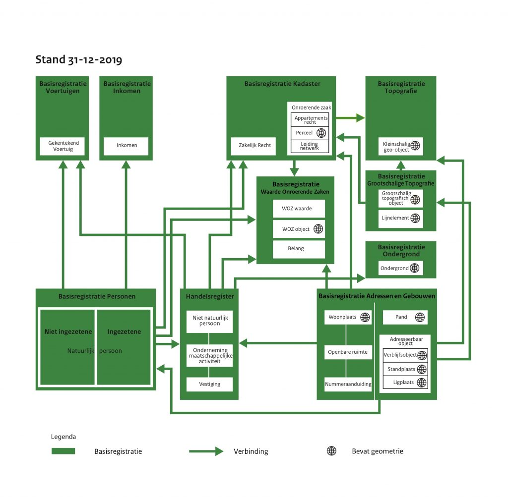

_Figuur 1.1: Stelselplaat Stelsel van Basisregistraties, status 31 december 2019. [**www.digitaleoverheid.nl/overzicht-van-alle-onderwerpen/basisregistraties-en-afsprakenstelsels/inhoud-basisregistraties/stelselplaat**](https://www.digitaleoverheid.nl/overzicht-van-alle-onderwerpen/basisregistraties-en-afsprakenstelsels/inhoud-basisregistraties/stelselplaat)_

# 2 Kenmerken van TOP10NL

Dit hoofdstuk beschrijft de belangrijkste kenmerken van TOP10NL, daarbij ook relaterend aan TOP10vector, de voorganger van TOP10NL.

- Basisregistratie Topografie

    Vanaf 1 januari 2008 is TOP10NL onderdeel van de Basisregistratie Topografie (BRT). Daarmee is TOP10NL het standaard topografische basisbestand voor gebruik binnen de overheid op het betreffende schaalgebied.

- Objectgerichte structuur met een unieke codering voor geo-objecten

    Alle topografische geo-objecten krijgen een eigen uniek nummer. Dit nummer vormt de koppeling met door derden toe te voegen thematische en administratieve gegevens over hetzelfde object.

- Meer attributen

    In TOP10NL is de inhoud van TOP10vector integraal overgenomen, echter anders gestructureerd. In deze objectstructuur met objectklassen, attributen en attribuutwaarden is plaats voor aanvullingen zowel op het niveau van attributen als op het niveau van attribuutwaarden.

- Integratie TOP10vector en TOP10wegen

    In TOP10vector zijn de wegen opgenomen als vlakken. Daarnaast voert het Kadaster als product TOP10wegen dat de gecodeerde hartlijnen en hartpunten bevat. In TOP10NL worden beide producten gecombineerd.

- Mutatiebestanden versus integrale updates

    Alle geo-objecten en versies van geo-objecten bevatten begin- en eindtijden waarmee direct is na te gaan of een geo-object gewijzigd is. Daarmee is het mogelijk om mutaties te detecteren die tussen 2 data hebben plaatsgevonden.

- Historische versies toegankelijk houden

    De historie van de geo-objecten wordt opgeslagen. Wanneer de geometrie of een van de attributen van de geo-objecten wijzigt, zal het geo-object een nieuwe identificatie of een nieuwe versiedatum krijgen. Oude (versies van) geo-objecten worden bewaard waardoor voor elk moment in de historie, vanaf de eerste opbouw van het objectgerichte bestand, de situatie kan worden gereconstrueerd.

- 3D informatie

    In de nieuwe structuur is plaats ingeruimd om de derde dimensie aan de gegevens toe te voegen. In de huidige versie van TOP10NL zijn de objecten in 2D opgeslagen

- Meta informatie

    Metadata zijn van groot belang voor het gebruik en de uitwisseling van de gegevens. Meta-informatie omvat onder meer de omschrijving van de classificatiestructuur van de objecten, de wijze en het tijdstip van gegevens inwinning en de kwaliteit van de afzonderlijke objectgegevens. In tegenstelling tot TOP10vector is in TOP10NL naast metadata op databaseniveau ook metadata op objectniveau beschikbaar.

- Scheiding Digitaal Landschap Model en Digitaal Cartografisch Model

    In TOP10vector zijn de ruimtelijke beschrijving van topografische elementen en de presentatie ervan vermengd. De wensen om vectorbestanden te visualiseren zijn gewijzigd, terwijl ook gebruikersgerichte visualisaties nodig zijn. In TOP10NL zijn de inhoud en visualisatie daarom gescheiden. Er is een standaardvisualisatie voor TOP10NL beschikbaar.

- Naadloze, landsdekkende database

    In de TOP10vector database waren de topografische gegevens opgeslagen per kaartblad. TOP10NL is een naadloze database. Selecties op regio, een willekeurige polygoon, bepaalde coördinatenparen, maar ook op thema of attribuut zijn in principe mogelijk.

- Koppeling met TOP10vector

    TOP10NL dient uitwisselbaar te zijn met oudere TOP10vector versies. Om de koppeling mogelijk te maken is vanaf september 2012 het attribuut TDNcode aan het datamodel toegevoegd.

- Koppeling met andere bestanden

    TOP10NL dient koppelbaar te zijn met andere beschikbare geodata. Via de unieke identificatiecode kunnen meerdere attributen en domeinen aan een geo-object worden gekoppeld. Thematische gegevens en administratieve gegevens kunnen worden toegekend aan een geo-object.

- Gestandaardiseerde manier van gegevensuitwisseling

    Voor TOP10NL worden open standaarden gehanteerd. Voor TOP10NL wordt gekozen voor de standaarden van het Open Geospatial Consortium (OGC, voorheen OpenGIS Consortium) en ISO TC211.

    Voor de uitwisseling van de TOP10NL bestanden is gekozen voor de standaardtaal GML (Geography Markup Language). Het grote voordeel van GML is dat zowel de inhoud als de structuur van de gegevens wordt meegeleverd.

# 3 Opbouw TOP10NL

## 3.1 Gebiedsaanduiding

Het bestand TOP10NL beslaat het gehele Nederlandse grondgebied. Langs de grenzen met België en Duitsland is een buffer van ongeveer 250 m vanaf de landsgrens opgenomen.

## 3.2 Actualiteit

TOP10NL is gebaseerd op luchtfotografie, ondersteund door 360 graden beelden en eventueel een terreinverkenning. De datum van de luchtopname, meestal in de periode januari - april, is bepalend voor de actualiteitsdatum van TOP10NL. De bijhoudingscyclus van TOP10NL is één jaar voor heel Nederland. Een overzicht van de actualiteit van TOP10NL wordt weergegeven in de "BRT Actualiteitskaart: TOP10NL" (te vinden op: [**www.kadaster.nl/zakelijk/producten/geo-informatie/topnl**](https://www.kadaster.nl/zakelijk/producten/geo-informatie/topnl) ).

## 3.3 Ruimtelijk referentiesysteem

### 3.3.1 Horizontaal coördinatenstelsel

- Projectie systeem: RijksDriehoekstelsel (RD-stelsel)
- Projectie: Stereografische projectie voor Nederland (Dubbel projectie van Schreiber)
- Horizontaal datum: Rijksdriehoeksmeting
- Ellipsoïde: Bessel 1841 (a = 6377397,155, 1/f = 299,1528128)
- Projectie centrum: 52:09:22.178 d:​m:​s & 5:23:15.500 d:​m:​s
- Coördinaatverschuiving: X: 155000 m & Y: 463000 m

Coördinaten worden in het RD-stelsel gegeven in meters, met drie decimalen.

### 3.3.2 Verticaal coördinatenstelsel

De hoogtegegevens zijn aangegeven in meters ten opzichte van NAP (Normaal Amsterdams Peil).

Bij de objectklasse hoogte wordt middels het attribuut "Referentievlak" aangegeven ten opzichte van welke referentievlak de hoogte gegeven wordt.

### 3.3.3 Coördinatenstelsel in GIS applicaties

In GIS-applicaties worden EPSG (European Petroleum Survey Group) codes gebruik om het gebruikte coördinaatsysteem mee aan te duiden. Het voor de BRT gebruikte coördinatenstelsel is RD\_new / EPSG 28992.

## 3.4 Kwaliteitsbeschrijving

### 3.4.1 Kwaliteitscontrole

De interne kwaliteitscontrole wordt uitgevoerd met behulp van het interne document "Controleprotocol TOP10NL" ( [**www.kadaster.nl/zakelijk/registraties/basisregistraties/brt/brt-documentatie**](https://www.kadaster.nl/zakelijk/registraties/basisregistraties/brt/brt-documentatie) ). In het controleprotocol vinden de controleaspecten plaats zoals genoemd in ISO 19113. Deze controleaspecten zijn: logische consistentie, positionele nauwkeurigheid, actualiteit, volledigheid, thematische nauwkeurigheid en de terugmeldingen.

De in de wet bedoelde externe kwaliteitscontrole wordt eens in de drie jaar uitgevoerd door een externe expert. De kwaliteitsbeoordeling moet worden gemaakt volgens de ISO 19114 standaard. In 2011 en 2015 zijn deze controles uitgevoerd door Wageningen Environmental Research (Alterra). De uitkomsten van deze controle heeft het Kadaster aan het Ministerie van Infrastructuur en Milieu gerapporteerd.

### 3.4.2 Verkenningsvoorschriften

In de interne verkenningsvoorschriften wordt in detail beschreven welke objecten in TOP10NL als geo-object worden opgenomen. Deze elementen worden altijd beschreven door een geometrisch type, coördinaten, hun betekenis en temporele kenmerken. Het gaat hierbij niet alleen om beschrijvingen, maar ook om afmetingen en relaties met andere objecten. In de voorschriften wordt bijvoorbeeld bepaald dat lantaarnpalen niet worden opgenomen, maar dat steenglooiingen wel worden opgenomen, uitgezonderd steenglooiingen langs een kanaal. In de Objectcatalogus TOP10NL (zie [**hoofdstuk 7**](#7-catalogus-basisregistratie-topografie)) zijn de inwinningscriteria uit de verkenningsvoorschriften te vinden.

De verkenningsvoorschriften zijn in grote lijnen ongewijzigd gebleven ten opzichte van TOP10vector. Jaarlijks worden ze aangepast indien nieuwe of vervallen relevante categorieën worden geconstateerd of indien gebruikerswensen en verbeteringen in de productiemethodiek daartoe aanleiding geven.

### 3.4.3 Metadata

Metadata betreft de eigenschappen van de gegevens. Ze bevatten een beschrijving van de inhoud, de structuur en gebruiksmogelijkheden, of juist de beperkingen van de gegevens.

Digitale geografische gegevens kennen vele gebruikers. Een goede documentatie moet aan diegenen die onbekend zijn met de gegevens een goed beeld geven van de inhoud en de gebruiksmogelijkheden of beperkingen. Metadata geeft de producent de mogelijkheid om datasets goed te beschrijven, zodat de gebruikers een inschatting kunnen maken voor de geschiktheid van de gegevens voor de door hen beoogde toepassing.

Metadata komt in TOP10NL op twee wijzen voor: uitgebreide gegevens over de gehele dataset en een beperkt aantal gegevens per geo-object.

Uitgangspunt van de metadata van de gehele dataset TOP10NL is een beschrijving volgens ISO19115. Dit is de ISO-norm voor algemene metadata op het terrein van geografische informatie, die in mei 2003 is vastgesteld.

De keuze voor ISO19115 is niet geheel willekeurig. In het verleden zijn er meerdere metadata-standaarden beschreven. Vaak waren dit standaarden, die slechts gebruikt werden in bepaalde landen, zoals FGDC (USA) en ANZLIC (Australië). De Europese landen hebben tot nu toe veelal de CEN-norm gevolgd. Sinds een aantal jaren wordt de noodzaak onderkend de verschillende standaarden beter op elkaar af te stemmen. Uit deze afstemming is ISO19115 ontstaan, met vele elementen uit CEN en FGDC. ISO19115 wordt op dit moment beschouwd als de nieuwe internationale metadata-standaard voor geo-informatie.

De ISO-norm biedt een structuur voor het vastleggen van metadata, met gebruik van een gemeenschappelijke terminologie. Dit geeft een algemeen toepasbare set van metadata voor het identificeren van geografische informatie, voor het definiëren van het verspreidingsgebied, voor het vastleggen van de kwaliteit en ontstaansgeschiedenis en het documenteren van de distributiemogelijkheden en contactgegevens

De ISO-norm is dermate uitgebreid, dat de opstellende werkgroep TC211 een aantal elementen uit de norm heeft aangemerkt als 'core metadata'. De 'core metadata' is de minimale set aan metadata elementen, die noodzakelijk zijn om een dataset te identificeren voor gebruik in een (online) catalogus. Hiermee kan antwoord gegeven op worden op een aantal wezenlijke vragen als: 'Bestaat er een dataset over een specifiek onderwerp?', 'En voor een specifiek gebied?', 'Voor een specifieke periode?' en 'Wie kan ik benaderen voor meer informatie?'.

Om een aantal praktische problemen, o.a. wat betreft uitwisselbaarheid, met de 'core-metadata' op te lossen is besloten een Nederlands profiel op ISO 19115:2003 op te stellen.

Dit profiel bestaat uit een kernset en een optionele set. De kernset bevat de verplichte metadata-elementen op basis waarvan gebruikers geografische datasets en -series kunnen zoeken ("metadata for discovery"). Deze kernset is zo beperkt mogelijk gehouden. Dankzij deze kernset kunnen gebruikers gevonden datasets en -series op dezelfde elementen met elkaar vergelijken en weten gebruikers dat ze alle beschikbare data gevonden hebben. De optionele set bevat metadata-elementen voor het beheer van geografische datasets en -series. Het is een aanvulling op de minimale kernset en voorziet in de behoefte van het geo-werkveld aan een brede gemeenschappelijke basis van metadata-elementen, in het bijzonder voor het beheer. De verplichte kernset en optionele set maken dit profiel breed en praktisch toepasbaar voor het geo-werkveld. De metadata van TOP10NL is te vinden in het Nationaal Georegister ( [**www.nationaalgeoregister.nl**](https://www.nationaalgeoregister.nl) ).

### 3.4.4 Metadata per object

Brongegevens worden algemeen aangenomen als zijnde metadata, zo ook in de ISO-norm. Brongegevens vormen een onderdeel van de ontstaansgeschiedenis van een dataset. De ontstaansgeschiedenis kan op hoofdlijnen beschreven worden voor de gehele dataset. Echter de exacte bron van elk gedigitaliseerd geo-object kan variëren; zeker in de loop van de tijd. Hiermee wordt de bron een veel dynamischer gegeven, dan de meeste metadata. De dynamische brongegevens hebben een directe relatie met de geo-objecten en worden als kenmerk (attribuut) van het geo-object opgeslagen.

| Attribuut | Domein |
|:---|:---|
| brontype | < domein "Brontype" > |
| bronbeschrijving | < tekst > |
| bronactualiteit | < datum > |
| bronnauwkeurigheid | < getal > |

| Domein "Brontype" |
|:---|
| luchtfoto |
| RD |
| TOP10vector |
| externe data |
| overig |

_Tabel 3.1: Metadata per object._

Het brontype, de bronbeschrijving, bronactualiteit en bronnauwkeurigheid geven informatie over de bron van het geo-object.

## 3.5 Productieproces in het kort

De productie van digitale topografische bestanden valt uiteen in een aantal stappen:

- Het detecteren van mutaties uit twee verschillende jaargangen luchtfoto's.
- Het (stereoscopisch) interpreteren van luchtfoto's en 360 graden beelden.
- Het opbouwen van een digitale topografische database (TOP10NL).
- Vanuit deze database verschillende topografische bestanden en kaartseries produceren.

### 3.5.1 Detecteren van mutaties

In deze processtap worden de mutaties gedetecteerd door het vergelijken van 2 jaargangen luchtfoto's. Daar waar verschillen waarneembaar zijn tussen de beide luchtfoto's wordt een trigger aangebracht. Deze triggers geven aan waar in het vervolgproces de wijzigingen in TOP10NL kunnen worden aangebracht.

De gebruikte luchtfoto's zijn afkomstig uit de Landelijke Voorziening Beeldmateriaal ( [**www.beeldmateriaal.nl**](https://www.beeldmateriaal.nl) ).

### 3.5.2 Interpretatie luchtfoto's en muteren TOP10NL

De luchtfoto's, ondersteund door 360 graden beelden, vormen de basis voor het bijhouden van de topografische database. Daarvoor wordt de luchtfoto geïnterpreteerd door topografen. In een digitaal stereoscopisch beeld wordt het overlappende deel van twee naast elkaar gelegen luchtfoto's stereoscopisch bekeken en worden de herkende objecten nauwkeurig gedigitaliseerd. Voor TOP10NL wordt gebruik gemaakt van de softwareproducten ESPA (3D luchtfoto-interpretatie) en ArcGIS van ESRI. Alle topografische objecten die de topograaf op deze manier herkent, worden vastgelegd.

De gegevens worden opgeslagen in een centrale database. Daarvoor wordt gebruik gemaakt van Oracle 11g Spatial. De data in de database is nu beschikbaar voor gebruik in geografische informatiesystemen en voor het maken van standaard kaartseries of speciale eenmalige producten.

### 3.5.3 Gebruik externe bronnen

Luchtfoto's en panoramafoto's vormen de belangrijkste bron voor het bijhouden van de basistopografie in TOP10NL. Maar op basis van alleen deze foto's kunnen niet alle gegevens in TOP10NL ingewonnen en bijgehouden worden. Daarom wordt er in toenemende mate gebruik gemaakt van externe bronnen. Net als de basistopografie, worden de objecten en attributen die gebaseerd zijn op externe bronnen in principe jaarlijks bijgewerkt aan de hand van de beschikbare externe bronnen, voor zover jaarlijks een nieuwe versie van de bron beschikbaar is. Voor het intekenen van de geometrie wordt ook gebruik gemaakt van luchtfoto's en panoramafoto's. Externe bronnen worden met name gebruik voor het bijhouden van de gegevens in de volgende objectklassen: Gebouw, Inrichtingselement, Registratief gebied, Geografisch gebied, Plaats en Functioneel gebied.

### 3.5.4 Vervolgproducten

De bijgewerkte TOP10NL is vervolgens de bron voor het maken van de vervolgproducten. Door middel van visualisatie en automatische generalisatie worden deze vervolgproducten gerealiseerd. Het gaat om de volgende producten:

- TOP25raster
- TOP50raster en TOP50NL
- TOP100raster en TOP100NL
- TOP250raster en TOP250NL
- TOP500raster en TOP500NL
- TOP1000raster en TOP1000NL
- BRT-Achtergrondkaart in 4 visualisaties
- TOPnamen

Net zoals TOP10NL worden deze producten 5 keer per jaar ontsloten via PDOK ( [**www.pdok.nl**](https://www.pdok.nl) ).

# 3.6 Volledigheid TOP10NL

Met betrekking tot de compleetheid van de objectgegevens zijn ook een aantal beperkingen van kracht. Voor de opbouw van TOP10NL is gebruik gemaakt van de gegevens van TOP10vector. Het gegevensmodel van TOP10NL is ruimer opgezet dan de voorhanden zijnde inhoud van TOP10vector. Dit betekent dat er meer kenmerken (attributen en attribuutwaarden) in de TOP10NL structuur kunnen worden opgenomen dan in de TOP10vector bestanden aanwezig waren. TOP10vector kende in zekere zin beperkingen omdat bij de inwinning van gegevens sterk rekening is gehouden met de hoeveelheid gegevens die op een topografische kaart op de schaal 1:10.000 en 1:25.000 kan worden afgebeeld. Dat betekent onder meer dat er beperkingen zijn opgelegd ten aanzien van het inwinnen van bepaalde topografische gegevens.

Omdat de topografische gegevens nu als objecten zijn opgeslagen, met een aantal beschrijvende kenmerken blijkt expliciet welke attribuutwaarden niet gevuld zijn. In de uitgebreide Objectcatalogus TOP10NL (zie [**hoofdstuk 7**](#7-catalogus-basisregistratie-topografie)) is aangegeven welke gegevens "volledig", "beperkt" en "niet" worden ingewonnen. Met "volledig" bij een attribuutwaarde wordt bedoeld, dat minimaal 95 % van de objecten, die voldoen aan de criteria van deze attribuutwaarde, voorkomen in TOP10NL.

## 3.7 TDN-codes uit TOP10vector

De objectgerichte structuur van TOP10NL wijkt sterk af van de structuur van de voorganger TOP10vector. TOP10vector kende ruim 175 TDN codes, waarmee de verschillende inhoudselementen waren gecodeerd. Aan de (punt-, lijn - en vlak-)codes kon ook een visualisatie worden toegekend, waardoor er een vermenging ontstond met betrekking tot de 'zuivere' topografische kenmerken van de objecten. In TOP10NL zijn alle eigenschappen, inclusief de geometrie, als attributen van een object opgenomen en waren de oorspronkelijke TDN codes niet meer aanwezig. Om de koppeling mogelijk te maken tussen TOP10vector en TOP10NL is vanaf september 2012 het attribuut TDNcode aan het datamodel van TOP10NL toegevoegd. Omdat het gegevensmodel van TOP10NL meer attributen kent dan de TDN codes van TOP10vector is dit geen 1 op 1 relatie. Echter de meeste objecten zullen een TDNcode hebben.

## 3.8 Gebruik van TOP10NL

Het Kadaster houdt als enige instantie in Nederland een uniform, consistent en landsdekkend kleinschalig topografisch bestand van Nederland bij.

De geografische informatie vervult een belangrijke functie in de geografische informatie-infrastructuur van Nederland omdat die als referentie een onmisbare rol vervult in de beleidsprocessen van tal van overheden en in het verkeer tussen overheden onderling en tussen overheden en burgers en bedrijven.

De basisgegevens worden onder meer gebruikt ten behoeve van de landsverdediging, veiligheidsbeleid (rampenpreventie, rampenbestrijding, meldkamers van politie, brandweer en ambulance), verkeer en transport (mobiliteit, routeplanning, filebestrijding, autonavigatie), natuur, milieu en planologie (ruimtelijke ordening, aanleg van infrastructurele werken), waterbeheer (het zoeken naar bergingscapaciteit van water), fondsenverdeling (landbouwsubsidies, toewijzingen gemeentefonds), cultuurbeheer (oudheidkundig bodemonderzoek), recreatieve applicaties en kaartproducten. Eenduidigheid, consistentie, kwaliteit en actualiteit van de geografische basisgegevens zijn hierbij van groot belang.

De geografische informatie is voorts van cruciaal belang om verplichtingen en beleidsafspraken in het kader van de NAVO en andere internationale verdragen te kunnen nakomen.

Sinds 1 januari 2008 is TOP10NL onderdeel van de Basisregistratie Topografie (BRT) en daarmee het belangrijkste topografische referentiebestand zijn voor overheidsgebruik op het schaalniveau 1:10.000.

Sinds 1 januari 2012 is de BRT beschikbaar als open data.

### 3.8.1 GIS gebruik

De objectgerichte topografische gegevens, zorgen voor een goede ondersteuning van GIS toepassingen. De structuur wordt onder meer gekenmerkt door unieke ID's, was-wordt detectie, naadloze database, meervoudige representatie en koppelbaarheid met ander geo-bestanden. Dit betekent dat vele gebruikers in staat zullen zijn de basistopografie te gebruiken in GIS-analyses en de gegevens te verrijken met eigen gegevens.

Afhankelijk van het GIS-software pakket dat gebruikt wordt, kunnen vele GIS analyses worden toegepast als oppervlakte berekening, buffering, afstandsberekening, routenavigatie, enzovoort, al dan niet in combinatie met andere digitale data. Meerdere toepassingsvoorbeelden komen t.z.t. beschikbaar.

### 3.8.2 Visualisatie

De TOP10NL database bevat geo-objecten met een beschrijving van de eigenschappen. Sinds september 2012 heeft ieder object een visualisatiecode gekregen. Hiermee is het visualiseren van TOP10NL eenvoudiger gemaakt. Het Kadaster levert standaard visualisatiemodules mee met de TOP10NL-data gebaseerd op de topografische kaart 1:25.000. Ook kan de gebruiker zelf visualisaties definiëren in de applicatiesoftware.

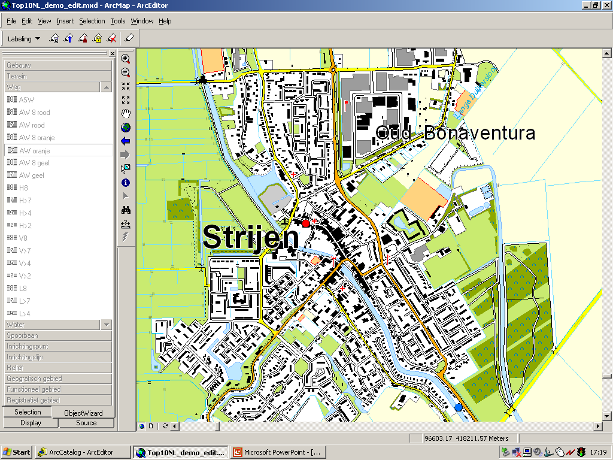

_Figuur 3.1: Standaardvisualisatie van TOP10NL_

### 3.8.3 Webapplicaties

Omdat de TOP10NL bestanden geleverd worden in GML zijn ze zeer geschikt voor webapplicaties. GML is gebaseerd op XML, de standaard uitwisselingstaal voor internet. Veel technieken in de internetomgeving ontwikkelde applicaties zijn bruikbaar voor het uitwisselen en visualiseren van TOP10NL.

# 4 Gegevensmodel TOP10NL

Dit hoofdstuk gaat nader in op de structuur en de samenstelling van het gegevensmodel TOP10NL versie 1.2.

Het gegevensmodel specificeert de objectklassen die voorkomen in de objectgerichte _TOP10NL_, de attributen binnen de objectklasse en de gerechtigde waarden van de attributen, relaties tussen de objectklassen en andere relevante informatie. De objectklassen die worden onderscheiden zijn gerelateerd aan een weergaveschaal 1:10.000.

## 4.1 Objectgerichte gegevens

TOP10NL is objectgericht, dat wil zeggen, alle topografische elementen zijn opgeslagen als afzonderlijke geo-objecten met een uniek nummer. Dit nummer (de identificatie) is de sleutel tussen het TOP10NL geo-object en de gegevens die een gebruiker aan het geo-object wil koppelen. Zo kunnen aan wegen o.a. straatnamen en wegnummers worden gekoppeld, maar ook de eigenaar en beheergegevens. Of aan percelen kunnen de gewassen en bodemkundige gegevens worden verbonden en kunnen mutaties worden bijgehouden.

De opdeling van de topografie kent een hiërarchische structuur. De basiselementen worden objectklassen genoemd. Het betreft hier wegdelen, spoorbaandelen, waterdelen, gebouwen, terrein, inrichtingselementen, reliëf en (meerdere soorten) gebieden. Aan de objectklasse worden attributen toegekend, waarmee een verdere typering mogelijk wordt gemaakt. Elk attribuut kent waarden, die uiteindelijk een nadere verklaring geven over de aard van de objectklassen, vergelijkbaar met de legenda van een kaart of de codering van een digitaal bestand.

Dit model is grotendeels gebaseerd op de Nederlandse standaard NEN3610, het Basismodel Geo-Informatie, waarbij de huidige inhoud van TOP10vector en de topografische databases op kleinere schalen objectgericht zijn gemodelleerd. Voor internationale uitwisseling zal deze ook converteerbaar zijn naar de DFDD standaard, welke oorspronkelijk voor militair gebruik is ontwikkeld, maar inmiddels ook in de civiele wereld wordt toegepast.

### 4.1.1 Waarom een objectgerichte structuur?

Het oorspronkelijke product TOP10vector is een vectorbestand met een gesloten vlakkenstructuur, opgebouwd uit gecodeerde en onderling geknoopte lijnelementen. Deze bestandstructuur kent een aantal nadelen:

- Lijnvormige objecten zijn in willekeurige stukken gehakt. Een objectgericht bestand samenstellen uit het TOP10vector-bestand betekent voor gebruikers dat de ontvangen gegevens eerst bewerkt moeten worden.
- De attributering van TOP10vector kent geen hiërarchische gelaagdheid waardoor het structureren van de attributen door de gebruiker zelf gedaan moet worden. De gegevens zijn gestructureerd op basis van de (topografische) TDN-coderingen en zijn ten dele ten behoeve van de kaartproductie ontwikkeld.
- Er is sprake van een vermenging van het terreinmodel en het kartografische model. Het bestand is zowel gebaseerd op de inhoudelijke kant als op de wijze waarop de gegevens worden gepresenteerd, terwijl de wens is om dit gescheiden te houden.
- TOP10vector is een geometrisch bestand met relatief weinig thematische inhoud. Een objectgerichte structuur maakt het mogelijk om per geo-object zowel geometrische als beschrijvende en kwaliteitsgegevens te leveren.
- Het huidige bestand koppelen aan gebruikersgegevens is moeilijk. Een objectgerichte structuur maakt het mogelijk om per geo-object eigen gegevens te koppelen (bijvoorbeeld de koppeling van postcodes of huisnummers aan gebouwen).

Met de objectgerichte structuur van TOP10NL wordt gestreefd naar een efficiënter (kostenbesparend) en effectiever (structurerend) gebruik van de TOPvector bestanden en naar een verbetering van de uitwisseling (standaardiserend) van geografische bestanden.

## 4.2 Objectklassen

De TOP10NL-data wordt onderverdeeld in een aantal objectklassen. In tabel 4.1 is aangegeven welke objectklassen worden onderscheiden.

| objectklasse |
|:---|
| wegdeel |
| spoorbaandeel |
| waterdeel |
| gebouw |
| terrein |
| inrichtingselement |
| reliëf |
| hoogte |
| registratief gebied |
| geografisch gebied |
| plaats |
| functioneel gebied |
| plantopografie |

_Tabel 4.1: De objectklassen._

### 4.2.1 Samengestelde geo-objecten

De geo-objecten in TOP10NL kunnen gebruikt worden als bouwstenen voor de vorming van samengestelde geo-objecten. Bijvoorbeeld een weg is een verzameling van wegdelen die samen onder een naam bekend zijn, bijvoorbeeld de 'A1' of de 'Weerdingerstraat'. Samengestelde geo-objecten zijn niet als apart geo-object aanwezig in de database, maar kunnen eenvoudig worden gecreëerd door het koppelen van geo-objecten met overeenkomstige kenmerken (bijv. een straatnaam, een wegnummer).

Ook voor generalisatiedoeleinden kunnen op basis van gemeenschappelijke kenmerkwaarden, samengestelde objecten op een hoger abstractieniveau worden afgeleid. Bijvoorbeeld een bosgebied is een verzameling terreinobjecten die gekenmerkt wordt door het landgebruik loofbos, naaldbos of gemengd bos.

 op basis van het objectkenmerk 'wegnummer': de A12 als samengesteld geo-object")

_Figuur 4.1: Een selectie (lichtblauw gemarkeerd) op basis van het objectkenmerk 'wegnummer': de A12 als samengesteld geo-object._

## 4.3 Objectkenmerken

De geo-objecten hebben identificerende, geometrische, temporele, meta en beschrijvende kenmerken, die als attributen in het gegevensmodel zijn opgenomen. De relatiematrix in [**paragraaf 4.4**](#44-relatiematrix) geeft een overzicht van de objectklassen met bijbehorende attributen.

### 4.3.1 Identificerende kenmerken

In TOP10NL heeft elk geo-object een identificatiecode, bestaande uit de attributen namespace en lokaalID. Deze attributen geven het geo-object een unieke identiteit.

| Attribuut | Attribuutwaarde | Beperkingregels |
|:---|:---|:---|
| namespace | _< tekst >_ | NL.TOP10NL |
| lokaalID | _< identificatiecode >_ | Uniek identificerend |

Zo kan een wegdeel bijvoorbeeld de volgende identificatie hebben: identificatie = NL.TOP10NL.ID (waarbij ID een uniek nummer van maximaal 16 cijfers is). De identificatie is in beginsel betekenisloos, met uitzondering van de voorvoegsels "NL" en "TOP10NL". Deze voorvoegsels zorgen ervoor dat het identificatie wereldwijd uniek is. Het bevat geen informatie over de aard of indeling van het geo-object.

### 4.3.2 Beschrijvende kenmerken

Beschrijvende kenmerken geven een nadere invulling aan het geo-object. Deze kenmerken hebben betrekking op bijvoorbeeld de aard of type van het geo-object.

De beschrijvende kenmerken van geo-objecten en de gerechtigde attribuutwaarden die zijn opgesteld hebben volledige namen. Er worden geen afkortingen of coderingen gebruikt, zoals ook in de NEN3610 (Basismodel Geo-Informatie) het geval is, in tegenstelling tot de oorspronkelijk NEN3610 standaard.

Als een attribuut van het geo-object gekenmerkt wordt door een waarde die niet voorkomt in het attribuutdomein dan krijgt het attribuut meestal de waarde 'overig'. Indien noodzakelijk kunnen er nieuwe attribuutwaarden worden toegevoegd aan de bestaande lijst.

### 4.3.3 Multipliciteit van een kenmerk

Met de multipliciteit of kardinaliteit van een kenmerk wordt in dit model te kennen gegeven of een geo-object precies één of meerdere attribuutwaarden kan aannemen.

Als de multipliciteit van een kenmerk veelvoudig is kan een geo-object meer dan één attribuutwaarde aannemen. Zo kan een wegdeel meer dan één A-wegnummer hebben (bijvoorbeeld A50 en A12).

Indien de multipliciteit van een kenmerk enkelvoudig is, dan kan een geo-object slechts één enkele attribuutwaarde aannemen. Zo kan een wegdeel geo-object slechts één verhardingstype hebben.

### 4.3.4 Optionaliteit van een kenmerk

Een beschrijvend kenmerk is optioneel of verplicht. Optioneel betekent dat het kenmerk op een deel van de geo-objecten niet van toepassing is. Een optioneel kenmerk bij een wegdeel is bijvoorbeeld de straatnaam. Niet alle wegdeel geo-objecten hebben een straatnaam. Verplicht betekent dat het kenmerk op alle geo-objecten van toepassing is.

### 4.3.5 Geometrische kenmerken

Geometrische kenmerken zijn eigenschappen toegekend aan een geo-object die locatie en vorm van het geo-object vastlegt. De vorm wordt vastgelegd als punt, rechte lijn of een door rechte lijnen begrensd vlak. In onderstaande tabel wordt aangegeven welke geometrie een objectklasse kan hebben.

| | punt | lijn | vlak |
|:---|:---|:---|:---|
| wegdeel | + | + | + |
| spoorbaandeel | + | + | - |
| waterdeel | + | + | + |
| gebouw | + | - | + |
| terrein | - | - | + |
| inrichtingselement | + | + | - |
| reliëf | - | + | - |
| hoogte | + | + | - |
| registratief gebied | - | - | + |
| geografisch gebied | + | - | + |
| plaats | + | - | + |
| functioneel gebied | + | - | + |
| plantopografie | + | + | + |

\+ = wel, - = niet

_Tabel 4.2: De geometrische kenmerken_

Registratief gebied, geografisch gebied en functioneel gebied bestaan voorlopig (ook) als puntobject, omdat deze gebieden in TOP10vector alleen als naam bekend waren zonder bijbehorend gebied.

De positie van een geo-object wordt weergegeven door middel van x en y- coördinaten in het Rijksdriehoeksstelsel (gegeven in meters, met 3 decimalen) en de hoogte ten opzichte van Normaal Amsterdams Peil (NAP). Indien de hoogtewaarde niet beschikbaar is blijft deze ongevuld. (zie ook hoogteniveau in [**paragraaf 4.5.3**](#453-kruisende-objecten)). Bij de objectklasse hoogte wordt middels het attribuut "Referentievlak" aangegeven ten opzichte van welk referentievlak de hoogte gegeven wordt.

### 4.3.6 Geo-objecten met meervoudige geometrie

Wegdelen hebben vrijwel altijd een meervoudige geometrie. Voor de meeste wegdelen wordt naast het vlak voor het weglichaam de hartlijn opgenomen. In onderstaande figuur wordt dit schematisch toegelicht.

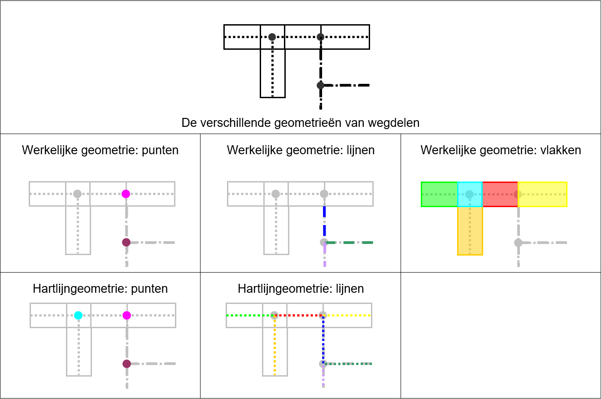

_Figuur 4.2: De verschillende geometrieën van wegdelen._

Behalve wegdelen hebben ook bepaalde reliëfobjecten een meervoudige geometrie. Het object wordt dan gevormd door twee lijnobjecten, één voor de hoge kant en één voor de lage kant.

De gebieden in TOP10NL kunnen bestaan uit meerdere vlakken. Deze vlakken zijn dan samen bekend onder een gemeenschappelijke naam. De gemeente Amsterdam bestaat bijvoorbeeld uit twee vlakken.

### 4.3.7 Temporele kenmerken

Temporele kenmerken beschrijven de historie van geo-objecten. Daartoe zijn de attributen objectBeginTijd, objectEindTijd, tijdstipRegistratie en eindRegistratie opgenomen.

| Attribuut | Domein |
|:---|:---|
| objectBeginTijd | _< datum >_ |
| objectEindTijd | _< datum >_ |
| tijdstipRegistratie | _< datum >_ |
| eindRegistratie | _< datum >_ |

_Tabel 4.3: Temporele kenmerken._

Op het moment dat er een nieuw geo-object wordt gevormd, dan krijgt het een objectBeginTijd. Een geo-object dat niet meer actueel is en vervangen wordt, krijgt een objectEindTijd. Het oude geo-object blijft in de database aanwezig.

De tijdstipRegistratie en eindRegistratie zorgen ervoor dat iedere mutatie van een geo-object wordt bijgehouden. Als er bijvoorbeeld een attribuutwaarde van een geo-object verandert, dan kan er een nieuwe versie van het geo-object ontstaan.

Voor het volgen van geo-objecten in de tijd heeft elk geo-object een relatie met zijn voorganger en opvolger. Een geo-object kan ontstaan uit één of meer geo-objecten en kan overgaan in één of meer geo-objecten.

Het mutatieprotocol (zie [**Bijlage 1: Mutatieprotocol**](#bijlage-1-mutatieprotocol)) bepaald wat er met bovenstaande attributen van een geo-object gebeurt bij bepaalde wijzigingen.

## 4.4 Relatiematrix

In onderstaande tabel zijn de relaties weergegeven die voorkomen tussen de objectklassen en de attributen.

| | Ob­ject­ken­merk | weg­deel | spoor­baan­deel | wa­ter­deel | ge­bouw | ter­rein | in­rich­tings­ele­ment | re­liëf | hoog­te | re­gis­tra­tief ge­bied | geo­gra­fisch ge­bied | plaats | func­ti­o­neel ge­bied | plan­to­po­gra­fie |
|:---|:---|:---:|:---:|:---:|:---:|:---:|:---:|:---:|:---:|:---:|:---:|:---:|:---:|:---:|
| iden­ti­fi­ce­rend | iden­ti­fi­ca­tie | V | V | V | V | V | V | V | V | V | V | V | V | V |
| geo­me­trisch | geo­me­trie | V | V | V | V | V | V | V | V | V | V | V | V | V |
| tem­po­reel | ob­ject​Be­gin­Tijd | V | V | V | V | V | V | V | V | V | V | V | V | V |
| tem­po­reel | ob­ject​Eind­Tijd | O | O | O | O | O | O | O | O | O | O | O | O | O |
| tem­po­reel | tijd­stip​Re­gis­tra­tie | V | V | V | V | V | V | V | V | V | V | V | V | V |
| tem­po­reel | eind​Re­gis­tra­tie | O | O | O | O | O | O | O | O | O | O | O | O | O |
| me­ta | bron­ty­pe | V | V | V | V | V | V | V | V | V | V | V | V | V |
| me­ta | bron­be­schrij­ving | V | V | V | V | V | V | V | V | V | V | V | V | V |
| me­ta | bron­ac­tu­a­li­teit | V | V | V | V | V | V | V | V | V | V | V | V | V |
| me­ta | bron­nauw­keu­rig­heid | V | V | V | V | V | V | V | V | V | V | V | V | V |
| me­ta | mu­ta­tie­ty­pe | O | O | O | O | O | O | O | O | O | O | O | O | O |
| vi­su­a­li­sa­tie | vi­su­a­li­sa­tie­Co­de | O | O | O | O | O | O | O | O | O | O | O | O | O |
| vi­su­a­li­sa­tie | tdn­Code | O | O | O | O | O | O | O | O | O | O | O | O | O |
| be­schrij­vend | naam | O | | | O | O | O | | | | | | | O |
| be­schrij­vend | naam​NL | | | O | | | | | | O | O | O | O | |
| be­schrij­vend | naam​Fries | | | O | | | | | | O | O | O | O | |
| be­schrij­vend | naam​Of­fi­ci­eel | | | O | | | | | | V | | O | | |
| be­schrij­vend | is​BAG­naam | O | | O | | | | | | | | | | |
| be­schrij­vend | soort­naam | | | | O | | O | | | | | | O | |
| be­schrij­vend | brug­naam | O | O | O | | | | | | | | | | |
| be­schrij­vend | tun­nel­naam | O | O | | | | | | | | | | | |
| be­schrij­vend | num­mer | | | | | | O | | | O | | | | |
| be­schrij­vend | hoog­te­ni­veau | V | V | V | V | V | V | V | | | | | | |
| be­schrij­vend | sta­tus | V | V | | V | | | | | | | | | |
| be­schrij­vend | ty­pe­In­fra­struc­tuur | V | V | | | | | | | | | | | |
| be­schrij­vend | fy­siek­Voor­ko­men | O | O | O | O | O | | | | | | | | |
| be­schrij­vend | voor­ko­men | | | O | | O | | | | | | | | |
| be­schrij­vend | hoog­te­klas­se | | | | V | | | V | | | | | | |
| be­schrij­vend | hoog­te | | | | O | | O | | V | | | | | |
| be­schrij­vend | ty­pe­Weg | V | | | | | | | | | | | | |
| be­schrij­vend | hoofd­ver­keers­ge­bruik | V | | | | | | | | | | | | |
| be­schrij­vend | ver­har­dings­breed­te­klas­se | O | | | | | | | | | | | | |
| be­schrij­vend | ge­schei­den­Rij­baan | V | | | | | | | | | | | | |
| be­schrij­vend | ver­har­dings­ty­pe | V | | | | | | | | | | | | |
| be­schrij­vend | aan­tal­Rij­stro­ken | O | | | | | | | | | | | | |
| be­schrij­vend | A-weg­num­mer | O | | | | | | | | | | | | |
| be­schrij­vend | N-weg­num­mer | O | | | | | | | | | | | | |
| be­schrij­vend | E-weg­num­mer | O | | | | | | | | | | | | |
| be­schrij­vend | S-weg­num­mer | O | | | | | | | | | | | | |
| be­schrij­vend | af­rit­num­mer | O | | | | | | | | | | | | |
| be­schrij­vend | af­rit­naam | O | | | | | | | | | | | | |
| be­schrij­vend | knoop­punt­naam | O | | | | | | | | | | | | |
| be­schrij­vend | ty­pe­Spoor­baan | | V | | | | | | | | | | | |
| be­schrij­vend | spoor­breed­te | | V | | | | | | | | | | | |
| be­schrij­vend | aan­tal­Spo­ren | | V | | | | | | | | | | | |
| be­schrij­vend | ver­voer­func­tie | | V | | | | | | | | | | | |
| be­schrij­vend | elek­tri­fi­ca­tie | | V | | | | | | | | | | | |
| be­schrij­vend | baan­vak­naam | | O | | | | | | | | | | | |
| be­schrij­vend | ty­pe­Wa­ter | | | V | | | | | | | | | | |
| be­schrij­vend | breed­te­klas­se | | | O | | | | | | | | | | |
| be­schrij­vend | hoofd­af­wa­te­ring | | | V | | | | | | | | | | |
| be­schrij­vend | func­tie | | | V | | | | | | | | | | |
| be­schrij­vend | ge­tij­de­In­vloed | | | V | | | | | | | | | | |
| be­schrij­vend | vaar­weg­klas­se | | | O | | | | | | | | | | |
| be­schrij­vend | sluis­naam | | | O | | | | | | | | | | |
| be­schrij­vend | ty­pe­Ge­bouw | | | | V | | | | | | | | | |
| be­schrij­vend | ge­bruiks­doel | | | | O | | | | | | | | | |
| be­schrij­vend | ty­pe­Land­ge­bruik | | | | | V | | | | | | | | |
| be­schrij­vend | ty­pe­In­rich­tings­ele­ment | | | | | | V | | | | | | | |
| be­schrij­vend | breed­te | | | | | | O | | | | | | | |
| be­schrij­vend | ty­pe­Re­liëf | | | | | | | V | | | | | | |
| be­schrij­vend | func­tie | | | | | | | O | | | | | | |
| be­schrij­vend | ty­pe​Hoog­te | | | | | | | | V | | | | | |
| be­schrij­vend | re­fe­ren­tie­vlak | | | | | | | | V | | | | | |
| be­schrij­vend | ty­pe­Re­gis­tra­tief­Ge­bied | | | | | | | | | V | | | | |
| be­schrij­vend | ty­pe­Geo­gra­fisch­Ge­bied | | | | | | | | | | V | | | |
| be­schrij­vend | ty­pe​Ge­bied | | | | | | | | | | | V | | |
| be­schrij­vend | be­bouw­de​Kom | | | | | | | | | | | V | | |
| be­schrij­vend | is​BAG­woon­plaats | | | | | | | | | | | V | | |
| be­schrij­vend | aan­tal­In­wo­ners | | | | | | | | | | | O | | |
| be­schrij­vend | ty­pe­Func­ti­o­neelGe­bied | | | | | | | | | | | | V | |
| be­schrij­vend | ty­pe​Ob­ject | | | | | | | | | | | | | V |

Tabel 4.4: Relatiematrix. **V** = verplicht. **O** = optioneel.

## 4.5 Gedrag van geo-objecten

Deze paragraaf beschrijft wanneer er sprake is van een ander geo-object en hoe een geo-object zich gedraagt bij veranderingen. Ook de modellering van geo-objecten op verschillende hoogteniveaus wordt beschreven.

### 4.5.1 Vorming van geo-objecten

In de regel gaat een geo-object over in een ander geo-object op het moment dat de objectklasse of een waarde van een attribuut zich wijzigt in het terrein.

In figuur 4.3 is een weg aangegeven die bestaat uit meerdere wegdelen. In dit voorbeeld ontstaat een ander wegdeel op het moment dat de weg overgaat van verhard naar onverhard of overgaat van een verbinding naar een kruising.

_Figuur 4.3: voorbeeld objectvorming_

### 4.5.2 Mutatie van geo-objecten

Een mutatie doet zich voor als de geometrische vorm of een waarde van een attribuut zich wijzigt in de tijd. Als voorbeeld wordt in figuur 4.4 een verhard wegdeel gedeeltelijk half verhard en gedeeltelijk onverhard.

_Figuur 4.4: voorbeeld objectmutatie_

Door opsplitsing van het wegdeel ontstaan er twee nieuwe wegdelen, elk met een nieuwe identificatie. Het oude wegdeel krijgt een objectEindTijd, maar blijft in de database aanwezig.

De exacte regels voor het toekennen van identificaties, objectBeginTijd, objectEindTijd, tijdstipRegistratie en eindRegistratie staan beschreven in het mutatieprotocol in [**Bijlage 1: Mutatieprotocol**](#bijlage-1-mutatieprotocol).

### 4.5.3 Kruisende objecten

Om te kunnen bepalen hoe geo-objecten zonder absolute hoogtewaarde elkaar kruisen, bijvoorbeeld wegen, hebben de elkaar kruisende geo-objecten een hoogteniveau attribuut*.* Overige geo-objecten, waaronder de elkaar snijdende geo-objecten en de gebieden, hebben geen hoogteniveau attribuut.

| Attribuutwaarden |
|:---|
| 0 |
| -1 |
| -2 |
| -3 |
| < enz. > |

_Tabel 4.5: Hoogteniveaus in TOP10NL._

Met het hoogteniveau wordt de relatieve hoogte van het geo-object weergegeven. Zo kan worden bepaald op welke wijze geo-objecten elkaar kruisen, en op welk hoogteniveau. Kruisende geo-objecten die op de bovenste laag liggen krijgen de waarde 0, het hoogste niveau. Kruisende geo-objecten op een lager niveau krijgen in principe de waarde -1, voor het volgende lager niveau de waarde -2, enzovoort. Het is toegestaan dat de waarden (0, -1, -2, -3, enz.) elkaar niet opvolgen, maar dat er waarden worden overgeslagen (bijvoorbeeld 0, -2, -3, -6). Enkel de volgorde is van belang bij het bepalen van de relatieve hoogte. Het hoogteniveau attribuut bevat geen informatie over de absolute hoogte van een geo-object.

In figuur 4.5 is een kruisend wegdeel aangegeven met hoogteniveau -1. Het kruisend spoorbaandeel heeft een hoogteniveau 0. Het wegdeel bevindt zich dus onder het spoorbaandeel.

_Figuur 4.5: Het gebruik van het hoogteniveau-attribuut._

Bij alle objectklassen met het attribuut 'hoogteniveau' is 'hoogteniveau' een verplicht attribuut.

De verschillende gebieden (registratief gebied, geografisch gebied, plaats, functioneel gebied en plantopografie) kennen ook geen hoogteniveau. Zij vormen een aparte laag zonder directe relatie met de andere geo-objecten. Geografische gebieden, plaatsen en functionele gebieden van hetzelfde type kunnen elkaar ook overlappen.

### 4.5.4 Aaneengrenzende en overlappende objecten

De vlakvormige wegdelen en waterdelen en het terrein zijn aanééngrenzend en volledig landsdekkend. Er zijn geen onbenoemde (zogenaamde "witte") gebieden. In figuur 4.6 is dit weergegeven.

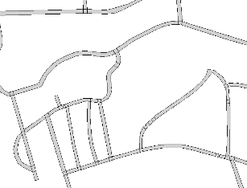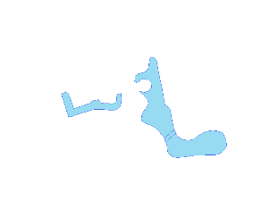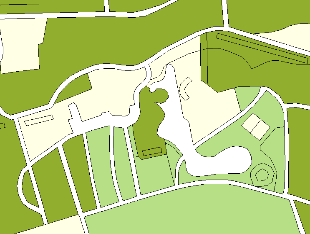

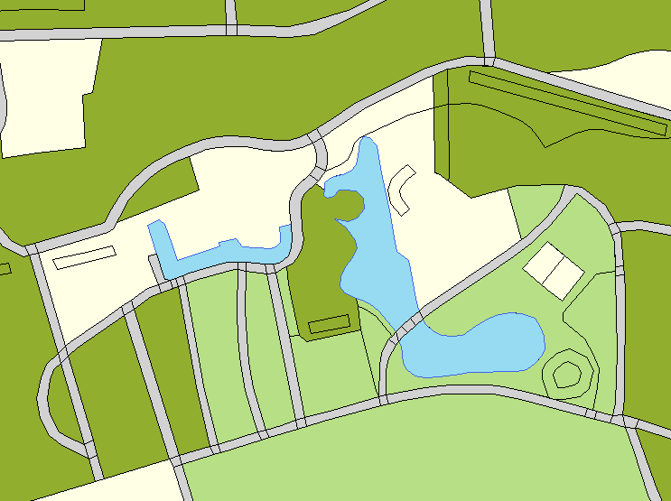

_Figuur 4.6: vlakvormige wegdelen, waterdelen en terrein zijn aanééngrenzend en landsdekkend._

Gebouwen, spoorbaandelen, inrichtingselementen en reliëf liggen boven op deze geo-objecten. Gebouwen maken dus geen deel uit van het terrein. Spoorbaandelen, inrichtingselementen en reliëf komen alleen voor als punt- of lijnobjecten en nemen dus geen oppervlakte in.

In figuur 4.7 is hetzelfde gebied te zien als in figuur 4.6, maar dit maal met gebouwen.

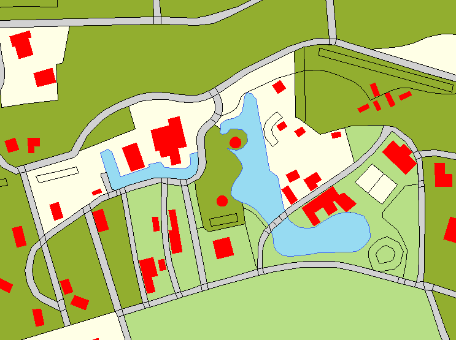

_Figuur 4.7: gebouwen als losse laag boven wegdelen, waterdelen en terrein._

De registratieve gebieden, zoals provincies en gemeenten, grenzen aan elkaar en zijn landsdekkend. De overige gebieden kunnen elkaar overlappen en zijn niet landsdekkend. De grenzen van de functionele gebieden worden indien mogelijk afgestemd met de grenzen van de terreinobjecten.

## 4.6 Samenvoegen en splitsen van objecten

Deze paragraaf beschrijft wanneer objecten gesplitst of samengevoegd moeten worden in TOP10NL.

### 4.6.1 Splitsen van objecten met een vlakgeometrie

Vlakobjecten van de objectklasses Wegdeel, Waterdeel en Terrein dienen gesplitst te zijn als het vlak geheel doorsneden wordt door één of meer aaneengesloten lijnobjecten op hetzelfde hoogteniveau met de volgende kenmerken:

- Alle lijnobjecten uit de klasse Wegdeel.
- Alle lijnobjecten uit de klasse Waterdeel.
- Alle lijnobjecten uit de klasse Spoorbaandeel.

### 4.6.2 Splitsen van objecten met een lijngeometrie

De volgende lijnobjecten dienen gesplitst te zijn:

- Lijnobjecten van de objectklasse Wegdeel, Spoorbaandeel, Waterdeel, Inrichtingselement en Reliëf ter plaatse van een gelijkvloerse kruising (op hetzelfde hoogteniveau) met een ander lijn object uit dezelfde objectklasse.
- Lijnobjecten van de objectklasses Wegdeel en Spoorbaandeel ter plaatse van een gelijkvloerse kruising (op hetzelfde hoogteniveau) van een weg met een spoorbaan.
- Lijnobjecten van de objectklasse Waterdeel ter plaatse van een gelijkvloerse kruising (op hetzelfde hoogteniveau) met een object uit de objectklasse Wegdeel of Spoorbaandeel.
- Lijnobjecten van de objectklasse Inrichtingselement of Reliëf ter plaatse van een gelijkvloerse kruising (op hetzelfde hoogteniveau) met een object uit de objectklasse Wegdeel, Spoorbaandeel of Waterdeel.

### 4.6.3 Samenvoegen van objecten met een vlakgeometrie

Vlakobjecten binnen eenzelfde objectklasse met dezelfde attribuutwaarden (incl. hoogteniveau) dienen samengevoegd te zijn, behalve als ze doorsneden worden door lijnobjecten genoemd in § 4.6.1.

### 4.6.4 Samenvoegen van objecten met een lijngeometrie

Lijnobjecten binnen eenzelfde objectklasse met dezelfde attribuutwaarden (incl. hoogteniveau) dienen samengevoegd te zijn, behalve lijnobjecten genoemd in § 4.6.2

# 5 De objectcatalogus in het kort

In dit hoofdstuk wordt een algemene toelichting gegeven op de objectklassen. Voor uitgebreide informatie betreffende de objecten wordt verwezen naar de Objectcatalogus TOP10NL ([**hoofdstuk 7**](#7-catalogus-basisregistratie-topografie)).

Per objectklasse worden in een tabel de attributen weergegeven met de bijbehorende waarden. Ook wordt daar per attribuut aangegeven of het één of meer keer mag voorkomen en of het attribuut verplicht of optioneel is. Eventueel wordt extra informatie over de objectklasse gegeven.

## 5.1 Wegdeel

Definitie: Kleinste functioneel onafhankelijk stukje weg met gelijkblijvende, homogene eigenschappen en relaties voor wegverkeer en vliegverkeer te land.

| Attribuut | Multipliciteit | Optionaliteit | Attribuutwaarde | Punt | Lijn | Vlak |
|:---|:---|:---|:---|:---|:---|:---|
| type infrastructuur | enkelvoudig | verplicht | < domein "WE\_typeInfrastructuur" > | | | |
| type weg | veelvoudig 1) | verplicht | < domein "WE\_typeweg" > | | | |
| hoofdverkeersgebruik | veelvoudig 1) | verplicht | < domein "WE\_hoofdverkeersgebruik" > | x | x | x |
| fysiek voorkomen | veelvoudig | optioneel | < domein "WE\_fysiekVoorkomen" > | | | |
| verhardingsbreedteklasse | enkelvoudig | optioneel | < domein "WE\_verhardingsbreedteklasse" > | x | x | x |
| gescheiden rijbaan | enkelvoudig | verplicht | < domein "WE\_gescheidenRijbaan" > | x | x | x |
| verhardingstype | enkelvoudig | verplicht | < domein "WE\_verhardingsType" > | x | x | x |
| aantal rijstroken | enkelvoudig | optioneel | < aantal > | x | x | x |
| naam | veelvoudig | optioneel | < eigennaam wegdeel> | x | x | x |
| isBAGnaam | enkelvoudig | optioneel | < domein "WE\_isBAGnaam" > | x | x | x |
| A-wegnummer | veelvoudig | optioneel | < A-nummer weg > | x | x | x |
| N-wegnummer | veelvoudig | optioneel | < N-nummer weg > | x | x | x |
| E-wegnummer | veelvoudig | optioneel | < E-nummer weg > | x | x | x |
| S-wegnummer | veelvoudig | optioneel | < S-nummer weg > | x | x | x |
| afritnummer | enkelvoudig | optioneel | < nummer afrit > | x | x | x |
| afritnaam | enkelvoudig | optioneel | < naam afrit > | x | x | x |
| knooppuntnaam | enkelvoudig | optioneel | < naam knooppunt > | x | x | x |
| brugnaam | enkelvoudig | optioneel | < naam brug > | x | x | x |
| tunnelnaam | enkelvoudig | optioneel | < naam tunnel > | x | x | x |
| status | enkelvoudig | verplicht | < domein "Status" > | x | x | x |
| hoogteniveau | enkelvoudig | verplicht | < getal > | x | x | x |

> _1) Veelvoudigheid geldt alleen voor het wegdeel met type infrastructuur 'kruising'._

| Domein "WE\_typeInfrastructuur" | Punt | Lijn | Vlak |
|:---|:---|:---|:---|
| verbinding | | x | x |
| kruising | x | | x |
| overig verkeersgebied | | | x |

| Domein "WE\_typeweg" | Punt | Lijn | Vlak |
|:---|:---|:---|:---|
| startbaan, landingsbaan | x | x | x |
| rolbaan, platform | x | x | x |
| autosnelweg | x | x | x |
| hoofdweg | x | x | x |
| regionale weg | x | x | x |
| lokale weg | x | x | x |
| straat | x | x | x |
| veerverbinding | x | x | |
| parkeerplaats | | | x |
| parkeerplaats: carpoolplaats | | | x |
| parkeerplaats: P+R parkeerplaats | | | x |
| overig | x | x | x |

| Domein "WE\_hoofdverkeersgebruik" |
|:---|
| snelverkeer |
| gemengd verkeer |
| busverkeer |
| fietsers, bromfietsers |
| voetgangers |
| ruiters |
| vliegverkeer |
| overig |

| Domein "WE\_fysiekVoorkomen" | Punt | Lijn | Vlak |
|:---|:---|:---|:---|
| op vast deel van brug | x | x | x |
| op beweegbaar deel van brug | x | x | x |
| op rotonde | x | x | x |
| op oprit / afrit | x | x | x |
| op knooppuntverbinding | x | x | x |
| overkluisd | x | x | x |
| in tunnel | x | x | x |

| Domein "WE\_verhardingsbreedteklasse" |
|:---|
| > 7 meter |
| 4 - 7 meter |
| 2 - 4 meter |
| < 2 meter |

| Domein "WE\_gescheidenRijbaan" |
|:---|
| ja |
| nee |

| Domein "WE\_verhardingsType" |
|:---|
| verhard |
| half verhard |
| onverhard |
| onbekend |

| Domein "WE\_isBAGnaam" |
|:---|
| ja |
| nee |

| Domein "Status" |
|:---|
| in uitvoering |
| in gebruik |
| buiten gebruik |

_Tabel 5.1 Attributen, attribuutwaarden en geometrieën van wegdelen._

Een wegdeel kent meerdere geometrieën (zie figuur 4.2). Wegdelen komen voor als punt, lijn en vlak. Meerdere geometrieën zijn voorstellingsvormen van hetzelfde wegdeel. Technisch gezien maken de kruisingspunten deel uit van de hartlijngeometrie.

Gelijkvloerse kruisingen kunnen meerdere waarden hebben voor 'wegtype' en 'hoofdverkeersgebruik'. Zie figuur 5.1.

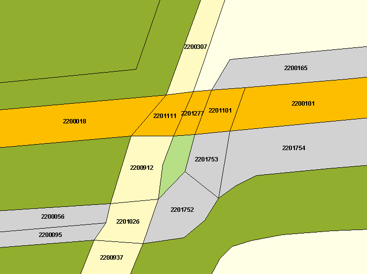

| identificatie | type infrastructuur | type weg | type weg |
|:---:|:---:|:---:|:---:|
| 2200018 | verbinding | regionale weg | |
| 2200056 | verbinding | overig | |
| 2200095 | verbinding | overig | |
| 2200101 | verbinding | overig | |
| 2200165 | verbinding | overig | |
| 2200307 | verbinding | lokale weg | |
| 2200912 | verbinding | lokale weg | |
| 2200937 | verbinding | lokale weg | |
| _2201026_ | _kruising_ | _lokale weg_ | _overig_ |
| _2201101_ | _kruising_ | _regionale weg_ | _overig_ |
| _2201111_ | _kruising_ | _regionale weg_ | _lokale weg_ |
| 2201752 | verbinding | overig | |
| 2201753 | kruising | overig | |
| 2201754 | verbinding | overig | |

_Figuur 5.1: Voorbeeld van gelijkvloerse kruisingen. De kruisingen bestaan uit één wegdeel met in sommige gevallen twee wegtypes. Eventuele multipliciteit van 'hoofdverkeersgebruik' is hier niet weergegeven._

## 5.2 Spoorbaandeel

Definitie: Kleinste functioneel onafhankelijk stukje spoorbaan met gelijkblijvende, homogene eigenschappen en relaties dat er binnen een spoorwegnet wordt onderscheiden.

| Attribuut | Multipliciteit | Optionaliteit | Attribuutwaarde | Punt | Lijn | Vlak |
|:---|:---|:---|:---|:---|:---|:---|
| type infrastructuur | enkelvoudig | verplicht | < domein "SP\_typeInfrastructuur" > | |  | |
| type spoorbaan | enkelvoudig | verplicht | < domein "SP\_typeSpoorbaan" > | x | x | |
| fysiek voorkomen | veelvoudig | optioneel | < domein "SP\_fysiekVoorkomen" > | x | x | |
| spoorbreedte | enkelvoudig | verplicht | < domein "SP\_spoorbreedte" > | x | x | |
| aantal sporen | enkelvoudig | verplicht | < domein "SP\_aantalSporen" > | x | x | |
| vervoerfunctie | enkelvoudig | verplicht | < domein "SP\_vervoerFunctie" > | x | x | |
| elektrificatie | enkelvoudig | verplicht | < domein "SP\_elektrificatie" > | x | x | |
| brugnaam | enkelvoudig | optioneel | < naam brug > | x | x | |
| tunnelnaam | enkelvoudig | optioneel | < naam tunnel > | x | x | |
| baanvaknaam | enkelvoudig | optioneel | < naam baanvak > | x | x | |
| status | enkelvoudig | verplicht | < domein "Status" > | x | x | |
| hoogteniveau | enkelvoudig | verplicht | < getal > | x | x | |

| Domein "SP\_typeInfrastructuur" | Punt | Lijn | Vlak |
|:---|:---|:---|:---|
| verbinding | | x | |
| kruising | x | | |

| Domein "SP\_typeSpoorbaan" |
|:---|
| trein |
| tram |
| sneltram |
| metro |
| gemengd |

| Domein "SP\_fysiekVoorkomen" |
|:---|
| op vast deel van brug |
| op beweegbaar deel van brug |
| overkluisd |
| in tunnel |

| Domein "SP\_spoorbreedte" |
|:---|
| normaalspoor |
| smalspoor |

| Domein "SP\_aantalSporen" |
|:---|
| enkel |
| dubbel |
| meervoudig |

| Domein "SP\_vervoerFunctie" |
|:---|
| gemengd gebruik |
| personenvervoer |
| goederenvervoer |
| museumlijn |

| Domein "SP\_elektrificatie" |
|:---|
| ja |
| nee |

| Domein "Status" |
|:---|
| in uitvoering |
| in gebruik |
| buiten gebruik |

_Tabel 5.2 Attributen, attribuutwaarden en geometrieën van spoorbaandelen._

Een spoorbaandeel heeft een punt- of lijngeometrie. Het heeft een lijngeometrie indien het type infrastructuur verbinding is. Indien type infrastructuur kruising is, dan heeft het spoorbaandeel een puntgeometrie. Een spoorbaandeel heeft nooit een meervoudige geometrie.

## 5.3 Waterdeel

Definitie: Kleinste functioneel onafhankelijk stukje water met gelijkblijvende, homogene eigenschappen en relaties dat er binnen een water wordt onderscheiden.

| Attribuut | Multipliciteit | Optionaliteit | Attribuutwaarde | Punt | Lijn | Vlak |
|:---|:---|:---|:---|:---|:---|:---|
| type water | enkelvoudig | verplicht | < domein "WA\_typeWater" > | | | |
| breedteklasse | enkelvoudig | optioneel | < domein "WA\_breedteklasse" > | | | |
| hoofdafwatering | enkelvoudig | verplicht | < domein "WA\_hoofdafwatering" > | x | x | x |
| fysiek voorkomen | veelvoudig | optioneel | < domein "WA\_fysiekVoorkomen" > | | | |
| functie | enkelvoudig | verplicht | < domein "WA\_functie" > | | | |
| voorkomen | enkelvoudig | optioneel | met riet | | x | x |
| getijde invloed | enkelvoudig | verplicht | < domein "WA\_getijdeInvloed" > | x | x | x |
| vaarwegklasse | enkelvoudig | optioneel | < domein "WA\_vaarwegklasse" > | x | x | x |
| naam officieel | enkelvoudig | optioneel | < Officiële naam water > | x | x | x |
| naam NL | veelvoudig | optioneel | < Nederlandse naam water > | x | x | x |
| naam Fries | veelvoudig | optioneel | < Friese naam water > | x | x | x |
| isBAGnaam | enkelvoudig | optioneel | < domein "WA\_isBAGnaam" > | x | x | x |
| sluisnaam | enkelvoudig | optioneel | < naam sluis > | x | x | x |
| brugnaam | enkelvoudig | optioneel | < naam brug > | x | x | x |
| hoogteniveau | enkelvoudig | verplicht | < getal > | x | x | x |

| Domein "WA\_typeWater" | Multipliciteit | Optionaliteit | Attribuutwaarde | Punt | Lijn | Vlak |
|:---|:---|:---|:---|:---|:---|:---|
| type water | enkelvoudig | verplicht | waterloop | | x | x |
| type water | enkelvoudig | verplicht | meer, plas | | | x |
| type water | enkelvoudig | verplicht | greppel, droge sloot | | x | |
| type water | enkelvoudig | verplicht | zee | | | x |
| type water | enkelvoudig | verplicht | droogvallend | | | x |
| type water | enkelvoudig | verplicht | droogvallend (LAT) | | | x |
| type water | enkelvoudig | verplicht | bron, wel | x | | |

| Domein "WA\_breedteklasse" | Punt | Lijn | Vlak |
|:---|:---|:---|:---|
| 0,5 - 3 meter | x | x | |
| 3 - 6 meter | x | x | |
| 6 - 12 meter | | | x |
| 12 - 50 meter | | | x |
| 50 - 125 meter | | | x |
| > 125 meter | | | x |

| Domein "WA\_hoofdafwatering" |
|:---|
| ja |
| nee |

| Domein "WA\_fysiekVoorkomen" | Punt | Lijn | Vlak |
|:---|:---|:---|:---|
| in sluis | | x | x |
| op brug | | x | x |
| in duiker | | x | x |
| in afsluitbare duiker | | x | x |
| in grondduiker | | x | x |
| in afsluitbare grondduiker | | x | x |
| overkluisd | x | x | x |

| Domein "WA\_functie" | Punt | Lijn | Vlak |
|:---|:---|:---|:---|
| drinkwaterbekken | | x | x |
| haven | | x | x |
| natuurbad | | x | x |
| viskwekerij | | x | x |
| vistrap | x | x | x |
| vloeiveld | | x | x |
| waterval | x | x | x |
| waterzuivering | | x | x |
| zwembad | | x | x |
| overig | x | x | x |
| onbekend | x | x | x |

| Domein "WA\_getijdeInvloed" |
|:---|
| ja |
| nee |

| Domein "WA\_vaarwegklasse" |
|:---|
| I |
| II |
| III |
| IV |
| Va |
| Vb |
| Via |
| VIb |
| Vic |
| VII |

| Domein "WA\_isBAGnaam" |
|:---|
| ja |
| nee |

_Tabel 5.3 Attributen, attribuutwaarden en geometrieën van waterdelen._

Een waterdeel kan een punt-, lijn- of vlakgeometrie hebben. Een waterdeel heeft nooit een meervoudige geometrie.

## 5.4 Gebouw

Definitie: Vrijstaande, overdekte en geheel of gedeeltelijk met wanden omsloten toegankelijke ruimte, die direct of indirect met de grond is verbonden.

| Attribuut | Multipliciteit | Optionaliteit | Attribuutwaarde | Punt | Lijn | Vlak |
|:---|:---|:---|:---|:---|:---|:---|
| type gebouw | veelvoudig | verplicht | < domein "GB\_typeGebouw" > | x | | x |
| fysiek voorkomen | enkelvoudig | optioneel | < domein "GB\_fysiekVoorkomen" > | | | |
| hoogteklasse | enkelvoudig | verplicht | < domein "GE\_hoogteklasse" > | x | | x |
| hoogte | enkelvoudig | optioneel | < hoogte boven maaiveld in meters > | x | | x |
| naam | meervoudig | optioneel | < naam gebouw > | x | | |
| soortnaam | enkelvoudig | optioneel | < soortnaam gebouw > | x | | x |
| status | enkelvoudig | verplicht | < domein "Status" > | x | | x |
| hoogteniveau | enkelvoudig | verplicht | < getal > | x | | x |
| gebruiksdoel | meervoudig | optioneel | < domein GE\_gebruiksdoel > | x | | x |

| Domein "GB\_typeGebouw" |
|:---|
| bezoekerscentrum |
| boortoren |
| brandtoren |
| brandweerkazerne |
| bunker |
| crematorium |
| dok |
| elektriciteitscentrale |
| fabriek |
| fort |
| gemaal |
| gemeentehuis |
| gevangenis |
| hotel |
| huizenblok |
| kapel |
| kas, warenhuis |
| kasteel |
| kerk |
| kerncentrale, kernreactor |
| kliniek, inrichting, sanatorium |
| klokkentoren |
| klooster, abdij |
| koeltoren |
| koepel |
| kunstijsbaan |
| lichttoren |
| luchtwachttoren |
| manege |
| markant gebouw |
| militair gebouw |
| moskee |
| museum |
| observatorium |
| overig religieus gebouw |
| paleis |
| parkeerdak, parkeerdek, parkeergarage |
| peilmeetstation |
| politiebureau |
| pompstation |
| postkantoor |
| psychiatrisch ziekenhuis, psychiatrisch centrum |
| radarpost |
| radartoren |
| radiotoren, televisietoren |
| recreatiecentrum |
| reddingboothuisje |
| remise |
| ruïne |
| schaapskooi |
| school |
| schoorsteen |
| silo |
| sporthal |
| stadion |
| stadskantoor, hulpsecretarie |
| stationsgebouw |
| synagoge |
| tank |
| tankstation |
| telecommunicatietoren |
| tol |
| toren |
| transformatorstation |
| uitzichttoren |
| universiteit |
| veiling |
| verkeerstoren |
| vuurtoren |
| waterradmolen |
| watertoren |
| wegrestaurant |
| werf |
| windmolen |
| windmolen: korenmolen |
| windmolen: watermolen |
| windturbine |
| zendtoren |
| ziekenhuis |
| zwembad |
| overig |

| Domein "GB\_fysiekVoorkomen" | Punt | Lijn | Vlak |
|:---|:---|:---|:---|
| ondergronds | | | x |
| overkluisd | x | | x |

| Domein "GE\_hoogteklasse" |
|:---|
| laagbouw | x | | x |
| hoogbouw | x | | x |

| Domein "Status" |
|:---|
| in uitvoering |
| in gebruik |
| buiten gebruik |

| Domein GE\_gebruiksdoel |
|:---|
| bijeenkomstfunctie |
| celfunctie |
| gezondheidszorgfunctie |
| industriefunctie |
| kantoorfunctie |
| logiesfunctie |
| onderwijsfunctie |
| sportfunctie |
| winkelfunctie |
| woonfunctie |
| overige gebruiksfunctie |

_Tabel 5.4 Attributen, attribuutwaarden en geometrieën van gebouwen._

## 5.5 Terrein

Definitie: Zichtbaar begrensd stuk grond, niet zijnde een van de andere opdelende ruimtelijke objecten (wegdeel of waterdeel)

| Attribuut | Multipliciteit | Optionaliteit | Attribuutwaarde | Punt | Lijn | Vlak |
|:---|:---|:---|:---|:---|:---|:---|
| type landgebruik | enkelvoudig | verplicht | < domein "TE\_typeIandgebruik" > | | | x |
| fysiek voorkomen | veelvoudig | optioneel | < domein "TE\_fysiekVoorkomen" > | | | x |
| voorkomen | veelvoudig | optioneel | < domein "TE\_voorkomen" > | | | x |
| naam | enkelvoudig | optioneel | < naam terrein > | | | x |
| hoogteniveau | enkelvoudig | verplicht | < getal > | | | x |

| Domein "TE\_typeIandgebruik" |
|:---|
| aanlegsteiger |
| akkerland |
| basaltblokken, steenglooiing |
| bebouwd gebied |
| boomgaard |
| boomkwekerij |
| bos: gemengd bos |
| bos: griend |
| bos: loofbos |
| bos: naaldbos |
| braakliggend |
| dodenakker |
| dodenakker met bos |
| duin |
| fruitkwekerij |
| grasland |
| heide |
| populieren |
| spoorbaanlichaam |
| zand |
| overig |

| Domein "TE\_fysiekVoorkomen" |
|:---|
| overkluisd |
| in tunnel |
| op vast deel van brug |
| op beweegbaar deel van brug |

| Domein "TE\_voorkomen" |
|:---|
| met riet |
| dras, moerassig |

_Tabel 5.5 Attributen, attribuutwaarden en geometrieën van terrein._

## 5.6 Inrichtingselement

Definitie: Ruimtelijk object, punt of lijnvormig, al dan niet ter detaillering dan wel ter inrichting van de overige benoemde ruimtelijke objecten of een ander inrichtingselement.

| Attribuut | Multipliciteit | Optionaliteit | Attribuutwaarde | Punt | Lijn | Vlak |
|:---|:---|:---|:---|:---|:---|:---|
| type inrichtingselement | enkelvoudig | verplicht | < domein "IE\_typeInrichtingselement" > | | | |
| hoogte | enkelvoudig | optioneel | < hoogte boven maaiveld in meters > | x | x | |
| breedte | enkelvoudig | optioneel | < breedte in meters > | | x | |
| naam | veelvoudig | optioneel | < naam inrichtingselement > | x | x | |
| soortnaam | enkelvoudig | optioneel | < soortnaam inrichtingselement > | x | x | |
| nummer | veelvoudig | optioneel | < nummer inrichtingselement > | x | x | |
| hoogteniveau | enkelvoudig | verplicht | < getal > | x | x | |

| Domein "IE\_typeInrichtingselement" | Punt | Lijn | Vlak |
|:---|:---|:---|:---|
| aanlegsteiger | | x | |
| baak | x | | |
| bomenrij | | x | |
| boom | x | | |
| botenhelling | x | | |
| busstation | x | | |
| calamiteitendoorgang | x | x | |
| dukdalf | x | | |
| gaswinning | x | | |
| gedenkteken, monument | x | | |
| geluidswering | | x | |
| golfmeetpaal | x | | |
| GPS kernnetpunt | x | | |
| grenspunt | x | | |
| havenhoofd | x | | |
| heg, haag | | x | |
| hekwerk | | x | |
| helikopterlandingsplatform | x | | |
| hoogspanningsleiding | | x | |
| hoogspanningsmast | x | | |
| hunebed | x | | |
| kaap | x | | |
| kabelbaan | | x | |
| kabelbaanmast | x | | |
| kilometerpaal | x | | |
| kilometerpaal spoorweg | x | | |
| kilometerpaal water | x | | |
| kilometerraaibord | x | | |
| kilometerraaipaal | x | | |
| klokkenstoel | x | | |
| koedam | x | x | |
| kogelvanger schietbaan | x | x | |
| kraan | x | | |
| kruis | x | | |
| leiding | | x | |
| luchtvaartlicht | x | | |
| markant object | x | | |
| metrostation | x | | |
| muur | | x | |
| oliepompinstallatie | x | | |
| paal | x | | |
| paalwerk | | x | |
| peilschaal | x | | |
| pijler | x | | |
| plaatsnaambord | x | x | |
| radiobaken | x | | |
| radiotelescoop | x | | |
| RD punt | x | | |
| scheepvaartlicht | x | | |
| schietbaan | x | | |
| seinmast | x | | |
| sluisdeur | x | x | |
| sneltramhalte | x | | |
| stormvloedkering | | x | |
| strandpaal | x | | |
| strekdam, krib, golfbreker | | x | |
| stuw | x | x | |
| tol | x | x | |
| treinstation | x | | |
| uitzichtpunt | x | | |
| verkeersgeleider | | x | |
| vlampijp | x | | |
| vliedberg | x | | |
| wegafsluiting | | x | |
| wegwijzer | x | | |
| windmolentje | x | | |
| zendmast | x | | |
| zichtbaar wrak | x | | |
| overig | x | x | |

_Tabel 5.6 Attributen, attribuutwaarden en geometrieën van inrichtingselementen._

## 5.7 Reliëf

Definitie: Object dat tot doel heeft hoogteverschillen in het landschap te representeren.

| Attribuut | Multipliciteit | Optionaliteit | Attribuutwaarde | Punt | Lijn | Vlak |
|:---|:---|:---|:---|:---|:---|:---|
| type reliëf | enkelvoudig | verplicht | < domein "RE\_typeReliëf" > | | x | |
| hoogteklasse | enkelvoudig | verplicht | < domein "RE\_hoogteklasse" > | | x | |
| functie | enkelvoudig | optioneel | geluid weren | | x | |
| hoogteniveau | enkelvoudig | verplicht | < getal > | | x | |

| Domein "RE\_typeReliëf" |
|:---|
| wal |
| talud, hoogteverschil |
| steile rand, aardrand |

| Domein "RE\_hoogteklasse" |
|:---|
| < 1 meter |
| 1 - 2,5 meter |
| > 2,5 meter |

_Tabel 5.7 Attributen, attribuutwaarden en geometrieën van reliëf._

Talud, hoogteverschil en steile rand, aardrand worden met twee lijnen opgeslagen: een lijn voor de hoge zijde en een lijn voor de lage zijde. De andere geo-objecten worden met een enkele lijn opgeslagen.

## 5.8 Hoogte

Definitie: Virtuele objecten met informatie over de hoogte van het terrein of de diepte van het water.

| Attribuut | Multipliciteit | Optionaliteit | Attribuutwaarde | Punt | Lijn | Vlak |
|:---|:---|:---|:---|:---|:---|:---|
| type hoogte | enkelvoudig | verplicht | < domein "HO\_typeHoogte" > | | | |
| hoogte | enkelvoudig | verplicht | < hoogte t.o.v. referentievlak in meters met 1 decimaal > | x | x | |
| referentievlak | enkelvoudig | verplicht | < domein "HO\_referentievlak" > | x | x | |

| Domein "HO\_typeHoogte" | Punt | Lijn | Vlak |
|:---|:---|:---|:---|
| dieptelijn | | x | |
| dieptepunt | x | | |
| hoogtelijn | | x | |
| hoogtepunt | x | | |
| hoogwaterlijn | | x | |
| laagwaterlijn | | x | |
| peil | x | | |
| peil: winterpeil | x | | |
| peil: zomerpeil | x | | |

| Domein "HO\_referentievlak" |
|:---|
| NAP |
| LAT |
| GHW |
| OLW |

_Tabel 5.8 Attributen, attribuutwaarden en geometrieën van hoogte._

## 5.9 Registratief gebied

Definitie: Op basis van wet- en regelgeving afgebakend gebied dat als eenheid geldt van politieke/bestuurlijke verantwoordelijkheid of voor bedrijfsvoering.

| Attribuut | Multipliciteit | Optionaliteit | Attribuutwaarde | Punt | Lijn | Vlak |
|:---|:---|:---|:---|:---|:---|:---|
| type registratief gebied | enkelvoudig | verplicht | < domein "RG\_typeRegistratiefGebied" > | | | x |
| naam officieel | enkelvoudig | verplicht | < Officiële naam registratief gebied > | | | x |
| naam NL | veelvoudig | optioneel | < Nederlandse naam registratief gebied > | | | x |
| naam Fries | veelvoudig | optioneel | < Friese naam registratief gebied > | | | x |
| nummer | veelvoudig | optioneel | < registratief nummer > | | | x |

| Domein "RG\_typeRegistratiefGebied" |
|:---|
| land |
| provincie |
| gemeente |
| territoriale zee |
| waterschap |

_Tabel 5.9 Attributen, attribuutwaarden en geometrieën van registratieve gebieden._

Registratieve gebieden liggen als virtuele gebieden boven de reële objectklassen (wegdelen, waterdelen, terrein, bebouwing, inrichtingselementen en reliëf).

## 5.10 Geografisch gebied

Definitie: Begrensd en benoemd gebied dat door een geografische eenheid beschreven wordt.

| Attribuut | Multipliciteit | Optionaliteit | Attribuutwaarde | Punt | Lijn | Vlak |
|:---|:---|:---|:---|:---|:---|:---|
| type geografisch gebied | enkelvoudig | verplicht | < domein "GG\_typeGeografischGebied" > | x | | x |
| naam NL | veelvoudig | optioneel | < Nederlandse naam geografisch gebied > | x | | x |
| naam Fries | veelvoudig | optioneel | < Friese naam geografisch gebied > | x | | x |

| Domein "GG\_typeGeografischGebied" |
|:---|
| bank, ondiepte, plaat |
| bosgebied |
| duingebied |
| eiland |
| geul, vaargeul |
| heidegebied |
| heuvel, berg |
| kaap, hoek |
| polder |
| streek, veld |
| terp, wierde |
| wad |
| watergebied |
| zee |
| zeegat, zeearm |
| overig |

_Tabel 5.10 Attributen, attribuutwaarden en geometrieën van geografische gebieden._

Deze objectklasse bevat een groot scala aan geografische namen (ook wel toponiemen of aardrijkskundige namen genoemd). In beginsel worden namen toegekend aan reële geo-objecten (wegdelen, waterdelen, gebouwen, terrein, inrichtingselementen). In veel gevallen omvat een geografische naam een groter gebied, waaronder tientallen, honderden of wel duizenden reële geo-objecten kunnen vallen (zoals bijvoorbeeld de Veluwe). In deze situaties wordt de naam niet toegekend aan al die individuele geo-objecten, maar wordt de naam als zelfstandig geo-object opgenomen. De begrenzingen van deze geografische gebieden zijn in veel gevallen niet exact bekend. De aangegeven begrenzingen zijn per definitie 'vaag'. In veel gevallen zijn de gebieden vooralsnog als puntobject opgenomen, met als coördinaat de locatie waar de desbetreffende naam op een reguliere topografische kaart voorkomt.

## 5.11 Plaats

Definitie: geografisch gebied gekenmerkt door een concentratie van gebouwen gebruikt voor wonen en werken.

| Attribuut | Multipliciteit | Optionaliteit | Attribuutwaarde | Punt | Lijn | Vlak |
|:---|:---|:---|:---|:---|:---|:---|
| type gebied | enkelvoudig | verplicht | < domein "PL\_typeGebied" > | | | |
| bebouwde kom | enkelvoudig | verplicht | < domein "PL\_isBebouwdeKom" > | x | | x |
| isBAGwoonplaats | enkelvoudig | verplicht | < domein "PL\_isBAGwoonplaats" > | x | | x |
| aantal inwoners | enkelvoudig | optioneel | < nummer > | x | | x |
| naam officieel | enkelvoudig | optioneel | < Officiële naam plaats > | x | | x |
| naam NL | veelvoudig | optioneel | < Nederlandse naam geografisch gebied > | x | | x |
| naam Fries | veelvoudig | optioneel | < Friese naam geografisch gebied > | x | | x |

| Domein "PL\_typeGebied" | Punt | Lijn | Vlak |
|:---|:---|:---|:---|
| woonkern | | | x |
| industriekern | | | x |
| recreatiekern | | | x |
| gehucht | x | | x |
| buurtschap | x | | x |
| deelkern | x | | x |
| stadsdeel | x | | x |
| wijk | x | | x |
| buurt | x | | x |

| Domein "PL\_isBebouwdeKom" |
|:---|
| ja |
| nee |

| Domein "PL\_isBAGwoonplaats" |
|:---|
| ja |
| nee |

_Tabel 5.11 Attributen, attribuutwaarden en geometrieën van plaatsen._

## 5.12 Functioneel gebied

Definitie: Begrensd en benoemd gebied dat door een functionele eenheid beschreven wordt.

| Attribuut | Multipliciteit | Optionaliteit | Attribuutwaarde | Punt | Lijn | Vlak |
|:---|:---|:---|:---|:---|:---|:---|
| type functioneel gebied | enkelvoudig | verplicht | < domein "FG\_typeFunctioneelGebied" > | x | | x |
| soortnaam | enkelvoudig | optioneel | < soortnaam functioneel gebied > | x | | x |
| naam NL | veelvoudig | optioneel | < Nederlandse naam functioneel gebied > | x | | x |
| naam Fries | veelvoudig | optioneel | < Friese naam functioneel gebied > | x | | x |

| Domein "FG\_typeFunctioneelGebied" |
|:---|
| attractiepark |
| bedrijventerrein |
| begraafplaats |
| boswachterij |
| botanische tuin |
| bungalowpark |
| camping, kampeerterrein |
| campus |
| caravanpark |
| circuit |
| crossbaan |
| dierentuin, safaripark |
| eendenkooi |
| emplacement |
| erebegraafplaats |
| gaswinning |
| gebied met hoge objecten |
| gebied voor radioastronomie |
| gebouwencomplex |
| golfterrein |
| grafheuvel |
| grindwinning |
| groeve |
| haven |
| heemtuin |
| helikopterlandingsterrein |
| infiltratiegebied |
| jachthaven |
| kartingbaan |
| kassengebied |
| kazerne, legerplaats |
| landgoed |
| mijn |
| milieustraat |
| militair oefengebied, schietterrein mosselbank |
| nationaal park |
| natuurgebied |
| oliewinning |
| openluchtmuseum |
| openluchttheater |
| park |
| plantsoen |
| productie-installatie |
| recreatiegebied |
| renbaan |
| skibaan |
| slipschool |
| sluizencomplex |
| sportterrein, sportcomplex |
| stortplaats |
| tennispark |
| transformatorstation |
| tuincentrum |
| vakantiepark |
| verdedigingswerk |
| verzorgingsplaats |
| viskwekerij |
| visvijvercomplex |
| vliegveld, luchthaven |
| volkstuinen |
| waterkering |
| werf |
| wildwissel |
| windturbinepark |
| woonwagencentrum |
| ijsbaan |
| zandwinning |
| zenderpark |
| ziekenhuiscomplex |
| zonnepark |
| zoutwinning |
| zuiveringsinstallatie |
| zweefvliegveldterrein |
| zwembadcomplex |
| overig |

_Tabel 5.12 Attributen, attribuutwaarden en geometrieën van functionele gebieden._

## 5.13 Plantopografie

Definitie: ruimtelijk object dat wel gepland is, maar nog niet in uitvoering is; meestal een groot infrastructureel object.

| Attribuut | Multipliciteit | Optionaliteit | Attribuutwaarde | Punt | Lijn | Vlak |
|:---|:---|:---|:---|:---|:---|:---|
| type object | enkelvoudig | verplicht | < domein "PT\_typeObject" > | x | x | x |
| naam | veelvoudig | optioneel | < naam plantopografie > | x | x | x |

| Domein "PT\_typeObject" |
|:---|
| spoorbaan |
| water |
| weg |
| overig |

_Tabel 5.13 Attributen, attribuutwaarden en geometrieën van plantopografie._

# 6 Uitwisseling van topografische gegevens

De oorspronkelijke niet objectgerichte TOP10vector bestanden zijn eind jaren tachtig ontwikkeld met een CAD structuur en zijn geproduceerd als Microstation dgn-files. In de zogenaamde userdata is de TDN-codering opgeslagen en deze vormen in feite een rechtstreekse vertaling van de legenda's van de topografische kaartseries.

Als gevolg van de technische ontwikkelingen op het gebied van hardware en software namen het afgelopen decennium de gebruiksmogelijkheden van de geografische gegevens sterk toe. Dit leidde ook tot andere gebruikerswensen als complexere analyse, koppeling met andere bestanden, snellere levering van data en internet toepassingen. Deze wensen zijn onder meer vastgelegd in de aanzet tot het Geografisch Kernbestand.
Tegenover de gebruikerswensen zijn de volgende beperkingen van de TOPvector-structuur op te merken: kaartgerichte data (vermenging terreinmodel met kartografisch model), bewerkelijke conversies van CAD naar GIS, interpretatie problemen van gebruikte TDN-coderingen, beperkte thematische inhoud, moeilijk koppelbaar met andere gegevens en leveren van mutaties is problematisch.

Bij de ontwikkeling van het objectgerichte gegevensmodel en de objectcatalogus van TOP10NL hebben de volgende overwegingen een rol gespeeld. Het model dient aan te sluiten op Nederlandse en buitenlandse standaarden en dient een open, uitbreidbaar karakter te dragen. In Nederland gold als norm het Terreinmodel Vastgoed, NEN3610, waarvan vanaf 2005 een nieuwe versie beschikbaar is: het Basismodel Geo-Informatie (NEN3610 _2005_). Internationaal wordt veel gebruik gemaakt van de DFDD standaard. Deze standaard is in eerste instantie voor militair gebruik ontwikkeld, maar wordt nu ook voor civiele internationale datasets gehanteerd (onder meer EuroGlobalMap en EuroRegionalMap). Ook zijn buitenlandse modellen van diverse Europese landen in ogenschouw genomen (Duitsland: ATKIS, Groot-Brittannië: Mastermap, Denemarken: TOP10DK).
NEN3610 _2005_ (Basismodel Geo-Informatie) is vrijwel tegelijkertijd met TOP10NL ontwikkeld en er is voor gezorgd dat beide modellen goed op elkaar aansluiten. Zo gebruikt het Basismodel Geo-Informatie ook geen afkortingen en coderingen meer en wordt er voor de uitwisseling ook GML gebruikt.

Het uitwisselingsformaat waarin de gegevens beschikbaar zijn, is meestal afhankelijk van het softwarepakket waarin de gegevens zijn geproduceerd. De ontwikkelingen van de laatste decennia hebben geleid tot een breed scala van uitwisselingsformaten. Voor gebruikers met een afwijkend softwarepakket dan de producent levert dit vaak onoverkomelijke problemen op. Gelukkig zijn er nationale en internationale organisaties die standaarden vaststellen waarmee, onafhankelijk van de gebruikte software, datasets kunnen worden uitgewisseld. Dit gaat echter soms gepaard met gegevensverlies. Zo zijn er NEN- (Nederlandse), CEN- (Europese) en ISO- (wereldwijde) standaarden. Voor TOP10NL is gekozen voor een internationale standaard, aangereikt door het Open Geospatial Consortium (OGC, voorheen OpenGIS Consortium). Dit consortium is een samenwerkingsverband van enkele honderden internationale bedrijven en instanties op het gebied van GIS-software en GIS-gebruikers. Het doel is open standaarden te ontwikkelen, zodat datasets zonder problemen kunnen worden uitgewisseld en worden gebruikt op diverse platforms binnen de gangbare GIS-software.

Voor de uitwisseling van de TOP10NL bestanden is gekozen voor de standaardtaal GML (Geography Markup Language). Het voordeel van GML is dat zowel de inhoud als de structuur van de gegevens meegeleverd wordt. De structuur wordt via het internet door de bronhouder(s) bijgehouden, zodat dataconversie problemen tot het verleden behoren. GML is in beginsel een uitwisselingsformaat dat onafhankelijk is van specifieke GIS-software. Het is wereldwijd bruikbaar in een GIS systeem dat compatibel is met XML (eXtensible Markup Language), een internationale standaard op ICT gebied.

Vanaf de BRT-levering van september 2020 wordt TOP10NL ook ontsloten als Geopackage. Meer informatie over Geopackage is te vinden op de website van Geonovum: [**www.geonovum.nl/geo-standaarden/geopackage**](https://www.geonovum.nl/geo-standaarden/geopackage)

## 6.1 GML

GML (Geography Markup Language) is één van de standaarden die zijn ontwikkeld binnen het Open Geospatial Consortium, in samenwerking met o.a. ISO. GML is gebaseerd op XML (eXtensible Markup Language), net als HTML afkomstig uit de Internet-wereld en speciaal bedoeld voor het uitwisselen van gestructureerde informatie (gegevens in plaats van 'vrije' tekst).

XML (en dus GML) heeft tal van voordelen: het is goed leesbaar door zowel mensen als machines (het is niet binair), het is internationaal geaccepteerd (en op Unicode gebaseerd, zodat ook niet-westerse talen worden ondersteund), het is te controleren op juiste structuur ('well-formed' en 'valid') met niet-geo-specifieke tools, er is veel standaard programmatuur beschikbaar (welke ook weer in eigen software kan worden opgenomen), er is een methode om XML documenten te converteren naar andere XML documenten (XSLT om b.v. een kartografisch model van een landschapsmodel af te leiden), etc.

Voordeel is ook dat een op XML gebaseerde uitwisselingsstandaard zelf ook 'extensible' oftewel uitbreidbaar is. Als er een attribuut of recordtype moet worden toegevoegd, hoeft niet de hele standaard te worden aangepast. Hoewel er al erg veel geo-informatie uitwisselingsformaten zijn in de wereld, zijn deze óf gebonden aan een bepaald merk GIS- of CAD-software, of nationaal van opzet, of beperkt tot een bepaalde organisatie of bedrijfstak.

XML is een 'technisch' formaat (gekenmerkt door begin- en eind'tags' met tekst ertussen). Hoe de data in een XML of GML document moet worden gestructureerd (welke 'tags' er kunnen voorkomen, hoe de hiërarchie tussen de elementen eruit ziet) wordt bepaald door een bijbehorend schema. Dit kan een DTD document zijn (DTD = Document Type Description) of een XML Schema document.

In het geval van GML 3.1 wordt gebruik gemaakt van XML Schema. Een XML Schema document heeft als extensie ".xsd" en bevat de definities van de elementen en objectklassen die kunnen voorkomen in de GML documenten met de eigenlijke data. In een XML schema kunnen ook de toegestane waarden voor een attribuut worden aangegeven (enumeratie-types).

Er zijn allerlei hulpmiddelen beschikbaar (o.a. XML Spy) om te controleren of een GML document in overeenstemming is met de structuur en de 'constraints' die in het bijbehorende schema zijn vastgelegd.

De GML specificatie van het Open Geospatial Consortium bestaat uit vele XML Schema documenten (o.a. geometry.xsd, feature.xsd en xlinks.xsd) die tezamen een raamwerk vormen waarop gebruikersorganisaties hun eigen GML formaat kunnen baseren. Zo'n organisatie-specifiek GML schema is ook voor NEN3610 en TOP10NL gemaakt.

## 6.2 UML-model en XSD TOP10NL

Voor TOP10NL is een UML model opgesteld waarin de objectstructuur beschreven wordt. In onderstaande figuur is dit model weergegeven. Het model bestaat uit de 13 objectklassen zoals beschreven in [**paragraaf 4.2**](#42-objectklassen).

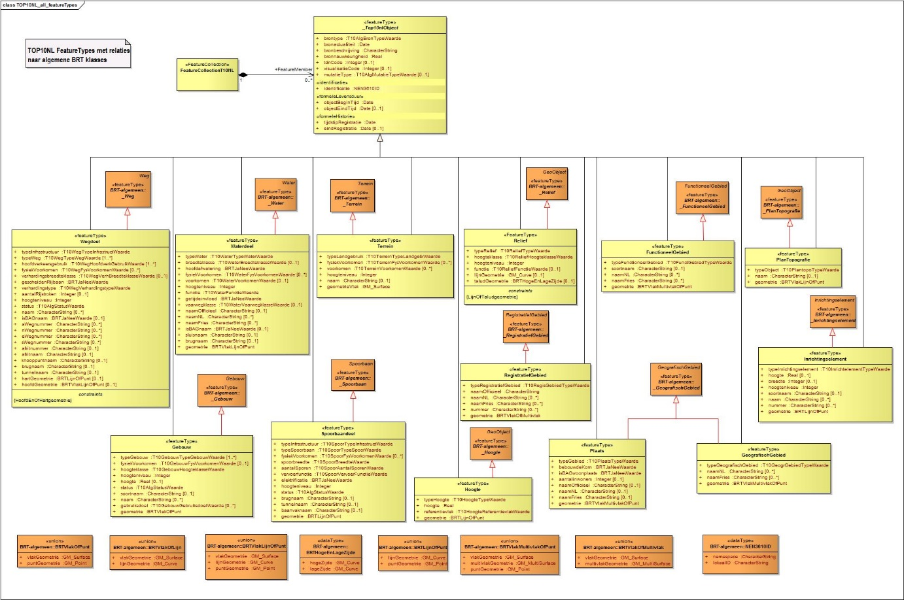

_Figuur 6.1: UML model van TOP10NL._

Het UML model is omgezet naar een XSD voor het gebruik in diverse programma's. Deze XSD is de basis voor het produceren en valideren van de GML bestanden van TOP10NL.

Het UML model en de XSD van TOP10NL kunnen gevonden worden op: [**register.geostandaarden.nl/?url=brt/top10nl**](https://register.geostandaarden.nl/?url=brt/top10nl)

## 6.3 Waardelijsten TOP10NL

De mogelijke attribuutwaarden voor attributen van TOP10NL zijn opgeslagen in waardelijsten. Deze waardelijsten zijn extern van de UML en XSD opgeslagen. Het extern opslaan van de waardelijsten heeft als voordeel dat de waardelijsten aangepast kunnen worden zonder dat dit gevolgen heeft voor de UML en XSD van TOP10NL. En doordat de XSD niet wijzigt, is er voor klanten geen aanpassing nodig aan het proces om de GML in te lezen.

De waardelijsten van TOP10NL kunnen gevonden worden op: [**register.geostandaarden.nl/?url=brt/top10nl**](https://register.geostandaarden.nl/?url=brt/top10nl)

## 6.4 Open data

De basisregistratie Topografie is vanaf 1 januari 2012 als open data beschikbaar, in de vorm van bestandsleveringen en een aantal webservices via PDOK.
Meer informatie over de Basisregistratie Topografie en de manieren om de producten van de BRT te verkrijgen is te vinden op de productpagina's van de BRT:

Productpagina BRT: [**www.kadaster.nl/zakelijk/registraties/basisregistraties/brt**](https://www.kadaster.nl/zakelijk/registraties/basisregistraties/brt)

Productpagina TOPNL: [**www.kadaster.nl/zakelijk/producten/geo-informatie/topnl**](https://www.kadaster.nl/zakelijk/producten/geo-informatie/topnl)

### Gebruiksvoorwaarden BRT

De topografische gegevens worden beschikbaar gesteld onder een CC-BY licentie. Dit betekent dat:

- De gebruiker de gegevens mag kopiëren, verspreiden en doorgeven.
- De gebruiker afgeleide producten mag maken.
- Gebruik voor commerciële doeleinden toegestaan is.
- Bij hergebruik of verspreiding de naam van het Kadaster wordt vermeld, op een manier die redelijk is in verhouding tot het gebruikte medium.
- Het Kadaster zijn intellectuele eigendomsrechten (o.a. databankenrecht) blijft voorbehouden.

Daarnaast moet er rekening mee gehouden worden dat alleen de gegevens die rechtstreeks uit de Basisregistratie afkomstig zijn, gelden als authentieke gegevens in de zin van de Kadasterwet.

## 6.5 Bestandsleveringen

De BRT is als bestandslevering beschikbaar in het formaat GML en Geopackage. Een compleet overzicht van de verschillende bestandsleveringen van de Basisregistratie Topografie is te vinden op de productpagina's van de BRT op PDOK: [**www.pdok.nl/introductie/-/article/basisregistratie-topografie-brt-topnl**](https://www.pdok.nl/introductie/-/article/basisregistratie-topografie-brt-topnl)

De GML-bestanden kunnen gedownload worden via een een download-viewer en via een API. Met de download-viewer kan de GML van heel Nederland in één keer downloaden. Ook kan er met de muis op de kaart van Nederland een gebied getekend worden. Vervolgens kunnen de gewenste objectklassen geselecteed worden en deze voor het geselecteerde gebied gedownload worden. 
Voor afnemers die elke levering hetzelfde gebied willen selecteren, heeft PDOK een API ontwikkeld die dit proces automatiseert. Hiermee is het ook mogelijk om de GML's per kaartblad te downloaden. PDOK heeft een instructie gemaakt over het het downloaden van GML's met deze API. Deze is te vinden op: [**www.pdok.nl/documents/1901824/4016976/Stappenplan_PDOK_download_APIs.pdf**](https://www.pdok.nl/documents/1901824/4016976/Stappenplan_PDOK_download_APIs.pdf)

De BRT geopackages kunnen gedownload worden via de productpagina's van de BRT op PDOK. Een Geopackage bevat altijd alle objecten in heel Nederland. Meer informatie over Geopackage is te vinden op de website van Geonovum: [**www.geonovum.nl/geo-standaarden/geopackage**](https://www.geonovum.nl/geo-standaarden/geopackage)

## 6.6 Webservices en OGC API's

Een webservice maakt het mogelijk een kaartbeeld in een webapplicatie te gebruiken, zonder dat de beheerder van de applicatie de geodata zelf in huis hoeft te hebben. Een webservice ontsluit dus de topografie "bij de bron". Voor TOP10NL is een WMS en een WMTS ingericht, waarmee de gegevens uit TOP10NL te bekijken zijn. Deze webservices zijn beschikbaar via het tabblad **(OGC) Webservices** op de productpagina van TOPNL: [**www.pdok.nl/introductie/-/article/basisregistratie-topografie-brt-topnl**](https://www.pdok.nl/introductie/-/article/basisregistratie-topografie-brt-topnl)

Voor TOP10NL zijn ook de **OGC API Features** en **OGC API Tiles en Styles (Vectortiles)** beschikbaar. 
De **OGC API-Tiles** is een nieuwe standaard waarmee visualisaties van topografische data gemaakt kunnen worden. Deze visualisaties kunnen daarna gebruikt worden in toepassingen zoals kaartviewers en andere topografische applicaties. Om snel te kunnen beginnen is de standaardvisualisatie van TOP10NL beschikbaar in de **OGC API-Styles**. In deze API kan die standaardvisualisatie ook aangepast worden. 
In de **OGC API-Features** is de complete TOP10NL-dataset beschikbaar. Hiermee kunnen specifieke objecten van TOP10NL-informatie gedownload worden, op basis van bijvoorbeeld een interessegebied of een ID. Omdat met de OGC API-Features de TOP10NL-informatie op objectniveau bekeken wordt, is er geen specifieke geografische kennis of een specifieke applicatie nodig. 
Deze OGC API's zijn beschikbaar op: [api.pdok.nl/brt/top10nl/ogc/v1](https://api.pdok.nl/brt/top10nl/ogc/v1)

## 6.7 Andere BRT-producten

Naast TOP10NL bestaat de BRT uit andere topografische bestanden. In onderstaande tabel wordt daarvan een overzicht gegeven en wordt verwezen naar de productpagina's en de PDOK-pagina's waar deze bestanden gedownload kunnen worden. Een compleet overzicht van de BRT-producten wordt gegeven op de pagina met BRT-producten: [**www.kadaster.nl/zakelijk/registraties/basisregistraties/brt/brt-producten**](https://www.kadaster.nl/zakelijk/registraties/basisregistraties/brt/brt-producten)

| Product | Productpagina |
|:---|:---|
| TOPNL | Productpagina: [**www.kadaster.nl/zakelijk/producten/geo-informatie/topnl**](https://www.kadaster.nl/zakelijk/producten/geo-informatie/topnl)   PDOK: [**www.pdok.nl/introductie/-/article/basisregistratie-topografie-brt-topnl**](https://www.pdok.nl/introductie/-/article/basisregistratie-topografie-brt-topnl) |
| TOPraster | Productpagina: [**www.kadaster.nl/zakelijk/producten/geo-informatie/topraster**](https://www.kadaster.nl/zakelijk/producten/geo-informatie/topraster)   PDOK: [**www.pdok.nl/introductie/-/article/dataset-basisregistratie-topografie-brt-topraster**](https://www.pdok.nl/introductie/-/article/dataset-basisregistratie-topografie-brt-topraster) |
| BRT Achtergrondkaart | Productpagina: [**https://www.kadaster.nl/zakelijk/producten/geo-informatie/brt-achtergrondkaart**](https://www.kadaster.nl/zakelijk/producten/geo-informatie/brt-achtergrondkaart)   PDOK: [**www.pdok.nl/introductie/-/article/basisregistratie-topografie-achtergrondkaarten-brt-a-**](https://www.pdok.nl/introductie/-/article/basisregistratie-topografie-achtergrondkaarten-brt-a-) |
| TOPnamen | Productpagina: [**www.kadaster.nl/zakelijk/producten/geo-informatie/topnamen**](https://www.kadaster.nl/zakelijk/producten/geo-informatie/topnamen)   PDOK: [**www.pdok.nl/introductie/-/article/basisregistratie-topografie-brt-topnl**](https://www.pdok.nl/introductie/-/article/basisregistratie-topografie-brt-topnl) |
| NLmaps | Productpagina: [**www.kadaster.nl/zakelijk/producten/geo-informatie/nl-maps**](https://www.kadaster.nl/zakelijk/producten/geo-informatie/nl-maps) |

_Tabel 6.1: Tabel met verwijzingen naar productpagina's._

## 6.8 Andere BRT UML-modellen en XSD's

In paragraaf [**6.2**](#62-uml-model-en-xsd-top10nl) is het UML-model en de XSD van TOP10NL beschreven. In het technisch register bij Geonovum kunnen de  UML-modellen en XSD's van de BRT in het algemeen en van de overige BRT producten gevonden worden: 
[**register.geostandaarden.nl/brt/index.html**](https://register.geostandaarden.nl/brt/index.html)

# 7 Catalogus Basisregistratie Topografie

In de catalogus van de Basisregistratie Topografie worden objecten en hun attributen in detail beschreven. Dit wordt gedaan door voor de objecten de attributen en attribuutwaarden te beschrijven. Onder andere worden de definitie, inwinningscriteria, multipliciteit en optionaliteit van de attributen en attribuutwaarden gegeven. Meer informatie over deze attributen is te vinden in de paragrafen [**3.6**](#36-volledigheid-top10nl), [**4.3.3**](#433-multipliciteit-van-een-kenmerk) en [**4.3.4**](#434-optionaliteit-van-een-kenmerk). Ook wordt aangegeven als welk geometrietype het object kan voorkomen.

De attributen, domeinen en attribuutwaarden die in alle objectklassen gebruikt worden, zoals identificatie, brontype, etc., zijn beschreven in [**paragraaf 7.1**](#71-objectklasse-onafhankelijke-attributen-en-domeinen). De overige attributen, domeinen en attribuutwaarden zijn beschreven in de [**paragraaf 7.2**](#72-objectklasse-wegdeel) tot en met paragraaf 7.13.

Volgens de Kadasterwet zijn alle gegevens in de Basisregistratie Topografie (TOP10NL) authentiek. In deze catalogus zal niet per gegeven worden aangegeven of het authentiek is of niet.

## 7.1 Objectklasse onafhankelijke attributen en domeinen

In de Basisregistratie Topografie zijn attributen gedefinieerd die bij ieder object voorkomen, ongeacht de objectklasse. Ook zijn er domeinen die in meerdere objectclasses gebruikt worden. In dit hoofdstuk worden deze attributen en domeinen beschreven. Deze attributen en domeinen worden niet bij de afzonderlijke objectklassen beschreven.

### 7.1.1 Attributen

#### Attribuut namespace

| Attribuut | namespace |
|:---|:---|
| Definitie | Unieke verwijzing naar een registratie van objecten |
| Inwinningscriteria | - |
| Multipliciteit | Enkelvoudig |
| Optionaliteit | Verplicht |
| Formaat | Tekst |

#### Attribuut lokaalID

| Attribuut | lokaalID |
|:---|:---|
| Definitie | Unieke registratiecode binnen een registratie |
| Inwinningscriteria | Wordt automatisch toegekend. |
| Multipliciteit | Enkelvoudig |
| Optionaliteit | Verplicht |
| Formaat | Tekst |

#### Attribuut brontype

| Attribuut | brontype |
|:---|:---|
| Definitie | Het type van de gebruikte bron. |
| Inwinningscriteria | - |
| Multipliciteit | Enkelvoudig |
| Optionaliteit | Verplicht |
| Formaat | Tekst |
| Domein | "Brontype" |

#### Attribuut bronbeschrijving

| Attribuut | bronbeschrijving |
|:---|:---|
| Definitie | De beschrijving van de gebruikte bron. |
| Inwinningscriteria | De bronbeschrijving geeft een nadere specificering van de gebruikte bron. |
| Multipliciteit | Enkelvoudig |
| Optionaliteit | Verplicht |
| Formaat | Tekst |

#### Attribuut bronactualiteit

| Attribuut | bronactualiteit |
|:---|:---|
| Definitie | De actualiteit van de gebruikte bron. |
| Inwinningscriteria | - |
| Multipliciteit | Enkelvoudig |
| Optionaliteit | Verplicht |
| Formaat | Datum |

#### Attribuut bronnauwkeurigheid

| Attribuut | bronnauwkeurigheid |
|:---|:---|
| Definitie | De nauwkeurigheid van de gebruikte bron in meters. |
| Inwinningscriteria | - |
| Multipliciteit | Enkelvoudig |
| Optionaliteit | Verplicht |
| Formaat | Getal |
| Domein | ≥ 0 |

#### Attribuut objectBeginTijd

| Attribuut | objectBeginTijd |
|:---|:---|
| Definitie | Tijdstip waarop het object ontstaan is. |
| Inwinningscriteria | - |
| Multipliciteit | Enkelvoudig |
| Optionaliteit | Verplicht |
| Formaat | Datum |

#### Attribuut objectEindTijd

| Attribuut | objectEindTijd |
|:---|:---|
| Definitie | Tijdstip waarop het object vervallen is. |
| Inwinningscriteria | - |
| Multipliciteit | Enkelvoudig |
| Optionaliteit | Optioneel |
| Formaat | Datum |

#### Attribuut tijdstipRegistratie

| Attribuut | tijdstipRegistratie |
|:---|:---|
| Definitie | Tijdstip waarop een versie van het object ontstaan is. |
| Inwinningscriteria | - |
| Multipliciteit | Enkelvoudig |
| Optionaliteit | Verplicht |
| Formaat | Datum |

#### Attribuut eindRegistratie

| Attribuut | eindRegistratie |
|:---|:---|
| Definitie | Tijdstip waarop een versie van het object vervallen is. |
| Inwinningscriteria | - |
| Multipliciteit | Enkelvoudig |
| Optionaliteit | Optioneel |
| Formaat | Datum |

#### Attribuut visualisatieCode

| Attribuut | visualisatieCode |
|:---|:---|
| Definitie | Code voor het visualiseren van het object. |
| Inwinningscriteria | - |
| Multipliciteit | Enkelvoudig |
| Optionaliteit | Optioneel |
| Formaat | Geheel getal |

#### Attribuut tdnCode

| Attribuut | tdnCode |
|:---|:---|
| Definitie | Code die het object in TOP10vector had. |
| Inwinningscriteria | - |
| Multipliciteit | Enkelvoudig |
| Optionaliteit | Optioneel |
| Formaat | Geheel getal |

#### Attribuut mutatietype

| Attribuut | mutatietype |
|:---|:---|
| Definitie | Het soort mutatie dat een object als laatste ondergaan heeft. |
| Inwinningscriteria | - |
| Multipliciteit | Enkelvoudig |
| Optionaliteit | Optioneel |
| Formaat | Tekst |
| Domein | "Mutatietype" |

### 7.1.2 Domeinen

#### Domein "Brontype"

| Domein | Brontype |
|:---|:---|
| Domeinwaarde | **luchtfoto** |
| Definitie | Een fotografische opname van een deel van het aardoppervlak, gemaakt vanuit een vliegtuig. |

| Domein | Brontype |
|:---|:---|
| Domeinwaarde | **RD** |
| Definitie | Net van vaste punten in Nederland. Deze vaste punten zijn de referentiepunten waarnaar overige metingen en karteringen kunnen verwijzen. De referentiepunten maken deel uit van een netwerk dat is vastgelegd in het systeem van de Rijksdriehoeksmeting (RD). Dit netwerk wordt beheerd en onderhouden door het Kadaster. ( [www.kadaster.nl](https://www.kadaster.nl) ). |

| Domein | Brontype |
|:---|:---|
| Domeinwaarde | **TOP10vector** |
| Definitie | Digitaal bestand, bestaande uit gecodeerde vectoren, die tezamen de topografie van Nederland weergeven op de schaal 1:10.000. Voorloper van TOP10NL. |

| Domein | Brontype |
|:---|:---|
| Domeinwaarde | **overig** |
| Definitie | De waarde van het objectkenmerk is bekend, maar anders dan de genoemde waarden. |

| Domein | Brontype |
|:---|:---|
| Domeinwaarde | **externe data** |
| Definitie | De data worden aangeleverd door externe leveranciers. |

#### Domein "Ruimtelijke coördinaten"

Definitie: De beschrijving van de ligging en de vorm van een object aan de hand van coördinaten. Voor TOP10NL wordt het coördinatenstelsel van de Rijksdriehoeksmeting gebruikt, ook wel bekend onder de namen "RD" of "EPSG 28992".

| Domein | Ruimtelijke coördinaten |
|:---|:---|
| Domeinwaarde | **GM\_Point** |
| Definitie | Het object wordt gerepresenteerd als een punt van het GML geometry type GM\_Point. |

| Domein | Ruimtelijke coördinaten |
|:---|:---|
| Domeinwaarde | **GM\_Curve** |
| Definitie | Het object wordt gerepresenteerd als een lijn van het GML geometry type GM\_Curve. |

| Domein | Ruimtelijke coördinaten |
|:---|:---|
| Domeinwaarde | **GM\_Surface** |
| Definitie | Het object wordt gerepresenteerd als een vlak van het GML geometry type GM\_Surface. |

| Domein | Ruimtelijke coördinaten |
|:---|:---|
| Domeinwaarde | **GM\_MultiSurface** |
| Definitie | Het object wordt gerepresenteerd als een multi vlak van het GML geometry type GM\_MultiSurface. |

#### Domein "Status"

| Domein | Status |
|:---|:---|
| Domeinwaarde | **in gebruik** |
| Definitie | Het object wordt gebruikt. |

| Domein | Status |
|:---|:---|
| Domeinwaarde | **buiten gebruik** |
| Definitie | Het object wordt niet meer (als zodanig) gebruikt. |

| Domein | Status |
|:---|:---|
| Domeinwaarde | **in uitvoering** |
| Definitie | Het object is in aanleg. |

#### Domein "Mutatietype"

| Domein | Mutatietype |
|:---|:---|
| Domeinwaarde | **kwaliteitsverbetering** |
| Definitie | Aanpassing van het object als gevolg van een kwaliteitsactie. |

| Domein | Mutatietype |
|:---|:---|
| Domeinwaarde | **werkelijke verandering** |
| Definitie | Aanpassing van het object als gevolg van wijzigingen van het object in het terrein. |

| Domein | Mutatietype |
|:---|:---|
| Domeinwaarde | **modelwijziging** |
| Definitie | Aanpassing van het object als gevolg van wijzigingen in het datamodel. |

| Domein | Mutatietype |
|:---|:---|
| Domeinwaarde | **andere bron** |
| Definitie | Aanpassing van het object als gevolg van gebruik van andere bronnen. |

## 7.2 Objectklasse: wegdeel

_Definitie:_

Kleinste functioneel onafhankelijk stukje weg met gelijkblijvende, homogene eigenschappen en relaties voor wegverkeer en vliegverkeer te land. Hieronder wordt het gehele weglichaam begrepen (incl. rijstroken, trottoirs, bermen, etc.).

_Inwinningscriteria:_

Een weg smaller dan 2 meter wordt aangegeven als een lijnobject samenvallend met het midden van de weg. Een weg breder dan 2 meter wordt aangegeven als een vlakobject, waarvan de contouren worden aangegeven, samenvallend met de kant van de verharding van een verharde weg c.q. de berijdbare strook van een onverharde weg.

Een berm smaller dan 6 meter zonder bebouwing, talud of brede houtrand wordt bij het wegdeel getrokken als de berm begrensd wordt door een waterloop, bebouwd oppervlak of een andere weg (uitgezonderd een rijwielpad smaller dan 2 meter). Een berm met talud wordt ongeacht de breedte als terrein met reliëf opgenomen.

Niet-openbare wegen op een circuit, wegen van een kartbaan, tankbanen (niet gelegen in een zandvlakte), wegen op een vliegveld/luchthaven (niet zijnde startbaan, landingsbaan, rolbaan of platform) en wegen op een volkstuincomplex worden opgenomen als wegdeel met als type weg en hoofdverkeersgebruik 'overig'.

Wegen van een crossbaan gelegen in een bos worden altijd opgenomen als wegdeel met als type wegen hoofdverkeersgebruik 'overig' en verhardingstype 'onverhard'. Wegen van een crossbaan buiten een bos worden alleen ingewonnen als de crossbaan meer dan 10.000 m² groot is. Bij andere crossbanen worden de wegen niet opgenomen.

Minimumlengte van op- en afritten van een dijk: 100 meter.

Er wordt geen verbinding gemaakt tussen wegen die op een erf uitkomen, maar openbare wegen die via het erf lopen worden wel opgenomen.

Een weg uitsluitend bestemd voor voetgangers rondom een sportveld wordt niet ingewonnen. Een weg uitsluitend bestemd voor voetgangers als toegangspad of gemeenschappelijk pad rond huizen, huizenrijen, flatgebouwen en dergelijke wordt niet opgenomen.

De wegen op een fruitkwekerij worden gegeneraliseerd weergegeven.

De toe- en uitrit van een tankstation of verzorgingsplaats wordt altijd opgenomen als lokale weg met een breedte van 4 tot 7 meter.

Een trap, hemelsbreed langer dan 100 meter wordt aangegeven als wegdeel met hoofdverkeersgebruik 'voetgangers' en breedteklasse '< 2 meter'. Een trap, hemelsbreed korter dan 100 meter, wordt niet aangegeven, tenzij het onderdeel is van een voetpad smaller dan 2 meter. Een trap gelegen in een voetgangersgebied wordt niet apart aangegeven.

Een steeg (nauwe straat binnen bebouwd gebied, smaller dan 2 meter) wordt als vlak ingewonnen waarbij de aanliggende gebouwen vertekend worden.

Een wisselstrook krijgt dezelfde attribuutwaarden als de rest van de weg.

### Attribuut geometriePunt

| Attribuut | geometriePunt |
|:---|:---|
| Definitie | De puntgeometrie van een wegdeel object. |
| Inwinningscriteria | - |
| Multipliciteit | Enkelvoudig |
| Optionaliteit | Optioneel |
| Formaat | GM\_Point |
| Domein | "Ruimtelijke coördinaten" |

### Attribuut geometrieLijn

| Attribuut | geometrieLijn |
|:---|:---|
| Definitie | De lijngeometrie van een wegdeel object. |
| Inwinningscriteria | - |
| Multipliciteit | Enkelvoudig |
| Optionaliteit | Optioneel |
| Formaat | GM\_Curve |
| Domein | "Ruimtelijke coördinaten" |

### Attribuut geometrieVlak

| Attribuut | geometrieVlak |
|:---|:---|
| Definitie | De vlakgeometrie van een wegdeel object. |
| Inwinningscriteria | - |
| Multipliciteit | Enkelvoudig |
| Optionaliteit | Optioneel |
| Formaat | GM\_Surface |
| Domein | "Ruimtelijke coördinaten" |

### Attribuut hartPunt

| Attribuut | hartPunt |
|:---|:---|
| Definitie | De hartpuntgeometrie van een wegdeel object. |
| Inwinningscriteria | - |
| Multipliciteit | Enkelvoudig |
| Optionaliteit | Optioneel |
| Formaat | GM\_Point |
| Domein | "Ruimtelijke coördinaten" |

### Attribuut hartLijn

| Attribuut | hartLijn |
|:---|:---|
| Definitie | De hartlijngeometrie van een wegdeel object. |
| Inwinningscriteria | - |
| Multipliciteit | Enkelvoudig |
| Optionaliteit | Optioneel |
| Formaat | GM\_Curve |
| Domein | "Ruimtelijke coördinaten" |

### Attribuut typeInfrastructuur

| Attribuut | typeInfrastructuur |
|:---|:---|
| Definitie | Aanduiding of het object een verbinding, een kruising of een overig verkeersgebied is. |
| Inwinningscriteria | - |
| Multipliciteit | Enkelvoudig |
| Optionaliteit | Verplicht |
| Formaat | Tekst |
| Domein | "WE\_typeInfrastructuur" |

#### Domein "WE\_typeInfrastructuur"

| Domein | WE\_typeInfrastructuur |
|:---|:---|
| Domeinwaarde | **verbinding** |
| Definitie | Wegdeel waar maximaal twee hartlijnen van andere wegdelen op aansluiten. |
| Inwinningscriteria | - Een wegdeel van het type verbinding heeft meestal als hoofdgeometrie een wegvlak of een weglijn. Soms heeft het geen hoofdgeometrie. - Een wegdeel van het type verbinding heeft altijd een hartlijn. |
| Volledigheid | Volledig |
| Punt | Nee |
| Lijn | Ja |
| Vlak | Ja |

| Domein | WE\_typeInfrastructuur |
|:---|:---|
| Domeinwaarde | **kruising** |
| Definitie | Gelijkvloerse kruising (wegdeel waar drie of meer hartlijnen van verbindingen op elkaar aansluiten). |
| Inwinningscriteria | - Een wegdeel van het type kruising heeft meestal als hoofdgeometrie een wegvlak of een wegpunt. Soms heeft het geen hoofdgeometrie. - Een wegdeel van het type kruising heeft altijd een hartpunt. - Het kruisingsvlak wordt geplaatst, daar waar twee wegvlakken elkaar kruisen of zoals bij op - en afritten, daar waar de wegvlakken bij elkaar komen. |
| Volledigheid | Volledig |
| Punt | Ja |
| Lijn | Nee |
| Vlak | Ja |

| Domein | WE\_typeInfrastructuur |
|:---|:---|
| Domeinwaarde | **overig verkeersgebied** |
| Definitie | Een wegdeel anders dan een verbinding of kruising. |
| Inwinningscriteria | - Een wegdeel van het type overig verkeersgebied heeft als hoofdgeometrie een wegvlak. - Een wegdeel van het type overig verkeersgebied heeft geen hartlijn en geen hartpunt. - Overige verkeersgebied wordt alleen gebruikt voor voetgangersgebieden en parkeerplaatsen. |
| Volledigheid | Volledig |
| Punt | Nee |
| Lijn | Nee |
| Vlak | Ja |

### Attribuut typeWeg

| Attribuut | typeWeg |
|:---|:---|
| Definitie | Het soort weg. |
| Inwinningscriteria | - Wegen worden hiërarchisch opgedeeld in een aantal categorieën, welke met dit attribuut worden aangeduid. - Een op- of afrit en een rotonde wordt aangegeven als een wegdeel van de hoogst geclassificeerde route (Volgorde van classificatie van hoog naar laag: 1 autosnelweg, 2 hoofdweg, 3 regionale weg, 4 lokale weg, 5 alle andere). Echter, als van een autosnelweg of hoofdweg voor snelverkeer een op/afrit op een rotonde uitkomt, dan vervalt de regel van hoogst geclassificeerde route, en krijgt de rotonde de code van de doorgaande route. - Autosnelwegen en hoofdwegen vormen samen een gesloten netwerk. Autosnelwegen, hoofdwegen en regionale wegen vormen ook een gesloten netwerk. |
| Multipliciteit | Veelvoudig (type infrastructuur = "kruising") / Enkelvoudig (type infrastructuur = "verbinding" of type infrastructuur = "overig verkeersgebied") |
| Optionaliteit | Verplicht |
| Formaat | Tekst |
| Domein | "WE\_typeWeg" |

#### Domein "WE\_typeWeg"

| Domein | WE\_typeweg |
|:---|:---|
| Domeinwaarde | **autosnelweg** |
| Definitie | Weg met gescheiden rijbanen en ongelijkvloerse kruisingen, daartoe aangeduid met het betreffende verkeersbord. |
| Inwinningscriteria | - |
| Volledigheid | Volledig |
| Punt | Ja |
| Lijn | Ja |
| Vlak | Ja |

| Domein | WE\_typeweg |
|:---|:---|
| Domeinwaarde | **hoofdweg** |
| Definitie | Verharde weg die is aangeduid met een E-nummer, maar niet met een A-nummer, of verharde weg die onderdeel is van een verbindingsroute tussen grotere plaatsen, wat blijkt uit blauwe ANWB-borden, dan wel onderdeel is van een route om eindigende A of E-routes tot een gesloten netwerk te completeren. |
| Inwinningscriteria | - |
| Volledigheid | Volledig |
| Punt | Ja |
| Lijn | Ja |
| Vlak | Ja |

| Domein | WE\_typeweg |
|:---|:---|
| Domeinwaarde | **regionale weg** |
| Definitie | Verharde weg die een verbinding vormt tussen bewoonde oorden of grote stadswijken en daartoe van twee kanten bewegwijzerd zijn met blauwe ANWB-richtingsborden voor autoverkeer. |
| Inwinningscriteria | Uitzondering:  Een weg mag als regionale weg worden opgenomen wanneer deze door 1 richtingsbord voor autoverkeer wordt aangeduid. Het kan zijn dat er in een bepaald gebied geen blauwe ANWB-borden aanwezig zijn, maar wel lokale borden voor autoverkeer. |
| Volledigheid | Volledig |
| Punt | Ja |
| Lijn | Ja |
| Vlak | Ja |

| Domein | WE\_typeweg |
|:---|:---|
| Domeinwaarde | **lokale weg** |
| Definitie | Weg van lokaal belang tussen bewegwijzerde routes. |
| Inwinningscriteria | - De belangrijkste straat (straten) binnen een wijk van tenminste 1 km2. - Belangrijke ontsluitingswegen zijn bewegwijzerd met witte ANWB-borden. - Aan- en afvoerwegen naar bebouwingsconcentraties (ook als deze doodlopend zijn) die veel verkeer aantrekken zoals winkel- en wijkcentra, industrieterreinen, stations, ziekenhuizen en aanverwante inrichtingen, kampeerterreinen, kazernes etc. - Een doodlopende weg langer dan 250 meter wordt ingewonnen als 'lokale weg' als deze verhard is of geen toegangsweg is. |
| Volledigheid | Volledig |
| Punt | Ja |
| Lijn | Ja |
| Vlak | Ja |

| Domein | WE\_typeweg |
|:---|:---|
| Domeinwaarde | **straat** |
| Definitie | Weg van zeer plaatselijk belang, gelegen binnen bebouwd gebied. |
| Inwinningscriteria | - Breder dan 2 meter. - Weg gelegen binnen bebouwd gebied, niet behorende tot de categorieën Autosnelweg, Hoofdweg, Regionale weg en Lokale weg, ongeacht de verharding en lengte. - Uitzondering: Doodlopende wegen naar of tussen schuurtjes, garageboxen, parkeerterreintjes (< 1000 m2) gelegen achter bebouwing, etc., korter dan 100 meter, worden ongeacht de verharding weggelaten. Wegen langer dan 100 meter worden aangegeven als straat. |
| Volledigheid | Volledig |
| Punt | Ja |
| Lijn | Ja |
| Vlak | Ja |

| Domein | WE\_typeweg |
|:---|:---|
| Domeinwaarde | **startbaan, landingsbaan** |
| Definitie | Strook grond waar vliegtuigen kunnen opstijgen en/of landen. |
| Inwinningscriteria | - |
| Volledigheid | Volledig |
| Punt | Ja |
| Lijn | Ja |
| Vlak | Ja |

| Domein | WE\_typeweg |
|:---|:---|
| Domeinwaarde | **rolbaan, platform** |
| Definitie | Afgebakende taxibaan op een vliegveld (rolbaan). / Terrein voor geparkeerd staande vliegtuigen (platform). |
| Inwinningscriteria | - |
| Volledigheid | Volledig |
| Punt | Ja |
| Lijn | Ja |
| Vlak | Ja |

| Domein | WE\_typeweg |
|:---|:---|
| Domeinwaarde | **veerverbinding** |
| Definitie | Vastgelegde route over water om voertuigen en personen over te zetten al dan niet op basis van een vaste dienstregeling |
| Inwinningscriteria | Een veerverbinding komt in verschillende verschijningsvormen voor: - Veerdienst: veer met een dienstregeling tussen twee plaatsen / havens. Wordt ingewonnen als 'veerverbinding' met hoofdverkeersgebruik 'gemengd verkeer' én bij de attribuutwaarde "naam" de tekst "Veerdienst <plaats1> - <plaats2>". - Pontveer: veer voor het overzetten van voertuigen en personen. Wordt ingewonnen als 'veerverbinding' met hoofdverkeersgebruik 'gemengd verkeer' - Fietsveer: veer voor het overzetten van fietsers / bromfietsers en personen. Wordt ingewonnen als 'veerverbinding' met hoofdverkeersgebruik 'fietsers, bromfietsers'. Ook een losliggend fietsveer worden ingewonnen als fietsveer. - Voetveer: veer voor het overzetten van personen. Wordt ingewonnen als 'veerverbinding' met hoofdverkeersgebruik 'voetgangers'. Ook een losliggend voetveer wordt ingewonnen als voetveer. |
| Volledigheid | Volledig |
| Punt | Nee |
| Lijn | Ja |
| Vlak | Nee |

| Domein | WE\_typeweg |
|:---|:---|
| Domeinwaarde | **parkeerplaats** |
| Definitie | Parkeergelegenheid voor meerdere voertuigen in de openlucht. |
| Inwinningscriteria | - Parkeerplaatsen worden gegeven als deze openbaar zijn en groter zijn dan 1000m². - Parkeerterreinen kleiner dan 1000 m² in een bosrijk natuurgebied én van oriënterende waarde worden ook ingewonnen. |
| Volledigheid | Volledig |
| Punt | Nee |
| Lijn | Nee |
| Vlak | Ja |

| Domein | WE\_typeweg |
|:---|:---|
| Domeinwaarde | **parkeerplaats: carpool** |
| Definitie | Parkeerplaats voor personenwagens langs doorgaande wegen t.b.v. carpoolers. |
| Inwinningscriteria | - |
| Volledigheid | Volledig |
| Punt | Nee |
| Lijn | Nee |
| Vlak | Ja |

| Domein | WE\_typeweg |
|:---|:---|
| Domeinwaarde | **parkeerplaats: P+R** |
| Definitie | Parkeergelegenheid ten behoeve van het overstappen op het openbaar vervoer. |
| Inwinningscriteria | - |
| Volledigheid | Volledig |
| Punt | Nee |
| Lijn | Nee |
| Vlak | Ja |

| Domein | WE\_typeweg |
|:---|:---|
| Domeinwaarde | **overig** |
| Definitie | De waarde van het objectkenmerk is bekend, maar anders dan de genoemde waarden. |
| Inwinningscriteria | - Niet-openbare wegen op een circuit en wegen van een crossbaan gelegen in een bos worden als overige weg ingewonnen. Wegen op een vliegveld/luchthaven die geen start- of landingsbaan, rolbaan of platform zijn worden altijd als overige weg ingewonnen. - Doodlopende wegen en toegangswegen langer dan 100 meter en korter dan 250 meter worden ingewonnen als 'overige weg'. - Een toegangsweg langer dan 250 meter met wegafsluiter (open of dicht) naar landerij(en) worden gegeven als 'overige weg'. - Wegen achter bebouwing, doodlopend in het terrein, met een minimum lengte van 250 meter worden ingewonnen als 'overige weg'. |
| Volledigheid | Beperkt |
| Punt | Ja |
| Lijn | Ja |
| Vlak | Ja |

### Attribuut hoofdverkeersgebruik

| Attribuut | hoofdverkeersgebruik |
|:---|:---|
| Definitie | Soort verkeer waarvoor een weg bestemd is. |
| Inwinningscriteria | - |
| Multipliciteit | Veelvoudig (type infrastructuur = "kruising") / Enkelvoudig (type infrastructuur = "verbinding" of type infrastructuur = "overig verkeersgebied") |
| Optionaliteit | Verplicht |
| Formaat | Tekst |
| Domein | "WE\_hoofdverkeersgebruik" |

#### Domein "WE\_hoofdverkeersgebruik"

| Domein | WE\_hoofdverkeersgebruik |
|:---|:---|
| Domeinwaarde | **snelverkeer** |
| Definitie | Weg, bestemd voor motorvoertuigen. |
| Inwinningscriteria | - |
| Volledigheid | Volledig |
| Punt | Ja |
| Lijn | Ja |
| Vlak | Ja |

| Domein | WE\_hoofdverkeersgebruik |
|:---|:---|
| Domeinwaarde | **gemengd verkeer** |
| Definitie | Weg, bestemd voor allerlei soorten verkeer. |
| Inwinningscriteria | - |
| Volledigheid | Volledig |
| Punt | Ja |
| Lijn | Ja |
| Vlak | Ja |

| Domein | WE\_hoofdverkeersgebruik |
|:---|:---|
| Domeinwaarde | **busverkeer** |
| Definitie | Weg speciaal bestemd voor openbaar vervoer. |
| Inwinningscriteria | Indien een busbaan is geïntegreerd in een bredere weg (dus als er op de grens tussen de busbaan en de rest van de weg geen fysieke barrière is om oneigenlijk gebruik te verhinderen), dan wordt de busbaan niet apart aangegeven. |
| Volledigheid | Beperkt |
| Punt | Ja |
| Lijn | Ja |
| Vlak | Ja |

| Domein | WE\_hoofdverkeersgebruik |
|:---|:---|
| Domeinwaarde | **fietsers, bromfietsers** |
| Definitie | Weg uitsluitend bestemd voor fietsers en/of bromfietsers en daartoe aangeduid met een blauw bord met daarop een wit rijwiel, of een blauw of zwart bord met daarop de tekst "FIETSPAD" of "RIJWIELPAD". Indien, in uitzonderlijke gevallen, met grote mate van zekerheid bepaald kan worden dat een weg/pad een rijwielpad is, mag afgeweken worden van de regel dat er een aanduiding moet zijn. |
| Inwinningscriteria | - Een vrijliggend rijwielpad (waar niet direct een ander wegdeel naast ligt) breder dan 2 meter wordt altijd aangegeven. - Een parallel gelegen rijwielpad (direct gelegen naast een ander wegdeel, met een fysieke scheiding ertussen) breder dan 2 meter, buiten bebouwd gebied, wordt altijd aangegeven. - Een parallel gelegen rijwielpad breder dan 2 meter, binnen bebouwd gebied, wordt alleen gegeven naast een autosnelweg, hoofdweg, regionale weg of lokale weg. - Een vrijliggend rijwielpad smaller dan 2 meter, wordt altijd aangegeven. - Een parallel gelegen rijwielpad smaller dan 2 meter buiten bebouwd gebied wordt aangegeven op de rand van het naastliggende wegvlak. - Een parallel gelegen rijwielpad smaller dan 2 meter binnen bebouwd gebied wordt niet aangegeven. - Een vrijliggend rijwielpad binnen bebouwd gebied dat over een relatief korte afstand parallel ligt langs een niet-geclassificeerde weg (straat of overige weg), wordt wel aangegeven. - Rijwielpaden toegankelijk voor bestemmingsverkeer krijgen als hoofdverkeersgebruik 'fietsers, bromfietsers'. - Een rijwielpad geïntegreerd in een voetgangersgebied wordt niet apart aangegeven. - Een fietsstraat wordt ingewonnen als straat. |
| Volledigheid | Beperkt |
| Punt | Ja |
| Lijn | Ja |
| Vlak | Ja |

| Domein | WE\_hoofdverkeersgebruik |
|:---|:---|
| Domeinwaarde | **voetgangers** |
| Definitie | Weg, uitsluitend bestemd voor voetgangers. |
| Inwinningscriteria | - Voetpaden smaller dan 2 meter worden alleen ingewonnen indien vrijliggend van andere wegdelen en langer dan 100 meter. - In uitzonderingssituaties mag, in geval van een duidelijke verbinding (als afkorting van een veel langer wegdeel van het type gemengd verkeer), een pad korter dan 100 m wel gegeven worden. Een koepad <2 m, gelegen achter een boerderij, wordt gegeven als voetpad indien hij langer is dan 250 m. - Een voetpad toegankelijk voor bestemmingsverkeer krijgt alleen 'voetgangers' als hoofdverkeersgebruik. Een voetpad als toegangspad of gemeenschappelijk pad rond huizen, huizenrijen, flatgebouwen e.d. v wordt niet aangegeven. Een voetpad dat onderdeel is van een doorlopend geheel en over een relatief korte afstand parallel ligt langs een niet-geclassificeerde weg (straat of overige weg), wordt wel aangegeven. Belangrijke voetpaden (belangrijk voor de wijk waarin ze voorkomen) mogen gegeven worden, ook als ze korter zijn dan 100 m, mits ze onderdeel zijn van een logisch doorlopend geheel met een minimum lengte van 250 meter. - Losse voetgangersbruggen, niet gelegen in een pad of rijwielpad, worden aangegeven als een voetpad met de attribuutwaarde op vast deel van brug / op beweegbaar deel van brug. Deze bruggen zijn interessant voor bv. wandelaars. Indien er over een waterloop veel losse voetgangersbruggen naast elkaar voorkomen, worden deze gegeneraliseerd weergegeven. |
| Volledigheid | Beperkt |
| Punt | Ja |
| Lijn | Ja |
| Vlak | Ja |

| Domein | WE\_hoofdverkeersgebruik |
|:---|:---|
| Domeinwaarde | **ruiters** |
| Definitie | Weg bestemd voor paardrijders. |
| Inwinningscriteria | Wordt niet ingewonnen. |
| Volledigheid | Niet |
| Punt | Ja |
| Lijn | Ja |
| Vlak | Ja |

| Domein | WE\_hoofdverkeersgebruik |
|:---|:---|
| Domeinwaarde | **vliegverkeer** |
| Definitie | Weg, bestemd voor luchtvaartuigen. |
| Inwinningscriteria | - |
| Volledigheid | Volledig |
| Punt | Ja |
| Lijn | Ja |
| Vlak | Ja |

| Domein | WE\_hoofdverkeersgebruik |
|:---|:---|
| Domeinwaarde | **overig** |
| Definitie | De waarde van het objectkenmerk is bekend, maar anders dan de genoemde waarden. |
| Inwinningscriteria | - |
| Volledigheid | Beperkt |
| Punt | Ja |
| Lijn | Ja |
| Vlak | Ja |

### Attribuut fysiekVoorkomen

| Attribuut | fysiekVoorkomen |
|:---|:---|
| Definitie | De plaats waar het object zich bevindt t.o.v. andere constructies. |
| Inwinningscriteria | - |
| Multipliciteit | Veelvoudig |
| Optionaliteit | Optioneel |
| Formaat | Tekst |
| Domein | "WE\_fysiekVoorkomen" |

#### Domein "WE\_fysiekVoorkomen"

| Domein | WE\_fysiekVoorkomen |
|:---|:---|
| Domeinwaarde | **op vast deel van brug** |
| Definitie | Gelegen op een niet beweegbaar deel van een kunstwerk dat een verbinding vormt door middel van een overspanning. |
| Inwinningscriteria | - Iedere brug wordt ingewonnen tenzij het een brug betreft die direct vanaf een weg toegang geeft tot bebouwing, een landerij etc. én geen relatie heeft met een weg. - Uitzondering: Losse voetgangersbruggen, niet gelegen in een pad of rijwielpad, worden aangegeven als een voetpad met de attribuutwaarde op vast deel van brug. Deze bruggen zijn interessant voor bv. wandelaars. Indien er over een waterloop veel losse voetgangersbruggen naast elkaar voorkomen, worden deze gegeneraliseerd weergegeven. |
| Volledigheid | Beperkt |
| Punt | Ja |
| Lijn | Ja |
| Vlak | Ja |

| Domein | WE\_fysiekVoorkomen |
|:---|:---|
| Domeinwaarde | **op beweegbaar deel van brug** |
| Definitie | Gelegen op een beweegbaar deel van een kunstwerk dat een verbinding vormt door middel van een overspanning. |
| Inwinningscriteria | - Iedere beweegbare brug wordt ingewonnen tenzij het een brug betreft die direct vanaf een weg toegang geeft tot bebouwing, een landerij etc. én geen relatie heeft met een weg. - Uitzondering: Losse voetgangersbruggen, niet gelegen in een pad of rijwielpad, worden aangegeven als een voetpad met de attribuutwaarde op beweegbaar deel van brug. Deze bruggen zijn interessant voor bv. wandelaars. Indien er over een waterloop veel losse voetgangersbruggen naast elkaar voorkomen, worden deze gegeneraliseerd weergegeven. |
| Volledigheid | Beperkt |
| Punt | Ja |
| Lijn | Ja |
| Vlak | Ja |

| Domein | WE\_fysiekVoorkomen |
|:---|:---|
| Domeinwaarde | **op rotonde** |
| Definitie | Deel van weg onderdeel zijnde van een rotonde. |
| Inwinningscriteria | - |
| Volledigheid | Volledig |
| Punt | Ja |
| Lijn | Ja |
| Vlak | Ja |

| Domein | WE\_fysiekVoorkomen |
|:---|:---|
| Domeinwaarde | **op oprit / afrit** |
| Definitie | Deel van weg onderdeel zijnde van een op- of afrit van een autosnelweg of hoofdweg. |
| Inwinningscriteria | - |
| Volledigheid | Volledig |
| Punt | Ja |
| Lijn | Ja |
| Vlak | Ja |

| Domein | WE\_fysiekVoorkomen |
|:---|:---|
| Domeinwaarde | **op knooppuntverbinding** |
| Definitie | Deel van een weg gelegen op een verkeersknooppunt van snelwegen. |
| Inwinningscriteria | - |
| Volledigheid | Volledig |
| Punt | Ja |
| Lijn | Ja |
| Vlak | Ja |

| Domein | WE\_fysiekVoorkomen |
|:---|:---|
| Domeinwaarde | **overkluisd** |
| Definitie | Overbouwd door gebouwen, zodanig dat de orthogonale projectie van de gebouwen op of over het object valt. |
| Inwinningscriteria | - Een overkluizing wordt niet aangeven in het geval van kleine oversteekjes. Bij de objectklasse terrein is de minimale maat 100 m2, de andere objectklassen kennen geen minimummaat. - Het verloop van het object onder de bebouwing, wordt volgens de meest waarschijnlijke vorm aangegeven. - Een overkluizing is geen aanleiding tot verandering van het hoogteniveau (bijvoorbeeld: een object waarboven zich alleen een gebouw bevindt, heeft als hoogteniveau de attribuutwaarde 0). - Wanneer een weg voor een gedeelte van de breedte overkluisd is, wordt het gehele wegdeel waarvoor dit geldt overkluisd (i.v.m. hartlijn). |
| Volledigheid | Beperkt |
| Punt | Ja |
| Lijn | Ja |
| Vlak | Ja |

| Domein | WE\_fysiekVoorkomen |
|:---|:---|
| Domeinwaarde | **in tunnel** |
| Definitie | Gelegen in een kunstmatig aangelegde, onderaardse of door een berg geboorde kokervormige doorgang. |
| Inwinningscriteria | - Voor vastlegging van het verloop van een tunnel is een overzichtskaart noodzakelijk. - Een veetunnel smaller dan 2 m wordt gegeven door het aanbrengen van een voetpad<2m in tunnel, ongeacht de lengte. - Een op zichzelf staande veetunnel breder dan 2 m wordt gegeven door het aanbrengen van een vlak overig in tunnel. - Een voetgangerstunnel smaller dan 2 m wordt gegeven door het aanbrengen van een voetpad<2m in tunnel, ongeacht de lengte. - Een voetgangerstunnel breder dan 2 m wordt gegeven door het aanbrengen van een wegvlak van het type voetpad>2 m in tunnel ongeacht de lengte. |
| Volledigheid | Beperkt |
| Punt | Ja |
| Lijn | Ja |
| Vlak | Ja |

### Attribuut verhardingsbreedteklasse

| Attribuut | verhardingsbreedteklasse |
|:---|:---|
| Definitie | De breedte van de verharding, ingedeeld in klassen. |
| Inwinningscriteria | - Bij het bepalen van de wegbreedte wordt tot de verharding gerekend: het verharde rijgedeelte, beton- en klinkerrand op gelijk niveau als het wegdek, berijdbare goot en in de rijbaan geïntegreerde rijwielstrook, weg/ busbaan en parkeerstrook (aangegeven door b.v. een witte streep). Niet meegerekend worden: opstaande randen, parkeerhavens, groenstenen en bermverharding in de vorm van sintels, puin e.d. Duidelijk zichtbare, plaatselijke versmallingen of verbredingen worden alleen opgemeten als deze zich over een afstand van tenminste 500 meter voortzetten (dus geen bruggen e.d.). Vluchtheuvels en verkeersgeleiders in de vorm van opstaande randen worden, mits ze korter zijn dan 500 meter, bij de bepaling van de wegbreedte buiten beschouwing gelaten. - Wegen van het type "straat" worden ingewonnen met verhardingsbreedteklasse = "2 - 4 meter" ongeacht de werkelijke verhardingsbreedte. - Wegen van het type "overig" en breder dan 2 meter, worden ingewonnen met verhardingsbreedteklasse = "2 - 4 meter" ongeacht de werkelijke verhardingsbreedte. Dit geldt bijvoorbeeld voor toegangswegen, busbanen, half-verharde wegen of onverharde wegen. |
| Multipliciteit | Enkelvoudig |
| Optionaliteit | Optioneel |
| Formaat | Tekst |
| Domein | "WE\_verhardingsbreedteklasse" |

#### Domein "WE\_verhardingsbreedteklasse"

| Domein | WE\_verhardingsbreedteklasse |
|:---|:---|
| Domeinwaarde | **> 7 meter** |
| Definitie | De breedte van de verharding, inclusief beton- en klinkerrand op gelijk niveau als het wegdek, berijdbare goot, geintegreerde rijwielstrook en/of busbaan en parkeerstrook is 7 meter of meer. |
| Inwinningscriteria | - |
| Volledigheid | Volledig |
| Punt | Ja |
| Lijn | Ja |
| Vlak | Ja |

| Domein | WE\_verhardingsbreedteklasse |
|:---|:---|
| Domeinwaarde | **4 - 7 meter** |
| Definitie | De breedte van de verharding, inclusief beton- en klinkerrand op gelijk niveau als het wegdek, berijdbare goot, geintegreerde rijwielstrook en/of busbaan en parkeerstrook is 4 meter of breder en smaller dan 7 meter. |
| Inwinningscriteria | - |
| Volledigheid | Volledig |
| Punt | Ja |
| Lijn | Ja |
| Vlak | Ja |

| Domein | WE\_verhardingsbreedteklasse |
|:---|:---|
| Domeinwaarde | **2 - 4 meter** |
| Definitie | De breedte van de verharding, inclusief beton- en klinkerrand op gelijk niveau als het wegdek, berijdbare goot, geintegreerde rijwielstrook en/of busbaan en parkeerstrook is 2 meter of breder en smaller dan 4 meter. |
| Inwinningscriteria | - |
| Volledigheid | Volledig |
| Punt | Ja |
| Lijn | Ja |
| Vlak | Ja |

| Domein | WE\_verhardingsbreedteklasse |
|:---|:---|
| Domeinwaarde | **< 2 meter** |
| Definitie | De breedte van de verharding, inclusief beton- en klinkerrand op gelijk niveau als het wegdek, berijdbare goot is smaller dan 2 meter. |
| Inwinningscriteria | Een verhardingsbreedteklasse "< 2 meter" geldt alleen voor weglijnen. |
| Volledigheid | Volledig |
| Punt | Ja |
| Lijn | Ja |
| Vlak | Nee |

### Attribuut gescheidenRijbaan

| Attribuut | gescheidenRijbaan |
|:---|:---|
| Definitie | Aanduiding of het object onderdeel uitmaakt van een weg met gescheiden rijbanen. |
| Inwinningscriteria | - Een weg heeft gescheiden rijbanen als het obstakel (vangrail, verhoogde betonrand, middenberm) tussen de rijbanen langer is dan 500 meter, mits beide wegen als een samenhangend geheel kunnen worden beschouwd. Een plaatselijke onderbreking van het obstakel (bijvoorbeeld bij een brug) wordt niet als onderbreking van het obstakel beschouwd. In het geval het terrein tussen beide rijbanen gevuld is met min of meer aaneengesloten bebouwing of met water of met een dusdanige dichte begroeiing dat het verband tussen beide wegen in het terrein niet meer is waar te nemen dan worden beide rijbanen niet meer aangegeven als gescheiden rijbaan. - De combinatie van gescheidenRijbaan = "ja" en typeWeg = "straat" is niet toegestaan. |
| Multipliciteit | Enkelvoudig |
| Optionaliteit | Verplicht |
| Formaat | Tekst |
| Domein | "WE\_gescheidenRijbaan" |

#### Domein "WE\_gescheidenRijbaan"

| Domein | WE\_gescheidenRijbaan |
|:---|:---|
| Domeinwaarde | **ja** |
| Definitie | Het object maakt deel uit van een weg met gescheiden rijbanen. |
| Inwinningscriteria | - |
| Volledigheid | Volledig |
| Punt | Ja |
| Lijn | Ja |
| Vlak | Ja |

| Domein | WE\_gescheidenRijbaan |
|:---|:---|
| Domeinwaarde | **nee** |
| Definitie | Het object maakt geen deel uit van een weg met gescheiden rijbanen. |
| Inwinningscriteria | - |
| Volledigheid | Volledig |
| Punt | Ja |
| Lijn | Ja |
| Vlak | Ja |

### Attribuut verhardingstype

| Attribuut | verhardingstype |
|:---|:---|
| Definitie | Het type verharding van een wegdeel. |
| Inwinningscriteria | Het verhardingstype wordt niet ingewonnen voor voetpaden en een aantal 'overige' wegen (bv. wegen op afgesloten terreinen, doodlopende wegen korter dan 250 m, wegen achter bebouwing). Het verhardingstype is dan "onbekend". |
| Multipliciteit | Enkelvoudig |
| Optionaliteit | Verplicht |
| Formaat | Tekst |
| Domein | "WE\_verhardingsType" |

#### Domein "WE\_verhardingsType"

| Domein | WE\_verhardingsType |
|:---|:---|
| Domeinwaarde | **verhard** |
| Definitie | Een weg met een egale verharding (asfalt, beton, klinkers, tegels, keien, etc.). |
| Inwinningscriteria | - Wegen met een verharding in slechte staat worden als verhard ingewonnen. - Wegen die van nature min of meer steenachtig zijn, zoals bijvoorbeeld in Limburg, worden als onverhard aangegeven. |
| Volledigheid | Volledig |
| Punt | Ja |
| Lijn | Ja |
| Vlak | Ja |

| Domein | WE\_verhardingsType |
|:---|:---|
| Domeinwaarde | **half verhard** |
| Definitie | Een weg waarop de verharding slechts gedeeltelijk is aangebracht (als twee banen met klinkers, beton, tegels, of uitsluitend groenstenen, etc.) of het rijvlak is verbeterd met grind of sintels. |
| Inwinningscriteria | - Wegen met een verharding in slechte staat worden als verhard ingewonnen. - Wegen die van nature min of meer steenachtig zijn, zoals bijvoorbeeld in Limburg, worden als onverhard aangegeven. |
| Volledigheid | Volledig |
| Punt | Ja |
| Lijn | Ja |
| Vlak | Ja |

| Domein | WE\_verhardingsType |
|:---|:---|
| Domeinwaarde | **onverhard** |
| Definitie | Een weg zonder enige vorm van kunstmatige verharding, dan wel een weg hier en daar opgevuld met puin. |
| Inwinningscriteria | Wegen die van nature min of meer steenachtig zijn, zoals bijvoorbeeld in Limburg, worden als onverhard aangegeven. |
| Volledigheid | Volledig |
| Punt | Ja |
| Lijn | Ja |
| Vlak | Ja |

| Domein | WE\_verhardingsType |
|:---|:---|
| Domeinwaarde | **onbekend** |
| Definitie | De waarde van het objectkenmerk is niet bekend. |
| Inwinningscriteria | Het verhardingstype wordt niet ingewonnen voor voetpaden en een aantal 'overige' wegen (bv. wegen op afgesloten terreinen, doodlopende wegen korter dan 250 m, wegen achter bebouwing). Het verhardingstype is dan "onbekend". |
| Volledigheid | Beperkt |
| Punt | Ja |
| Lijn | Ja |
| Vlak | Ja |

### Attribuut aantalRijstroken

| Attribuut | aantalRijstroken |
|:---|:---|
| Definitie | Het aantal onderverdelingen van een wegdeel d.m.v. strepen, verschil in verharding of kleur. |
| Inwinningscriteria | - Wordt aangegeven voor alle wegdelen behorende tot de categorie autosnelwegen en/of hoofdwegen. - Niet meegeteld worden geïntegreerde stroken met een speciale bestemming zoals busbaan en rijwielstrook. Een eventuele wisselstrook (een fysiek gescheiden rijbaan die beurtelings per rijrichting gebruikt wordt om doorstroming van het verkeer in de spits te bevorderen) telt mee voor het aantal rijstroken. - Een wisselend aantal rijstroken wordt pas weergegeven als het aantal rijstroken over tenminste 500 m constant is. - Bij een weg met gescheiden rijbanen wordt het **aantal rijstroken** per rijbaan aangegeven. - Het **aantal rijstroken** wordt _**niet**_ toegevoegd aan op- en afritten, wel aan de verbindingswegen op een **knooppunt**. |
| Volledigheid | Beperkt |
| Multipliciteit | Enkelvoudig |
| Optionaliteit | Optioneel |
| Formaat | Geheel getal |
| Punt | Ja |
| Lijn | Ja |
| Vlak | Ja |

### Attribuut naam

| Attribuut | naam |
|:---|:---|
| Definitie | De naam van het wegdeel. |
| Inwinningscriteria | - De naam van het wegdeel is gebaseerd op informatie uit de Basisregistratie Adressen en Gebouwen (BAG). - De tekst "Veerdienst … - …" mag opgenomen worden bij een wegdeel veerverbinding. De naam moet beide plaatsen bevatten. |
| Volledigheid | Beperkt |
| Multipliciteit | Veelvoudig |
| Optionaliteit | Optioneel |
| Formaat | Tekst |
| Punt | Ja |
| Lijn | Ja |
| Vlak | Ja |

### Attribuut isBAGnaam

| Attribuut | isBAGnaam |
|:---|:---|
| Definitie | Aanduiding of de naam geverifieerd is met de BAG. |
| Inwinningscriteria | Wegen van het type kruising hebben geen aanduiding 'isBAGnaam'. |
| Multipliciteit | Enkelvoudig |
| Optionaliteit | Optioneel |
| Formaat | Tekst |
| Domein | "WE\_isBAGnaam" |

#### Domein "WE\_isBAGnaam"

| Domein | WE\_isBAGnaam |
|:---|:---|
| Domeinwaarde | **ja** |
| Definitie | De naam is geverifieerd met de BAG. |
| Inwinningscriteria | - |
| Volledigheid | Beperkt |
| Punt | Ja |
| Lijn | Ja |
| Vlak | Ja |

| Domein | WE\_isBAGnaam |
|:---|:---|
| Domeinwaarde | **nee** |
| Definitie | De naam is niet geverifieerd met de BAG. |
| Inwinningscriteria | - |
| Volledigheid | Beperkt |
| Punt | Ja |
| Lijn | Ja |
| Vlak | Ja |

### Attribuut A-wegnummer

| Attribuut | A-wegnummer |
|:---|:---|
| Definitie | Nummering van de rijkswegen (autosnelwegen en autowegen) behorende tot het nationale wegenstelsel. |
| Inwinningscriteria | - Wordt opgenomen voor alle betreffende wegdelen, inclusief op- en afritten. - In incidentele gevallen komt het voor dat een autosnelweg tijdelijk overgaat in een autoweg waarbij het A-wegnummer blijft doorlopen. In die gevallen is het toegestaan aan de autoweg het betreffende A-wegnummer toe te voegen. |
| Volledigheid | Volledig |
| Multipliciteit | Veelvoudig |
| Optionaliteit | Optioneel |
| Formaat | Tekst |
| Punt | Ja |
| Lijn | Ja |
| Vlak | Ja |

### Attribuut N-wegnummer

| Attribuut | N-wegnummer |
|:---|:---|
| Definitie | Nummering van de provinciale wegen behorende tot het nationale wegenstelsel en nummering van rijkswegen die nog niet de status van autosnelweg hebben. |
| Inwinningscriteria | - Wordt opgenomen voor alle betreffende wegdelen, inclusief op- en afritten. - Bij een kruising van twee wegen met N-wegnummering over een rotonde krijgen alle wegdelen van de rotonde een dubbel N-wegnummer. Dit geldt niet indien het een T-splitsing betreft. In dat geval krijgen de wegdelen op de rotonde enkel het doorgaande N-wegnummer. |
| Volledigheid | Volledig |
| Multipliciteit | Veelvoudig |
| Optionaliteit | Optioneel |
| Formaat | Tekst |
| Punt | Ja |
| Lijn | Ja |
| Vlak | Ja |

### Attribuut E-wegnummer

| Attribuut | E-wegnummer |
|:---|:---|
| Definitie | Nummering van rijkswegen behorende tot het stelsel van europese doorgaande routes. |
| Inwinningscriteria | Wordt opgenomen voor alle betreffende wegdelen, echter niet aan de wegdelen behorende tot de op- en afritten, tenzij deze behoren tot de E-route of een verbinding vormen tussen verschillende E-routes. |
| Volledigheid | Volledig |
| Multipliciteit | Veelvoudig |
| Optionaliteit | Optioneel |
| Formaat | Tekst |
| Punt | Ja |
| Lijn | Ja |
| Vlak | Ja |

### Attribuut S-wegnummer

| Attribuut | S-wegnummer |
|:---|:---|
| Definitie | Nummering van secundaire wegen behorende tot het provinciale wegenstelsel. |
| Inwinningscriteria | Wordt opgenomen voor alle betreffende wegdelen, inclusief op- en afritten. |
| Volledigheid | Volledig |
| Multipliciteit | Veelvoudig |
| Optionaliteit | Optioneel |
| Formaat | Tekst |
| Punt | Ja |
| Lijn | Ja |
| Vlak | Ja |

### Attribuut afritnummer

| Attribuut | afritnummer |
|:---|:---|
| Definitie | Afritnummering op autosnelweg en hoofdweg, vastgesteld door Rijkswaterstaat. |
| Inwinningscriteria | - |
| Volledigheid | Volledig |
| Multipliciteit | Enkelvoudig |
| Optionaliteit | Optioneel |
| Formaat | Tekst |
| Punt | Ja |
| Lijn | Ja |
| Vlak | Ja |

### Attribuut afritnaam

| Attribuut | afritnaam |
|:---|:---|
| Definitie | Afritbenaming op autosnelweg, vastgesteld door Rijkswaterstaat. |
| Inwinningscriteria | Wordt (nog) niet ingewonnen. |
| Volledigheid | Niet |
| Multipliciteit | Enkelvoudig |
| Optionaliteit | Optioneel |
| Formaat | Tekst |
| Punt | Ja |
| Lijn | Ja |
| Vlak | Ja |

### Attribuut knooppuntnaam

| Attribuut | knooppuntnaam |
|:---|:---|
| Definitie | Naam van een knooppunt. |
| Inwinningscriteria | - |
| Volledigheid | Beperkt |
| Multipliciteit | Enkelvoudig |
| Optionaliteit | Optioneel |
| Formaat | Tekst |
| Punt | Ja |
| Lijn | Ja |
| Vlak | Ja |

### Attribuut brugnaam

| Attribuut | brugnaam |
|:---|:---|
| Definitie | De naam van een brug. |
| Inwinningscriteria | - Indien de brug is gelegen over een waterdeel van het type Greppel, Enkele sloot of Gerenforceerde sloot en er zich geen weer te geven brugvlak boven het waterdeel bevindt is het niet mogelijk een naam toe te voegen. - Indien de brug wel is beschreven op de 1:25.000 wordt in dat geval een inrichtingspunt geplaatst van het type overig waaraan de naam wordt toegevoegd. |
| Volledigheid | Beperkt |
| Multipliciteit | Enkelvoudig |
| Optionaliteit | Optioneel |
| Formaat | Tekst |
| Punt | Ja |
| Lijn | Ja |
| Vlak | Ja |

### Attribuut tunnelnaam

| Attribuut | tunnelnaam |
|:---|:---|
| Definitie | Naam van een tunnel. |
| Inwinningscriteria | - |
| Volledigheid | Beperkt |
| Multipliciteit | Enkelvoudig |
| Optionaliteit | Optioneel |
| Formaat | Tekst |
| Punt | Ja |
| Lijn | Ja |
| Vlak | Ja |

### Attribuut status

| Attribuut | status |
|:---|:---|
| Definitie | De staat waarin het object zich bevindt. |
| Inwinningscriteria | - |
| Multipliciteit | Enkelvoudig |
| Optionaliteit | Verplicht |
| Formaat | Tekst |
| Domein | "Status" |

### Attribuut hoogteniveau

| Attribuut | hoogteniveau |
|:---|:---|
| Definitie | Met het hoogteniveau wordt de relatieve hoogte van het geo-object weergegeven. Zo kan worden bepaald op welke wijze geo-objecten elkaar kruisen. |
| Inwinningscriteria | - |
| Volledigheid | Volledig |
| Multipliciteit | Enkelvoudig |
| Optionaliteit | Verplicht |
| Formaat | Geheel getal |
| Domein | ≤ 0 (0, -1, -2, -3, …) |
| Punt | Ja |
| Lijn | Ja |
| Vlak | Ja |

## 7.3 Objectklasse: spoorbaandeel

_Definitie:_

Kleinste functioneel onafhankelijk stukje spoorbaan met gelijkblijvende, homogene eigenschappen en relaties dat er binnen een spoorwegnet wordt onderscheiden.

_Inwinningscriteria:_

De hartlijnen worden opgenomen. Op het rangeergedeelte van een emplacement worden de buitenste sporen op de juiste plaats aangegeven, waarna de ruimte tussen het doorgaande spoor en het buitenste spoor wordt opgevuld met spoorbaandelen zonder wissels (kruisingen).

### Attribuut geometriePunt

| Attribuut | geometriePunt |
|:---|:---|
| Definitie | De puntgeometrie van een spoorbaandeel object. |
| Inwinningscriteria | - |
| Multipliciteit | Enkelvoudig |
| Optionaliteit | Optioneel |
| Formaat | GM\_Point |
| Domein | "Ruimtelijke coördinaten" |

### Attribuut geometrieLijn

| Attribuut | geometrieLijn |
|:---|:---|
| Definitie | De lijngeometrie van een spoorbaandeel object. |
| Inwinningscriteria | - |
| Multipliciteit | Enkelvoudig |
| Optionaliteit | Optioneel |
| Formaat | GM\_Curve |
| Domein | "Ruimtelijke coördinaten" |

### Attribuut typeInfrastructuur

| Attribuut | typeInfrastructuur |
|:---|:---|
| Definitie | Aanduiding of het object een verbinding of een kruising is. |
| Inwinningscriteria | - |
| Multipliciteit | Enkelvoudig |
| Optionaliteit | Verplicht |
| Formaat | Tekst |
| Domein | "SP\_typeInfrastructuur" |

#### Domein "SP\_typeInfrastructuur"

| Domein | SP\_typeInfrastructuur |
|:---|:---|
| Domeinwaarde | **verbinding** |
| Definitie | Object waar maximaal twee objecten van hetzelfde objecttype op aansluiten. |
| Inwinningscriteria | - |
| Volledigheid | Volledig |
| Punt | Nee |
| Lijn | Ja |
| Vlak | Nee |

| Domein | SP\_typeInfrastructuur |
|:---|:---|
| Domeinwaarde | **kruising** |
| Definitie | Een object waar drie of meer objecten van hetzelfde objecttype op aansluiten. |
| Inwinningscriteria | - |
| Volledigheid | Volledig |
| Punt | Ja |
| Lijn | Nee |
| Vlak | Nee |

### Attribuut typeSpoorbaan

| Attribuut | typeSpoorbaan |
|:---|:---|
| Definitie | Het soort vervoermiddel waarvoor het spoorbaandeel bestemd is. |
| Inwinningscriteria | - |
| Multipliciteit | Enkelvoudig |
| Optionaliteit | Verplicht |
| Formaat | Tekst |
| Domein | "SP\_typeSpoorbaan" |

#### Domein "SP\_typeSpoorbaan"

| Domein | SP\_typeSpoorbaan |
|:---|:---|
| Domeinwaarde | **trein** |
| Definitie | Spoorbaandeel bestemd voor railvoertuig voor de langere afstand dat sneller dan 45 km per uur kan, bestaande uit een enkele of een reeks van locomotieven, treinstellen en/of wagons. |
| Inwinningscriteria | - |
| Volledigheid | Volledig |
| Punt | Ja |
| Lijn | Ja |
| Vlak | Nee |

| Domein | SP\_typeSpoorbaan |
|:---|:---|
| Domeinwaarde | **tram** |
| Definitie | Spoorbaandeel bestemd voor railvoertuig ten behoeve van personenvervoer over korte afstand, niet harder rijdend dan 45 km per uur. |
| Inwinningscriteria | - Kan zowel enkel- als meersporig voorkomen. Hierbij geldt geen minimummaat voor opname. - Indien de tramroute loopt over een brug, door een tunnel of overkluisd is wordt dit voor het betreffende routedeel als attribuut toegevoegd. |
| Volledigheid | Volledig |
| Punt | Ja |
| Lijn | Ja |
| Vlak | Nee |

| Domein | SP\_typeSpoorbaan |
|:---|:---|
| Domeinwaarde | **sneltram** |
| Definitie | Spoorbaandeel bestemd voor railvoertuig ten behoeve van personenvervoer over korte afstand, harder rijdend dan 45 km per uur. |
| Inwinningscriteria | - Kan zowel enkel- als meersporig voorkomen. Hierbij geldt geen minimummaat voor opname. - Indien de tramroute loopt over een brug, door een tunnel of overkluisd is wordt dit voor het betreffende routedeel als attribuut toegevoegd. - Indien op een tracé zowel tram als sneltram rijdt wordt het tracé gegeven als sneltram. |
| Volledigheid | Volledig |
| Punt | Ja |
| Lijn | Ja |
| Vlak | Nee |

| Domein | SP\_typeSpoorbaan |
|:---|:---|
| Domeinwaarde | **metro** |
| Definitie | Spoorbaandeel bestemd voor al dan niet ondergrondse personentrein in een grote stad. |
| Inwinningscriteria | Wordt niet voorzien van kilometrering en het ondergrondse deel krijgt geen spoorbaanlichaam. |
| Volledigheid | Volledig |
| Punt | Ja |
| Lijn | Ja |
| Vlak | Nee |

| Domein | SP\_typeSpoorbaan |
|:---|:---|
| Domeinwaarde | **gemengd** |
| Definitie | Spoorbaandeel bestemd voor een combinatie van zowel trein, metro, sneltram of tramverkeer. |
| Inwinningscriteria | - |
| Volledigheid | Volledig |
| Punt | Ja |
| Lijn | Ja |
| Vlak | Nee |

### Attribuut fysiekVoorkomen

| Attribuut | fysiekVoorkomen |
|:---|:---|
| Definitie | De plaats waar het object zich bevindt t.o.v. andere constructies. |
| Inwinningscriteria | - |
| Multipliciteit | Veelvoudig |
| Optionaliteit | Optioneel |
| Formaat | Tekst |
| Domein | "SP\_fysiekVoorkomen" |

#### Domein "SP\_fysiekVoorkomen"

| Domein | SP\_fysiekVoorkomen |
|:---|:---|
| Domeinwaarde | **op vast deel van brug** |
| Definitie | Gelegen op een niet beweegbaar deel van een kunstwerk dat een verbinding vormt door middel van een overspanning. |
| Inwinningscriteria | - |
| Volledigheid | Volledig |
| Punt | Ja |
| Lijn | Ja |
| Vlak | Nee |

| Domein | SP\_fysiekVoorkomen |
|:---|:---|
| Domeinwaarde | **op beweegbaar deel van brug** |
| Definitie | Gelegen op een beweegbaar deel van een kunstwerk dat een verbinding vormt door middel van een overspanning. |
| Inwinningscriteria | - |
| Volledigheid | Volledig |
| Punt | Ja |
| Lijn | Ja |
| Vlak | Nee |

| Domein | SP\_fysiekVoorkomen |
|:---|:---|
| Domeinwaarde | **overkluisd** |
| Definitie | Overbouwd door bebouwing of door een al dan niet licht doorlatend dak, zodanig dat de orthogonale projectie van de bebouwing of het dak op of over het object valt. |
| Inwinningscriteria | - Het verloop van het object onder de bebouwing, wordt volgens de meest waarschijnlijke vorm aangegeven. - Een overkluizing is geen aanleiding tot verandering van het hoogteniveau (bijvoorbeeld: een object waarboven zich alleen een gebouw bevindt, heeft als hoogteniveau de attribuutwaarde 0). |
| Volledigheid | Volledig |
| Punt | Ja |
| Lijn | Ja |
| Vlak | Nee |

| Domein | SP\_fysiekVoorkomen |
|:---|:---|
| Domeinwaarde | **in tunnel** |
| Definitie | Gelegen in een kunstmatig aangelegde, onderaardse of door een berg geboorde kokervormige doorgang. |
| Inwinningscriteria | - |
| Volledigheid | Volledig |
| Punt | Ja |
| Lijn | Ja |
| Vlak | Nee |

### Attribuut spoorbreedte

| Attribuut | spoorbreedte |
|:---|:---|
| Definitie | De breedteklasse van het spoor. |
| Inwinningscriteria | - |
| Multipliciteit | Enkelvoudig |
| Optionaliteit | Verplicht |
| Formaat | Tekst |
| Domein | "SP\_spoorbreedte" |

#### Domein "SP\_spoorbreedte"

| Domein | SP\_spoorbreedte |
|:---|:---|
| Domeinwaarde | **normaalspoor** |
| Definitie | Spoor met een normale breedte, namelijk 1,435 meter. |
| Inwinningscriteria | - |
| Volledigheid | Volledig |
| Punt | Ja |
| Lijn | Ja |
| Vlak | Nee |

| Domein | SP\_spoorbreedte |
|:---|:---|
| Domeinwaarde | **smalspoor** |
| Definitie | Spoorbaandeel met een geringere breedte dan normaalspoor. |
| Inwinningscriteria | Wordt alleen weergegeven in open terrein. |
| Volledigheid | Volledig |
| Punt | Ja |
| Lijn | Ja |
| Vlak | Nee |

### Attribuut aantalSporen

| Attribuut | aantalSporen |
|:---|:---|
| Definitie | Het aantal sporen van het spoorbaandeel. |
| Inwinningscriteria | - Een wisselend aantal sporen wordt pas weergegeven als het aantal sporen over tenminste 5 kilometer constant is. Indien het aantal sporen over een lengte van minder dan 5 km wisselt, wordt het extra spoor niet apart weergegeven. Een tijdelijk parallel spoor op een volledig eigen tracé, wordt apart weergegeven. - Echter: de minimum lengte voor opname van een dubbelsporig gedeelte in een **enkelspoor** is 500 meter en ditzelfde geld voor een enkelsporig gedeelte in een **dubbelspoor**. - Voor het inwinnen van het aantal sporen van een spoorbaandeel is gebruik gemaakt van gegevens van ProRail. |
| Multipliciteit | Enkelvoudig |
| Optionaliteit | Verplicht |
| Formaat | Tekst |
| Domein | "SP\_aantalSporen" |

#### Domein "SP\_aantalSporen"

| Domein | SP\_ aantalSporen |
|:---|:---|
| Domeinwaarde | **enkel** |
| Definitie | Spoorbaan bestaande uit één spoor. |
| Inwinningscriteria | - |
| Volledigheid | Volledig |
| Punt | Ja |
| Lijn | Ja |
| Vlak | Nee |

| Domein | SP\_ aantalSporen |
|:---|:---|
| Domeinwaarde | **dubbel** |
| Definitie | Spoorbaan bestaande uit twee sporen. |
| Inwinningscriteria | - |
| Volledigheid | Volledig |
| Punt | Ja |
| Lijn | Ja |
| Vlak | Nee |

| Domein | SP\_ aantalSporen |
|:---|:---|
| Domeinwaarde | **meervoudig** |
| Definitie | Spoorbaan bestaande uit meer dan twee sporen. |
| Inwinningscriteria | - |
| Volledigheid | Volledig |
| Punt | Ja |
| Lijn | Ja |
| Vlak | Nee |

### Attribuut vervoerfunctie

| Attribuut | vervoerfunctie |
|:---|:---|
| Definitie | De functie waarvoor het spoor gebruikt wordt. |
| Inwinningscriteria | - |
| Multipliciteit | Enkelvoudig |
| Optionaliteit | Verplicht |
| Formaat | Tekst |
| Domein | "SP\_vervoerFunctie" |

#### Domein "SP\_vervoerFunctie"

| Domein | SP\_vervoerFunctie |
|:---|:---|
| Domeinwaarde | **gemengd gebruik** |
| Definitie | Spoorbaan, zowel bestemd voor personen- als goederenvervoer. |
| Inwinningscriteria | - |
| Volledigheid | Beperkt |
| Punt | Ja |
| Lijn | Ja |
| Vlak | Nee |

| Domein | SP\_vervoerFunctie |
|:---|:---|
| Domeinwaarde | **personenvervoer** |
| Definitie | Spoorbaan, alleen bestemd voor personenvervoer. |
| Inwinningscriteria | - |
| Volledigheid | Beperkt |
| Punt | Ja |
| Lijn | Ja |
| Vlak | Nee |

| Domein | SP\_vervoerFunctie |
|:---|:---|
| Domeinwaarde | **goederenvervoer** |
| Definitie | Spoorbaan, alleen bestemd voor goederenvervoer. |
| Inwinningscriteria | - |
| Volledigheid | Beperkt |
| Punt | Ja |
| Lijn | Ja |
| Vlak | Nee |

| Domein | SP\_vervoerFunctie |
|:---|:---|
| Domeinwaarde | **museumlijn** |
| Definitie | Spoorbaan, enkel in gebruik als toeristische attractie. |
| Inwinningscriteria | - |
| Volledigheid | Beperkt |
| Punt | Ja |
| Lijn | Ja |
| Vlak | Nee |

### Attribuut elektrificatie

| Attribuut | elektrificatie |
|:---|:---|
| Definitie | Aanduiding of het spoorbaandeel geëlektrificeerd is of niet. |
| Inwinningscriteria | - |
| Multipliciteit | Enkelvoudig |
| Optionaliteit | Verplicht |
| Formaat | Tekst |
| Domein | "SP\_elektrificatie" |

#### Domein "SP\_elektrificatie"

| Domein | SP\_elektrificatie |
|:---|:---|
| Domeinwaarde | **ja** |
| Definitie | Attribuut waarmee wordt aangegeven dat een spoorbaan geëlektrificeerd is. |
| Inwinningscriteria | - |
| Volledigheid | Volledig |
| Punt | Ja |
| Lijn | Ja |
| Vlak | Nee |

| Domein | SP\_elektrificatie |
|:---|:---|
| Domeinwaarde | **nee** |
| Definitie | Attribuut waarmee wordt aangegeven dat een niet spoorbaan geëlektrificeerd is. |
| Inwinningscriteria | - |
| Volledigheid | Volledig |
| Punt | Ja |
| Lijn | Ja |
| Vlak | Nee |

### Attribuut brugnaam

| Attribuut | brugnaam |
|:---|:---|
| Definitie | De naam van een spoorbrug. |
| Inwinningscriteria | - |
| Volledigheid | Beperkt |
| Multipliciteit | Enkelvoudig |
| Optionaliteit | Optioneel |
| Formaat | Tekst |
| Punt | Ja |
| Lijn | Ja |
| Vlak | Nee |

### Attribuut tunnelnaam

| Attribuut | tunnelnaam |
|:---|:---|
| Definitie | Naam van een spoortunnel. |
| Inwinningscriteria | - |
| Volledigheid | Beperkt |
| Multipliciteit | Enkelvoudig |
| Optionaliteit | Optioneel |
| Formaat | Tekst |
| Punt | Ja |
| Lijn | Ja |
| Vlak | Nee |

### Attribuut baanvaknaam

| Attribuut | baanvaknaam |
|:---|:---|
| Definitie | De naam van het baanvak waarin het spoorbaandeel zich bevind. |
| Inwinningscriteria | Wordt niet ingewonnen. |
| Volledigheid | Niet |
| Multipliciteit | Enkelvoudig |
| Optionaliteit | Optioneel |
| Formaat | Tekst |
| Punt | Ja |
| Lijn | Ja |
| Vlak | Nee |

### Attribuut status

| Attribuut | status |
|:---|:---|
| Definitie | De staat waarin het object zich bevindt. |
| Inwinningscriteria | - |
| Multipliciteit | Enkelvoudig |
| Optionaliteit | Verplicht |
| Formaat | Tekst |
| Domein | "Status" |

### Attribuut hoogteniveau

| Attribuut | hoogteniveau |
|:---|:---|
| Definitie | Het hoogteniveau van het object. |
| Inwinningscriteria | - |
| Volledigheid | Volledig |
| Multipliciteit | Enkelvoudig |
| Optionaliteit | Verplicht |
| Formaat | Geheel getal |
| Domein | ≤ 0 (0, -1, -2, -3, …) |
| Punt | Ja |
| Lijn | Ja |
| Vlak | Nee |

## 7.4 Objectklasse: waterdeel

_Definitie:_

Kleinste functioneel onafhankelijk stukje water met gelijkblijvende homogene eigenschappen en relaties dat er binnen een water wordt onderscheiden.

_Inwinningscriteria:_

Maximum breedte voor lijnvormige waterdelen: 6 meter.

Minimum oppervlakte voor vlakvormige waterdelen: 50 m².

Een vlakvormig waterdeel (zee of meer, plas) kan opgesplitst worden in meerdere delen, zodat het aantal punten niet te groot wordt.

### Attribuut geometriePunt

| Attribuut | geometriePunt |
|:---|:---|
| Definitie | De puntgeometrie van een waterdeel object. |
| Inwinningscriteria | - |
| Multipliciteit | Enkelvoudig |
| Optionaliteit | Optioneel |
| Formaat | GM\_Point |
| Domein | "Ruimtelijke coördinaten" |

### Attribuut geometrieLijn

| Attribuut | geometrieLijn |
|:---|:---|
| Definitie | De lijngeometrie van een waterdeel object. |
| Inwinningscriteria | - |
| Multipliciteit | Enkelvoudig |
| Optionaliteit | Optioneel |
| Formaat | GM\_Curve |
| Domein | "Ruimtelijke coördinaten" |

### Attribuut geometrieVlak

| Attribuut | geometrieVlak |
|:---|:---|
| Definitie | De vlakgeometrie van een waterdeel object. |
| Inwinningscriteria | - |
| Multipliciteit | Enkelvoudig |
| Optionaliteit | Optioneel |
| Formaat | GM\_Surface |
| Domein | "Ruimtelijke coördinaten" |

### Attribuut typeWater

| Attribuut | typeWater |
|:---|:---|
| Definitie | Het type water. |
| Inwinningscriteria | - |
| Multipliciteit | Enkelvoudig |
| Optionaliteit | Verplicht |
| Formaat | Tekst |
| Domein | "WA\_typeWater" |

#### Domein "WA\_typeWater"

| Domein | WA\_typeWater |
|:---|:---|
| Domeinwaarde | **waterloop** |
| Definitie | Langgerekt waterdeel in de vorm van een sloot, rivier, kanaal, enz. |
| Inwinningscriteria | Als waterloop worden beschouwd: - Beek (natuurlijke waterloop, ontstaan uit een bron). - Boezem (het geheel aan stilstaande, gemeen liggende, doch van het buitenwater afgesloten plassen, kanalen, tochten en sloten, waarop het overtollige water uit lager gelegen polders wordt uitgeslagen. Karakteristiek hierbij is dat het waterniveau hoger is dan het naastliggende maaiveldniveau). - Gracht (gegraven geul). - Kanaal (een ten behoeve van de waterbeheersing of scheepvaart gegraven geul). - Kreek (klein, smal, niet gegraven water, dikwijls een inham van een zee, ook wel een overblijfsel van een overstroming). Worden gegeneraliseerd aangegeven. - Natte sloot (sloot waar het grootste gedeelte van het jaar water in staat). - Rivier (natuurlijke waterloop). - Sprang / Sprank / Spreng (sloot of kanaal in zandgrond tot verzameling van het in de bodem aanwezige water t.b.v. de drinkwatervoorziening). - Vaart (kanaal, gegraven waterweg). - Vistrap (omleiding bij een stuw of een deel van een waterloop zodanig ingericht dat vissen stroomopwaarts kunnen passeren). - Wijk (sloot of kanaal in veenkoloniaal gebied). |
| Volledigheid | Volledig |
| Punt | Nee |
| Lijn | Ja |
| Vlak | Ja |

| Domein | WA\_typeWater |
|:---|:---|
| Domeinwaarde | **meer, plas** |
| Definitie | Water (meestal) niet gelegen in een waterloop. |
| Inwinningscriteria | Als meer, plas worden beschouwd: - Bezinkbak (omdijkt of ommuurd vlak, bestemd voor de bezinking van afvalslib). - Brandput (verdieping in het terrein, gevuld met water, waar bij brand bluswater gehaald kan worden). - Drinkplaats (verdieping in het terrein, gevuld met water, bestemd om vee te drenken). - Drinkwaterbekken (bassin t.b.v. de drinkwatervoorziening). - Kolk (waterput van extreme diepte in vergelijking met de oppervlakte). - Meer (grote watervlakte, ontstaan op natuurlijke wijze, dan wel door menselijk ingrijpen). - Natuurbad (plas in de natuur, ingericht voor zwemmen en zonnebaden). - Plas (watervlakte, ontstaan op natuurlijke wijze, dan wel door menselijk ingrijpen). - Poel (klein, ondiep, stilstaand water). - Spaarbekken (bekken waarin water wordt verzameld om op andere tijden te worden gebruikt o.a. als drinkwater). - Ven (klein, ondiep, stilstaand water in bos- of heidegebied, dat in tijden van grote droogte leeg kan staan en betreedbaar kan zijn). - Vijver (aangelegde waterkom in een tuin, park, plantsoen e.d.). - Viskwekerij (bassin, aangelegd voor het kweken van vis). - Visvijver (plas met voorzieningen t.b.v. het sportvissen). - Vloeiveld (omdijkt stuk land, bestemd voor bezinking van afvalwater). - Wiel (plas ontstaan als gevolg van uitspoeling na een dijkdoorbraak). - Zwembassin (waterbak bij een zwembad). Omdat een ven ondiep is, kan de oeverlijn sterk fluctueren, maar de oorspronkelijke vastlegging hiervan wordt echter zoveel mogelijk gehandhaafd. Een niet-ronde waterbak groter dan 50 m² wordt ook opgenomen (indien de waterbak rond is, dan wordt deze als gebouw van het type tank opgenomen). Opnamecriterium: minimumgrootte 50 m². |
| Volledigheid | Volledig |
| Punt | Nee |
| Lijn | Nee |
| Vlak | Ja |

| Domein | WA\_typeWater |
|:---|:---|
| Domeinwaarde | **greppel, droge sloot** |
| Definitie | Een in het algemeen niet watervoerende sloot. |
| Inwinningscriteria | Een greppel wordt gegeven indien hij minimaal 50 cm diep en breed is. |
| Volledigheid | Volledig |
| Punt | Nee |
| Lijn | Ja |
| Vlak | Nee |

| Domein | WA\_typeWater |
|:---|:---|
| Domeinwaarde | **zee** |
| Definitie | Uitgestrekt oppervlak zout water dat het grootste deel van de aarde bedekt. |
| Inwinningscriteria | - Het waterdeel in een haven aan zee heeft ook de attribuutwaarde 'zee'. - De overgang naar 'waterloop' of 'meer, plas' ligt op een sluis (bv. haven Den Helder en IJmuiden, Haringvlietsluizen). - Nieuwe Waterweg: compleet waterloop en dus geen zee. De overgang naar de Noordzee ligt aan het eind van de Noorderdam, haaks over de Nieuwe Waterweg (tussen de twee landhoofden). - Oosterschelde: compleet zee, tot de Philipsdam en de Oesterdam. - Westerschelde: compleet zee, de overgang naar waterloop ligt bij de Stroomleidam (ter hoogte van de rijksgrens met België). De overgang ligt op de dam en vanaf het einde van de dam haaks over de Schelde. |
| Volledigheid | Volledig |
| Punt | Nee |
| Lijn | Nee |
| Vlak | Ja |

| Domein | WA\_typeWater |
|:---|:---|
| Domeinwaarde | **droogvallend** |
| Definitie | Geheel of gedeeltelijk droogvallende gronden, buitendijks gelegen, begrensd door de hoogwaterlijn op gemiddeld hoog water en de laagwaterlijn op gemiddeld laag water. |
| Inwinningscriteria | Het terrein, gelegen tussen de hoogwaterlijn en de waterkering (dijk), wordt aangegeven volgens de aanwezige vegetatie. Het gedeelte tussen de hoogwaterlijn en de laagwaterlijn wordt aangegeven als een waterdeel van het type 'droogvallend'. |
| Volledigheid | Volledig |
| Punt | Nee |
| Lijn | Nee |
| Vlak | Ja |

| Domein | WA\_typeWater |
|:---|:---|
| Domeinwaarde | **droogvallend (LAT)** |
| Definitie | Geheel of gedeeltelijk droogvallende gronden, buitendijks gelegen, begrensd door de laagwaterlijnen op gemiddeld laag water en op laagste astronomisch getij (LAT). |
| Inwinningscriteria | Ingewonnen op basis van gegevens van de Dienst der Hydrografie. |
| Volledigheid | Volledig |
| Punt | Nee |
| Lijn | Nee |
| Vlak | Ja |

| Domein | WA\_typeWater |
|:---|:---|
| Domeinwaarde | **bron, wel** |
| Definitie | Plaats waar op natuurlijke wijze water uit de grond opwelt. |
| Inwinningscriteria | - |
| Volledigheid | Beperkt |
| Punt | Ja |
| Lijn | Nee |
| Vlak | Nee |

| Domein | WA\_typeWater |
|:---|:---|
| Domeinwaarde | **overig** |
| Definitie | De waarde van het objectkenmerk is bekend, maar anders dan de genoemde waarden. |
| Inwinningscriteria | - |
| Volledigheid | Beperkt |
| Punt | Nee |
| Lijn | Nee |
| Vlak | Ja |

### Attribuut breedteklasse

| Attribuut | breedteklasse |
|:---|:---|
| Definitie | De breedte van het water ingedeeld in klassen. |
| Inwinningscriteria | - De breedte van een natte sloot (een sloot waar het grootste gedeelte van het jaar water in staat) wordt gemeten over de gemiddelde waterbreedte. - Waterlopen worden opgenomen indien ze minimaal 50 cm diep en breed zijn. |
| Multipliciteit | Enkelvoudig |
| Optionaliteit | Optioneel |
| Formaat | Getal |
| Domein | "WA\_breedteklasse"

#### Domein "WA\_breedteklasse"

| Domein | WA\_breedteklasse |
|:---|:---|
| Domeinwaarde | **0,5 - 3 meter** |
| Definitie | De breedte van het water is groter dan of gelijk aan 0,5 meter en minder dan 3 meter. |
| Inwinningscriteria | - |
| Volledigheid | Volledig |
| Punt | Ja |
| Lijn | Ja |
| Vlak | Nee |

| Domein | WA\_breedteklasse |
|:---|:---|
| Domeinwaarde | **3 - 6 meter** |
| Definitie | De breedte van het water is groter dan of gelijk aan 3 meter en minder dan 6 meter. |
| Inwinningscriteria | - |
| Volledigheid | Volledig |
| Punt | Ja |
| Lijn | Ja |
| Vlak | Nee |

| Domein | WA\_breedteklasse |
|:---|:---|
| Domeinwaarde | **6 - 12 meter** |
| Definitie | De breedte van het water is groter dan of gelijk aan 6 meter en minder dan 12 meter. |
| Inwinningscriteria | - |
| Volledigheid | Volledig |
| Punt | Nee |
| Lijn | Nee |
| Vlak | Ja |

| Domein | WA\_breedteklasse |
|:---|:---|
| Domeinwaarde | **12 - 50 meter** |
| Definitie | De breedte van het water is groter dan of gelijk aan 12 meter en minder dan 50 meter. |
| Inwinningscriteria | - |
| Volledigheid | Volledig |
| Punt | Nee |
| Lijn | Nee |
| Vlak | Ja |

| Domein | WA\_breedteklasse |
|:---|:---|
| Domeinwaarde | **50 - 125 meter** |
| Definitie | De breedte van het water is groter dan of gelijk aan 50 meter en minder dan 125 meter. |
| Inwinningscriteria | - |
| Volledigheid | Volledig |
| Punt | Nee |
| Lijn | Nee |
| Vlak | Ja |

| Domein | WA\_breedteklasse |
|:---|:---|
| Domeinwaarde | **> 125 meter** |
| Definitie | De breedte van het water is groter dan of gelijk aan 125 meter. |
| Inwinningscriteria | - |
| Volledigheid | Volledig |
| Punt | Nee |
| Lijn | Nee |
| Vlak | Ja |

### Attribuut hoofdafwatering

| Attribuut | hoofdafwatering |
|:---|:---|
| Definitie | Aanduiding of het water deel uitmaakt van het hoofdafwateringspatroon (het stelsel van waterlopen in gebruik als primaire afvoermogelijkheid van overtollig oppervlaktewater c.q. aanvoermogelijkheid bij een tekort aan oppervlaktewater, plus bijbehorende kunstwerken). |
| Inwinningscriteria | - |
| Multipliciteit | Enkelvoudig |
| Optionaliteit | Verplicht |
| Formaat | Tekst |
| Domein | "WA\_hoofdafwatering" |

#### Domein "WA\_hoofdafwatering"

| Domein | WA\_hoofdafwatering |
|:---|:---|
| Domeinwaarde | **ja** |
| Definitie | Het water maakt deel uit van het hoofdafwateringspatroon. |
| Inwinningscriteria | - |
| Volledigheid | Beperkt |
| Punt | Ja |
| Lijn | Ja |
| Vlak | Ja |

| Domein | WA\_hoofdafwatering |
|:---|:---|
| Domeinwaarde | **nee** |
| Definitie | Het water maakt geen deel uit van het hoofdafwateringspatroon. |
| Inwinningscriteria | - |
| Volledigheid | Volledig |
| Punt | Ja |
| Lijn | Ja |
| Vlak | Ja |

### Attribuut fysiekVoorkomen

| Attribuut | fysiekVoorkomen |
|:---|:---|
| Definitie | De plaats waar het object zich bevindt t.o.v. andere constructies. |
| Inwinningscriteria | - |
| Multipliciteit | Veelvoudig |
| Optionaliteit | Optioneel |
| Formaat | Tekst |
| Domein | "WA\_fysiekVoorkomen" |

#### Domein "WA\_fysiekVoorkomen"

| Domein | WA\_fysiekVoorkomen |
|:---|:---|
| Domeinwaarde | **in sluis** |
| Definitie | Gelegen in het deel tussen de sluisdeuren van een schutsluis/scheepvaartsluis (de schutkolk/sluiskolk). |
| Inwinningscriteria | Indien een sluisdeur is gelegen onder een wegdeel >2 m op brug wordt deze niet aangegeven. Ook de kolk loopt in dat geval tot de brug. |
| Volledigheid | Volledig |
| Punt | Nee |
| Lijn | Ja |
| Vlak | Ja |

| Domein | WA\_fysiekVoorkomen |
|:---|:---|
| Domeinwaarde | **op brug** |
| Definitie | Gelegen op een kunstwerk waarmee water over een weg of een ander water wordt gevoerd, zodanig geconstrueerd dat het dak van de onderdoorgang tevens de bodem van het bovengelegen water vormt (aquaduct). |
| Inwinningscriteria | - |
| Volledigheid | Volledig |
| Punt | Nee |
| Lijn | Ja |
| Vlak | Ja |

| Domein | WA\_fysiekVoorkomen |
|:---|:---|
| Domeinwaarde | **in duiker** |
| Definitie | Gelegen in een niet afsluitbare koker die dient voor de instandhouding van de verbinding tussen wederzijds gelegen wateren of voor de afwatering van aangrenzende landerijen, niet zijnde een grondduiker. |
| Inwinningscriteria | - Elke duiker in het hoofdafwateringspatroon wordt aangegeven en elke duiker onder een dijk of (spoor)weg met een minimale diameter van 60 centimeter. - Een duiker in open terrein, niet gelegen in het hoofdafwateringspatroon, wordt aangegeven als (koe)dam. - (Koe)dammen gelegen in waterlopen smaller dan 6 meter die onderdeel uitmaken van het hoofdafwateringspatroon worden opgenomen als duiker. - Een buis voor het lozen van industrieel water op oppervlaktewater wordt niet opgenomen. |
| Volledigheid | Beperkt |
| Punt | Nee |
| Lijn | Ja |
| Vlak | Ja |

| Domein | WA\_fysiekVoorkomen |
|:---|:---|
| Domeinwaarde | **in afsluitbare duiker** |
| Definitie | Gelegen in een afsluitbare koker die dient voor de instandhouding van de verbinding tussen wederzijds gelegen wateren of voor de afwatering van aangrenzende landerijen, niet zijnde een grondduiker. |
| Inwinningscriteria | - Elke afsluitbare duiker in het hoofdafwateringspatroon wordt aangegeven en elke afsluitbare duiker onder een dijk of (spoor)weg met een minimale diameter van 60 centimeter. - Een afsluitbare duiker in open terrein, niet gelegen in het hoofdafwateringspatroon, wordt aangegeven als (koe)dam. - (Koe)dammen gelegen in waterlopen smaller dan 6 meter die onderdeel uitmaken van het hoofdafwateringspatroon worden opgenomen als duiker. - Ook een uitwateringssluis (sluis waarmee overtollig water gespuid wordt) wordt opgenomen als waterdeel in afsluitbare duiker, tenzij er een aantal uitwateringssluizen als complex naast elkaar voorkomen. Dan wordt het geheel als functioneel gebied van het type sluizencomplex opgenomen. - Een duiker gelegen onder een gemaal of onder een molen van het type windmolen: watermolen wordt altijd gegeven als afsluitbare duiker. - Een buis voor het lozen van industrieel water op oppervlaktewater wordt niet opgenomen. |
| Volledigheid | Beperkt |
| Punt | Nee |
| Lijn | Ja |
| Vlak | Ja |

| Domein | WA\_fysiekVoorkomen |
|:---|:---|
| Domeinwaarde | **in grondduiker** |
| Definitie | Gelegen in een onder een ander water doorlopende koker, die dient voor de instandhouding van de verbinding tussen wederzijds gelegen wateren of voor de afwatering van aangrenzende landerijen. |
| Inwinningscriteria | - Elke grondduiker gelegen in het hoofdafwateringspatroon wordt aangegeven. - Een buis voor het lozen van industrieel water op oppervlaktewater wordt niet opgenomen. |
| Volledigheid | Beperkt |
| Punt | Nee |
| Lijn | Ja |
| Vlak | Ja |

| Domein | WA\_fysiekVoorkomen |
|:---|:---|
| Domeinwaarde | **in afsluitbare grondduiker** |
| Definitie | Gelegen in een onder een ander water doorlopende afsluitbare koker, die dient voor de instandhouding van de verbinding tussen wederzijds gelegen wateren of voor de afwatering van aangrenzende landerijen. |
| Inwinningscriteria | - Elke afsluitbare grondduiker in het hoofdafwateringspatroon wordt aangegeven. - Een buis voor het lozen van industrieel water op oppervlaktewater wordt niet opgenomen. |
| Volledigheid | Beperkt |
| Punt | Nee |
| Lijn | Ja |
| Vlak | Ja |

| Domein | WA\_fysiekVoorkomen |
|:---|:---|
| Domeinwaarde | **overkluisd** |
| Definitie | Water overbouwd door gebouwen. |
| Inwinningscriteria | - Een overkluizing wordt niet aangeven in het geval van kleine oversteekjes. Bij de objectklasse terrein is de minimale maat 100 m2, de andere objectklassen kennen geen minimummaat. - Het verloop van het object onder de bebouwing, wordt volgens de meest waarschijnlijke vorm aangegeven. - Een overkluizing is geen aanleiding tot verandering van het hoogteniveau (bijvoorbeeld: een object waarboven zich alleen een gebouw bevindt, heeft als hoogteniveau de attribuutwaarde 0).|
| Volledigheid | Volledig |
| Punt | Ja |
| Lijn | Ja |
| Vlak | Ja |

### Attribuut functie

| Attribuut | functie |
|:---|:---|
| Definitie | De functie van het water. |
| Inwinningscriteria | - |
| Multipliciteit | Enkelvoudig |
| Optionaliteit | Verplicht |
| Formaat | Tekst |
| Domein | "WA\_functie" |

#### Domein "WA\_functie"

| Domein | WA\_functie |
|:---|:---|
| Domeinwaarde | **drinkwaterbekken** |
| Definitie | Bassin t.b.v. de drinkwatervoorziening. |
| Inwinningscriteria | Ook een spaarbekken (niet noodzakelijk bedoeld voor de drinkwatervoorziening) wordt als drinkwaterbekken ingewonnen. |
| Volledigheid | Beperkt |
| Punt | Nee |
| Lijn | Ja |
| Vlak | Ja |

| Domein | WA\_functie |
|:---|:---|
| Domeinwaarde | **haven** |
| Definitie | Lig- en bergplaats voor vaartuigen. |
| Inwinningscriteria | Tot welk type water een haven behoort, is afhankelijk van het waterdeel waar de haven aan ligt. Is dat waterdeel een "waterloop" dan is ook de haven een "waterloop", is dat waterdeel van de categorie "meer, plas" dan is de haven ook een "meer, plas". |
| Volledigheid | Beperkt |
| Punt | Nee |
| Lijn | Ja |
| Vlak | Ja |

| Domein | WA\_functie |
|:---|:---|
| Domeinwaarde | **natuurbad** |
| Definitie | Plas in de natuur, ingericht voor zwemmen en zonnebaden. |
| Inwinningscriteria | - |
| Volledigheid | Beperkt |
| Punt | Nee |
| Lijn | Ja |
| Vlak | Ja |

| Domein | WA\_functie |
|:---|:---|
| Domeinwaarde | **viskwekerij** |
| Definitie | Bassin, aangelegd voor het kweken van vis. |
| Inwinningscriteria | - |
| Volledigheid | Beperkt |
| Punt | Nee |
| Lijn | Ja |
| Vlak | Ja |

| Domein | WA\_functie |
|:---|:---|
| Domeinwaarde | **vistrap** |
| Definitie | Omleiding bij een stuw of een deel van een waterloop zodanig ingericht dat vissen stroomopwaarts kunnen passeren. |
| Inwinningscriteria | De in de vistrap gelegen stuwtjes worden niet apart aangegeven. |
| Volledigheid | Beperkt |
| Punt | Ja |
| Lijn | Ja |
| Vlak | Ja |

| Domein | WA\_functie |
|:---|:---|
| Domeinwaarde | **vloeiveld** |
| Definitie | Omdijkt stuk land, bestemd voor de bezinking van afvalwater. |
| Inwinningscriteria | - |
| Volledigheid | Beperkt |
| Punt | Nee |
| Lijn | Ja |
| Vlak | Ja |

| Domein | WA\_functie |
|:---|:---|
| Domeinwaarde | **waterval** |
| Definitie | Plaats waar stromend water van een hoogte of helling naar beneden valt. |
| Inwinningscriteria | - |
| Volledigheid | Beperkt |
| Punt | Ja |
| Lijn | Ja |
| Vlak | Ja |

| Domein | WA\_functie |
|:---|:---|
| Domeinwaarde | **waterzuivering** |
| Definitie | Zuivering van afvalwater. |
| Inwinningscriteria | Een bezinkbak (omdijkt of ommuurd vlak, bestemd voor de bezinking van afvalslib) en beluchtingsbak worden, indien deel uitmakend van een zuiveringsinstallatie, ook opgenomen. |
| Volledigheid | Volledig |
| Punt | Nee |
| Lijn | Ja |
| Vlak | Ja |

| Domein | WA\_functie |
|:---|:---|
| Domeinwaarde | **zwembad** |
| Definitie | De waterbak bij een zwembad. |
| Inwinningscriteria | Een zwembassin wordt, indien groter dan 50 m² en openbaar toegankelijk, aangegeven als een waterdeel van het type meer/plas/ven/vijver, met de functie zwembad. |
| Volledigheid | Beperkt |
| Punt | Nee |
| Lijn | Ja |
| Vlak | Ja |

| Domein | WA\_functie |
|:---|:---|
| Domeinwaarde | **overig** |
| Definitie | De waarde van het objectkenmerk is bekend, maar anders dan de genoemde waarden. |
| Inwinningscriteria | - |
| Volledigheid | Volledig |
| Punt | Ja |
| Lijn | Ja |
| Vlak | Ja |

### Attribuut voorkomen

| Attribuut | voorkomen |
|:---|:---|
| Definitie | Aanduiding dat er riet op het waterdeel voorkomt. |
| Inwinningscriteria | - |
| Multipliciteit | Enkelvoudig |
| Optionaliteit | Optioneel |
| Formaat | Tekst |
| Domein | "WA\_voorkomen" |

#### Domein "WA\_voorkomen"

| Domein | WA\_voorkomen |
|:---|:---|
| Domeinwaarde | **met riet** |
| Definitie | Een met riet bedekt oppervlak. |
| Inwinningscriteria | - Minimum oppervlakte: 1000 m². - Rietkragen smaller dan 6 meter worden niet gegeven. |
| Volledigheid | Beperkt |
| Punt | Nee |
| Lijn | Nee |
| Vlak | Ja |

### Attribuut getijdeInvloed

| Attribuut | getijdeInvloed |
|:---|:---|
| Definitie | Aanduiding of het water getijdeinvloed heeft. |
| Inwinningscriteria | - |
| Multipliciteit | Enkelvoudig |
| Optionaliteit | Verplicht |
| Formaat | Tekst |
| Domein | "WA\_hoofdafwatering" |

#### Domein "WA\_getijdeInvloed"

| Domein | **WA\_getijdeInvloed** |
|:---|:---|
| Domeinwaarde | **ja** |
| Definitie | Het water heeft getijdeinvloed. |
| Inwinningscriteria | - |
| Volledigheid | Volledig |
| Punt | Ja |
| Lijn | Ja |
| Vlak | Ja |

| Domein | **WA\_getijdeInvloed** |
|:---|:---|
| Domeinwaarde | **nee** |
| Definitie | Het water heeft geen getijdeinvloed. |
| Inwinningscriteria | - |
| Volledigheid | Volledig |
| Punt | Ja |
| Lijn | Ja |
| Vlak | Ja |

### Attribuut vaarwegklasse

| Attribuut | vaarwegklasse |
|:---|:---|
| Definitie | CEMT klasses van vaarwegen, welke gebaseerd zijn op de afmetingen en laadvermogen van standaardschepen en duwstellen voor de binnen- en riviervaart in West-Europa. De klasses I t/m VII zijn in 1992 bepaald door de Conferentie van Europese Ministers van Verkeer (C.E.M.T.). Naderhand is klasse 0 (vaarwegen kleiner dan die van klasse I) daaraan toegevoegd. Klasse VII komt in Nederland niet voor. |
| Inwinningscriteria | - |
| Multipliciteit | Enkelvoudig |
| Optionaliteit | Optioneel |
| Formaat | Tekst |
| Domein | "WA\_vaarwegklasse" |

#### Domein "WA\_vaarwegklasse"

| Domein | **WA\_vaarwegklasse** |
|:---|:---|
| Domeinwaarde | **0** |
| Definitie | Vaarweg geschikt voor kleinere vaartuigen en recreatievaart (laadvermogen < 250 ton). |
| Inwinningscriteria | - |
| Volledigheid | Beperkt |
| Punt | Ja |
| Lijn | Ja |
| Vlak | Ja |

| Domein | **WA\_vaarwegklasse** |
|:---|:---|
| Domeinwaarde | **I** |
| Definitie | Vaarweg geschikt voor Spits (laadvermogen 250 - 400 ton). |
| Inwinningscriteria | - |
| Volledigheid | Beperkt |
| Punt | Ja |
| Lijn | Ja |
| Vlak | Ja |

| Domein | **WA\_vaarwegklasse** |
|:---|:---|
| Domeinwaarde | **II** |
| Definitie | Vaarweg geschikt voor Kempenaar (laadvermogen 400 - 650 ton). |
| Inwinningscriteria | - |
| Volledigheid | Beperkt |
| Punt | Nee |
| Lijn | Ja |
| Vlak | Ja |

| Domein | **WA\_vaarwegklasse** |
|:---|:---|
| Domeinwaarde | **III** |
| Definitie | Vaarweg geschikt voor Dortmund-Eemskanaalschip (laadvermogen 650 - 1000 ton). |
| Inwinningscriteria | - |
| Volledigheid | Beperkt |
| Punt | Ja |
| Lijn | Ja |
| Vlak | Ja |

| Domein | **WA\_vaarwegklasse** |
|:---|:---|
| Domeinwaarde | **IV** |
| Definitie | Vaarweg geschikt voor Rijn-Hernekanaalschip (laadvermogen 1000 - 1500 ton) en voor 1-baksduwstel (laadvermogen 1250-1450 ton). |
| Inwinningscriteria | - |
| Volledigheid | Beperkt |
| Punt | Ja |
| Lijn | Ja |
| Vlak | Ja |

| Domein | **WA\_vaarwegklasse** |
|:---|:---|
| Domeinwaarde | **Va** |
| Definitie | Vaarweg geschikt voor Groot Rijnschip (laadvermogen 1500 - 3000 ton) en voor 1-baksduwstel (laadvermogen 1600-3000 ton). |
| Inwinningscriteria | - |
| Volledigheid | Beperkt |
| Punt | Ja |
| Lijn | Ja |
| Vlak | Ja |

| Domein | WA\_vaarwegklasse |
|:---|:---|
| Domeinwaarde | **Vb** |
| Definitie | Vaarweg geschikt voor 2-baksduwstel - achter elkaar (laadvermogen 3200 - 6000 ton). |
| Inwinningscriteria | - |
| Volledigheid | Beperkt |
| Punt | Ja |
| Lijn | Ja |
| Vlak | Ja |

| Domein | **WA\_vaarwegklasse** |
|:---|:---|
| Domeinwaarde | **VIa** |
| Definitie | Vaarweg geschikt voor 2-baksduwstel - naast elkaar (laadvermogen 3200 - 6000 ton). |
| Inwinningscriteria | - |
| Volledigheid | Beperkt |
| Punt | Ja |
| Lijn | Ja |
| Vlak | Ja |

| Domein | **WA\_vaarwegklasse** |
|:---|:---|
| Domeinwaarde | **VIb** |
| Definitie | Vaarweg geschikt voor 4-baksduwstel - 2 naast elkaar, 2 achter elkaar (laadvermogen 6000 - 12000 ton). |
| Inwinningscriteria | - |
| Volledigheid | Beperkt |
| Punt | Ja |
| Lijn | Ja |
| Vlak | Ja |

| Domein | **WA\_vaarwegklasse** |
|:---|:---|
| Domeinwaarde | **VIc** |
| Definitie | Vaarweg geschikt voor 6-baksduwstel - 2 naast elkaar, 3 achter elkaar of 3 naast elkaar, 2 achter elkaar (laadvermogen 9600 - 18000 ton). |
| Inwinningscriteria | - |
| Volledigheid | Beperkt |
| Punt | Ja |
| Lijn | Ja |
| Vlak | Ja |

| Domein | WA\_vaarwegklasse |
|:---|:---|
| Domeinwaarde | **VII** |
| Definitie | Vaarweg geschikt voor 9-baksduwstel - 3 naast elkaar, 3 achter elkaar (laadvermogen 14500 - 27000 ton). |
| Inwinningscriteria | - |
| Volledigheid | Beperkt |
| Punt | Ja |
| Lijn | Ja |
| Vlak | Ja |

### Attribuut naamNL

| Attribuut | naamNL |
|:---|:---|
| Definitie | De Nederlandse naam van het water. |
| Inwinningscriteria | Indien het waterdeel de functie 'haven' heeft, dan mag de soortnaam 'vluchthaven' of 'werkhaven' worden opgenomen. |
| Volledigheid | Beperkt |
| Multipliciteit | Veelvoudig |
| Optionaliteit | Optioneel |
| Formaat | Tekst |
| Punt | Ja |
| Lijn | Ja |
| Vlak | Ja |

### Attribuut naamFries

| Attribuut | naamFries |
|:---|:---|
| Definitie | De Friese naam van het water. |
| Inwinningscriteria | Wordt alleen in Friesland ingewonnen. |
| Volledigheid | Beperkt |
| Multipliciteit | Veelvoudig |
| Optionaliteit | Optioneel |
| Punt | Ja |
| Lijn | Ja |
| Vlak | Ja |

### Attribuut naamOfficieel

| Attribuut | naamOfficieel |
|:---|:---|
| Definitie | De officiële naam van het water. |
| Inwinningscriteria | Indien het waterdeel de functie 'haven' heeft, dan mag de soortnaam 'vluchthaven' of 'werkhaven' worden opgenomen. |
| Volledigheid | Beperkt |
| Multipliciteit | Enkelvoudig |
| Optionaliteit | Optioneel |
| Formaat | Tekst |
| Punt | Ja |
| Lijn | Ja |
| Vlak | Ja |

### Attribuut isBAGnaam

| Attribuut | isBAGnaam |
|:---|:---|
| Definitie | Aanduiding of de naam geverifieerd is met de BAG. |
| Inwinningscriteria | - |
| Multipliciteit | Enkelvoudig |
| Optionaliteit | Optioneel |
| Formaat | Tekst |
| Domein | "WA\_isBAGnaam" |

#### Domein "WA\_isBAGnaam"

| Domein | WA\_isBAGnaam |
|:---|:---|
| Domeinwaarde | **ja** |
| Definitie | De naam is geverifieerd met de BAG. |
| Inwinningscriteria | - |
| Volledigheid | Beperkt |
| Punt | Ja |
| Lijn | Ja |
| Vlak | Ja |

| Domein | WA\_isBAGnaam |
|:---|:---|
| Domeinwaarde | **nee** |
| Definitie | De naam is geverifieerd met de BAG. |
| Inwinningscriteria | - |
| Volledigheid | Beperkt |
| Punt | Ja |
| Lijn | Ja |
| Vlak | Ja |

### Attribuut sluisnaam

| Attribuut | sluisnaam |
|:---|:---|
| Definitie | De naam van de sluis. |
| Inwinningscriteria | - |
| Volledigheid | Beperkt |
| Multipliciteit | Enkelvoudig |
| Optionaliteit | Optioneel |
| Punt | Ja |
| Lijn | Ja |
| Vlak | Ja |

### Attribuut brugnaam

| Attribuut | brugnaam |
|:---|:---|
| Definitie | De naam van een brug. |
| Inwinningscriteria | - |
| Volledigheid | Beperkt |
| Multipliciteit | Enkelvoudig |
| Optionaliteit | Optioneel |
| Punt | Ja |
| Lijn | Ja |
| Vlak | Ja |

### Attribuut hoogteniveau

| Attribuut | hoogteniveau |
|:---|:---|
| Definitie | Het hoogteniveau van het object. |
| Inwinningscriteria | - |
| Volledigheid | Volledig |
| Multipliciteit | Enkelvoudig |
| Optionaliteit | Verplicht |
| Formaat | Geheel getal |
| Domein | ≤ 0 (0, -1, -2, -3, …) |
| Punt | Ja |
| Lijn | Ja |
| Vlak | Ja |

## 7.5 Objectklasse: gebouw

_Definitie:_

Vrijstaande, overdekte en geheel of gedeeltelijk met wanden omsloten toegankelijke ruimte of door pilaren ondersteunde dakconstructie, die direct of indirect met de grond is verbonden.

_Inwinningscriteria:_

- Met ingang van april 2020 is het muteren van gebouwen in de BRT gebaseerd op mutaties in de Basisregistratie Adressen en Gebouwen (BAG). Alle mutaties die in de BAG plaatsvinden worden in enigszins gegeneraliseerde vorm overgenomen in de BRT. Als peildatum voor de BAG-mutaties is hierbij 1 juni gebruikt, omdat dit het beste aansluit bij de luchtfoto's waarmee de andere elementen in de BRT worden bijgewerkt. Omwille van de actualiteit worden ook BAG-panden met een voorlopige geometrie (status: "bouw gestart" en "pand in gebruik (niet ingemeten)") in dit proces meegenomen. 

- Voor bestaande bebouwing gelden, in tegenstelling tot nieuw in te winnen gebouwen, afwijkende inwinregels. Kleinere afwijkingen in de vorm van het gebouw, zoals een aanbouw of carport, worden bij de actualisering genegeerd. Deze regel is geïntroduceerd vanwege het gebruik van de TOP10NL-gebouwen door het CBS en nu nog actief vanwege het gebruik van de BAG als bron voor de gebouwen in TOP10NL.

- Een gebouw moet een permanent karakter hebben en bedoeld zijn voor verblijf, handel, verkeer en/of arbeid.

- De orthogonale projectie van de uiterste buitenrand inclusief carports en passages (overbouwing van een weg reikend van gebouw tot gebouw, enkel bestaand uit een al dan niet licht doorlatend dak), exclusief luifels, op onderliggend terrein, wegen of water wordt opgenomen. Een stationsoverkapping wordt ingewonnen als gebouw, een overkapping van alleen een perron op een station wordt niet opgenomen. Bebouwing boven (hoge) poorten maakt onderdeel uit van de opgaande bebouwing. Bebouwing, geheel of gedeeltelijk gelegen over een ander object, wordt als bebouwing aangegeven.

- De minimumgrootte voor een gebouwvlak is 9 m².

- Gebouwen, gelegen onder de projectie van andere gebouwen wordt niet opgenomen. Is echter een deel van het gebouw wel zichtbaar dan wordt het gehele gebouw op basis van interpretatie zo goed mogelijk aangegeven waarbij het gebouwdeel gelegen onder het object een hoogteniveau kleiner dan nul krijgt.

- Twee stukken bebouwing worden samengevoegd indien de afstand tussen de orthogonale projecties 2 meter of minder bedraagt, behalve als er tussen de gebouwen een weg of water voorkomt en als de gebouwen in verschillende rijen van bebouwing staan, gezien vanaf de ontsluitingsweg. Deze regel geldt alleen in de breedte van het gebouw, gezien vanaf de voorzijde van een gebouw.

- Uitbouwsels tot plm. 3x3 meter en luifels worden verwaarloosd. Inspringingen tot plm. 3x3 meter worden aangegeven als onderdeel van de bebouwing. Een loopgang of loopbrug wordt als onderdeel van het gebouw opgenomen indien deze 3 meter of breder is. Bij openingen groter dan plm. 3 meter wordt het hierdoor ontsloten binnenterrein wel gegeven, waarna een nieuwe afweging gemaakt wordt of er sprake is van een gebouw dan wel een bebouwd oppervlak.

- Een open gedeelte binnen bebouwing (waarbij loopgangen buiten beschouwing worden gelaten), niet direct bereikbaar vanaf de openbare weg, kleiner dan ongeveer 1000 m² wordt niet opgenomen. Deze regel geldt echter niet voor boerderijen met ommuurde binnenplaats zoals deze in Limburg voorkomen.

- Het al dan niet aangegeven van een gebouw is afhankelijk van de omgeving waarin dit gebouw staat. In een gebied met weinig bebouwing wordt elk gebouw aangegeven (vanwege de oriënterende waarde).

- In een gebied met drukke bebouwing worden gebouwen kleiner dan 50 m² achter de eerste rij gebouwen, gezien vanaf de voorzijde van een gebouw, niet opgenomen.

- Meerdere aaneengeschakelde stacaravans, aaneen gebouwd of in een L-vorm, en stacaravans met een beduidend grotere breedte dan normaal (voor stacaravans) worden als gebouw ingewonnen. Een enkele stacaravan wordt niet ingewonnen.

- Boothuizen worden als gebouw ingewonnen.

- Op een volkstuincomplex worden de gebouwen gegeneraliseerd weergegeven.

- Een kas wordt aangegeven als een gebouw van het type kas, warenhuis, indien groter dan 200 m².

- Hooibergen worden niet opgenomen. Echter wordt een carport, al dan niet vrijstaand, wel opgenomen.

- Bij een steeg (nauwe straat binnen bebouwd gebied, smaller dan 2 meter) wordt de weg als vlak i.p.v. als lijn ingewonnen en worden de gebouwen vertekend opgenomen.

- De torens van een stormvloedkering worden als gebouw ingewonnen.

- Een tribune die een geheel vormt met de bebouwing wordt als gebouw ingewonnen.

- Drijvende bebouwing met het voorkomen van een huis en met een permanente (flexibele) verankering (waterwoning) wordt aangegeven als normale bebouwing. Het onderliggende waterdeel wordt overkluisd gegeven. Woonboten worden, ongeacht de verschijningsvorm, niet aangegeven.

- Loopstallen ten behoeve van stalling van rundvee (ook wel ligboxenstal genoemd), zowel voorkomend met een open als een gesloten (dak)constructie worden als gebouw ingewonnen.

### Attribuut geometriePunt

| Attribuut | geometriePunt |
|:---|:---|
| Definitie | De puntgeometrie van een gebouw object. |
| Inwinningscriteria | - |
| Multipliciteit | Enkelvoudig |
| Optionaliteit | Optioneel |
| Formaat | GM\_Point |
| Domein | "Ruimtelijke coördinaten" |

### Attribuut geometrieVlak

| Attribuut | geometrieVlak |
|:---|:---|
| Definitie | De vlakgeometrie van een gebouw object. |
| Inwinningscriteria | - |
| Multipliciteit | Enkelvoudig |
| Optionaliteit | Optioneel |
| Formaat | GM\_Surface |
| Domein | "Ruimtelijke coördinaten" |

### Attribuut typeGebouw

| Attribuut | typeGebouw |
|:---|:---|
| Definitie | Het type gebouw, het doel waarvoor de bebouwing gebruikt wordt (gaat worden / werd). |
| Inwinningscriteria | - Indien de betreffende bebouwing onderdeel uitmaakt van een groter geheel, wordt het gebouwdeel "uitgesneden" uit de omliggende bebouwing en voorzien van de bijbehorende attribuutwaarde. - Indien het gebouwdeel niet exact is aan te geven, wordt een op zich zelf staand gebouw aangebracht aan de rand van het complete gebouw (op de ware plek of bij de dichtstbij gelegen ingang van het gebouw). |
| Multipliciteit | Veelvoudig |
| Optionaliteit | Verplicht |
| Formaat | Tekst |
| Domein | "GB\_typeGebouw" |

#### Domein "GB\_typeGebouw"

| Domein | GB\_typeGebouw |
|:---|:---|
| Domeinwaarde | **bezoekerscentrum** |
| Definitie | Informatiecentrum in een culturele instelling, een natuurpark, enz. |
| Inwinningscriteria | - |
| Volledigheid | Beperkt |
| Punt | Ja |
| Lijn | Nee |
| Vlak | Ja |

| Domein | GB\_typeGebouw |
|:---|:---|
| Domeinwaarde | **boortoren** |
| Definitie | Tijdelijke of permanente toren voor het verrichten van boorwerkzaamheden. |
| Inwinningscriteria | - Indien het object niet voldoet aan de criteria voor een gebouwvlak, dan wordt deze opgenomen als gebouwpunt. - Ook een drijvend of op de zeebodem staand platform van waaraf boringen onder water kunnen worden uitgevoerd wordt ingewonnen als boortoren. |
| Volledigheid | Beperkt |
| Punt | Ja |
| Lijn | Nee |
| Vlak | Ja |

| Domein | GB\_typeGebouw |
|:---|:---|
| Domeinwaarde | **brandtoren** |
| Definitie | Toren t.b.v. het signaleren van een (bos)brand. |
| Inwinningscriteria | Indien het object niet voldoet aan de criteria voor een gebouwvlak, dan wordt deze opgenomen als gebouwpunt. |
| Volledigheid | Volledig |
| Punt | Ja |
| Lijn | Nee |
| Vlak | Ja |

| Domein | GB\_typeGebouw |
|:---|:---|
| Domeinwaarde | **brandweerkazerne** |
| Definitie | Gebouw voor het stationeren van materieel en manschappen t.b.v. brandbestrijding. |
| Inwinningscriteria | - |
| Volledigheid | Volledig |
| Punt | Ja |
| Lijn | Nee |
| Vlak | Ja |

| Domein | GB\_typeGebouw |
|:---|:---|
| Domeinwaarde | **bunker** |
| Definitie | Versterkte (schuil)plaats te gebruiken in tijden van oorlog of ramp zowel voor burger- als militaire doeleinden. Kan ook (gedeeltelijk) ondergronds gelegen zijn. |
| Inwinningscriteria | Alleen het bovengrondse gedeelte wordt opgenomen. |
| Volledigheid | Beperkt |
| Punt | Ja |
| Lijn | Nee |
| Vlak | Ja |

| Domein | GB\_typeGebouw |
|:---|:---|
| Domeinwaarde | **crematorium** |
| Definitie | Gebouw dat dient voor lijkverbranding. |
| Inwinningscriteria | - |
| Volledigheid | Beperkt |
| Punt | Ja |
| Lijn | Nee |
| Vlak | Ja |

| Domein | GB\_typeGebouw |
|:---|:---|
| Domeinwaarde | **dok** |
| Definitie | Installatie voor onderhoud en herstel van schepen. |
| Inwinningscriteria | - |
| Volledigheid | Volledig |
| Punt | Ja |
| Lijn | Nee |
| Vlak | Ja |

| Domein | GB\_typeGebouw |
|:---|:---|
| Domeinwaarde | **elektriciteitscentrale** |
| Definitie | Gebouw waarin elektriciteit wordt opgewekt. |
| Inwinningscriteria | - |
| Volledigheid | Volledig |
| Punt | Ja |
| Lijn | Nee |
| Vlak | Ja |

| Domein | GB\_typeGebouw |
|:---|:---|
| Domeinwaarde | **fabriek** |
| Definitie | Industriële onderneming waarin op grote schaal stoffen of goederen worden geproduceerd. |
| Inwinningscriteria | - |
| Volledigheid | Beperkt |
| Punt | Ja |
| Lijn | Nee |
| Vlak | Ja |

| Domein | GB\_typeGebouw |
|:---|:---|
| Domeinwaarde | **fort** |
| Definitie | Verdedigingswerk. |
| Inwinningscriteria | Van een gedeeltelijk met aarde bedekt fort worden de aarden hellingen aangegeven als hoogteverschil, terwijl zichtbare muren aangegeven worden als muur, indien deze muur langer is dan 50 meter en hoger dan 2 meter. |
| Volledigheid | Volledig |
| Punt | Ja |
| Lijn | Nee |
| Vlak | Ja |

| Domein | GB\_typeGebouw |
|:---|:---|
| Domeinwaarde | **gemaal** |
| Definitie | Installatie om water omhoog te pompen uit een polder of een kanaal. |
| Inwinningscriteria | - Alleen een gemaal, gelegen in het hoofdafwateringspatroon wordt aangegeven. Indien het object niet voldoet aan de criteria voor een gebouwvlak, dan wordt deze opgenomen als gebouwpunt. - Een gemaal moet altijd in combinatie met een waterdeel gegeven worden. - Een rioolgemaal wordt niet aangegeven als gemaal. |
| Volledigheid | Beperkt |
| Punt | Ja |
| Lijn | Nee |
| Vlak | Ja |

| Domein | GB\_typeGebouw |
|:---|:---|
| Domeinwaarde | **gemeentehuis** |
| Definitie | Gebouw waarin de gemeentelijke secretarie gevestigd is. |
| Inwinningscriteria | Dependances van deze secretarie worden als 'stadskantoor, hulpsecretarie' aangegeven. Indien het gemeentehuis omwille van ruimtegebrek over verschillende gebouwen is verspreid, is er geen sprake van dependances. |
| Volledigheid | Volledig |
| Punt | Ja |
| Lijn | Nee |
| Vlak | Ja |

| Domein | GB\_typeGebouw |
|:---|:---|
| Domeinwaarde | **gevangenis** |
| Definitie | Gebouwen waarin personen in verzekerde bewaring worden gesteld. |
| Inwinningscriteria | Door middel van het attribuut soortnaam wordt vermeld of het eventueel een jeugdinrichting of detentiecentrum betreft. |
| Volledigheid | Volledig |
| Punt | Ja |
| Lijn | Nee |
| Vlak | Ja |

| Domein | GB\_typeGebouw |
|:---|:---|
| Domeinwaarde | **hotel** |
| Definitie | Gebouw ten behoeve van de overnachting van reizigers. |
| Inwinningscriteria | Een jeugdherberg wordt als hotel ingewonnen. |
| Volledigheid | Beperkt |
| Punt | Ja |
| Lijn | Nee |
| Vlak | Ja |

| Domein | GB\_typeGebouw |
|:---|:---|
| Domeinwaarde | **huizenblok** |
| Definitie | Terrein, volledig of nagenoeg volledig bedekt met bebouwing (niet zijnde lintbebouwing of grote boerderijen met bijbehorende stallen), gelegen in stedelijk/verstedelijkt gebied, waarbij de bebouwing naar alle zijden aaneengesloten is en waar men vanaf de openbare weg van eventuele binnenplaatsen en -tuinen weinig of niets kan zien. |
| Inwinningscriteria | - Bij de beoordeling of een zijde aaneengesloten is wordt alle bebouwing meegerekend, plus muren. Kleine openingen tot plm. 3 meter en poorten worden als bebouwd beschouwd. Grotere inspringingen welke niet voor het publiek vanaf de openbare weg toegankelijk zijn, worden bij het bebouwd gebied getrokken. - Kleine en smalle inspringingen (tot plm. 3 meter) in de begrenzingslijn worden niet aangegeven. - Ingeval het bebouwd gebied slechts uit één of enkele gebouwen bestaat, mogen binnenplaatsen gegeven worden indien deze groter zijn dan plm. 1000m². |
| Volledigheid | Volledig |
| Punt | Ja |
| Lijn | Nee |
| Vlak | Ja |

| Domein | GB\_typeGebouw |
|:---|:---|
| Domeinwaarde | **kapel** |
| Definitie | Gebouwtje dat dient als bidruimte. |
| Inwinningscriteria | Indien het object niet voldoet aan de criteria voor een gebouwvlak, dan wordt deze opgenomen als gebouwpunt. |
| Volledigheid | Volledig |
| Punt | Ja |
| Lijn | Nee |
| Vlak | Ja |

| Domein | GB\_typeGebouw |
|:---|:---|
| Domeinwaarde | **kas, warenhuis** |
| Definitie | Voornamelijk uit glas opgebouwde overbouwing van de grond. |
| Inwinningscriteria | - Een kas wordt aangegeven als een gebouw van het type kas, warenhuis, indien groter dan 200 m². Stookhokken worden als typegebouw 'overig' opgenomen. - Plastic kassen met een permanent karakter worden ingewonnen als 'kas, warenhuis'. - Het zogenaamde "platte glas" wordt niet aangegeven. |
| Volledigheid | Volledig |
| Punt | Ja |
| Lijn | Nee |
| Vlak | Ja |

| Domein | GB\_typeGebouw |
|:---|:---|
| Domeinwaarde | **kasteel** |
| Definitie | Versterkt gebouw of burcht. |
| Inwinningscriteria | - |
| Volledigheid | Volledig |
| Punt | Ja |
| Lijn | Nee |
| Vlak | Ja |

| Domein | GB\_typeGebouw |
|:---|:---|
| Domeinwaarde | **kerk** |
| Definitie | Bebouwing bedoeld voor christelijke erediensten. |
| Inwinningscriteria | Een gebouw, dat is gebouwd met het doel om er christelijke erediensten te kunnen houden en door een kenmerkende bouwstijl als zodanig herkenbaar is, maar dat niet meer in gebruik is voor erediensten, wordt aangegeven als gebouw en voorzien van een typering die overeenkomt met het huidige gebruik alsmede van de soortnaam "Voormalige kerk". |
| Volledigheid | Volledig |
| Punt | Ja |
| Lijn | Nee |
| Vlak | Ja |

| Domein | GB\_typeGebouw |
|:---|:---|
| Domeinwaarde | **kerncentrale, kernreactor** |
| Definitie | Centrale die met kernenergie elektriciteit opwekt (kerncentrale) / Installatie voor het splijten of fuseren van atoomkernen, atoomreactor (kernreactor). |
| Inwinningscriteria | - |
| Volledigheid | Volledig |
| Punt | Ja |
| Lijn | Nee |
| Vlak | Ja |

| Domein | GB\_typeGebouw |
|:---|:---|
| Domeinwaarde | **kliniek, inrichting, sanatorium** |
| Definitie | Inrichting waar patiënten worden verpleegd (kliniek). / Herstellingsoord (sanatorium). |
| Inwinningscriteria | Ook een revalidatiecentrum wordt opgenomen. |
| Volledigheid | Beperkt |
| Punt | Ja |
| Lijn | Nee |
| Vlak | Ja |

| Domein | GB\_typeGebouw |
|:---|:---|
| Domeinwaarde | **klokkentoren** |
| Definitie | Toren t.b.v. de ophanging van een klokkenspel (met tenminste 8 klokken). |
| Inwinningscriteria | - Torens met minder dan 8 klokken of alleen een uurwerk worden gegeven als toren en niet als klokkentoren. - Een klokkentoren welke niet voldoet aan de opnamecriteria voor een gebouwvlak, wordt aangegeven als gebouwpunt. |
| Volledigheid | Volledig |
| Punt | Ja |
| Lijn | Nee |
| Vlak | Ja |

| Domein | GB\_typeGebouw |
|:---|:---|
| Domeinwaarde | **klooster, abdij** |
| Definitie | Gebouw bedoeld voor de huisvesting en eventueel het voorzien in levensonderhoud van een geloofsgemeenschap. |
| Inwinningscriteria | Het hoofdgebouw wordt aangegeven als bebouwing en voorzien van de attribuutwaarde klooster/abdij. |
| Volledigheid | Volledig |
| Punt | Ja |
| Lijn | Nee |
| Vlak | Ja |

| Domein | GB\_typeGebouw |
|:---|:---|
| Domeinwaarde | **koeltoren** |
| Definitie | Torenvormig bouwsel voor het afkoelen van gassen of dampen. |
| Inwinningscriteria | Indien de koeltoren niet voldoet aan het voorschrift voor bebouwing wordt er een gebouwpunt geplaatst. |
| Volledigheid | Volledig |
| Punt | Ja |
| Lijn | Nee |
| Vlak | Ja |

| Domein | GB\_typeGebouw |
|:---|:---|
| Domeinwaarde | **koepel** |
| Definitie | Bolvormige constructie als dak van een gebouw. |
| Inwinningscriteria | - Alleen een hoge koepel (in verhouding tot de omliggende bebouwing) wordt aangegeven. - Indien de koepel niet voldoet aan het voorschrift voor gebouwvlak wordt er een gebouwpunt geplaatst. |
| Volledigheid | Beperkt |
| Punt | Ja |
| Lijn | Nee |
| Vlak | Ja |

| Domein | GB\_typeGebouw |
|:---|:---|
| Domeinwaarde | **kunstijsbaan** |
| Definitie | Gebouw voorzien van een installatie waarmee een ijsvloer kan worden gelegd. |
| Inwinningscriteria | - |
| Volledigheid | Volledig |
| Punt | Ja |
| Lijn | Nee |
| Vlak | Ja |

| Domein | GB\_typeGebouw |
|:---|:---|
| Domeinwaarde | **lichttoren** |
| Definitie | Toren als drager van een ter oriëntatie dienend licht, met name langs de kust. Het lichtpatroon van een lichttoren is niet uniek t.o.v. andere lichttorens. |
| Inwinningscriteria | Een **lichttoren** welke niet voldoet aan de opnamecriteria voor **gebouwvlak**, wordt aangegeven als een gebouwpunt. |
| Volledigheid | Volledig |
| Punt | Ja |
| Lijn | Nee |
| Vlak | Ja |

| Domein | GB\_typeGebouw |
|:---|:---|
| Domeinwaarde | **luchtwachttoren** |
| Definitie | Toren vroeger gebruikt t.b.v. het bewaken van het luchtruim. |
| Inwinningscriteria | - |
| Volledigheid | Volledig |
| Punt | Ja |
| Lijn | Nee |
| Vlak | Ja |

| Domein | GB\_typeGebouw |
|:---|:---|
| Domeinwaarde | **manege** |
| Definitie | Besloten plaats tot beoefening van het paardrijden. |
| Inwinningscriteria | - |
| Volledigheid | Beperkt |
| Punt | Ja |
| Lijn | Nee |
| Vlak | Ja |

| Domein | GB\_typeGebouw |
|:---|:---|
| Domeinwaarde | **markant gebouw** |
| Definitie | Gebouw dat sterk opvalt ten opzichte van zijn omgeving. |
| Inwinningscriteria | Indien het object niet voldoet aan de criteria voor een gebouwvlak, dan wordt deze opgenomen als gebouwpunt. |
| Volledigheid | Volledig |
| Punt | Ja |
| Lijn | Nee |
| Vlak | Ja |

| Domein | GB\_typeGebouw |
|:---|:---|
| Domeinwaarde | **militair gebouw** |
| Definitie | Gebouw in gebruik voor militaire doeleinden. |
| Inwinningscriteria | - |
| Volledigheid | Beperkt |
| Punt | Ja |
| Lijn | Nee |
| Vlak | Ja |

| Domein | GB\_typeGebouw |
|:---|:---|
| Domeinwaarde | **moskee** |
| Definitie | Bebouwing bedoeld voor islamitische geloofsuitoefening. |
| Inwinningscriteria | Een gebouw, dat is gebouwd met het doel om er islamitische geloofsuitoefening te kunnen houden en door een kenmerkende bouwstijl als zodanig herkenbaar is, maar dat niet meer in gebruik is voor geloofsuitoefening, wordt aangegeven als gebouw en voorzien van een typering die overeenkomt met het huidige gebruik alsmede van de soortnaam "Voormalige moskee". |
| Volledigheid | Volledig |
| Punt | Ja |
| Lijn | Nee |
| Vlak | Ja |

| Domein | GB\_typeGebouw |
|:---|:---|
| Domeinwaarde | **museum** |
| Definitie | Gebouw waarin voorwerpen van kunst of wetenschap bijeen zijn gebracht en (ten minste voor een gedeelte) voortdurend uitgestald worden. |
| Inwinningscriteria | - |
| Volledigheid | Beperkt |
| Punt | Ja |
| Lijn | Nee |
| Vlak | Ja |

| Domein | GB\_typeGebouw |
|:---|:---|
| Domeinwaarde | **observatorium** |
| Definitie | Gebouw t.b.v. het doen van waarnemingen in de ruimte. |
| Inwinningscriteria | - |
| Volledigheid | Beperkt |
| Punt | Ja |
| Lijn | Nee |
| Vlak | Ja |

| Domein | GB\_typeGebouw |
|:---|:---|
| Domeinwaarde | **overig religieus gebouw** |
| Definitie | Bebouwing bedoeld voor geloofsuitoefening, niet zijnde een kerk, moskee en synagoge. |
| Inwinningscriteria | - |
| Volledigheid | Beperkt |
| Punt | Ja |
| Lijn | Nee |
| Vlak | Ja |

| Domein | GB\_typeGebouw |
|:---|:---|
| Domeinwaarde | **paleis** |
| Definitie | Gebouw dat een openbare of ceremoniële functie heeft voor gebruik door de koninklijke familie. |
| Inwinningscriteria | - |
| Volledigheid | Beperkt |
| Punt | Ja |
| Lijn | Nee |
| Vlak | Ja |

| Domein | GB\_typeGebouw |
|:---|:---|
| Domeinwaarde | **parkeerdak, parkeerdek, parkeergarage** |
| Definitie | Al dan niet open bebouwing, geheel of gedeeltelijk (het dak of een van de onderliggende etages) in gebruik als openbare voorziening voor het parkeren van motorvoertuigen. |
| Inwinningscriteria | De toegang van een ondergrondse parkeergarage wordt aangegeven als een gebouwpunt. |
| Volledigheid | Beperkt |
| Punt | Ja |
| Lijn | Nee |
| Vlak | Ja |

| Domein | GB\_typeGebouw |
|:---|:---|
| Domeinwaarde | **peilmeetstation** |
| Definitie | Installatie die informatie geeft over de landelijke/regionale waterstanden via het Monitoring Systeem Water (MSW). De installatie is voorzien van een Digitaal Niveau Meter (DNM). |
| Inwinningscriteria | Indien het object niet voldoet aan de criteria voor gebouwvlak, dan wordt deze opgenomen als gebouwpunt. |
| Volledigheid | Beperkt |
| Punt | Ja |
| Lijn | Nee |
| Vlak | Ja |

| Domein | GB\_typeGebouw |
|:---|:---|
| Domeinwaarde | **politiebureau** |
| Definitie | Gebouw waarin een kantoor of bezoeklocatie van de politie is gevestigd. |
| Inwinningscriteria | - |
| Volledigheid | Volledig |
| Punt | Ja |
| Lijn | Nee |
| Vlak | Ja |

| Domein | GB\_typeGebouw |
|:---|:---|
| Domeinwaarde | **pompstation** |
| Definitie | Installatie waarmee een vloeistof op- of doorgepompt wordt. |
| Inwinningscriteria | - |
| Volledigheid | Beperkt |
| Punt | Ja |
| Lijn | Nee |
| Vlak | Ja |

| Domein | GB\_typeGebouw |
|:---|:---|
| Domeinwaarde | **postkantoor** |
| Definitie | Kantoor waar men administratieve handelingen kan verrichten ten behoeve van postverzending, giro e.d. |
| Inwinningscriteria | - Alle locaties die PostNL als postkantoor aanduidt, worden als 'postkantoor' ingewonnen. - Pakketpunten, businesspoints en andere locaties waar niet alle diensten van een postkantoor worden aangeboden, worden niet ingewonnen als 'postkantoor'. |
| Volledigheid | Volledig |
| Punt | Ja |
| Lijn | Nee |
| Vlak | Ja |

| Domein | GB\_typeGebouw |
|:---|:---|
| Domeinwaarde | **psychiatrisch ziekenhuis, psychiatrisch centrum** |
| Definitie | Verzorgingstehuis voor geesteszieken. |
| Inwinningscriteria | Het hoofdgebouw wordt voorzien van de attribuutwaarde psychiatrisch ziekenhuis, psychiatrisch centrum |
| Volledigheid | Beperkt |
| Punt | Ja |
| Lijn | Nee |
| Vlak | Ja |

| Domein | GB\_typeGebouw |
|:---|:---|
| Domeinwaarde | **radarpost** |
| Definitie | Plaats waar waarnemingen worden gedaan met behulp van radar, m.n. om vliegtuigen en scheepsbewegingen te observeren. |
| Inwinningscriteria | Een radarpost welke niet voldoet aan de opnamecriteria voor gebouwvlak, wordt aangegeven als gebouwpunt. |
| Volledigheid | Beperkt |
| Punt | Ja |
| Lijn | Nee |
| Vlak | Ja |

| Domein | GB\_typeGebouw |
|:---|:---|
| Domeinwaarde | **radartoren** |
| Definitie | Toren t.b.v. radarsignalering c.q. radargeleiding. |
| Inwinningscriteria | Indien het object niet voldoet aan de criteria voor een gebouwvlak, dan wordt deze opgenomen als gebouwpunt. |
| Volledigheid | Beperkt |
| Punt | Ja |
| Lijn | Nee |
| Vlak | Ja |

| Domein | GB\_typeGebouw |
|:---|:---|
| Domeinwaarde | **radiotoren, televisietoren** |
| Definitie | Toren t.b.v. het verspreiden van radio- en televisiesignalen. |
| Inwinningscriteria | - |
| Volledigheid | Volledig |
| Punt | Ja |
| Lijn | Nee |
| Vlak | Ja |

| Domein | GB\_typeGebouw |
|:---|:---|
| Domeinwaarde | **recreatiecentrum** |
| Definitie | Terrein van min of meer beperkte omvang, bedoeld voor vrijetijdsbesteding. |
| Inwinningscriteria | - |
| Volledigheid | Beperkt |
| Punt | Ja |
| Lijn | Nee |
| Vlak | Ja |

| Domein | GB\_typeGebouw |
|:---|:---|
| Domeinwaarde | **reddingboothuisje** |
| Definitie | Plaats waar een reddingboot beschikbaar is. |
| Inwinningscriteria | - |
| Volledigheid | Volledig |
| Punt | Ja |
| Lijn | Nee |
| Vlak | Ja |

| Domein | GB\_typeGebouw |
|:---|:---|
| Domeinwaarde | **remise** |
| Definitie | Wagenloods voor openbare vervoermiddelen. |
| Inwinningscriteria | - |
| Volledigheid | Beperkt |
| Punt | Ja |
| Lijn | Nee |
| Vlak | Ja |

| Domein | GB\_typeGebouw |
|:---|:---|
| Domeinwaarde | **ruïne** |
| Definitie | Overblijfsel van een verwoest of door ouderdom vervallen gebouw. |
| Inwinningscriteria | - Minimaal een deel van een muur van een gebouw moet nog overeind staan om als ruïne gegeven te worden. - Alleen een gebouw als ruïne aangeven als het een historisch gebouw is (in terrein te zien aan bebording, naamgeving, gedenkteken, etc.). Als een (niet historisch) gebouw / huis vervallen of verwoest is, dan wordt dit gebouw aangeven volgens voorkomen met de status buiten gebruik. - Indien het object niet voldoet aan de criteria voor een gebouwvlak, dan wordt deze opgenomen als gebouwpunt. |
| Volledigheid | Beperkt |
| Punt | Ja |
| Lijn | Nee |
| Vlak | Ja |

| Domein | GB\_typeGebouw |
|:---|:---|
| Domeinwaarde | **schaapskooi** |
| Definitie | Stal voor schapen. |
| Inwinningscriteria | - |
| Volledigheid | Beperkt |
| Punt | Ja |
| Lijn | Nee |
| Vlak | Ja |

| Domein | GB\_typeGebouw |
|:---|:---|
| Domeinwaarde | **school** |
| Definitie | Gebouw in gebruik voor basis, middelbaar of hoger onderwijs. |
| Inwinningscriteria | - |
| Volledigheid | Beperkt |
| Punt | Ja |
| Lijn | Nee |
| Vlak | Ja |

| Domein | GB\_typeGebouw |
|:---|:---|
| Domeinwaarde | **schoorsteen** |
| Definitie | Pijp voor het afvoeren van verbrandingsgassen. |
| Inwinningscriteria | - Minimum hoogte 15 meter. - Indien het object niet voldoet aan de criteria voor een gebouwvlak, dan wordt deze opgenomen als gebouwpunt. |
| Volledigheid | Beperkt |
| Punt | Ja |
| Lijn | Nee |
| Vlak | Ja |

| Domein | GB\_typeGebouw |
|:---|:---|
| Domeinwaarde | **silo** |
| Definitie | Gebouw in gebruik als opslagplaats voor stort- of bulkgoederen. |
| Inwinningscriteria | - |
| Volledigheid | Beperkt |
| Punt | Ja |
| Lijn | Nee |
| Vlak | Ja |

| Domein | GB\_typeGebouw |
|:---|:---|
| Domeinwaarde | **sporthal** |
| Definitie | Hal waarin kan worden gesport. |
| Inwinningscriteria | Grootschalige voorziening met een meer regionale uitstraling en meerdere velden t.b.v. verschillende of een specifieke tak van sport. |
| Volledigheid | Volledig |
| Punt | Ja |
| Lijn | Nee |
| Vlak | Ja |

| Domein | GB\_typeGebouw |
|:---|:---|
| Domeinwaarde | **stadion** |
| Definitie | Gebouw met tribunes en een sportveld voor het beoefenen van sport, in het bijzonder voor het houden van grote wedstrijden. |
| Inwinningscriteria | - |
| Volledigheid | Volledig |
| Punt | Ja |
| Lijn | Nee |
| Vlak | Ja |

| Domein | GB\_typeGebouw |
|:---|:---|
| Domeinwaarde | **stadskantoor, hulpsecretarie** |
| Definitie | Bureau waar gemeentelijke instellingen, bijvoorbeeld de burgerlijke stand, gevestigd zijn. |
| Inwinningscriteria | - |
| Volledigheid | Volledig |
| Punt | Ja |
| Lijn | Nee |
| Vlak | Ja |

| Domein | GB\_typeGebouw |
|:---|:---|
| Domeinwaarde | **stationsgebouw** |
| Definitie | Een gebouw dat speciaal bedoeld is voor het bedienen van treinreizigers. |
| Inwinningscriteria | - |
| Volledigheid | Volledig |
| Punt | Ja |
| Lijn | Nee |
| Vlak | Ja |

| Domein | GB\_typeGebouw |
|:---|:---|
| Domeinwaarde | **synagoge** |
| Definitie | Bebouwing bedoeld voor joodse geloofsuitoefening. |
| Inwinningscriteria | Een gebouw, dat is gebouwd met het doel om er joodse erediensten te kunnen houden en door een kenmerkende bouwstijl als zodanig herkenbaar is, maar dat niet meer in gebruik is voor erediensten, wordt aangegeven als gebouw en voorzien van een typering die overeenkomt met het huidige gebruik alsmede van de soortnaam "Voormalige synagoge". |
| Volledigheid | Volledig |
| Punt | Ja |
| Lijn | Nee |
| Vlak | Ja |

| Domein | GB\_typeGebouw |
|:---|:---|
| Domeinwaarde | **tank** |
| Definitie | Rond bouwwerk t.b.v. opslag. |
| Inwinningscriteria | - Minimum diameter: 8 meter (bij een liggende tank geldt de breedtemaat), uitgezonderd een markante, alleenstaande tank. - Zowel open als gesloten, zowel staand als liggend. - Meerdere tanks met kleinere doorsnede worden niet aangegeven. Bijvoorbeeld gasbol, graansilo, mestsilo of olietank. - Een niet-ronde graansilo wordt als 'overig' gebouw ingewonnen. Een niet-ronde waterbak groter dan 50 m² wordt opgenomen als waterdeel van het type 'meer, plas'. |
| Volledigheid | Volledig |
| Punt | Ja |
| Lijn | Nee |
| Vlak | Ja |

| Domein | GB\_typeGebouw |
|:---|:---|
| Domeinwaarde | **tankstation** |
| Definitie | Inrichting waar motorbrandstof, olie, lucht en koelwater kunnen worden verkregen. |
| Inwinningscriteria | - Wordt ingewonnen als gebouwvlak langs autosnelwegen en hoofdwegen. - Op de plek waar de pompen zijn gesitueerd, wordt altijd een gebouwpunt gegeven. |
| Volledigheid | Volledig |
| Punt | Ja |
| Lijn | Nee |
| Vlak | Ja |

| Domein | GB\_typeGebouw |
|:---|:---|
| Domeinwaarde | **telecommunicatietoren** |
| Definitie | Toren t.b.v. datacommunicatie. |
| Inwinningscriteria | Een telecommunicatietoren die niet voldoet aan de opnamecriteria voor gebouwvlak, wordt aangegeven als een gebouwpunt. |
| Volledigheid | Volledig |
| Punt | Ja |
| Lijn | Nee |
| Vlak | Ja |

| Domein | GB\_typeGebouw |
|:---|:---|
| Domeinwaarde | **tol** |
| Definitie | Een tol is een gebouw aan een verkeers- of waterweg waar tol wordt geheven. |
| Inwinningscriteria | - |
| Volledigheid | Beperkt |
| Punt | Ja |
| Lijn | Nee |
| Vlak | Ja |

| Domein | GB\_typeGebouw |
|:---|:---|
| Domeinwaarde | **toren** |
| Definitie | Vrijstaand bouwwerk van grote hoogte in verhouding tot de doorsnede. |
| Inwinningscriteria | - Een toren kan zowel vrijstaand als onderdeel van een groter stuk aaneengesloten bebouwing voorkomen. - Indien het object (vrijstaand of als onderdeel van een gebouw) niet voldoet aan de criteria voor gebouwvlak, dan wordt deze opgenomen als gebouwpunt. - Een starttoren wordt niet als toren opgenomen maar als overig gebouw. |
| Volledigheid | Volledig |
| Punt | Ja |
| Lijn | Nee |
| Vlak | Ja |

| Domein | GB\_typeGebouw |
|:---|:---|
| Domeinwaarde | **transformatorstation** |
| Definitie | Installatie voor het transformeren van elektrische stroom. |
| Inwinningscriteria | - |
| Volledigheid | Beperkt |
| Punt | Ja |
| Lijn | Nee |
| Vlak | Ja |

| Domein | GB\_typeGebouw |
|:---|:---|
| Domeinwaarde | **uitzichttoren** |
| Definitie | Toren t.b.v. de recreatie. |
| Inwinningscriteria | Indien het object niet voldoet aan de criteria voor een gebouwvlak, dan wordt deze opgenomen als gebouwpunt. |
| Volledigheid | Volledig |
| Punt | Ja |
| Lijn | Nee |
| Vlak | Ja |

| Domein | GB\_typeGebouw |
|:---|:---|
| Domeinwaarde | **universiteit** |
| Definitie | Instelling voor wetenschappelijk onderwijs met tenminste drie faculteiten. |
| Inwinningscriteria | - |
| Volledigheid | Beperkt |
| Punt | Ja |
| Lijn | Nee |
| Vlak | Ja |

| Domein | GB\_typeGebouw |
|:---|:---|
| Domeinwaarde | **veiling** |
| Definitie | Gebouw waar goederen openbaar worden geveild. |
| Inwinningscriteria | - |
| Volledigheid | Beperkt |
| Punt | Ja |
| Lijn | Nee |
| Vlak | Ja |

| Domein | GB\_typeGebouw |
|:---|:---|
| Domeinwaarde | **verkeerstoren** |
| Definitie | Toren t.b.v. verkeersregulatie te land, ter zee of in de lucht. |
| Inwinningscriteria | - |
| Volledigheid | Volledig |
| Punt | Ja |
| Lijn | Nee |
| Vlak | Ja |

| Domein | GB\_typeGebouw |
|:---|:---|
| Domeinwaarde | **vuurtoren** |
| Definitie | Toren als drager van een ter oriëntatie dienend licht, met name langs de kust. Het lichtpatroon van de vuurtoren is uniek t.o.v. elke andere vuurtoren of lichttoren. |
| Inwinningscriteria | - Alleen de torens, voorkomend op de "Vuurtorenlijst" worden als **vuurtoren** aangegeven. - Een voormalige vuurtoren, die nog steeds als zodanig herkenbaar is, wordt aangegeven als bebouwing en voorzien van de attribuutwaarde vuurtoren, waarbij de status op buiten gebruik wordt ingesteld. |
| Volledigheid | Volledig |
| Punt | Ja |
| Lijn | Nee |
| Vlak | Ja |

| Domein | GB\_typeGebouw |
|:---|:---|
| Domeinwaarde | **waterradmolen** |
| Definitie | Bebouwing t.b.v. het verrichten van arbeid, waarvoor de energie geleverd wordt door stromend water en opgenomen wordt door middel van een schoepenrad. |
| Inwinningscriteria | Een voormalige waterradmolen (zonder schoepenrad) wordt aangegeven als bebouwing zonder verdere toevoeging. |
| Volledigheid | Volledig |
| Punt | Ja |
| Lijn | Nee |
| Vlak | Ja |

| Domein | GB\_typeGebouw |
|:---|:---|
| Domeinwaarde | **watertoren** |
| Definitie | Toren (oorspronkelijk) bedoeld voor de opslag van drinkwater. |
| Inwinningscriteria | Niet de functie, maar het voorkomen telt. Een voormalige watertoren, die nog steeds als zodanig herkenbaar is, wordt opgenomen, met als status 'buiten gebruik'. |
| Volledigheid | Volledig |
| Punt | Ja |
| Lijn | Nee |
| Vlak | Ja |

| Domein | GB\_typeGebouw |
|:---|:---|
| Domeinwaarde | **wegrestaurant** |
| Definitie | Restaurant op verzorgingsplaats langs autosnelweg of hoofdweg. |
| Inwinningscriteria | - |
| Volledigheid | Niet |
| Punt | Ja |
| Lijn | Nee |
| Vlak | Ja |

| Domein | GB\_typeGebouw |
|:---|:---|
| Domeinwaarde | **werf** |
| Definitie | Werkplaats waar schepen worden gebouwd of hersteld. |
| Inwinningscriteria | - |
| Volledigheid | Beperkt |
| Punt | Ja |
| Lijn | Nee |
| Vlak | Ja |

| Domein | GB\_typeGebouw |
|:---|:---|
| Domeinwaarde | **windmolen** |
| Definitie | Bebouwing t.b.v. het verrichten van arbeid (m.u.v. het opwekken van elektrische energie, het malen van granen en het opvijzelen van water), waarvoor de energie geleverd wordt door wind en opgenomen wordt door middel van wieken. |
| Inwinningscriteria | - Indien het object niet voldoet aan de criteria voor gebouwvlak, dan wordt deze opgenomen als gebouwpunt. - Een voormalige windmolen zonder wieken wordt niet aangegeven als windmolen. Wanneer de wieken vanwege restauratie tijdelijk afwezig zijn, dan wordt het object wel als windmolen gegeven. |
| Volledigheid | Volledig |
| Punt | Ja |
| Lijn | Nee |
| Vlak | Ja |

| Domein | GB\_typeGebouw |
|:---|:---|
| Domeinwaarde | **windmolen: korenmolen** |
| Definitie | Bebouwing t.b.v. het malen van granen, waarvoor de energie geleverd wordt door wind en opgenomen wordt door middel van wieken. |
| Inwinningscriteria | - Indien het object niet voldoet aan de criteria voor gebouwvlak, dan wordt deze opgenomen als gebouwpunt. - Een voormalige windmolen zonder wieken wordt niet aangegeven als windmolen: korenmolen. Wanneer de wieken vanwege restauratie tijdelijk afwezig zijn, dan wordt het object wel als windmolen: korenmolen gegeven. |
| Volledigheid | Volledig |
| Punt | Ja |
| Lijn | Nee |
| Vlak | Ja |

| Domein | GB\_typeGebouw |
|:---|:---|
| Domeinwaarde | **windmolen: watermolen** |
| Definitie | Bebouwing t.b.v. het opvijzelen van water, waarvoor de energie geleverd wordt door wind en opgenomen wordt door middel van wieken. |
| Inwinningscriteria | - Indien het object niet voldoet aan de criteria voor gebouwvlak, dan wordt deze opgenomen als gebouwpunt. - Een voormalige windmolen zonder wieken wordt niet aangegeven als windmolen: watermolen. Wanneer de wieken vanwege restauratie tijdelijk afwezig zijn, dan wordt het object wel als windmolen: watermolen gegeven. |
| Volledigheid | Volledig |
| Punt | Ja |
| Lijn | Nee |
| Vlak | Ja |

| Domein | GB\_typeGebouw |
|:---|:---|
| Domeinwaarde | **windturbine** |
| Definitie | Bebouwing t.b.v. het opwekken van elektrische energie, waarvoor de energie geleverd wordt door wind en opgenomen wordt door middel van wieken. |
| Inwinningscriteria | Een windturbine wordt ingewonnen als gebouwpunt. |
| Volledigheid | Volledig |
| Punt | Ja |
| Lijn | Nee |
| Vlak | Ja |

| Domein | GB\_typeGebouw |
|:---|:---|
| Domeinwaarde | **zendtoren** |
| Definitie | Toren met een zendantenne. |
| Inwinningscriteria | Een zendtoren welke niet voldoet aan de opnamecriteria voor gebouwvlak, wordt aangegeven als een gebouwpunt. |
| Volledigheid | Volledig |
| Punt | Ja |
| Lijn | Nee |
| Vlak | Ja |

| Domein | GB\_typeGebouw |
|:---|:---|
| Domeinwaarde | **ziekenhuis** |
| Definitie | Instelling voor onderzoek, behandeling en verpleging van patiënten. |
| Inwinningscriteria | - |
| Volledigheid | Volledig |
| Punt | Ja |
| Lijn | Nee |
| Vlak | Ja |

| Domein | GB\_typeGebouw |
|:---|:---|
| Domeinwaarde | **zwembad** |
| Definitie | Gebouw met zwemfunctionaliteit of een zwembassin, openbaar toegankelijk. |
| Inwinningscriteria | - |
| Volledigheid | Beperkt |
| Punt | Ja |
| Lijn | Nee |
| Vlak | Ja |

| Domein | GB\_typeGebouw |
|:---|:---|
| Domeinwaarde | **overig** |
| Definitie | De waarde van het objectkenmerk is bekend, maar anders dan de genoemde waarden. |
| Inwinningscriteria | De meeste gebouwen in TOP10NL zijn van het type "overig". Bijvoorbeeld woningen en flats, maar ook een stookhok bij een kas, kapschuur (schuur, bestaande uit een dak op palen en maximaal één muur), KI-station (gebouw waarin of van waar uit handelingen tot kunstmatige inseminatie uitgevoerd worden) of starttoren. |
| Volledigheid | Volledig |
| Punt | Ja |
| Lijn | Nee |
| Vlak | Ja |

### Attribuut fysiekVoorkomen

| Attribuut | fysiekVoorkomen |
|:---|:---|
| Definitie | De plaats waar het object zich bevindt t.o.v. andere constructies. |
| Inwinningscriteria | - |
| Multipliciteit | Enkelvoudig |
| Optionaliteit | Optioneel |
| Formaat | Tekst |
| Domein | "GB\_fysiekVoorkomen" |

#### Domein "GB\_fysiekVoorkomen"

| Domein | GB\_fysiekVoorkomen |
|:---|:---|
| Domeinwaarde | **ondergronds** |
| Definitie | Gebouw gelegen onder het maaiveld. |
| Inwinningscriteria | - |
| Volledigheid | Volledig |
| Punt | Ja |
| Lijn | Nee |
| Vlak | Ja |

| Domein | GB\_fysiekVoorkomen |
|:---|:---|
| Domeinwaarde | **overkluisd** |
| Definitie | Gebouw overbouwd door andere bebouwing. |
| Inwinningscriteria | - Een overkluizing wordt niet aangeven in het geval van kleine oversteekjes. Bij de objectklasse terrein is de minimale maat 100 m2, de andere objectklassen kennen geen minimummaat. - Het verloop van het object onder de bebouwing, wordt volgens de meest waarschijnlijke vorm aangegeven. - Een overkluizing is geen aanleiding tot verandering van het hoogteniveau (bijvoorbeeld: een object waarboven zich alleen een gebouw bevindt, heeft als hoogteniveau de attribuutwaarde 0). |
| Volledigheid | Volledig |
| Punt | Ja |
| Lijn | Nee |
| Vlak | Ja |

### Attribuut hoogteklasse

| Attribuut | hoogteklasse |
|:---|:---|
| Definitie | De klasse van hoogte waar de bebouwing toe behoort. |
| Inwinningscriteria | - |
| Multipliciteit | Enkelvoudig |
| Optionaliteit | Verplicht |
| Formaat | Tekst |
| Domein | GE\_hoogteklasse |

#### Domein GE\_hoogteklasse

| Domein | GE\_hoogteklasse |
|:---|:---|
| Domeinwaarde | **laagbouw** |
| Definitie | Bebouwing met een hoogte van 35 meter of lager en bestaande uit minder dan 10 woonlagen. |
| Inwinningscriteria | - |
| Volledigheid | Volledig |
| Punt | Ja |
| Lijn | Nee |
| Vlak | Ja |

| Domein | GE\_hoogteklasse |
|:---|:---|
| Domeinwaarde | **hoogbouw** |
| Definitie | Gebouwen (als zelfstandige eenheid of onderdeel van een groter gebouw) hoger dan 35 meter of bestaande uit 10 of meer woonlagen. |
| Inwinningscriteria | Een gedeelte **hoogbouw**, wat onderdeel uitmaakt van een groter geheel, wordt als een op zichzelf staand object aangegeven. |
| Volledigheid | Beperkt |
| Punt | Ja |
| Lijn | Nee |
| Vlak | Ja |

### Attribuut hoogte

| Attribuut | hoogte |
|:---|:---|
| Definitie | De hoogte van het object (t.o.v. het maaiveld of t.o.v. NAP). |
| Inwinningscriteria | - |
| Volledigheid | Beperkt |
| Multipliciteit | Enkelvoudig |
| Optionaliteit | Optioneel |
| Formaat | Getal |
| Punt | Ja |
| Lijn | Nee |
| Vlak | Ja |

### Attribuut naam

| Attribuut | naam |
|:---|:---|
| Definitie | Naam van het gebouw. |
| Inwinningscriteria | Een bedrijfsnaam wordt niet gegeven. |
| Volledigheid | Beperkt |
| Multipliciteit | Veelvoudig |
| Optionaliteit | Optioneel |
| Punt | Ja |
| Lijn | Nee |
| Vlak | Ja |

### Attribuut soortnaam

| Attribuut | soortnaam |
|:---|:---|
| Definitie | Nadere specificatie van het type gebouw. |
| Inwinningscriteria | - |
| Volledigheid | Beperkt |
| Multipliciteit | Enkelvoudig |
| Optionaliteit | Optioneel |
| Punt | Ja |
| Lijn | Nee |
| Vlak | Ja |

### Attribuut status

| Attribuut | status |
|:---|:---|
| Definitie | De staat waarin het object zich bevindt. |
| Inwinningscriteria | - |
| Multipliciteit | Enkelvoudig |
| Optionaliteit | Verplicht |
| Formaat | Tekst |
| Domein | "Status" |

### Attribuut gebruiksdoel

| Attribuut | gebruiksdoel |
|:---|:---|
| Definitie | Huidig gebruiksdoel van een gebouw, conform de BAG classificatie voor panden. |
| Inwinningscriteria | - |
| Multipliciteit | Enkelvoudig |
| Optionaliteit | Verplicht |
| Formaat | Tekst |
| Domein | **"GE\_gebruiksdoel"** |

#### Domein GE\_gebruiksdoel

| Domein | **GE\_gebruiksdoel** |
|:---|:---|
| Domeinwaarde | **bijeenkomstfunctie** |
| Definitie | Gebouw waar bijeenkomsten voor personen kunnen worden georganiseerd. |
| Inwinningscriteria | - |
| Volledigheid | Niet |
| Punt | Ja |
| Lijn | Nee |
| Vlak | Ja |

| Domein | **GE\_gebruiksdoel** |
|:---|:---|
| Domeinwaarde | **celfunctie** |
| Definitie | Gebouw waar personen in bewaring kunnen worden gesteld. |
| Inwinningscriteria | - |
| Volledigheid | Niet |
| Punt | Ja |
| Lijn | Nee |
| Vlak | Ja |

| Domein | **GE\_gebruiksdoel** |
|:---|:---|
| Domeinwaarde | **gezondheidszorgfunctie** |
| Definitie | Gebouw waar lichamelijke of geestelijke gezondheidszorg kan worden verleend. |
| Inwinningscriteria | - |
| Volledigheid | Niet |
| Punt | Ja |
| Lijn | Nee |
| Vlak | Ja |

| Domein | **GE\_gebruiksdoel** |
|:---|:---|
| Domeinwaarde | **industriefunctie** |
| Definitie | Gebouw waar industriële activiteiten plaatsvinden. |
| Inwinningscriteria | - |
| Volledigheid | Niet |
| Punt | Ja |
| Lijn | Nee |
| Vlak | Ja |

| Domein | **GE\_gebruiksdoel** |
|:---|:---|
| Domeinwaarde | **kantoorfunctie** |
| Definitie | Gebouw waar administratieve handelingen plaatsvinden. |
| Inwinningscriteria | - |
| Volledigheid | Niet |
| Punt | Ja |
| Lijn | Nee |
| Vlak | Ja |

| Domein | **GE\_gebruiksdoel** |
|:---|:---|
| Domeinwaarde | **logiesfunctie** |
| Definitie | Gebouw waar de mogelijkheid aanwezig is om overnachtingsmogelijkheden aan te bieden. |
| Inwinningscriteria | - |
| Volledigheid | Niet |
| Punt | Ja |
| Lijn | Nee |
| Vlak | Ja |

| Domein | **GE\_gebruiksdoel** |
|:---|:---|
| Domeinwaarde | **onderwijsfunctie** |
| Definitie | Gebouw waar onderwijsfaciliteiten worden aangeboden. |
| Inwinningscriteria | - |
| Volledigheid | Niet |
| Punt | Ja |
| Lijn | Nee |
| Vlak | Ja |

| Domein | **GE\_gebruiksdoel** |
|:---|:---|
| Domeinwaarde | **sportfunctie** |
| Definitie | Gebouw waar sportieve activiteiten kunnen worden ontplooid. |
| Inwinningscriteria | - |
| Volledigheid | Niet |
| Punt | Ja |
| Lijn | Nee |
| Vlak | Ja |

| Domein | **GE\_gebruiksdoel** |
|:---|:---|
| Domeinwaarde | **winkelfunctie** |
| Definitie | Gebouw waar allerhanden roerende of onroerende goederen al dan niet tegen betaling worden aangeboden. |
| Inwinningscriteria | - |
| Volledigheid | Niet |
| Punt | Ja |
| Lijn | Nee |
| Vlak | Ja |

| Domein | **GE\_gebruiksdoel** |
|:---|:---|
| Domeinwaarde | **woonfunctie** |
| Definitie | Gebouw geschikt voor permanente bewoning. |
| Inwinningscriteria | - |
| Volledigheid | Niet |
| Punt | Ja |
| Lijn | Nee |
| Vlak | Ja |

| Domein | **GE\_gebruiksdoel** |
|:---|:---|
| Domeinwaarde | **overige gebruiksfunctie** |
| Definitie | Indien geen van bovengenoemde functies van toepassing is. |
| Inwinningscriteria | - |
| Volledigheid | Niet |
| Punt | Ja |
| Lijn | Nee |
| Vlak | Ja |

### Attribuut hoogteniveau

| Attribuut | hoogteniveau |
|:---|:---|
| Definitie | Het hoogteniveau van het object. |
| Inwinningscriteria | - |
| Volledigheid | Volledig |
| Multipliciteit | Enkelvoudig |
| Optionaliteit | Verplicht |
| Formaat | Geheel getal |
| Domein | ≤ 0 (0, -1, -2, -3, …) |
| Punt | Ja |
| Lijn | Nee |
| Vlak | Ja |

## 7.6 Objectklasse: terrein

_Definitie:_

Zichtbaar begrensd stuk grond, niet zijnde een van de andere opdelende ruimtelijke objecten (wegdeel of waterdeel).

_Inwinningscriteria:_

Voor terreinen begrensd door uitsluitend harde topografie (zoals wegdelen, spoorbaandelen, waterdelen en enkele inrichtingselementen) geldt geen minimummaat. Voor terreinen niet geheel begrensd door harde topografie is de minimumoppervlakte 1000 m². Voor eilanden (land omgeven door water): minimumoppervlakte 50 m².

Een berm smaller dan 6 meter en zonder talud en zonder brede houtrand wordt niet als terrein opgenomen als de berm begrensd wordt door een waterloop, bebouwing, bebouwd oppervlak of een weg. Een berm met talud wordt ongeacht de breedte als terrein met reliëf opgenomen. Het niet berijdbare middenvlak van een rotonde wordt, ongeacht de grootte, aangegeven.

Voor het bijhouden van het attribuut type_landgebruik wordt gebruik gemaakt van een externe bron. Voor agrarische percelen wordt hiervoor gebruik gemaakt van de Basisregistratie Gewaspercelen (BRP) van RVO. Het soort gewas dat een perceeleigenaar opgeeft in de BRP is bepalend voor het invullen van het juiste type_landgebruik in TOP10NL.

### Attribuut geometrieVlak

| Attribuut | geometrieVlak |
|:---|:---|
| Definitie | De vlakgeometrie van een terrein object. |
| Inwinningscriteria | - |
| Multipliciteit | Enkelvoudig |
| Optionaliteit | Verplicht |
| Formaat | GM\_Surface |
| Domein | "Ruimtelijke coördinaten" |

### Attribuut typeLandgebruik

| Attribuut | typeLandgebruik |
|:---|:---|
| Definitie | De gebruiksbestemming van het terrein. |
| Inwinningscriteria | Indien er in het terrein meerdere vormen van begroeiing naast elkaar voorkomen, zonder dat daartussen duidelijke grenzen zijn aan te geven, dan wordt de meest voorkomende begroeiingsvorm opgenomen. Zo mogelijk worden binnen dit vlakobject kleinere vlakobjecten aangegeven met andere begroeiingsvormen, mits deze groter zijn dan plm. 1000 m². De perceeltjes behoren een globale indruk te geven van de bezettingsgraad van elk der vegetatievormen / vormen van grondgebruik. |
| Multipliciteit | Enkelvoudig |
| Optionaliteit | Verplicht |
| Formaat | Tekst |
| Domein | "TE\_typelandgebruik" |

#### Domein "TE\_typeIandgebruik"

| Domein | TE\_typeIandgebruik |
|:---|:---|
| Domeinwaarde | **aanlegsteiger** |
| Definitie | In het water uitstekende brug of pier, breder dan 2 meter, gebruikt om personen en goederen aan wal te brengen. |
| Inwinningscriteria | - Minimum lengte 50 meter. - Wordt gegeneraliseerd weergegeven. - De minimumlengte geldt niet indien de aanlegsteiger is gelegen in een waterdeel met de functie haven. - Een rij onderling verbonden meerpalen wordt aangegeven als aanlegsteiger. |
| Volledigheid | Volledig |
| Punt | Nee |
| Lijn | Nee |
| Vlak | Ja |

| Domein | TE\_typeIandgebruik |
|:---|:---|
| Domeinwaarde | **akkerland** |
| Definitie | Terrein waar landbouwproducten worden verbouwd. |
| Inwinningscriteria | - |
| Volledigheid | Volledig |
| Punt | Nee |
| Lijn | Nee |
| Vlak | Ja |

| Domein | TE\_typeIandgebruik |
|:---|:---|
| Domeinwaarde | **basaltblokken, steenglooiing** |
| Definitie | Dijkversteviging m.b.v. stenen, tegels, basaltblokken, stortsteen (geen asfalt of bitumen) of een golfslagbreker, stroombreker of strekdam langs de kust en in rivieren. |
| Inwinningscriteria | - Minimumgrootte: 50 m². - Wordt niet opgenomen langs een kanaal. |
| Volledigheid | Volledig |
| Punt | Nee |
| Lijn | Nee |
| Vlak | Ja |

| Domein | TE\_typeIandgebruik |
|:---|:---|
| Domeinwaarde | **bebouwd gebied** |
| Definitie | Een oppervlak, (vrij) intensief gebruikt voor bewoning en/of productie en/of verhandeling van goederen en diensten, plus bijbehorend erf, wegen en openbaar groen (m.u.v. een plantsoen of park). |
| Inwinningscriteria | - |
| Volledigheid | Beperkt |
| Punt | Nee |
| Lijn | Nee |
| Vlak | Ja |

| Domein | TE\_typeIandgebruik |
|:---|:---|
| Domeinwaarde | **boomgaard** |
| Definitie | Terrein met hoogstammige fruitbomen. |
| Inwinningscriteria | Fruitbomen als onderdeel van een moestuin worden niet opgenomen. |
| Volledigheid | Volledig |
| Punt | Nee |
| Lijn | Nee |
| Vlak | Ja |

| Domein | TE\_typeIandgebruik |
|:---|:---|
| Domeinwaarde | **boomkwekerij** |
| Definitie | Terrein, overwegend in gebruik t.b.v. het opkweken van bomen (inclusief coniferen en sparren) en struiken, waarbij de hoogte van de aanplant niet van belang is. |
| Inwinningscriteria | - Het terreingedeelte met plantgoed van een tuincentrum wordt ook opgenomen als boomkwekerij. - Een verwaarloosde kerstsparkwekerij wordt weergegeven als bos: naaldbos. - De wegen op de boomkwekerij worden gegeneraliseerd weergegeven. |
| Volledigheid | Volledig |
| Punt | Nee |
| Lijn | Nee |
| Vlak | Ja |

| Domein | TE\_typeIandgebruik |
|:---|:---|
| Domeinwaarde | **bos: gemengd bos** |
| Definitie | Oppervlak begroeid met een dusdanige aantal naald- en loofbomen dat de kruinen een min of meer gesloten geheel vormen of, na volgroeiing van de bomen, zullen vormen. |
| Inwinningscriteria | - Maximum percentage naaldbomen: 90%. Maximumpercentage loofbomen: 90%. Bij deze percentages worden het eventueel aanwezige onderhout en smalle stroken loof- en of naaldbos gelegen naast of als uitloper van het bos buiten beschouwing gelaten. - Minimumoppervlakte voor het logisch geheel van bospartijen op erven en in bebouwd gebied: 1000 m². - Minimumlengte en -breedte voor een brede houtrand: 50 meter resp. 3 meter. - Minimumoppervlakte in overige gevallen: 50 m². - Een afgebrand bos, kapvlakte, jonge aanplant of bosopslag (spontaan groeiend bos waarvan de begrenzing niet duidelijk kan worden onderscheiden) wordt behandeld als bos. - Een smalle strook loof- en/of naaldhout gelegen naast of als uitloper van een bos wordt geacht tot dit bos te behoren. - In een groot deel van de bossen worden bospaden ontoegankelijk gemaakt t.b.v. het wild door er greppels te graven, er bomen/takken neer te leggen of zandbergen op te werpen. Deze paden worden bij het bos getrokken. - Een heg op een wal (houtwal) wordt niet als inrichtingselement van het type 'heg, haag' ingewonnen, maar als bos (geen griend). |
| Volledigheid | Volledig |
| Punt | Nee |
| Lijn | Nee |
| Vlak | Ja |

| Domein | TE\_typeIandgebruik |
|:---|:---|
| Domeinwaarde | **bos: griend** |
| Definitie | In of aan het water gelegen terrein, begroeid met laagafgeknot wilgenhout t.b.v. de productie van rijshout. |
| Inwinningscriteria | Verwilderd griend wordt opgenomen als loofbos. |
| Volledigheid | Volledig |
| Punt | Nee |
| Lijn | Nee |
| Vlak | Ja |

| Domein | TE\_typeIandgebruik |
|:---|:---|
| Domeinwaarde | **bos: loofbos** |
| Definitie | Oppervlak begroeid met een dusdanige aantal loofbomen dat de kruinen een min of meer gesloten geheel vormen of, na volgroeiing van de bomen, zullen vormen. |
| Inwinningscriteria | - Minimumpercentage loofbomen: 90%. Bij dit percentage worden het eventueel aanwezige onderhout en smalle stroken loof- en of naaldbos gelegen naast of als uitloper van het bos buiten beschouwing gelaten. - Minimumoppervlakte voor het logisch geheel van bospartijen op erven en in bebouwd gebied: 1000 m². - Minimumlengte en -breedte voor een brede houtrand: 50 meter resp. 3 meter. - Minimumoppervlakte in overige gevallen: 50 m². - Een afgebrand bos, kapvlakte, jonge aanplant of bosopslag (spontaan groeiend bos waarvan de begrenzing niet duidelijk kan worden onderscheiden) wordt behandeld als bos. - Een smalle strook loof- en/of naaldhout gelegen naast of als uitloper van een bos wordt geacht tot dit bos te behoren. - In een groot deel van de bossen worden bospaden ontoegankelijk gemaakt t.b.v. het wild door er greppels te graven, er bomen/takken neer te leggen of zandbergen op te werpen. Deze paden worden bij het bos getrokken. - Een heg op een wal (houtwal) wordt niet als inrichtingselement van het type 'heg, haag' ingewonnen, maar als bos (geen griend).<br- Een terrein, volgens een regelmatig patroon beplant met populieren zonder een ondergrond van gras wordt opgenomen als loofbos. |
| Volledigheid | Volledig |
| Punt | Nee |
| Lijn | Nee |
| Vlak | Ja |

| Domein | TE\_typeIandgebruik |
|:---|:---|
| Domeinwaarde | **bos: naaldbos** |
| Definitie | Oppervlak begroeid met een dusdanige aantal naaldbomen dat de kruinen een min of meer gesloten geheel vormen of, na volgroeiing van de bomen, zullen vormen. |
| Inwinningscriteria | - Minimum percentage naaldbomen: 90%. Bij dit percentage worden het eventueel aanwezige onderhout en smalle stroken loof- en of naaldbos gelegen naast of als uitloper van het bos buiten beschouwing gelaten. - Minimumoppervlakte voor het logisch geheel van bospartijen op erven en in bebouwd gebied: 1000 m². - Minimumlengte en -breedte voor een brede houtrand: 50 meter resp. 3 meter. - Minimumoppervlakte in overige gevallen: 50 m². - Een afgebrand bos, kapvlakte, jonge aanplant of bosopslag (spontaan groeiend bos waarvan de begrenzing niet duidelijk kan worden onderscheiden) wordt behandeld als bos. - Een smalle strook loof- en/of naaldhout gelegen naast of als uitloper van een bos wordt geacht tot dit bos te behoren. - In een groot deel van de bossen worden bospaden ontoegankelijk gemaakt t.b.v. het wild door er greppels te graven, er bomen/takken neer te leggen of zandbergen op te werpen. Deze paden worden bij het bos getrokken. - Een heg op een wal (houtwal) wordt niet als inrichtingselement van het type 'heg, haag' ingewonnen, maar als bos (geen griend). |
| Volledigheid | Volledig |
| Punt | Nee |
| Lijn | Nee |
| Vlak | Ja |

| Domein | TE\_typeIandgebruik |
|:---|:---|
| Domeinwaarde | **braakliggend** |
| Definitie | Een stuk grond dat geen functie vervult of niet wordt onderhouden, met uitzondering van landbouwgrond. |
| Inwinningscriteria | - Braakliggende landbouwgronden en landbouwterreinen die zijn ingezaaid met groenbemesters worden aangegeven als braakliggend. - Betreft het een andersoortig terrein dan wordt dit gegeven met een vlak van het type 'overig'. |
| Volledigheid | Volledig |
| Punt | Nee |
| Lijn | Nee |
| Vlak | Ja |

| Domein | TE\_typeIandgebruik |
|:---|:---|
| Domeinwaarde | **dodenakker** |
| Definitie | Terrein, gedeelte van een begraafplaats waar doden zijn of zullen worden begraven, niet gelegen in bos. |
| Inwinningscriteria | - |
| Volledigheid | Volledig |
| Punt | Nee |
| Lijn | Nee |
| Vlak | Ja |

| Domein | TE\_typeIandgebruik |
|:---|:---|
| Domeinwaarde | **dodenakker met bos** |
| Definitie | Terrein, gedeelte van een begraafplaats waar doden zijn of zullen worden begraven, gelegen in bos. |
| Inwinningscriteria | - |
| Volledigheid | Volledig |
| Punt | Nee |
| Lijn | Nee |
| Vlak | Ja |

| Domein | TE\_typeIandgebruik |
|:---|:---|
| Domeinwaarde | **duin** |
| Definitie | Terrein met grondsoort zand, langs de kust als natuurlijke kustverdediging, eventueel begroeid met helmgras of lage struiken. |
| Inwinningscriteria | - |
| Volledigheid | Volledig |
| Punt | Nee |
| Lijn | Nee |
| Vlak | Ja |

| Domein | TE\_typeIandgebruik |
|:---|:---|
| Domeinwaarde | **fruitkwekerij** |
| Definitie | Terrein met laagstammige fruitbomen en struiken waarvan de vruchten worden geoogst (zoals: rozenbottels, bessen, frambozen, druiven, etc.). |
| Inwinningscriteria | - |
| Volledigheid | Volledig |
| Punt | Nee |
| Lijn | Nee |
| Vlak | Ja |

| Domein | TE\_typeIandgebruik |
|:---|:---|
| Domeinwaarde | **grasland** |
| Definitie | Terrein, overwegend begroeid met een grasachtige vegetatie. |
| Inwinningscriteria | - Een graszaadkwekerij en graszodenbedrijf worden ook als grasland ingewonnen. Een (sier)gazon, d.w.z. een goed onderhouden grasperk, op een erf wordt opgenomen als terrein met het type landgebruik 'overig'. - Indien het grasland tijdelijk onder water is gezet worden de wallen en het water genegeerd. - Ook een smalle strook grasland, niet zijnde een berm en begrensd door harde topografie, wordt ingewonnen. - Indien de strook gras gelegen is langs een waterdeel en begrensd wordt door een bosrand dan geldt er een minimum breedtemaat van 2 meter vanaf insteek sloot. - Indien de strook gras gelegen is langs een waterdeel en begrensd wordt door zachte topografie dan geldt er een minimum breedtemaat van 6 meter vanaf kant water. - Indien de strook gras niet gelegen is langs een waterdeel en permanent aanwezig, dan wordt deze gegeven indien breder dan 6 meter. - Een grasland met bomen kan op verschillende manieren ingewonnen worden in TOP10NL: &nbsp;&nbsp;&nbsp;&nbsp;- Bij één enkele rij bomen: als terrein grasland met een inrichtingselement bomenrij &nbsp;&nbsp;&nbsp;&nbsp;- Bij meerdere rijen populieren: als terrein populieren &nbsp;&nbsp;&nbsp;&nbsp;- In alle overige gevallen: als terrein loofbos. |
| Volledigheid | Volledig |
| Punt | Nee |
| Lijn | Nee |
| Vlak | Ja |

| Domein | TE\_typeIandgebruik |
|:---|:---|
| Domeinwaarde | **heide** |
| Definitie | Terrein, overwegend begroeid met heidevegetatie en wilde grassoorten. |
| Inwinningscriteria | - |
| Volledigheid | Volledig |
| Punt | Nee |
| Lijn | Nee |
| Vlak | Ja |

| Domein | TE\_typeIandgebruik |
|:---|:---|
| Domeinwaarde | **populieren** |
| Definitie | Terrein, volgens een regelmatig patroon beplant met populieren. |
| Inwinningscriteria | - Het perceel wordt aangegeven als terrein van het type landgebruik populieren, indien de ondergrond bestaat uit grasland en het perceel is beplant met meerdere rijen populieren. Betreft het een enkele rij populieren dan wordt het terrein gegeven als grasland in combinatie met een inrichtingselement bomenrij. - In alle overige gevallen wordt het perceel aangegeven als "bos/ loofbos". |
| Volledigheid | Volledig |
| Punt | Nee |
| Lijn | Nee |
| Vlak | Ja |

| Domein | TE\_typeIandgebruik |
|:---|:---|
| Domeinwaarde | **spoorbaanlichaam** |
| Definitie | Geheel van rails, dwarsliggers e.d. waarover de trein, metro of sneltram rijdt. |
| Inwinningscriteria | - Het terrein loopt tot aan de begrenzende sloot, een hek of een vlak met ander landgebruik. Spoorbaanlichaam wordt ook aangegeven op een spoorbrug. - Spoorbaanlichamen worden ook aangegeven indien het spoor van het type trein is gelegen in tunnel. De breedte wordt bepaalt aan de hand van de in- en uitgangsbreedte van de tunnel. - Metro en sneltram in tunnel krijgen geen spoorbaanlichaam. - Spoorbaanlichaam wordt niet aangegeven als de spoorbaan geïntegreerd is in andere objecten en dus geen eigen grindbed heeft. |
| Volledigheid | Volledig |
| Punt | Nee |
| Lijn | Nee |
| Vlak | Ja |

| Domein | TE\_typeIandgebruik |
|:---|:---|
| Domeinwaarde | **zand** |
| Definitie | Terrein, grondsoort zand, van nature zonder enige begroeiing. |
| Inwinningscriteria | Bij een zandwinning of grindwinning wordt het terrein voor opslag van het zand of grind niet ingewonnen als 'zand'. |
| Volledigheid | Volledig |
| Punt | Nee |
| Lijn | Nee |
| Vlak | Ja |

| Domein | TE\_typeIandgebruik |
|:---|:---|
| Domeinwaarde | **overig** |
| Definitie | De waarde van het objectkenmerk is bekend, maar anders dan de genoemde waarden. Een niet nader omschreven gebruiksbestemming. |
| Inwinningscriteria | - Bijvoorbeeld een oppervlakte begroeid met struiken of varens, een dijkversteviging met asfalt of bitumen, onland (terrein zonder begroeiing of met onduidelijke begroeiing), een skibaan, een stortplaats, een terrein ingericht t.b.v. een tankstation, een terrein rondom een transformatorstation, tennisbanen, een tribune die geen geheel vormt met de bebouwing, een kunstgrasveld, een trottoir breder dan 6 meter, volkstuinen, een paardenbak of het drafgedeelte van een renbaan. - Ook opgenomen wordt een (sier)gazon, d.w.z. een goed onderhouden grasperk, op een erf. - Een mestopslag groter dan 1000 m² en het terrein met voor een nertsfarm specifieke bebouwing wordt ook opgenomen. - Bij een weg in aanleg wordt het gerealiseerde gedeelte aangegeven als wegdeel. - Voor de overige wegen in aanleg geldt dat het gedeelte van het terrein waar de werkzaamheden zijn aangevangen wordt aangegeven als een terrein met overig landgebruik. |
| Volledigheid | Volledig |
| Punt | Nee |
| Lijn | Nee |
| Vlak | Ja |

### Attribuut fysiekVoorkomen

| Attribuut | fysiekVoorkomen |
|:---|:---|
| Definitie | De plaats waar het object zich bevindt t.o.v. andere constructies. |
| Inwinningscriteria | - |
| Multipliciteit | Veelvoudig |
| Optionaliteit | Optioneel |
| Formaat | Tekst |
| Domein | "TE\_fysiekvoorkomen" |

#### Domein "TE\_fysiekVoorkomen"

| Domein | TE\_fysiekVoorkomen |
|:---|:---|
| Domeinwaarde | **overkluisd** |
| Definitie | Overbouwd door bebouwing of door een al dan niet licht doorlatend dak, zodanig dat de orthogonale projectie van de bebouwing of het dak op of over het object valt. |
| Inwinningscriteria | - Een overkluizing wordt niet aangeven in het geval van kleine oversteekjes. Bij de objectklasse terrein is de minimale maat 100 m2, de andere objectklassen kennen geen minimummaat. - Het verloop van het object onder de bebouwing, wordt volgens de meest waarschijnlijke vorm aangegeven. - Een overkluizing is geen aanleiding tot verandering van het hoogteniveau (bijvoorbeeld: een object waarboven zich alleen een gebouw bevindt, heeft als hoogteniveau de attribuutwaarde 0). |
| Volledigheid | Beperkt |
| Punt | Nee |
| Lijn | Nee |
| Vlak | Ja |

| Domein | TE\_fysiekVoorkomen |
|:---|:---|
| Domeinwaarde | **in tunnel** |
| Definitie | Gelegen in een kunstmatig aangelegde, onderaardse of door een berg geboorde kokervormige doorgang. |
| Inwinningscriteria | Een op zichzelf staande veetunnel breder dan 2 m wordt gegeven door het aanbrengen van een vlak overig in tunnel. |
| Volledigheid | Beperkt |
| Punt | Nee |
| Lijn | Nee |
| Vlak | Ja |

| Domein | TE\_fysiekVoorkomen |
|:---|:---|
| Domeinwaarde | **op vast deel van brug** |
| Definitie | Object gelegen op een vast deel van een kunstwerk dat een verbinding vormt door middel van een overspanning. |
| Inwinningscriteria | Een losse brug die direct vanaf de weg toegang geeft tot bebouwing, een landerij, etc. én geen relatie heeft met een **weg** wordt niet gegeven. |
| Volledigheid | Beperkt |
| Punt | Nee |
| Lijn | Nee |
| Vlak | Ja |

| Domein | TE\_fysiekVoorkomen |
|:---|:---|
| Domeinwaarde | **op beweegbaar deel van brug** |
| Definitie | Object gelegen op een beweegbaar deel van een kunstwerk dat een verbinding vormt door middel van een overspanning. |
| Inwinningscriteria | Een losse brug die direct vanaf de weg toegang geeft tot bebouwing, een landerij, etc. én geen relatie heeft met een **weg** wordt niet gegeven. |
| Volledigheid | Beperkt |
| Punt | Nee |
| Lijn | Nee |
| Vlak | Ja |

### Attribuut voorkomen

| Attribuut | voorkomen |
|:---|:---|
| Definitie | Aanduiding dat er riet op het terrein voorkomt of dat het drassig/moerassig is. |
| Inwinningscriteria | - |
| Multipliciteit | Veelvoudig |
| Optionaliteit | Optioneel |
| Formaat | Tekst |
| Domein | "TE\_voorkomen" |

#### Domein "TE\_voorkomen"

| Domein | TE\_voorkomen |
|:---|:---|
| Domeinwaarde | **met riet** |
| Definitie | Met riet bedekt terreinoppervlak. |
| Inwinningscriteria | - Minimum oppervlakte: 1000 m². - Rietkragen smaller dan 6 meter worden niet gegeven. |
| Volledigheid | Volledig |
| Punt | Nee |
| Lijn | Nee |
| Vlak | Ja |

| Domein | TE\_voorkomen |
|:---|:---|
| Domeinwaarde | **dras, moerassig** |
| Definitie | Weke, moerassige grond. |
| Inwinningscriteria | - |
| Volledigheid | Volledig |
| Punt | Nee |
| Lijn | Nee |
| Vlak | Ja |

### Attribuut naam

| Attribuut | naam |
|:---|:---|
| Definitie | De naam van het terrein. |
| Inwinningscriteria | - |
| Volledigheid | Beperkt |
| Multipliciteit | Enkelvoudig |
| Optionaliteit | Optioneel |
| Punt | Nee |
| Lijn | Nee |
| Vlak | Ja |

### Attribuut hoogteniveau

| Attribuut | hoogteniveau |
|:---|:---|
| Definitie | Het hoogteniveau van het object. |
| Inwinningscriteria | - |
| Volledigheid | Volledig |
| Multipliciteit | Enkelvoudig |
| Optionaliteit | Verplicht |
| Formaat | Geheel getal |
| Domein | ≤ 0 (0, -1, -2, -3, …) |
| Punt | Nee |
| Lijn | Nee |
| Vlak | Ja |

## 7.7 Objectklasse: inrichtingselement

_Definitie:_

Ruimtelijk object, punt- of lijnvormig, al dan niet ter detaillering dan wel ter inrichting van de overige benoemde ruimtelijke objecten of een ander inrichtingselement.

_Inwinningscriteria:_

Inrichtingspunten met een negatief hoogteniveau worden niet ingewonnen.

### Attribuut geometriePunt

| Attribuut | geometriePunt |
|:---|:---|
| Definitie | De puntgeometrie van een inrichtingselement object. |
| Inwinningscriteria | - |
| Multipliciteit | Enkelvoudig |
| Optionaliteit | Optioneel |
| Formaat | GM\_Point |
| Domein | "Ruimtelijke coördinaten" |

### Attribuut geometrieLijn

| Attribuut | geometrieLijn |
|:---|:---|
| Definitie | De lijngeometrie van een inrichtingselement object. |
| Inwinningscriteria | - |
| Multipliciteit | Enkelvoudig |
| Optionaliteit | Optioneel |
| Formaat | GM\_Curve |
| Domein | "Ruimtelijke coördinaten" |

### Attribuut typeInrichtingselement

| Attribuut | typeInrichtingselement |
|:---|:---|
| Definitie | Het soort inrichtingselement. |
| Inwinningscriteria | - |
| Multipliciteit | Enkelvoudig |
| Optionaliteit | Verplicht |
| Formaat | Tekst |
| Domein | "IE\_typeInrichtingselement" |

#### Domein "IE\_typeInrichtingselement"

| Domein | IE\_typeInrichtingselement |
|:---|:---|
| Domeinwaarde | **aanlegsteiger** |
| Definitie | In het water uitstekende brug of pier, smaller dan 2 meter, gebruikt om personen en goederen aan wal te brengen. |
| Inwinningscriteria | - Minimum lengte 50 meter. De minimumlengte geldt niet indien de aanlegsteiger is gelegen in een waterdeel met de functie haven. - Wordt gegeneraliseerd weergegeven. - Een rij onderling verbonden meerpalen wordt ook ingewonnen als aanlegsteiger. |
| Volledigheid | Volledig |
| Punt | Nee |
| Lijn | Ja |
| Vlak | Nee |

| Domein | IE\_typeInrichtingselement |
|:---|:---|
| Domeinwaarde | **baak** |
| Definitie | Markering van de loop van de vaargeul. |
| Inwinningscriteria | - |
| Volledigheid | Beperkt |
| Punt | Ja |
| Lijn | Nee |
| Vlak | Nee |

| Domein | IE\_typeInrichtingselement |
|:---|:---|
| Domeinwaarde | **bomenrij** |
| Definitie | Aantal bomen (minimaal 3) die in een rij staan, waarbij de onderlinge afstand tussen de bomen zodanig is dat de bomenrij tot manshoogte geen zichtbelemmering vormt. |
| Inwinningscriteria | - Minimum lengte: 100 meter. - Indien een doorgaande bomenrij in het terrein voor minder dan 100 meter onderbroken is, wordt de onderbreking genegeerd en de bomenrij doorgetrokken. Een grotere opening leidt tot een opsplitsing in twee bomenrijen. Dit geldt niet indien een bomenrij een weg, water e.d. kruist die als vlak wordt weergegeven. In dat geval mogen ze korter zijn dan 100 m mits ze onderdeel zijn van een logisch doorgaand geheel. - Een enkele boom in de lijn van een aanwezige bomenrij, maar op meer dan 50 meter afstand, hoeft niet als onderdeel van die bomenrij gerekend te worden. - Bij een bomenrij naast een weg wordt de lijn op het wegvlak geplaatst als de bomen staan in een bij de weg getrokken berm, en buiten het wegvlak als de bomen staan op een niet bij de weg getrokken berm. - Wordt binnen bebouwd gebied slechts gegeven indien gelegen langs een naar breedte geclassificeerde weg (auto(snel)weg, hoofdweg, regionale of lokale weg). - Bomenrijen langs fietspaden worden alleen gegeven als het fietspad parallel ligt aan een geclassificeerde weg (auto(snel)weg, hoofdweg, regionale of lokale weg). - Wordt in een bos alleen aangegeven als er sprake is van een markante laan (b.v. oprijlaan naar een kasteel). - Een bomenrij op of om een erf mag worden gegeven indien deze door loopt in het achter- of naastliggende terrein. - Een bomenrij gelegen op de weg langs een waterdeel wordt, indien het betreffende waterdeel voor minder dan 100m wordt onderbroken, zonder verspringing doorgetrokken. |
| Volledigheid | Beperkt |
| Punt | Nee |
| Lijn | Ja |
| Vlak | Nee |

| Domein | IE\_typeInrichtingselement |
|:---|:---|
| Domeinwaarde | **boom** |
| Definitie | Houtachtig gewas met een enkele, stevige, houtige en overblijvende stam, die zich op een zekere hoogte boven de grond vertakt. |
| Inwinningscriteria | - Bomen worden gegeneraliseerd ingewonnen. - Bomen binnen bebouwd gebied op of langs een straat, in een tuin of op een erf worden niet opgenomen tenzij gelegen in plantsoen of park. - Een permanent aanwezige boom op een kwekerij kan gegeven worden. - Een klein aantal bij elkaar staande bomen wordt als één boom opgenomen. - Een gewas met meerdere hoofdstammen vanuit hetzelfde wortelstelsel (geen struik) wordt gegeven als boom. |
| Volledigheid | Beperkt |
| Punt | Ja |
| Lijn | Nee |
| Vlak | Nee |

| Domein | IE\_typeInrichtingselement |
|:---|:---|
| Domeinwaarde | **botenhelling** |
| Definitie | Voorziening om boten uit of in het water te helpen. |
| Inwinningscriteria | - Geeft het begin van de helling aan. - Wordt met behulp van het attribuut soortnaam geclassificeerd als openbare botenhelling of niet-openbare botenhelling. |
| Volledigheid | Volledig |
| Punt | Ja |
| Lijn | Nee |
| Vlak | Nee |

| Domein | IE\_typeInrichtingselement |
|:---|:---|
| Domeinwaarde | **busstation** |
| Definitie | Een plaats waar verschillende buslijnen samenkomen en waar meerdere bushaltes aanwezig zijn, met het doel dat buspassagiers hier kunnen in-, uit- of overstappen. |
| Inwinningscriteria | - |
| Volledigheid | Volledig |
| Punt | Ja |
| Lijn | Nee |
| Vlak | Nee |

| Domein | IE\_typeInrichtingselement |
|:---|:---|
| Domeinwaarde | **calamiteitendoorgang** |
| Definitie | Doorgang in de verkeersgeleider of wegafsluiting die hulpdiensten doorgang moet verlenen voor het bestrijden van calamiteiten. |
| Inwinningscriteria | - |
| Volledigheid | Beperkt |
| Punt | Nee |
| Lijn | Ja |
| Vlak | Nee |

| Domein | IE\_typeInrichtingselement |
|:---|:---|
| Domeinwaarde | **dukdalf** |
| Definitie | In het water geplaatste, zware al dan niet metalen paal of constructie, dienend tot bescherming van bruggen en sluizen. |
| Inwinningscriteria | - |
| Volledigheid | Beperkt |
| Punt | Ja |
| Lijn | Nee |
| Vlak | Nee |

| Domein | IE\_typeInrichtingselement |
|:---|:---|
| Domeinwaarde | **gaswinning** |
| Definitie | Installatie t.b.v. de winning of transport van aardgas. |
| Inwinningscriteria | - Maximum oppervlakte: 1000 m². - Indien groter, dan wordt het opgenomen als functioneel gebied. |
| Volledigheid | Volledig |
| Punt | Ja |
| Lijn | Nee |
| Vlak | Nee |

| Domein | IE\_typeInrichtingselement |
|:---|:---|
| Domeinwaarde | **gedenkteken, monument** |
| Definitie | Topografisch object ter nagedachtenis van een belangrijke persoon of gebeurtenis. |
| Inwinningscriteria | - |
| Volledigheid | Beperkt |
| Punt | Ja |
| Lijn | Nee |
| Vlak | Nee |

| Domein | IE\_typeInrichtingselement |
|:---|:---|
| Domeinwaarde | **geluidswering** |
| Definitie | Constructie ten behoeve van het terugdringen van geluidsoverlast. |
| Inwinningscriteria | - Minimum lengte: 100 meter. Minimum hoogte: 2 meter. - Een geluidsscherm op een dijk wordt ingewonnen als 'geluidswering'. - Een wal met geluidsscherm, samen hoger dan 2 meter, wordt ingewonnen als 'geluidswering'. |
| Volledigheid | Beperkt |
| Punt | Nee |
| Lijn | Ja |
| Vlak | Nee |

| Domein | IE\_typeInrichtingselement |
|:---|:---|
| Domeinwaarde | **golfmeetpaal** |
| Definitie | Paal uitgerust met instrumenten t.b.v. het doen van waarnemingen betreffende golfbewegingen. |
| Inwinningscriteria | - |
| Volledigheid | Beperkt |
| Punt | Ja |
| Lijn | Nee |
| Vlak | Nee |

| Domein | IE\_typeInrichtingselement |
|:---|:---|
| Domeinwaarde | **GPS kernnetpunt** |
| Definitie | Punt geschikt voor GPS metingen (kan een steen of bout zijn). |
| Inwinningscriteria | Alleen recent gecontroleerde GPS-kernnetpunten worden opgenomen in de BRT. |
| Volledigheid | Volledig |
| Punt | Ja |
| Lijn | Nee |
| Vlak | Nee |

| Domein | IE\_typeInrichtingselement |
|:---|:---|
| Domeinwaarde | **grenspunt** |
| Definitie | Aanduiding van een grensscheiding. |
| Inwinningscriteria | - Bij een herziening worden grenspalen alleen gecontroleerd in de buurt van nieuwe topografie. Overige grenspalen worden niet gecontroleerd. - Op een gemeentegrens of provinciegrens worden alleen grote, markante palen aangegeven (een stalen paal met een gemeentenaambordje wordt niet als markant gezien). - Indien er langs de grens dubbele grenspalen aanwezig zijn (bijvoorbeeld aan weerszijden van een waterloop) wordt er slechts één gegeven. |
| Volledigheid | Volledig |
| Punt | Ja |
| Lijn | Nee |
| Vlak | Nee |

| Domein | IE\_typeInrichtingselement |
|:---|:---|
| Domeinwaarde | **havenhoofd** |
| Definitie | Zware, stenen of houten dam ter weerszijden van de mond van een haven. |
| Inwinningscriteria | - |
| Volledigheid | Beperkt |
| Punt | Ja |
| Lijn | Nee |
| Vlak | Nee |

| Domein | IE\_typeInrichtingselement |
|:---|:---|
| Domeinwaarde | **heg, haag** |
| Definitie | Rij bomen, al of niet in combinatie met struiken, waarbij de onderlinge afstand of onderbegroeiing zodanig is dat tot minstens manshoogte het zicht belemmerd wordt. Maximale inplantbreedte van de stammen: 3 meter. / Een rij naast elkaar geplante struiken (liguster, haagdoorn, coniferen, haagbeuk, e.d.) die op gezette tijden worden geschoren. Minimale hoogte 1 meter, minimumlengte: 100 meter. |
| Inwinningscriteria | - Wordt niet opgenomen binnen bebouwd gebied en tussen tennisbanen. Een heg, haag op of rondom een erf wordt niet ingewonnen, tenzij deze zich voortzet voorbij het erf. - Een heg/haag aan de buitenzijde van een bos of op een middenberm smaller dan 6 meter of op het bovenste gedeelte van een talud wordt niet opgenomen. Een heg/haag in een berm smaller dan 6 meter wordt aan de buitenzijde van het wegdeel geplaatst (de berm is onderdeel van het wegdeel), maar als het wegdeel wordt begrensd door een watervlak of een talud, hoogteverschil, dan wordt de heg/haag voorgesteld als bomenrij aan de binnenzijde van het wegdeel, een haag wordt niet aangegeven. Als het aan de weg grenzende vlak een weer te geven talud betreft dan wordt een heg gegeven als bomenrij op het talud, een haag wordt in dat geval niet gegeven. - Een heg / haag gelegen op het onderste gedeelte van een talud wordt aangegeven aan de voet van het talud indien hiervoor ruimte is, waarbij de voorstelling van de heg blijft liggen binnen het vlak waarin ook het talud ligt. Is er niet voldoende ruimte aan de voet van het talud voor het geven van de heg/ haag dan wordt deze aan de buitenzijde van het taludvlak geplaatst. Indien echter het begrenzende vlak een waterloop > 6m betreft geldt dat een heg gegeven wordt als bomenrij op de werkelijke plaats, een haag wordt in dat geval niet gegeven. - Een rij dicht op elkaar geplante bomen met de functie van windscherm wordt gegeven als heg. - Doorgangen dienen gegeven te worden in geval van gelegen langs een door een koedam of duiker onderbroken waterdeel of indien vrijliggend gelegen in open, landelijk gebied. Geen doorgangen geven indien gelegen langs erven, wegen en op campings. |
| Volledigheid | Beperkt |
| Punt | Nee |
| Lijn | Ja |
| Vlak | Nee |

| Domein | IE\_typeInrichtingselement |
|:---|:---|
| Domeinwaarde | **hekwerk** |
| Definitie | Begrenzing van een terrein in de vorm van een afrastering. |
| Inwinningscriteria | - Minimumlengte: 400 meter bij gas- en oliewinningsgebieden, 1000 meter in overige situaties. - Minimumhoogte: 2 meter. - Bij een combinatie van hekwerken op een bedrijventerrein of op het terrein van een groot bedrijf wordt het buitenste hekwerk opgenomen. Daarbinnen worden hekwerken selectief ingewonnen. - Wordt niet ingewonnen tussen tennisbanen. - Indien een afrastering dwars over een weg loopt en ter plaatse een draaihek, slagboom o.i.d. aanwezig is, wordt alleen bij de hoofd in- en uitgang van het omsloten terrein een wegafsluiting geplaatst. Indien de wegafsluiting niet gegeven wordt, wordt het hek doorgetrokken. |
| Volledigheid | Beperkt |
| Punt | Nee |
| Lijn | Ja |
| Vlak | Nee |

| Domein | IE\_typeInrichtingselement |
|:---|:---|
| Domeinwaarde | **helikopterlandingsplatform** |
| Definitie | Platform dat als landings- en vertrekplaats dient voor helikopters. |
| Inwinningscriteria | - |
| Volledigheid | Volledig |
| Punt | Ja |
| Lijn | Nee |
| Vlak | Nee |

| Domein | IE\_typeInrichtingselement |
|:---|:---|
| Domeinwaarde | **hoogspanningsleiding** |
| Definitie | Leiding waarop elektrische spanning van meer dan 500 volt staat. |
| Inwinningscriteria | Zogenaamde wintrackmasten (magneetveldarme masten herkenbaar aan twee tegenover elkaar staande palen) worden gekarteerd door het geven van één hoogspanningsmast in het centrum. |
| Volledigheid | Volledig |
| Punt | Nee |
| Lijn | Ja |
| Vlak | Nee |

| Domein | IE\_typeInrichtingselement |
|:---|:---|
| Domeinwaarde | **hoogspanningsmast** |
| Definitie | Mast van een hoogspanningsleiding. |
| Inwinningscriteria | - |
| Volledigheid | Volledig |
| Punt | Ja |
| Lijn | Nee |
| Vlak | Nee |

| Domein | IE\_typeInrichtingselement |
|:---|:---|
| Domeinwaarde | **hunebed** |
| Definitie | Voorhistorische begraafplaats, bestaande uit opgestapelde, reusachtige stenen. |
| Inwinningscriteria | - |
| Volledigheid | Volledig |
| Punt | Ja |
| Lijn | Nee |
| Vlak | Nee |

| Domein | IE\_typeInrichtingselement |
|:---|:---|
| Domeinwaarde | **kaap** |
| Definitie | Gestel van balken met een daartegen aangebracht scherm van latten of ribben, dat als baak op het land dienst doet voor de zeevaart. |
| Inwinningscriteria | - |
| Volledigheid | Beperkt |
| Punt | Ja |
| Lijn | Nee |
| Vlak | Nee |

| Domein | IE\_typeInrichtingselement |
|:---|:---|
| Domeinwaarde | **kabelbaan** |
| Definitie | Kabel waaraan stoeltjes hangen. |
| Inwinningscriteria | - |
| Volledigheid | Volledig |
| Punt | Nee |
| Lijn | Ja |
| Vlak | Nee |

| Domein | IE\_typeInrichtingselement |
|:---|:---|
| Domeinwaarde | **kabelbaanmast** |
| Definitie | Mast van een kabelbaan. |
| Inwinningscriteria | - |
| Volledigheid | Volledig |
| Punt | Ja |
| Lijn | Nee |
| Vlak | Nee |

| Domein | IE\_typeInrichtingselement |
|:---|:---|
| Domeinwaarde | **kilometerpaal** |
| Definitie | Paal waarop de kilometrering van een weg wordt aangegeven. |
| Inwinningscriteria | - Alleen de palen met een gehele kilometeraanduiding worden aangegeven. - Bij een weg met gescheiden rijbanen met een middenberm smaller dan 6 meter en met kilometeraanduiding aan beide zijden en eventueel in de middenberm, wordt toch slechts één aanduiding aangegeven; bij voorkeur rechts in oplopende richting. - Bij een weg met gescheiden rijbanen met een middenberm breder dan 6 meter en met kilometeraanduiding aan beide zijden en eventueel in de middenberm, worden de aanduidingen links en rechts aangegeven, niet in de middenberm. - Bij een weg met gescheiden rijbanen met alleen een kilometeraanduiding in de middenberm, wordt de aanduiding alleen in de middenberm aangegeven. - Er wordt geen kilometrering gegeven langs op- en afritten, met uitzondering van wegen die behoren tot een knooppunt. |
| Volledigheid | Volledig |
| Punt | Ja |
| Lijn | Nee |
| Vlak | Nee |

| Domein | IE\_typeInrichtingselement |
|:---|:---|
| Domeinwaarde | **kilometerpaal spoorweg** |
| Definitie | Paal waarop de kilometrering van een spoorweg wordt aangegeven. |
| Inwinningscriteria | - Alleen de palen met een gehele kilometeraanduiding worden aangegeven. - Wordt niet ingewonnen langs metrolijnen. |
| Volledigheid | Volledig |
| Punt | Ja |
| Lijn | Nee |
| Vlak | Nee |

| Domein | IE\_typeInrichtingselement |
|:---|:---|
| Domeinwaarde | **kilometerpaal water** |
| Definitie | Paal waarop de kilometrering van een water wordt aangegeven. |
| Inwinningscriteria | - Alleen de palen met een gehele kilometeraanduiding worden aangegeven. - Indien er alleen hectometerpalen aanwezig zijn, worden alleen de tientallen opgenomen. |
| Volledigheid | Volledig |
| Punt | Ja |
| Lijn | Nee |
| Vlak | Nee |

| Domein | IE\_typeInrichtingselement |
|:---|:---|
| Domeinwaarde | **kilometerraaibord** |
| Definitie | Bord op de oever van een rivier, met daarop vermeld het aantal gehele kilometers van de betreffende kilometerraai. Een kilometerraai is een lijn loodrecht op de lengteas van een rivier, gedacht op onderlinge afstand van 1 kilometer als indeling van het traject. |
| Inwinningscriteria | - |
| Volledigheid | Volledig |
| Punt | Ja |
| Lijn | Nee |
| Vlak | Nee |

| Domein | IE\_typeInrichtingselement |
|:---|:---|
| Domeinwaarde | **kilometerraaipaal** |
| Definitie | Paal, meestal geplaatst tegenover een kilometerraaibord, op de andere oever van de rivier. |
| Inwinningscriteria | - |
| Volledigheid | Volledig |
| Punt | Ja |
| Lijn | Nee |
| Vlak | Nee |

| Domein | IE\_typeInrichtingselement |
|:---|:---|
| Domeinwaarde | **klokkenstoel** |
| Definitie | Stellage van balken (ongeacht het soort materiaal), meestal voorzien van een afdak, waarin een of meerdere klokken hangen. |
| Inwinningscriteria | - |
| Volledigheid | Beperkt |
| Punt | Ja |
| Lijn | Nee |
| Vlak | Nee |

| Domein | IE\_typeInrichtingselement |
|:---|:---|
| Domeinwaarde | **koedam** |
| Definitie | Onderbreking van een waterloop, door middel van demping, al dan niet met een doorlaatbuis. |
| Inwinningscriteria | - Een duiker in open terrein, niet gelegen in het hoofdafwateringspatroon, wordt aangegeven als koedam. - Koedammen gelegen in waterlopen smaller dan 6 meter die onderdeel uitmaken van het hoofdafwateringspatroon worden opgenomen als duiker. - Een bredere koedam (breder dan 12 meter) wordt aangegeven met een onderbreking van het waterdeel. In dit geval wordt er geen inrichtingselement "koedam" gegeven. - Een koedam in een wegcontour wordt nooit opgenomen. - Een onderbreking van een waterloop wordt altijd aangegeven tenzij gelegen in een wegcontour. Of er ook een inrichtingselement van het type koedam gegeven wordt is afhankelijk van een aantal randvoorwaarden. Er wordt geen inrichtingselement van het type koedam gegeven indien: &nbsp;&nbsp;&nbsp;&nbsp;- de koedam is gelegen in of langs een bosperceel. &nbsp;&nbsp;&nbsp;&nbsp;- over de koedam een wegvlak, weglijn of dijk (reliëflijn) ligt. &nbsp;&nbsp;&nbsp;&nbsp;- er geen sprake is van de mogelijkheid tot passage van de onderbreking (bv. i.h.g.v. aanwezigheid van een mast, windturbine, lantaarnpaal ed. op de dam). &nbsp;&nbsp;&nbsp;&nbsp;- de te overbruggen afstand meer dan 12 m bedraagt. &nbsp;&nbsp;&nbsp;&nbsp;- de waterdelen aan beide zijden van de dam breder zijn dan 6 meter. - Een koedam mag niet overlappen met een waterlijn. De begin- en eindpunten van een koedam moeten aansluiten op een waterlijn. |
| Volledigheid | Volledig |
| Punt | Ja |
| Lijn | Ja |
| Vlak | Nee |

| Domein | IE\_typeInrichtingselement |
|:---|:---|
| Domeinwaarde | **kogelvanger schietbaan** |
| Definitie | Zandheuvel of ander voorwerp achter de schietschijf op een schietbaan, die de afgevuurde kogels opvangt. |
| Inwinningscriteria | Wordt ingewonnen in combinatie met 'schietbaan'. |
| Volledigheid | Volledig |
| Punt | Ja |
| Lijn | Nee |
| Vlak | Nee |

| Domein | IE\_typeInrichtingselement |
|:---|:---|
| Domeinwaarde | **kraan** |
| Definitie | Hijswerktuig om zware voorwerpen op te tillen en te verplaatsen. |
| Inwinningscriteria | Wordt niet ingewonnen. |
| Volledigheid | Niet |
| Punt | Ja |
| Lijn | Nee |
| Vlak | Nee |

| Domein | IE\_typeInrichtingselement |
|:---|:---|
| Domeinwaarde | **kruis** |
| Definitie | Object tot bezinning en/of verering in de vorm van een kruis of heiligenbeeld. |
| Inwinningscriteria | - |
| Volledigheid | Beperkt |
| Punt | Ja |
| Lijn | Nee |
| Vlak | Nee |

| Domein | IE\_typeInrichtingselement |
|:---|:---|
| Domeinwaarde | **leiding** |
| Definitie | Koker, buis, draad enz. waardoor of waarlangs een stof of kracht geleid wordt. |
| Inwinningscriteria | Wordt niet ingewonnen |
| Volledigheid | Niet |
| Punt | Nee |
| Lijn | Ja |
| Vlak | Nee |

| Domein | IE\_typeInrichtingselement |
|:---|:---|
| Domeinwaarde | **luchtvaartlicht** |
| Definitie | Navigatielicht t.b.v. de luchtvaart. |
| Inwinningscriteria | Wordt niet ingewonnen |
| Volledigheid | Niet |
| Punt | Ja |
| Lijn | Nee |
| Vlak | Nee |

| Domein | IE\_typeInrichtingselement |
|:---|:---|
| Domeinwaarde | **markant object** |
| Definitie | Een object dat vanuit de wijde omgeving zichtbaar is en een oriënterende waarde heeft. |
| Inwinningscriteria | Een object wordt als inrichtingselement van het type 'markant object' ingewonnen indien het niet kan worden opgenomen in een meer specifieke categorie (bebouwing, palen, gedenktekens, zendmasten, schoorstenen) waarbij voor kunstwerken en reclame-uitingen extra voorwaarden gelden: - Reclamemasten worden pas als markant object gegeven indien de mast reclame van meerdere bedrijven voert. - Kunstwerken worden pas opgenomen als markant object indien het object opvallend groot is (richtlijn: meer dan 5m hoog). Binnen bebouwd gebied worden ze genegeerd met uitzondering van kunstwerken die als blikvanger dienen langs de toegangswegen naar een stad of dorp en voldoen aan de gegeven richtlijn voor de maatvoering. |
| Volledigheid | Volledig |
| Punt | Ja |
| Lijn | Nee |
| Vlak | Nee |

| Domein | IE\_typeInrichtingselement |
|:---|:---|
| Domeinwaarde | **metrostation** |
| Definitie | Halteplaats voor een onder- of bovengronds metronetwerk. |
| Inwinningscriteria | - Geeft de ingang van het station aan. - De ligging van een ondergronds metrostation wordt ontleend aan de plattegrond van de metro. - Een eventueel stationsgebouw wordt niet als metrostation aangegeven maar als gebouw van het type 'stationsgebouw'. |
| Volledigheid | Volledig |
| Punt | Ja |
| Lijn | Nee |
| Vlak | Nee |

| Domein | IE\_typeInrichtingselement |
|:---|:---|
| Domeinwaarde | **muur** |
| Definitie | Relatief smal, rechtopstaand bouwwerk. |
| Inwinningscriteria | - Minimum lengte: 50 meter. - Minimum hoogte: 2 meter. - Voor een muraltmuur (muur geplaatst op een dijk met een waterkerende functie) geldt deze minimum hoogte niet. - Een muur voor het bijzetten van urnen (columbarium) op een begraafplaats wordt niet opgenomen. |
| Volledigheid | Beperkt |
| Punt | Nee |
| Lijn | Ja |
| Vlak | Nee |

| Domein | IE\_typeInrichtingselement |
|:---|:---|
| Domeinwaarde | **oliepompinstallatie** |
| Definitie | Productie-installatie om olie uit de grond te pompen. |
| Inwinningscriteria | - Per plateau wordt slechts één oliepompinstallatie geplaatst. - Opnamecriterium is de aanwezigheid van de installatie, niet of deze wel of niet operationeel is. |
| Volledigheid | Volledig |
| Punt | Ja |
| Lijn | Nee |
| Vlak | Nee |

| Domein | IE\_typeInrichtingselement |
|:---|:---|
| Domeinwaarde | **paal** |
| Definitie | Stevig, langwerpig, rechtop in de grond geplaatst merkteken ter afbakening. / Kilometrering van een dijklichaam. |
| Inwinningscriteria | Voor de kilometrering van een dijklichaam geldt: - Alleen de palen met een gehele kilometeraanduiding worden aangegeven. - Indien er alleen hectometerpalen aanwezig zijn, worden alleen de tientallen opgenomen. |
| Volledigheid | Beperkt |
| Punt | Ja |
| Lijn | Nee |
| Vlak | Nee |

| Domein | IE\_typeInrichtingselement |
|:---|:---|
| Domeinwaarde | **paalwerk** |
| Definitie | Palissade, omheining van in de grond geslagen palen of staken ten behoeve van landaanwinning. |
| Inwinningscriteria | - |
| Volledigheid | Volledig |
| Punt | Nee |
| Lijn | Ja |
| Vlak | Nee |

| Domein | IE\_typeInrichtingselement |
|:---|:---|
| Domeinwaarde | **peilschaal** |
| Definitie | Lat met schaalverdeling voor het aflezen van de waterhoogte in een water. |
| Inwinningscriteria | Alleen aangegeven indien het in het hoofdafwateringspatroon ligt of buitendijks de grote rivieren. Wordt niet aangegeven in combinatie met een brug, duiker, gemaal, sluis of stuw. |
| Volledigheid | Beperkt |
| Punt | Ja |
| Lijn | Nee |
| Vlak | Nee |

| Domein | IE\_typeInrichtingselement |
|:---|:---|
| Domeinwaarde | **pijler** |
| Definitie | Zuil die een bouwconstructie ondersteunt. |
| Inwinningscriteria | Alleen pijlers van een brug die duidelijk buiten het brugdek uitsteken worden opgenomen. |
| Volledigheid | Beperkt |
| Punt | Ja |
| Lijn | Nee |
| Vlak | Nee |

| Domein | IE\_typeInrichtingselement |
|:---|:---|
| Domeinwaarde | **plaatsnaambord** |
| Definitie | Bord dat de naam weergeeft van een bewoond oord. |
| Inwinningscriteria | - |
| Volledigheid | Niet |
| Punt | Ja |
| Lijn | Ja |
| Vlak | Nee |

| Domein | IE\_typeInrichtingselement |
|:---|:---|
| Domeinwaarde | **radiobaken** |
| Definitie | Radiozendstation op een vliegveld of langs een luchtroute, dat dient als hulpmiddel om de koers voor vliegtuigen te bepalen. |
| Inwinningscriteria | Wordt niet ingewonnen. |
| Volledigheid | Niet |
| Punt | Ja |
| Lijn | Nee |
| Vlak | Nee |

| Domein | IE\_typeInrichtingselement |
|:---|:---|
| Domeinwaarde | **radiotelescoop** |
| Definitie | Instrument waarmee men radiogolven uit de kosmische ruimte kan opvangen. |
| Inwinningscriteria | Komt ook voor in een moderne variant waarbij in het landschap op regelmatige afstand sensoren staan opgesteld, er is geen sprake van een bouwwerk. In dat geval het terrein geven naar voorkomen en een inrichtingspunt plaatsen van het type overig met de naam Lofar. |
| Volledigheid | Volledig |
| Punt | Ja |
| Lijn | Nee |
| Vlak | Nee |

| Domein | IE\_typeInrichtingselement |
|:---|:---|
| Domeinwaarde | **RD punt** |
| Definitie | Getrianguleerd punt. |
| Inwinningscriteria | Alleen recent gecontroleerde RD-punten worden opgenomen in de BRT. |
| Volledigheid | Volledig |
| Punt | Ja |
| Lijn | Nee |
| Vlak | Nee |

| Domein | IE\_typeInrichtingselement |
|:---|:---|
| Domeinwaarde | **scheepvaartlicht** |
| Definitie | Stellage die een licht draagt t.b.v. de scheepvaart. |
| Inwinningscriteria | Ook de lichten langs het Noordzeekanaal worden ingewonnen. |
| Volledigheid | Volledig |
| Punt | Ja |
| Lijn | Nee |
| Vlak | Nee |

| Domein | IE\_typeInrichtingselement |
|:---|:---|
| Domeinwaarde | **schietbaan** |
| Definitie | Baan ingericht voor het schieten naar een doel. |
| Inwinningscriteria | Wordt ingewonnen in combinatie met 'kogelvanger schietbaan'. |
| Volledigheid | Volledig |
| Punt | Nee |
| Lijn | Ja |
| Vlak | Nee |

| Domein | IE\_typeInrichtingselement |
|:---|:---|
| Domeinwaarde | **seinmast** |
| Definitie | Mast waarin seinen worden gehesen. |
| Inwinningscriteria | - |
| Volledigheid | Beperkt |
| Punt | Ja |
| Lijn | Nee |
| Vlak | Nee |

| Domein | IE\_typeInrichtingselement |
|:---|:---|
| Domeinwaarde | **sluisdeur** |
| Definitie | Beweegbare waterkering van een (schut)sluis. |
| Inwinningscriteria | - Per schutsluis komen twee of meer deuren voor, gescheiden door een tussenruimte. Alleen de voorste en achterste sluisdeur wordt ingewonnen. - Een sluis in of vlak bij een duiker wordt ingewonnen als waterdeel met fysiek voorkomen 'in afsluitbare duiker'. - Een sluisdeur gelegen onder een gebouw, een wegvlak of terreinvlak 'op brug', wordt geplaatst tussen het bovenliggende object en het watervlak. |
| Volledigheid | Volledig |
| Punt | Ja |
| Lijn | Ja |
| Vlak | Nee |

| Domein | IE\_typeInrichtingselement |
|:---|:---|
| Domeinwaarde | **sneltramhalte** |
| Definitie | Halte aan een sneltramlijn. |
| Inwinningscriteria | - Geeft de ingang van de halte aan. - Een eventueel stationsgebouw wordt niet als sneltramhalte aangegeven maar als gebouw van het type 'stationsgebouw'. |
| Volledigheid | Volledig |
| Punt | Ja |
| Lijn | Nee |
| Vlak | Nee |

| Domein | IE\_typeInrichtingselement |
|:---|:---|
| Domeinwaarde | **stormvloedkering** |
| Definitie | Waterkering, bedoeld om bij extreem hoge waterstanden water af te sluiten ter bescherming van het achter de kering gelegen land. |
| Inwinningscriteria | Alleen de schuiven worden opgenomen als inrichtingselement van het type stormvloedkering. De torens worden opgenomen als gebouw. |
| Volledigheid | Volledig |
| Punt | Nee |
| Lijn | Ja |
| Vlak | Nee |

| Domein | IE\_typeInrichtingselement |
|:---|:---|
| Domeinwaarde | **strandpaal** |
| Definitie | Paal op het strand of in de duinen, geplaatst als hulpmiddel bij het uitvoeren van metingen. |
| Inwinningscriteria | - |
| Volledigheid | Beperkt |
| Punt | Ja |
| Lijn | Nee |
| Vlak | Nee |

| Domein | IE\_typeInrichtingselement |
|:---|:---|
| Domeinwaarde | **strekdam, krib, golfbreker** |
| Definitie | Dam in de richting van de loop van de rivier of kanaal, ter beveiliging van de oevers of brugpijlers of tot beperking van de rivier tot een bepaalde breedte (strekdam). Golfslagbreker of stroombreker langs de kust en in rivieren, staat loodrecht op de oever/kust (krib). Een uit steenglooiing of stortsteen bestaand object bedoelt voor oeverbescherming (golfbreker). |
| Inwinningscriteria | - Wordt, indien breder dan 2 m, gegeven als steenglooiing. - Minimumlengte voor opname is 50 meter. |
| Volledigheid | Beperkt |
| Punt | Nee |
| Lijn | Ja |
| Vlak | Nee |

| Domein | IE\_typeInrichtingselement |
|:---|:---|
| Domeinwaarde | **stuw** |
| Definitie | Vaste of beweegbare constructie die dient om de waterstand bovenstrooms van de constructie te regelen. |
| Inwinningscriteria | - Een stuw, in een duiker, wordt gekoppeld aan die duiker in de vorm van de attribuutwaarde 'in afsluitbare duiker' aan het bijbehorende waterdeel. Een grote stuw wordt aangegeven in gesloten toestand (b.v. de stuw bij Hagestein). - Een stuw tussen waterlijnen wordt aangegeven met een puntobject, een stuw tussen watervlakken wordt aangegeven met een lijnobject. Indien de stuw is gelegen tussen een waterlijn en watervlak wordt deze gegeven als puntobject. |
| Volledigheid | Beperkt |
| Punt | Ja |
| Lijn | Ja |
| Vlak | Nee |

| Domein | IE\_typeInrichtingselement |
|:---|:---|
| Domeinwaarde | **tol** |
| Definitie | Plaats waar men tol moet betalen. |
| Inwinningscriteria | - |
| Volledigheid | Volledig |
| Punt | Ja |
| Lijn | Ja |
| Vlak | Nee |

| Domein | IE\_typeInrichtingselement |
|:---|:---|
| Domeinwaarde | **treinstation** |
| Definitie | Halte aan een spoorlijn. |
| Inwinningscriteria | - Geeft de ingang van het station aan. - Een eventueel stationsgebouw wordt niet als treinstation aangegeven maar als gebouw van het type 'stationsgebouw'. |
| Volledigheid | Volledig |
| Punt | Ja |
| Lijn | Nee |
| Vlak | Nee |

| Domein | IE\_typeInrichtingselement |
|:---|:---|
| Domeinwaarde | **uitzichtpunt** |
| Definitie | Punt met fraai uitzicht. / Bouwwerk permanent ingericht om te kunnen observeren. |
| Inwinningscriteria | - |
| Volledigheid | Beperkt |
| Punt | Ja |
| Lijn | Nee |
| Vlak | Nee |

| Domein | IE\_typeInrichtingselement |
|:---|:---|
| Domeinwaarde | **verkeersgeleider** |
| Definitie | Obstakel op een weg om het verkeer in goede banen te leiden. |
| Inwinningscriteria | - Een verkeersgeleider wordt alleen gegeven indien deze is gelegen in een geclassificeerde weg (auto(snel)weg, hoofdweg, regionale of lokale weg). - Minimum lengte 50 meter. Maximale breedte 6 meter. - Een verkeersgeleider kan zich over meerdere logisch verbonden wegen uitstrekken. Een logisch geheel kan pas gevormd worden indien er minimaal twee op zichzelf staande kruisingen bij betrokken zijn. De lengte van een verkeersgeleider wordt dan ook gemeten over de volle lengte van dit logisch geheel. De lengte van elk logisch verbonden gedeelte moet minimaal 6 meter zijn. - Een middenberm (smalle strook grond, aan beide zijden begrensd door rijbanen van dezelfde weg) wordt als verkeersgeleider opgenomen indien smaller dan 6 meter. - Een verkeersgeleider breder dan 6 meter wordt aangegeven als terrein, als deze tenminste 50 meter lang is. - Als de verkeersgeleider langer is dan 500 meter, worden beide wegen geclassificeerd als weg met gescheiden rijbanen, onafhankelijk van de breedte van de middenberm, mits beide wegen als een samenhangend geheel kunnen worden beschouwd. Er mag in dit geval geen verkeersgeleider tussen de rijbanen gegeven worden. |
| Volledigheid | Beperkt |
| Punt | Nee |
| Lijn | Ja |
| Vlak | Nee |

| Domein | IE\_typeInrichtingselement |
|:---|:---|
| Domeinwaarde | **vlampijp** |
| Definitie | Affakkelinstallatie. |
| Inwinningscriteria | Alleen markante vlampijpen worden ingewonnen. |
| Volledigheid | Volledig |
| Punt | Ja |
| Lijn | Nee |
| Vlak | Nee |

| Domein | IE\_typeInrichtingselement |
|:---|:---|
| Domeinwaarde | **vliedberg** |
| Definitie | Verhoging in het terrein ter bescherming van de daarop geplaatste bebouwing tegen hoogwater. |
| Inwinningscriteria | - |
| Volledigheid | Beperkt |
| Punt | Ja |
| Lijn | Nee |
| Vlak | Nee |

| Domein | IE\_typeInrichtingselement |
|:---|:---|
| Domeinwaarde | **wegafsluiting** |
| Definitie | Een fysieke permanente of tijdelijke barrière in of dwars over een weg voor tenminste een gedeelte van de gebruikers van die weg. (b.v paaltjes, slagboom, toegangshek, etc.). |
| Inwinningscriteria | - Een wegafsluiting in een bos wordt alleen opgenomen indien deze voorkomt op een verharde of halfverharde weg. - Paaltjes en zigzaghekken aan het begin, eind of in voet- en rijwielpaden worden niet opgenomen. |
| Volledigheid | Beperkt |
| Punt | Nee |
| Lijn | Ja |
| Vlak | Nee |

| Domein | IE\_typeInrichtingselement |
|:---|:---|
| Domeinwaarde | **wegwijzer** |
| Definitie | Richtingaanduiding. |
| Inwinningscriteria | - Wordt alleen ingewonnen buiten bebouwd gebied, maar niet op autosnelwegen. Er wordt maximaal één wegwijzer per kruising ingewonnen. Een wegwijzer ten behoeve van de scheepvaart wordt niet ingewonnen. - De wegwijzer wordt geplaatst waar hij in het terrein voorkomt en mag dus ook midden op de weg voorkomen in het geval van een niet te geven (midden)berm of vluchtheuvel. |
| Volledigheid | Beperkt |
| Punt | Ja |
| Lijn | Nee |
| Vlak | Nee |

| Domein | IE\_typeInrichtingselement |
|:---|:---|
| Domeinwaarde | **windmolentje** |
| Definitie | Een vrij op de wind draaiend molentje (met wieken of een rad van schoepen) van metaal en/of kuststof, bestemd voor het bemalen van een sloot. / Klein type molen, herkenbaar aan schuin op een stellage geplaatste wieken, bestemd voor het bemalen van het omliggende terrein (tjasker). |
| Inwinningscriteria | - |
| Volledigheid | Volledig |
| Punt | Ja |
| Lijn | Nee |
| Vlak | Nee |

| Domein | IE\_typeInrichtingselement |
|:---|:---|
| Domeinwaarde | **zendmast** |
| Definitie | Telecommunicatietoren (toren t.b.v. datacommunicatie). / Zendtoren (toren met een zendantenne) / Zend- en/of ontvangstmast (hoge, open constructie t.b.v. het uitzenden en/of ontvangen van beeld- en/of geluidssignalen). |
| Inwinningscriteria | - Een telecommunicatietoren of zendtoren die niet voldoet aan de opnamecriteria voor gebouwen, wordt aangegeven als een inrichtingselement van het type zendmast. - Zend - en/of ontvangstmasten hoger dan 15 meter, al dan niet op een gebouw (de mast moet 15 meter zijn), worden opgenomen. |
| Volledigheid | Volledig |
| Punt | Ja |
| Lijn | Nee |
| Vlak | Nee |

| Domein | IE\_typeInrichtingselement |
|:---|:---|
| Domeinwaarde | **zichtbaar wrak** |
| Definitie | Wrak van vergaan schip dat (deels) boven water uitsteekt. |
| Inwinningscriteria | Wordt niet ingewonnen. |
| Volledigheid | Niet |
| Punt | Ja |
| Lijn | Nee |
| Vlak | Nee |

| Domein | IE\_typeInrichtingselement |
|:---|:---|
| Domeinwaarde | **overig** |
| Definitie | Het type inrichtingselement is bekend, maar anders dan de genoemde waarden. |
| Inwinningscriteria | Bijvoorbeeld een belvédère (punt met fraai uitzicht), observatiepunt of een doolhof. |
| Volledigheid | Beperkt |
| Punt | Ja |
| Lijn | Ja |
| Vlak | Nee |

### Attribuut hoogte

| Attribuut | hoogte |
|:---|:---|
| Definitie | De hoogte van het object (t.o.v. het maaiveld of t.o.v. NAP). |
| Inwinningscriteria | - |
| Volledigheid | Beperkt |
| Multipliciteit | Enkelvoudig |
| Optionaliteit | Optioneel |
| Formaat | Getal |
| Punt | Ja |
| Lijn | Ja |
| Vlak | Nee |

### Attribuut breedte

| Attribuut | breedte |
|:---|:---|
| Definitie | De breedte van het object gemeten in meters. |
| Inwinningscriteria | Dit attribuut geldt alleen voor inrichtingselementen van het type 'strekdam, krib, golfbreker'. |
| Volledigheid | Beperkt |
| Multipliciteit | Enkelvoudig |
| Optionaliteit | Optioneel |
| Formaat | Geheel getal |
| Punt | Nee |
| Lijn | Ja |
| Vlak | Nee |

### Attribuut soortnaam

| Attribuut | soortnaam |
|:---|:---|
| Definitie | Nadere specificatie van het type inrichtingselement. |
| Inwinningscriteria | - |
| Volledigheid | Beperkt |
| Multipliciteit | Enkelvoudig |
| Optionaliteit | Optioneel |
| Punt | Ja |
| Lijn | Ja |
| Vlak | Nee |

### Attribuut naam

| Attribuut | naam |
|:---|:---|
| Definitie | De naam van het inrichtingselement. |
| Inwinningscriteria | - |
| Volledigheid | Beperkt |
| Multipliciteit | Veelvoudig |
| Optionaliteit | Optioneel |
| Formaat | Tekst |
| Punt | Ja |
| Lijn | Ja |
| Vlak | Nee |

### Attribuut nummer

| Attribuut | nummer |
|:---|:---|
| Definitie | Het nummer van het inrichtingselement. |
| Inwinningscriteria | Bijvoorbeeld het nummer van een grenspunt, kilometerpaal, kilometerpaal spoorweg, kilometerpaal water, kilometerraaibord, kilometerraaipaal, paal of strandpaal. |
| Volledigheid | Beperkt |
| Multipliciteit | Veelvoudig |
| Optionaliteit | Optioneel |
| Formaat | Tekst |
| Punt | Ja |
| Lijn | Ja |
| Vlak | Nee |

### Attribuut hoogteniveau

| Attribuut | hoogteniveau |
|:---|:---|
| Definitie | Met het hoogteniveau wordt de relatieve hoogte van het geo-object weergegeven. Zo kan worden bepaald op welke wijze geo-objecten elkaar kruisen. |
| Inwinningscriteria | - |
| Volledigheid | Volledig |
| Multipliciteit | Enkelvoudig |
| Optionaliteit | Verplicht |
| Formaat | Geheel getal |
| Domein | ≤ 0 (0, -1, -2, -3, …) |
| Punt | Ja |
| Lijn | Ja |
| Vlak | Nee |

## 7.8 Objectklasse: reliëf

_Definitie:_

Object dat tot doel heeft hoogteverschillen in het landschap te representeren.

_Inwinningscriteria:_

"Talud, hoogteverschil" en "steile rand, aardrand" worden met twee lijnen opgeslagen: een lijn voor de hoge zijde en een lijn voor de lage zijde. De andere geo-objecten worden met een enkele lijn opgeslagen.

### Attribuut geometrieLijn

| Attribuut | geometrieLijn |
|:---|:---|
| Definitie | De lijngeometrie van een reliëf object. |
| Inwinningscriteria | - |
| Multipliciteit | Enkelvoudig |
| Optionaliteit | Optioneel |
| Formaat | GM\_Curve |
| Domein | "Ruimtelijke coördinaten" |

### Attribuut hogeZijde

| Attribuut | hogeZijde |
|:---|:---|
| Definitie | De lijngeometrie van de hoge zijde van een reliëf object. |
| Inwinningscriteria | - |
| Multipliciteit | Enkelvoudig |
| Optionaliteit | Optioneel |
| Formaat | GM\_Curve |
| Domein | "Ruimtelijke coördinaten" |

### Attribuut lageZijde

| Attribuut | lageZijde |
|:---|:---|
| Definitie | De lijngeometrie van de lage zijde van een reliëf object. |
| Inwinningscriteria | - |
| Multipliciteit | Enkelvoudig |
| Optionaliteit | Optioneel |
| Formaat | GM\_Curve |
| Domein | "Ruimtelijke coördinaten" |

### Attribuut typeReliëf

| Attribuut | typeReliëf |
|:---|:---|
| Definitie | Het soort reliëf. |
| Inwinningscriteria | - |
| Multipliciteit | Enkelvoudig |
| Optionaliteit | Verplicht |
| Formaat | Tekst |
| Domein | "RE\_typeReliëf" |

#### Domein "RE\_typeReliëf"

| Domein | RE\_typeReliëf |
|:---|:---|
| Domeinwaarde | **wal** |
| Definitie | Langgerekte ophoging in het terrein met een hoogte tussen 0,50 en 1,00 meter. |
| Inwinningscriteria | - Minimumlengte: 100 meter. - Een calamiteitenkering (een dijk als kering van vloeistoffen om bijvoorbeeld een tankpark) wordt ongeacht de hoogte als 'wal' opgenomen. - Indien er een weg over de wal loopt, dan wordt de wal niet opgenomen. - Een wal om een waterbak en mestopslag worden niet opgenomen. - De omdijking om een vloeiveld (omdijkt stuk land, bestemd voor bezinking van afvalwater) wordt altijd als wal opgenomen. - Kades worden niet ingewonnen. - Een wal met geluidsscherm, samen lager dan 2 meter, wordt ingewonnen als 'wal'. |
| Volledigheid | Volledig |
| Punt | Nee |
| Lijn | Ja |
| Vlak | Nee |

| Domein | RE\_typeReliëf |
|:---|:---|
| Domeinwaarde | **talud, hoogteverschil** |
| Definitie | Plaatselijk glooiende terreinverheffing of -inzinking (hoogteverschil). / Schuinte van het zijvlak van aardwerken, dijken, spoorbanen, vestingwerken, etc. (talud). |
| Inwinningscriteria | - Grotere terreinglooiingen worden opgenomen als hoogtelijnen. - Van een dijk wordt elke zijde opgenomen als een talud, hoogteverschil. - De onderzijde en de bovenzijde van het talud worden opgenomen. - Minimale lengte in geval van een dijk: 100 meter. - Minimale hoogteverschil tussen twee maaivelden: 1 meter (als geluidswering 2 meter). - Minimum hoogteverschil tussen maaiveld en water: 3 meter. - Wordt niet opgenomen in duingebieden en bij basaltblokken/steenglooiing. - Indien er een weg op een dijk loopt, dan worden hoge taludlijnen van deze dijk geplaatst op de kant van het wegdeel indien de afstand tussen de bovenzijde van het talud en de wegkant kleiner is dan 6 meter. - Een calamiteitenkering (dijk als kering van vloeistoffen om bijvoorbeeld een tankpark) wordt altijd als kade, wal opgenomen, ongeacht de hoogte. |
| Volledigheid | Volledig |
| Punt | Nee |
| Lijn | Ja |
| Vlak | Nee |

| Domein | RE\_typeReliëf |
|:---|:---|
| Domeinwaarde | **steile rand, aardrand** |
| Definitie | Plotselinge terreinverheffing of inzinking. |
| Inwinningscriteria | - Minimumlengte 100 meter. - Minimum hoogteverschil tussen twee maaivelden: 1 meter. - Minimum hoogteverschil tussen maaiveld en water: 3 meter. |
| Volledigheid | Volledig |
| Punt | Nee |
| Lijn | Ja |
| Vlak | Nee |

### Attribuut hoogteklasse

| Attribuut | hoogteklasse |
|:---|:---|
| Definitie | Klasse van de hoogte van een object ten opzichte van het maaiveld. |
| Inwinningscriteria | - |
| Multipliciteit | Enkelvoudig |
| Optionaliteit | Verplicht |
| Formaat | Getal |
| Domein | "RE\_hoogteklasse" |

#### Domein "RE\_hoogteklasse"

| Domein | RE\_hoogteklasse |
|:---|:---|
| Domeinwaarde | **< 1 meter** |
| Definitie | De hoogte van een wal, talud of steile rand is lager dan 1 meter. |
| Inwinningscriteria | - |
| Volledigheid | Volledig |
| Punt | Nee |
| Lijn | Ja |
| Vlak | Nee |

| Domein | RE\_hoogteklasse |
|:---|:---|
| Domeinwaarde | **1 - 2,5 meter** |
| Definitie | De hoogte van het object ten opzichte van het maaiveld ligt tussen 1 en 2,5 meter. |
| Inwinningscriteria | - |
| Volledigheid | Volledig |
| Punt | Nee |
| Lijn | Ja |
| Vlak | Nee |

| Domein | RE\_hoogteklasse |
|:---|:---|
| Domeinwaarde | **> 2,5 meter** |
| Definitie | De hoogte van het object ten opzichte van het maaiveld is groter dan 2,5 meter. |
| Inwinningscriteria | - |
| Volledigheid | Volledig |
| Punt | Nee |
| Lijn | Ja |
| Vlak | Nee |

### Attribuut functie

| Attribuut | functie |
|:---|:---|
| Definitie | Aanduiding of het object een geluidswerende functie heeft. |
| Inwinningscriteria | - |
| Multipliciteit | Enkelvoudig |
| Optionaliteit | Optioneel |
| Formaat | Tekst |
| Domein | "RE\_functie" |

#### Domein "RE\_functie"

| Domein | RE\_functie |
|:---|:---|
| Domeinwaarde | **geluid weren** |
| Definitie | Het reliëf heeft de functie van geluidswering in de vorm van een langwerpige, opgeworpen hoogte. |
| Inwinningscriteria | - Minimum lengte: 100 meter. Minimum hoogte: 2 meter. - Een dijk met daarop een geluidsscherm wordt aangegeven als dijk/… (zonder de functie "geluid weren") in combinatie met een inrichtingslijn geluidswering. - Een wal met daarop een geluidsscherm wordt aangegeven als een inrichtingslijn geluidswering. |
| Volledigheid | Volledig |
| Punt | Nee |
| Lijn | Ja |
| Vlak | Nee |

### Attribuut hoogteniveau

| Attribuut | hoogteniveau |
|:---|:---|
| Definitie | Het hoogteniveau van het object |
| Inwinningscriteria | - |
| Volledigheid | Volledig |
| Multipliciteit | Enkelvoudig |
| Optionaliteit | Verplicht |
| Formaat | Geheel getal |
| Domein | ≤ 0 (0, -1, -2, -3, …) |
| Punt | Nee |
| Lijn | Ja |
| Vlak | Nee |

## 7.9 Objectklasse: hoogte

_Definitie:_

Virtuele objecten met informatie over de hoogte van het terrein of de diepte van het water.

_Inwinningscriteria:_

\-

### Attribuut geometriePunt

| Attribuut | geometriePunt |
|:---|:---|
| Definitie | De puntgeometrie van een hoogte object. |
| Inwinningscriteria | - |
| Multipliciteit | Enkelvoudig |
| Optionaliteit | Optioneel |
| Formaat | GM\_Point |
| Domein | "Ruimtelijke coördinaten" |

### Attribuut geometrieLijn

| Attribuut | geometrieLijn |
|:---|:---|
| Definitie | De lijngeometrie van een hoogte object. |
| Inwinningscriteria | - |
| Multipliciteit | Enkelvoudig |
| Optionaliteit | Optioneel |
| Formaat | GM\_Curve |
| Domein | "Ruimtelijke coördinaten" |

### Attribuut typeHoogte

| Attribuut | typeHoogte |
|:---|:---|
| Definitie | Het soort hoogte. |
| Inwinningscriteria | - |
| Multipliciteit | Enkelvoudig |
| Optionaliteit | Verplicht |
| Formaat | Tekst |
| Domein | "HO\_typeHoogte" |

#### Domein "HO\_typeHoogte"

| Domein | HO\_typeHoogte |
|:---|:---|
| Domeinwaarde | **dieptelijn** |
| Definitie | Lijn gevormd door punten met gelijke waterdiepte. |
| Inwinningscriteria | - |
| Volledigheid | Volledig |
| Punt | Nee |
| Lijn | Ja |
| Vlak | Nee |

| Domein | HO\_typeHoogte |
|:---|:---|
| Domeinwaarde | **dieptepunt** |
| Definitie | Punt waarvan de waterdiepte bekend is ten opzichte van het referentievlak. |
| Inwinningscriteria | - |
| Volledigheid | Volledig |
| Punt | Ja |
| Lijn | Nee |
| Vlak | Nee |

| Domein | HO\_typeHoogte |
|:---|:---|
| Domeinwaarde | **hoogtelijn** |
| Definitie | Lijn die punten van gelijke hoogte met elkaar verbindt. |
| Inwinningscriteria | - Hoogtelijnen zijn een cartografische weergave van de hoogte in het terrein. - De hoogtelijnen zijn automatisch gegenereerd uit het hoogtemodel zonder rekening te houden met in het landschap aanwezige kunstmatige elementen, zoals wallen en dijken. Deze kunstmatige elementen met hoogte zijn ingewonnen als reliëf-object. - Bij het berekenen van de hoogtelijnen is geen rekening gehouden met kleine waterdelen, waardoor de lijnen in sommige gevallen door deze waterdelen heen lopen. |
| Volledigheid | Volledig |
| Punt | Nee |
| Lijn | Ja |
| Vlak | Nee |

| Domein | HO\_typeHoogte |
|:---|:---|
| Domeinwaarde | **hoogtepunt** |
| Definitie | Punt in de kaart, waarvan de hoogte bekend is ten opzichte van het referentievlak. |
| Inwinningscriteria | - |
| Volledigheid | Volledig |
| Punt | Ja |
| Lijn | Nee |
| Vlak | Nee |

| Domein | HO\_typeHoogte |
|:---|:---|
| Domeinwaarde | **hoogwaterlijn** |
| Definitie | Lijn die de grens van het water aangeeft als de waterstand op zijn hoogst is. |
| Inwinningscriteria | De hoogwaterlijn is onderdeel van TOP10NL vanwege INSPIRE eisen en wordt ingewonnen in de 6 grote wateren in Nederland (Noordzee, Waddenzee, IJsselmeer, Markermeer, Oosterschelde en Westerschelde). |
| Volledigheid | Volledig |
| Punt | Nee |
| Lijn | Ja |
| Vlak | Nee |

| Domein | HO\_typeHoogte |
|:---|:---|
| Domeinwaarde | **laagwaterlijn** |
| Definitie | Lijn die de grens van het water aangeeft als de waterstand op zijn laagst is. |
| Inwinningscriteria | Door middel van het attribuut referentievlak wordt aangegeven op welke waterstand deze lijn gebaseerd is. |
| Volledigheid | Volledig |
| Punt | Nee |
| Lijn | Ja |
| Vlak | Nee |

| Domein | HO\_typeHoogte |
|:---|:---|
| Domeinwaarde | **peil** |
| Definitie | Geeft de streefhoogte aan van het waterniveau t.o.v. het referentievlak in grotere waterplassen. |
| Inwinningscriteria | - |
| Volledigheid | Beperkt |
| Punt | Ja |
| Lijn | Nee |
| Vlak | Nee |

| Domein | HO\_typeHoogte |
|:---|:---|
| Domeinwaarde | **peil: winterpeil** |
| Definitie | Geeft de streefhoogte aan van het waterniveau t.o.v. het referentievlak in grotere waterplassen gedurende de wintermaanden. |
| Inwinningscriteria | - |
| Volledigheid | Beperkt |
| Punt | Ja |
| Lijn | Nee |
| Vlak | Nee |

| Domein | HO\_typeHoogte |
|:---|:---|
| Domeinwaarde | **peil: zomerpeil** |
| Definitie | Geeft de streefhoogte aan van het waterniveau t.o.v. het referentievlak in grotere waterplassen gedurende de zomermaanden. |
| Inwinningscriteria | - |
| Volledigheid | Beperkt |
| Punt | Ja |
| Lijn | Nee |
| Vlak | Nee |

### Attribuut hoogte

| Attribuut | hoogte |
|:---|:---|
| Definitie | Hoogte van het object t.o.v. het referentievlak in meters met een nauwkeurigheid van 1 decimeter. / De diepte van het water. |
| Inwinningscriteria | Wordt aangegeven voor hoogte- en dieptelijnen, hoogte- en dieptepunten en laagwaterlijnen. |
| Volledigheid | Beperkt |
| Multipliciteit | Enkelvoudig |
| Optionaliteit | Optioneel |
| Formaat | Decimaal getal |
| Punt | Ja |
| Lijn | Ja |
| Vlak | Nee |

### Attribuut referentievlak

| Attribuut | referentievlak |
|:---|:---|
| Definitie | Het referentievlak waarop de hoogte van het object gebaseerd is. |
| Inwinningscriteria | - |
| Multipliciteit | Enkelvoudig |
| Optionaliteit | Verplicht |
| Formaat | Tekst |
| Domein | "HO\_referentievlak" |

#### Domein "HO\_referentievlak"

| Domein | HO\_referentievlak |
|:---|:---|
| Domeinwaarde | **NAP** |
| Definitie | Normaal Amsterdams Peil. |
| Inwinningscriteria | - |
| Volledigheid | Volledig |
| Punt | Ja |
| Lijn | Ja |
| Vlak | Nee |

| Domein | HO\_referentievlak |
|:---|:---|
| Domeinwaarde | **LAT** |
| Definitie | Lowest Astronomical Tide / Laagste Astronomisch Getij. |
| Inwinningscriteria | - |
| Volledigheid | Volledig |
| Punt | Ja |
| Lijn | Ja |
| Vlak | Nee |

| Domein | HO\_referentievlak |
|:---|:---|
| Domeinwaarde | **GHW** |
| Definitie | Gemiddeld Hoog Water. |
| Inwinningscriteria | - |
| Volledigheid | Volledig |
| Punt | Ja |
| Lijn | Ja |
| Vlak | Nee |

| Domein | HO\_referentievlak |
|:---|:---|
| Domeinwaarde | **OLW** |
| Definitie | Overeengekomen Laag Water. |
| Inwinningscriteria | - |
| Volledigheid | Niet |
| Punt | Ja |
| Lijn | Ja |
| Vlak | Nee |

## 7.10 Objectklasse: registratief gebied

_Definitie:_

Op basis van wet- en regelgeving afgebakend gebied dat als eenheid geldt van politieke/bestuurlijke verantwoordelijkheid of voor bedrijfsvoering.

_Inwinningscriteria:_

De basis voor de grenzen in de BRT is het product TOPGrenzen geweest, dat tot 2014 is bijgehouden door de Topografische Dienst en Topografische Dienst Kadaster.
Vanaf 2014 is het muteren van de registratieve gebieden in de BRT gebaseerd op mutaties in de Basisregistratie Kadaster (BRK). In 2014 zijn de grootste verschillen geanalyseerd (afwijking > 40 meter), besproken met de BRK en zo nodig gecorrigeerd in de BRT.

De mutaties in de BRK worden in enigszins gegeneraliseerde vorm overgenomen in de BRT, waarbij een gemeentegrens in TOP10NL zo veel mogelijk de objecten in TOP10NL volgt.

Voor de 12-mijls zone zijn de "Grenzen territoriale zee" van de Dienst der Hydrografie de bron. Ook deze begrenzing is gegeneraliseerd opgenomen in de BRT.

### Attribuut geometrieVlak

| Attribuut | geometrieVlak |
|:---|:---|
| Definitie | De vlakgeometrie van een registratief gebied object. |
| Inwinningscriteria | - |
| Multipliciteit | Enkelvoudig |
| Optionaliteit | Verplicht |
| Formaat | GM\_Surface of GM\_MultiSurface |
| Domein | "Ruimtelijke coördinaten" |

### Attribuut typeRegistratiefGebied

| Attribuut | typeRegistratiefGebied |
|:---|:---|
| Definitie | Het soort administratief gebied. |
| Inwinningscriteria | - |
| Multipliciteit | Enkelvoudig |
| Optionaliteit | Verplicht |
| Formaat | Tekst |
| Domein | "RG\_typeRegistratiefGebied" |

#### Domein "RG\_typeRegistratiefGebied"

| Domein | RG\_typeRegistratiefGebied |
|:---|:---|
| Domeinwaarde | **land** |
| Definitie | Begrenzing van Nederland, begrenst door België, Duitsland en de 12-mijls zone. |
| Inwinningscriteria | Het land "Nederland" is een samenvoeging van alle provincies. |
| Volledigheid | Volledig |
| Punt | Nee |
| Lijn | Nee |
| Vlak | Ja |

| Domein | RG\_typeRegistratiefGebied |
|:---|:---|
| Domeinwaarde | **provincie** |
| Definitie | Staatkundig onderdeel van Nederland. |
| Inwinningscriteria | De provincies zijn een samenvoeging van de gemeenten die behoren tot deze provincie. |
| Volledigheid | Volledig |
| Punt | Nee |
| Lijn | Nee |
| Vlak | Ja |

| Domein | RG\_typeRegistratiefGebied |
|:---|:---|
| Domeinwaarde | **gemeente** |
| Definitie | Zelfstandig, zelfbestuur en autonomie bezittend onderdeel van de staat Nederland, onder het bestuur van een raad, een burgemeester en wethouders. |
| Inwinningscriteria | - |
| Volledigheid | Volledig |
| Punt | Nee |
| Lijn | Nee |
| Vlak | Ja |

| Domein | RG\_typeRegistratiefGebied |
|:---|:---|
| Domeinwaarde | **territoriale zee** |
| Definitie | Een zeestrook, grenzend aan het landgebied van Nederland waarover de soevereiniteit van Nederland zich uitstrekt. |
| Inwinningscriteria | De territoriale zee is gebaseerd op de laagwaterlijn en de 12-mijls zone. |
| Volledigheid | Volledig |
| Punt | Nee |
| Lijn | Nee |
| Vlak | Ja |

| Domein | RG\_typeRegistratiefGebied |
|:---|:---|
| Domeinwaarde | **waterschap** |
| Definitie | Lichaam dat, onder toezicht van de Provinciale Staten, in een bepaald gebied voor waterlozing en waterkering zorgt. |
| Inwinningscriteria | Wordt niet ingewonnen. |
| Volledigheid | Niet |
| Punt | Nee |
| Lijn | Nee |
| Vlak | Ja |

### Attribuut naamOfficieel

| Attribuut | naamOfficieel |
|:---|:---|
| Definitie | De officiële naam van het registratief gebied. |
| Inwinningscriteria | Waar mogelijk wordt de officiële naam vastgelegd, waar niet mogelijk de Nederlandse en/of de Friese. |
| Volledigheid | Volledig |
| Multipliciteit | Enkelvoudig |
| Optionaliteit | Verplicht |
| Formaat | Tekst |
| Punt | Nee |
| Lijn | Nee |
| Vlak | Ja |

### Attribuut naamNL

| Attribuut | naamNL |
|:---|:---|
| Definitie | De Nederlandse naam van het registratief gebied. |
| Inwinningscriteria | - |
| Volledigheid | Volledig |
| Multipliciteit | Veelvoudig |
| Optionaliteit | Optioneel |
| Formaat | Tekst |
| Punt | Nee |
| Lijn | Nee |
| Vlak | Ja |

### Attribuut naamFries

| Attribuut | naamFries |
|:---|:---|
| Definitie | De Friese naam van het registratief gebied. |
| Inwinningscriteria | Wordt alleen in Friesland ingewonnen. |
| Volledigheid | Volledig |
| Multipliciteit | Veelvoudig |
| Optionaliteit | Optioneel |
| Formaat | Tekst |
| Punt | Nee |
| Lijn | Nee |
| Vlak | Ja |

### Attribuut nummer

| Attribuut | nummer |
|:---|:---|
| Definitie | Het administratieve nummer van het registratief gebied. |
| Inwinningscriteria | - |
| Volledigheid | Volledig |
| Multipliciteit | Veelvoudig |
| Optionaliteit | Optioneel |
| Formaat | Tekst |
| Punt | Nee |
| Lijn | Nee |
| Vlak | Ja |

## 7.11 Objectklasse: geografisch gebied

_Definitie:_

Begrensd en benoemd gebied dat door een geografische eenheid beschreven wordt.

_Inwinningscriteria:_

\-

### Attribuut labelPunt

| Attribuut | labelPunt |
|:---|:---|
| Definitie | De puntgeometrie van een geografisch gebied object. |
| Inwinningscriteria | - |
| Multipliciteit | Enkelvoudig |
| Optionaliteit | Optioneel |
| Formaat | GM\_Point |
| Domein | "Ruimtelijke coördinaten" |

### Attribuut geometrieVlak

| Attribuut | geometrieVlak |
|:---|:---|
| Definitie | De vlakgeometrie van een geografisch gebied object. |
| Inwinningscriteria | - |
| Multipliciteit | Enkelvoudig |
| Optionaliteit | Optioneel |
| Formaat | GM\_Surface of GM\_MultiSurface |
| Domein | "Ruimtelijke coördinaten" |

### Attribuut typeGeografischGebied

| Attribuut | typeGeografischGebied |
|:---|:---|
| Definitie | Het soort geografisch gebied. |
| Inwinningscriteria | - |
| Multipliciteit | Enkelvoudig |
| Optionaliteit | Verplicht |
| Formaat | Tekst |
| Domein | "GG\_typeGeografischGebied" |

#### Domein "GG\_typeGeografischGebied"

| Domein | GG\_typeGeografischGebied |
|:---|:---|
| Domeinwaarde | **bank, ondiepte, plaat** |
| Definitie | Geheel of gedeeltelijk droogvallende grond (bank). / Ondiepe plaats in een vaarwater (ondiepte). / Zandbank (plaat). |
| Inwinningscriteria | - |
| Volledigheid | Beperkt |
| Punt | Ja |
| Lijn | Nee |
| Vlak | Ja |

| Domein | GG\_typeGeografischGebied |
|:---|:---|
| Domeinwaarde | **bosgebied** |
| Definitie | Met bos begroeid gebied. |
| Inwinningscriteria | - |
| Volledigheid | Beperkt |
| Punt | Ja |
| Lijn | Nee |
| Vlak | Ja |

| Domein | GG\_typeGeografischGebied |
|:---|:---|
| Domeinwaarde | **duingebied** |
| Definitie | Heuvels van fijn zand, al dan niet begroeid met helmgras en struiken. |
| Inwinningscriteria | - |
| Volledigheid | Beperkt |
| Punt | Ja |
| Lijn | Nee |
| Vlak | Ja |

| Domein | GG\_typeGeografischGebied |
|:---|:---|
| Domeinwaarde | **eiland** |
| Definitie | Land, omgeven door water. |
| Inwinningscriteria | Ook voormalige eilanden kunnen gegeven worden als geografisch gebied "eiland", bijvoorbeeld "Walcheren" en "Zuid-Beveland".  |
| Volledigheid | Beperkt |
| Punt | Ja |
| Lijn | Nee |
| Vlak | Ja |

| Domein | GG\_typeGeografischGebied |
|:---|:---|
| Domeinwaarde | **geul, vaargeul** |
| Definitie | Smal, meestal diep water (geul). / Geul van voldoende diepte als vaarwater tussen ondiepten door (vaargeul). |
| Inwinningscriteria | - |
| Volledigheid | Beperkt |
| Punt | Ja |
| Lijn | Nee |
| Vlak | Ja |

| Domein | GG\_typeGeografischGebied |
|:---|:---|
| Domeinwaarde | **heidegebied** |
| Definitie | Met heide begroeid gebied. |
| Inwinningscriteria | - |
| Volledigheid | Beperkt |
| Punt | Ja |
| Lijn | Nee |
| Vlak | Ja |

| Domein | GG\_typeGeografischGebied |
|:---|:---|
| Domeinwaarde | **heuvel, berg** |
| Definitie | Verhoging van het terrein (heuvel). / Min of meer op zichzelf staande sterke verheffing van het aardoppervlak (berg). |
| Inwinningscriteria | Alleen duintoppen met een eigennaam krijgen een geografisch gebied. |
| Volledigheid | Beperkt |
| Punt | Ja |
| Lijn | Nee |
| Vlak | Ja |

| Domein | GG\_typeGeografischGebied |
|:---|:---|
| Domeinwaarde | **kaap, hoek** |
| Definitie | In zee vooruitstekende landpunt (kaap). / In het water uitstekende landtong (hoek). |
| Inwinningscriteria | - |
| Volledigheid | Beperkt |
| Punt | Ja |
| Lijn | Nee |
| Vlak | Ja |

| Domein | GG\_typeGeografischGebied |
|:---|:---|
| Domeinwaarde | **polder** |
| Definitie | Door waterscheidingen begrensd stuk land of gebied waarin de waterstand kan worden beheerst door bemaling. |
| Inwinningscriteria | - |
| Volledigheid | Beperkt |
| Punt | Ja |
| Lijn | Nee |
| Vlak | Ja |

| Domein | GG\_typeGeografischGebied |
|:---|:---|
| Domeinwaarde | **streek, veld** |
| Definitie | Landstreek, gebied dat cultureel of landschappelijk een eenheid vormt (streek). / Het open land buiten steden en dorpen (veld). |
| Inwinningscriteria | - |
| Volledigheid | Beperkt |
| Punt | Ja |
| Lijn | Nee |
| Vlak | Ja |

| Domein | GG\_typeGeografischGebied |
|:---|:---|
| Domeinwaarde | **terp, wierde** |
| Definitie | Verhoging in het landschap oorspronkelijk bedoelt om de daarop gevestigde bebouwing te beschermen tegen het water. |
| Inwinningscriteria | - |
| Volledigheid | Beperkt |
| Punt | Ja |
| Lijn | Nee |
| Vlak | Ja |

| Domein | GG\_typeGeografischGebied |
|:---|:---|
| Domeinwaarde | **wad** |
| Definitie | De buitendijkse gronden bij Friesland, Groningen en Noord-Duitsland die alleen bij vloed onder water komen. |
| Inwinningscriteria | - |
| Volledigheid | Beperkt |
| Punt | Ja |
| Lijn | Nee |
| Vlak | Ja |

| Domein | GG\_typeGeografischGebied |
|:---|:---|
| Domeinwaarde | **watergebied** |
| Definitie | Een complex van meren en plassen. |
| Inwinningscriteria | - |
| Volledigheid | Beperkt |
| Punt | Ja |
| Lijn | Nee |
| Vlak | Ja |

| Domein | GG\_typeGeografischGebied |
|:---|:---|
| Domeinwaarde | **zee** |
| Definitie | Uitgestrekt oppervlak zout water dat het grootste deel van de aarde bedekt. |
| Inwinningscriteria | - |
| Volledigheid | Beperkt |
| Punt | Ja |
| Lijn | Nee |
| Vlak | Ja |

| Domein | GG\_typeGeografischGebied |
|:---|:---|
| Domeinwaarde | **zeegat, zeearm** |
| Definitie | Plaats waar een binnenzee in een zee uitmondt (zeegat). / Lange, smalle inham van een zee (zeearm). |
| Inwinningscriteria | - |
| Volledigheid | Beperkt |
| Punt | Ja |
| Lijn | Nee |
| Vlak | Ja |

| Domein | GG\_typeGeografischGebied |
|:---|:---|
| Domeinwaarde | **overig** |
| Definitie | De waarde van het objectkenmerk is bekend, maar anders dan de genoemde waarden. |
| Inwinningscriteria | - |
| Volledigheid | Beperkt |
| Punt | Ja |
| Lijn | Nee |
| Vlak | Ja |

### Attribuut naamNL

| Attribuut | naamNL |
|:---|:---|
| Definitie | De Nederlandse naam van het geografisch gebied. |
| Inwinningscriteria | Een woonwijk mag de tekst 'Stadswijk in aanleg' of 'Woonwijk in aanleg' als naam hebben. |
| Volledigheid | Beperkt |
| Multipliciteit | Veelvoudig |
| Optionaliteit | Optioneel |
| Formaat | Tekst |
| Punt | Ja |
| Lijn | Nee |
| Vlak | Ja |

### Attribuut naamFries

| Attribuut | naamFries |
|:---|:---|
| Definitie | De Friese naam van het geografisch gebied. |
| Inwinningscriteria | Wordt alleen in Friesland ingewonnen. |
| Volledigheid | Beperkt |
| Multipliciteit | Veelvoudig |
| Optionaliteit | Optioneel |
| Formaat | Tekst |
| Punt | Ja |
| Lijn | Nee |
| Vlak | Ja |

## 7.12 Objectklasse: plaats

_Definitie:_

Geografisch gebied gekenmerkt door een concentratie van gebouwen gebruikt voor wonen en werken.

_Inwinningscriteria:_

De objectklasse plaats bestaat uit de topografische bebouwde kommen en hun onderverdelingen.

Een topografische bebouwde kom is een plaatsvlak dat, gebaseerd op de locatie van de plaatsnaamborden langs de toegangswegen, de kern van de bebouwing van een plaats omvat, alsmede de daarbij behorende ruimtegebruiksfuncties (zoals wegen, volkstuinen, sportterreinen, begraafplaatsen en bedrijventerreinen), en is afgebakend volgens zichtbare topografische grenslijnen in het landschap (zoals een sloot, de bosrand of de berm van een weg). Het vlak is voorzien van een typering, de naam of namen van de plaats, het aantal inwoners binnen het vlak, en de status van de plaats als bebouwde kom voor de Wegenverkeerswet en als woonplaats in de Basisregistratie Adressen en Gebouwen (BAG).

De volgende topografische elementen maken deel uit van het vlak van een topografische bebouwde kom:

- Alle aaneengesloten bebouwing inclusief erven. Bebouwing buiten een bebouwingskern die alleen bereikbaar is vanuit de bebouwde kom en waar niet met plaatsnaamborden is aangegeven dat de bebouwing buiten de bebouwde kom ligt, alsmede bedrijventerreinen aan de rand van een plaats vallen ook binnen het vlak.

- Alle wegen tussen de bebouwing, met uitzondering van doorgaande wegen zonder erftoegangen die doorlopen buiten de bebouwingskern, vanaf de laatste kruising met een andere weg met erftoegangen binnen de bebouwingskern.

- Alle wegen aan de rand van de bebouwing die vallen binnen de bebouwde kom volgens de Wegenverkeerswet, met uitzondering van doorgaande wegen zoals hierboven beschreven.

- Alle plantsoenen en parken tussen en aan de rand van de bebouwing.

- Alle waterlopen tussen de bebouwing, met uitzondering van waterlopen die doorlopen buiten de bebouwingskern en breder zijn dan zes meter ter hoogte van de buitenrand van de bebouwingskern, vanaf de laatste kruising met een brug of een tunnel binnen de bebouwingskern.

- Alle sportterreinen en trapveldjes die tussen of aan de rand van de bebouwing gelegen zijn, met uitzondering van buiten de bebouwingskern gelegen golfterreinen.

- Alle begraafplaatsen die tussen of aan de rand van de bebouwing gelegen zijn.

- Alle volkstuinen die tussen of aan de rand van de bebouwing gelegen zijn.

- Alle terreinen tussen of aan de rand van de bebouwing waarop een van de bovenstaande elementen wordt aangelegd of ontwikkeld, zoals nieuwbouwwijken of bedrijventerreinen in aanleg.

- Alle andere topografische elementen die omsloten worden door een van de bovenstaande elementen, met uitzondering van landbouwgebied.

- De plaatsvlakken van type buurtschap volgen bovenstaande regels niet. Hun vlakgrens is zo bepaald, dat in ieder geval alle bebouwing die tot het buurtschap behoort binnen het vlak valt. Voor het overige houdt de begrenzing van de buurtschappen weinig rekening met de onderliggende topografie en is daarmee veel minder nauwkeurig dan die van de andere topografische bebouwde kommen. Dit past bij het 'vage' karakter van de meeste buurtschapgrenzen en is vergelijkbaar met de begrenzing van veel geografische gebieden. Een buurtschap overlapt echter niet met topografische bebouwde kommen van een ander type.

### Attribuut labelPunt

| Attribuut | labelPunt |
|:---|:---|
| Definitie | De puntgeometrie van een plaats object. |
| Inwinningscriteria | - |
| Multipliciteit | Enkelvoudig |
| Optionaliteit | Optioneel |
| Formaat | GM\_Point |
| Domein | "Ruimtelijke coördinaten" |

### Attribuut geometrieVlak

| Attribuut | geometrieVlak |
|:---|:---|
| Definitie | De vlakgeometrie van een plaats object. |
| Inwinningscriteria | - |
| Multipliciteit | Enkelvoudig |
| Optionaliteit | Optioneel |
| Formaat | GM\_Surface of GM\_MultiSurface |
| Domein | "Ruimtelijke coördinaten" |

### Attribuut typeGebied

| Attribuut | typeGebied |
|:---|:---|
| Definitie | Het soort gebied. |
| Inwinningscriteria | - |
| Multipliciteit | Enkelvoudig |
| Optionaliteit | Verplicht |
| Formaat | Tekst |
| Domein | "PL\_typeGebied" |

#### Domein "PL\_typeGebied"

| Domein | PL\_typeGebied |
|:---|:---|
| Domeinwaarde | **woonkern** |
| Definitie | Bebouwingskern met hoofdzakelijk een woonfunctie, die tevens een bebouwde kom voor de Wegenverkeerswet is. |
| Inwinningscriteria | - |
| Volledigheid | Volledig |
| Punt | Nee |
| Lijn | Nee |
| Vlak | Ja |

| Domein | PL\_typeGebied |
|:---|:---|
| Domeinwaarde | **industriekern** |
| Definitie | Bebouwingskern met hoofdzakelijk een bedrijfsmatige functie, zoals een bedrijventerrein, een haven of een vliegveld, voorzien van openbare wegen. |
| Inwinningscriteria | - |
| Volledigheid | Volledig |
| Punt | Nee |
| Lijn | Nee |
| Vlak | Ja |

| Domein | PL\_typeGebied |
|:---|:---|
| Domeinwaarde | **recreatiekern** |
| Definitie | Bebouwingskern met hoofdzakelijk een (verblijfs)recreatieve functie, zoals een bungalowpark, voorzien van openbare wegen. |
| Inwinningscriteria | - |
| Volledigheid | Volledig |
| Punt | Nee |
| Lijn | Nee |
| Vlak | Ja |

| Domein | PL\_typeGebied |
|:---|:---|
| Domeinwaarde | **gehucht** |
| Definitie | Kleine bebouwingskern of concentratie van aaneengesloten bebouwing, niet zijnde lintbebouwing, die geen bebouwde kom voor de Wegenverkeerswet vormt. |
| Inwinningscriteria | - |
| Volledigheid | Volledig |
| Punt | Ja |
| Lijn | Nee |
| Vlak | Ja |

| Domein | PL\_typeGebied |
|:---|:---|
| Domeinwaarde | **buurtschap** |
| Definitie | Lintbebouwing of verspreid staande bebouwing in landelijk gebied met een zekere mate van sociale samenhang, die geen bebouwde kom voor de Wegenverkeerswet vormt. |
| Inwinningscriteria | - |
| Volledigheid | Volledig |
| Punt | Ja |
| Lijn | Nee |
| Vlak | Ja |

| Domein | PL\_typeGebied |
|:---|:---|
| Domeinwaarde | **deelkern** |
| Definitie | Historische bebouwingskern, ruimtelijk te onderscheiden van de omliggende bebouwing, gelegen binnen een bebouwde kom voor de Wegenverkeerswet van een andere plaats. |
| Inwinningscriteria | - |
| Volledigheid | Volledig |
| Punt | Ja |
| Lijn | Nee |
| Vlak | Ja |

| Domein | PL\_typeGebied |
|:---|:---|
| Domeinwaarde | **stadsdeel** |
| Definitie | Grote administratief-geografische eenheid binnen een stedelijke gemeente. |
| Inwinningscriteria | Wordt alleen ingewonnen als onderverdeling en binnen de begrenzing van een topografische bebouwde kom, indien de gemeente de plaats heeft ingedeeld in stadsdelen. |
| Volledigheid | Beperkt |
| Punt | Ja |
| Lijn | Nee |
| Vlak | Ja |

| Domein | PL\_typeGebied |
|:---|:---|
| Domeinwaarde | **wijk** |
| Definitie | Eenheid binnen een bebouwingskern die ruimtelijk min of meer een afgesloten geheel vormt. |
| Inwinningscriteria | - Wordt alleen ingewonnen als onderverdeling en binnen de begrenzing van een topografische bebouwde kom. - De onderverdeling in wijken en buurten is gebaseerd op de topografische en sociaal-geografische indeling van de plaats en kan afwijken van de statistische indeling zoals weergegeven in de Wijk- en buurtindeling van het Centraal Bureau voor de Statistiek. |
| Volledigheid | Beperkt |
| Punt | Ja |
| Lijn | Nee |
| Vlak | Ja |

| Domein | PL\_typeGebied |
|:---|:---|
| Domeinwaarde | **buurt** |
| Definitie | Kleine eenheid binnen een plaats, doorgaans met een zekere mate van sociale samenhang. |
| Inwinningscriteria | - Wordt alleen ingewonnen als onderverdeling en binnen de begrenzing van een topografische bebouwde kom. - De onderverdeling in wijken en buurten is gebaseerd op de topografische en sociaal-geografische indeling van de plaats en kan afwijken van de statistische indeling zoals weergegeven in de Wijk- en buurtindeling van het Centraal Bureau voor de Statistiek. |
| Volledigheid | Beperkt |
| Punt | Ja |
| Lijn | Nee |
| Vlak | Ja |

### Attribuut bebouwdeKom

| Attribuut | bebouwdeKom |
|:---|:---|
| Definitie | Aanduiding of het gebied de bebouwde kom van een plaats omvat. |
| Inwinningscriteria | De status van de bebouwingskern volgens de Wegenverkeerswet is bepalend. De aanwezigheid van plaatsnaamborden is hierbij een hulpmiddel. |
| Volledigheid | Volledig |
| Multipliciteit | Enkelvoudig |
| Optionaliteit | Verplicht |
| Formaat | Tekst |
| Punt | Ja |
| Lijn | Nee |
| Vlak | Ja |

#### Domein "PL\_isBebouwdeKom"

| Domein | 'PL\_isBebouwdeKom |
|:---|:---|
| Domeinwaarde | **ja** |
| Definitie | Het gebied omvat de bebouwde kom van een plaats. |
| Inwinningscriteria | - |
| Volledigheid | Volledig |
| Punt | Ja |
| Lijn | Nee |
| Vlak | Ja |

| Domein | 'PL\_isBebouwdeKom |
|:---|:---|
| Domeinwaarde | **nee** |
| Definitie | Het gebied omvat niet de bebouwde kom van een plaats. |
| Inwinningscriteria | - |
| Volledigheid | Volledig |
| Punt | Ja |
| Lijn | Nee |
| Vlak | Ja |

### Attribuut isBAGwoonplaats

| Attribuut | isBAGwoonplaats |
|:---|:---|
| Definitie | Aanduiding of de naam afkomstig is uit de BAG. |
| Inwinningscriteria | Voor plaatsen die een eigen BAG-woonplaatsgebied hebben, wordt de spelling van de naam van het BAG-woonplaatsgebied overgenomen als officiële naam, met uitzondering van toevoegingen ter onderscheiding van gelijknamige plaatsen (bijvoorbeeld "Bergen L" voor "Bergen" in de provincie Limburg), afkortingen (bijvoorbeeld "St.-Annaparochie" voor "Sint-Annaparochie") en een kleine beginletter (bijvoorbeeld "de Lutte" voor "De Lutte"). |
| Multipliciteit | Enkelvoudig |
| Optionaliteit | Verplicht |
| Formaat | Tekst |
| Domein | "PL\_isBAGwoonplaats" |

#### Domein "PL\_isBAGwoonplaats"

| Domein | PL\_isBAGwoonplaats |
|:---|:---|
| Domeinwaarde | **ja** |
| Definitie | De naam is afkomstig uit de BAG. |
| Inwinningscriteria | - |
| Volledigheid | Volledig |
| Punt | Ja |
| Lijn | Nee |
| Vlak | Ja |

| Domein | PL\_isBAGwoonplaats |
|:---|:---|
| Domeinwaarde | **nee** |
| Definitie | De naam is niet afkomstig uit de BAG. |
| Inwinningscriteria | - |
| Volledigheid | Volledig |
| Punt | Ja |
| Lijn | Nee |
| Vlak | Ja |

### Attribuut aantalInwoners

| Attribuut | aantalInwoners |
|:---|:---|
| Definitie | Het aantal inwoners dat in een plaats woont. |
| Inwinningscriteria | - Het aantal inwoners van een topografische bebouwde kom is het totaal van alle mensen die als bewoner op een van de binnen het vlak gelegen adressen geregistreerd staan in de Basisregistratie Personen (BRP) op peildatum 1 juli van het jaar waarin de luchtfoto's genomen zijn, die gebruikt zijn voor het intekenen van de vlakken. - Omdat voor de vlakbegrenzing de oever van een water als grens is aangehouden, waardoor woonboten langs een oever niet binnen een vlak vallen, is het inwoneraantal van het vlak vermeerderd met de mensen die als bewoner van een woonboot grenzend aan een vlak geregistreerd staan. Hiervoor is een buffer van 25 meter aangehouden gerekend vanaf de vlakgrens. - Bij deze telling moet opgemerkt dat niet alle in de BRP geregistreerde inwoners van Nederland gekoppeld zijn aan een adreslocatie. Het gaat echter om minder dan 0,1% van de in de BRP geregistreerde inwoners die niet bij de berekening wordt meegenomen. - De berekening en telling van het aantal inwoners van de topografische bebouwde kommen wordt uitgevoerd door het Centraal Bureau voor de Statistiek (CBS), dat toegang heeft tot de BRP-gegevens. |
| Volledigheid | Volledig |
| Multipliciteit | Enkelvoudig |
| Optionaliteit | Optioneel |
| Formaat | Geheel getal |
| Punt | Ja |
| Lijn | Nee |
| Vlak | Ja |

### Attribuut naamOfficieel

| Attribuut | naamOfficieel |
|:---|:---|
| Definitie | De officiële naam van de plaats. |
| Inwinningscriteria | - De officiële naam zoals geregistreerd in de Basisregistratie Adressen en Gebouwen (BAG). - Voor plaatsen die een eigen BAG-woonplaatsgebied hebben, wordt de spelling van de naam van het BAG-woonplaatsgebied overgenomen als officiële naam, met uitzondering van toevoegingen ter onderscheiding van gelijknamige plaatsen (bijvoorbeeld "Bergen L" voor "Bergen" in de provincie Limburg), afkortingen (bijvoorbeeld "St.-Annaparochie" voor "Sint-Annaparochie") en een kleine beginletter (bijvoorbeeld "de Lutte" voor "De Lutte"). |
| Volledigheid | Volledig |
| Multipliciteit | Enkelvoudig |
| Optionaliteit | Optioneel |
| Formaat | Tekst |
| Punt | Ja |
| Lijn | Nee |
| Vlak | Ja |

### Attribuut naamNL

| Attribuut | naamNL |
|:---|:---|
| Definitie | De Nederlandse naam van de plaats. |
| Inwinningscriteria | De Nederlandse naam van een plaats wordt altijd ingewonnen, ook als dit niet de officiële naam is. |
| Volledigheid | Volledig |
| Multipliciteit | Veelvoudig |
| Optionaliteit | Optioneel |
| Formaat | Tekst |
| Punt | Ja |
| Lijn | Nee |
| Vlak | Ja |

### Attribuut naamFries

| Attribuut | naamFries |
|:---|:---|
| Definitie | De Friese naam van de plaats. |
| Inwinningscriteria | Wordt alleen in Friesland ingewonnen. Voor plaatsen gelegen in het Fries taalgebied van de provincie Fryslân is zowel de Nederlandse als de Friese naam aangegeven. |
| Volledigheid | Volledig |
| Multipliciteit | Veelvoudig |
| Optionaliteit | Optioneel |
| Formaat | Tekst |
| Punt | Ja |
| Lijn | Nee |
| Vlak | Ja |

## 7.13 Objectklasse: functioneel gebied

_Definitie:_

Begrensd en benoemd gebied dat door een functionele eenheid beschreven wordt.

_Inwinningscriteria:_

\-

### Attribuut labelPunt

| Attribuut | labelPunt |
|:---|:---|
| Definitie | De puntgeometrie van een functioneel gebied object. |
| Inwinningscriteria | - |
| Multipliciteit | Enkelvoudig |
| Optionaliteit | Optioneel |
| Formaat | GM\_Point |
| Domein | "Ruimtelijke coördinaten" |

### Attribuut geometrieVlak

| Attribuut | geometrieVlak |
|:---|:---|
| Definitie | De vlakgeometrie van een functioneel gebied object. |
| Inwinningscriteria | - |
| Multipliciteit | Enkelvoudig |
| Optionaliteit | Optioneel |
| Formaat | GM\_Surface of GM\_MultiSurface |
| Domein | "Ruimtelijke coördinaten" |

### Attribuut typeFunctioneelGebied

| Attribuut | typeFunctioneelGebied |
|:---|:---|
| Definitie | Het soort functioneel gebied. |
| Inwinningscriteria | - |
| Multipliciteit | Enkelvoudig |
| Optionaliteit | Verplicht |
| Formaat | Tekst |
| Domein | "FG\_typeFunctioneelGebied" |

#### Domein "FG\_typeFunctioneelGebied"

| Domein | FG\_typeFunctioneelGebied |
|:---|:---|
| Domeinwaarde | **attractiepark** |
| Definitie | Park ingericht voor vrijetijdsbesteding. |
| Inwinningscriteria | - |
| Volledigheid | Volledig |
| Punt | Ja |
| Lijn | Nee |
| Vlak | Ja |

| Domein | FG\_typeFunctioneelGebied |
|:---|:---|
| Domeinwaarde | **bedrijventerrein** |
| Definitie | Het geheel aan gebouwen en terreinen ten behoeve van bedrijven en industrie, inclusief toevoerwegen, tussengelegen water, etc. |
| Inwinningscriteria | - |
| Volledigheid | Volledig |
| Punt | Ja |
| Lijn | Nee |
| Vlak | Ja |

| Domein | FG\_typeFunctioneelGebied |
|:---|:---|
| Domeinwaarde | **begraafplaats** |
| Definitie | Het geheel aan voorzieningen t.b.v. het begraven van overledenen. |
| Inwinningscriteria | - |
| Volledigheid | Volledig |
| Punt | Ja |
| Lijn | Nee |
| Vlak | Ja |

| Domein | FG\_typeFunctioneelGebied |
|:---|:---|
| Domeinwaarde | **boswachterij** |
| Definitie | Deel van een houtvesterij onder een boswachter. |
| Inwinningscriteria | Wordt niet ingewonnen. |
| Volledigheid | Niet |
| Punt | Ja |
| Lijn | Nee |
| Vlak | Ja |

| Domein | FG\_typeFunctioneelGebied |
|:---|:---|
| Domeinwaarde | **botanische tuin** |
| Definitie | Tuin met verschillende soorten planten en / of bomen voor wetenschappelijke, educatieve of kunstzinnige doeleinden. |
| Inwinningscriteria | - |
| Volledigheid | Volledig |
| Punt | Ja |
| Lijn | Nee |
| Vlak | Ja |

| Domein | FG\_typeFunctioneelGebied |
|:---|:---|
| Domeinwaarde | **bungalowpark** |
| Definitie | Oppervlak bebouwd met (luxe) vakantiehuisjes. |
| Inwinningscriteria | - |
| Volledigheid | Volledig |
| Punt | Ja |
| Lijn | Nee |
| Vlak | Ja |

| Domein | FG\_typeFunctioneelGebied |
|:---|:---|
| Domeinwaarde | **camping, kampeerterrein** |
| Definitie | Terrein met voorzieningen t.b.v. verblijfsrecreatie voornamelijk voor tenten, caravans en campers. |
| Inwinningscriteria | - |
| Volledigheid | Volledig |
| Punt | Ja |
| Lijn | Nee |
| Vlak | Ja |

| Domein | FG\_typeFunctioneelGebied |
|:---|:---|
| Domeinwaarde | **campus** |
| Definitie | Een universiteitsterrein waarop gebouwen en voorzieningen voor zowel docenten als studenten aanwezig zijn. |
| Inwinningscriteria | - |
| Volledigheid | Volledig |
| Punt | Ja |
| Lijn | Nee |
| Vlak | Ja |

| Domein | FG\_typeFunctioneelGebied |
|:---|:---|
| Domeinwaarde | **caravanpark** |
| Definitie | Terrein met voorzieningen t.b.v. verblijfsrecreatie voornamelijk ingericht met stacaravans. |
| Inwinningscriteria | - |
| Volledigheid | Volledig |
| Punt | Ja |
| Lijn | Nee |
| Vlak | Ja |

| Domein | FG\_typeFunctioneelGebied |
|:---|:---|
| Domeinwaarde | **circuit** |
| Definitie | Verhard terrein voor snelheidswedstrijden. |
| Inwinningscriteria | - |
| Volledigheid | Volledig |
| Punt | Ja |
| Lijn | Nee |
| Vlak | Ja |

| Domein | FG\_typeFunctioneelGebied |
|:---|:---|
| Domeinwaarde | **crossbaan** |
| Definitie | Onverhard terrein voor snelheidswedstrijden en hiervoor uitgerust met de nodige voorzieningen. |
| Inwinningscriteria | - |
| Volledigheid | Volledig |
| Punt | Ja |
| Lijn | Nee |
| Vlak | Ja |

| Domein | FG\_typeFunctioneelGebied |
|:---|:---|
| Domeinwaarde | **dierentuin, safaripark** |
| Definitie | Publieke tuin / park waarin een verzameling inheemse en uitheemse dieren is ondergebracht (dierentuin). Groot park met wilde dieren, waar men met een auto doorheen kan rijden (safaripark). |
| Inwinningscriteria | - |
| Volledigheid | Volledig |
| Punt | Ja |
| Lijn | Nee |
| Vlak | Ja |

| Domein | FG\_typeFunctioneelGebied |
|:---|:---|
| Domeinwaarde | **eendenkooi** |
| Definitie | Stuk land en water met een karakteristieke vorm, ingericht om wilde eenden te vangen. |
| Inwinningscriteria | - |
| Volledigheid | Volledig |
| Punt | Ja |
| Lijn | Nee |
| Vlak | Ja |

| Domein | FG\_typeFunctioneelGebied |
|:---|:---|
| Domeinwaarde | **emplacement** |
| Definitie | Het totaal aan sporen op een terrein ten behoeve van het rangeren en stallen van treinen. |
| Inwinningscriteria | - |
| Volledigheid | Volledig |
| Punt | Ja |
| Lijn | Nee |
| Vlak | Ja |

| Domein | FG\_typeFunctioneelGebied |
|:---|:---|
| Domeinwaarde | **erebegraafplaats** |
| Definitie | Begraafplaats voor gesneuvelde militairen. |
| Inwinningscriteria | - |
| Volledigheid | Volledig |
| Punt | Ja |
| Lijn | Nee |
| Vlak | Ja |

| Domein | FG\_typeFunctioneelGebied |
|:---|:---|
| Domeinwaarde | **gaswinning** |
| Definitie | Gebied met installatie(s) t.b.v. de winning of transport van aardgas. |
| Inwinningscriteria | - Minimumgrootte: 1000 m². - Indien kleiner, dan wordt het opgenomen als inrichtingselement. |
| Volledigheid | Volledig |
| Punt | Ja |
| Lijn | Nee |
| Vlak | Ja |

| Domein | FG\_typeFunctioneelGebied |
|:---|:---|
| Domeinwaarde | **gebied met hoge objecten** |
| Definitie | Gebied, waarbinnen zich meerdere hoge objecten bevinden. |
| Inwinningscriteria | Wordt niet ingewonnen. |
| Volledigheid | Niet |
| Punt | Ja |
| Lijn | Nee |
| Vlak | Ja |

| Domein | FG\_typeFunctioneelGebied |
|:---|:---|
| Domeinwaarde | **gebied voor radioastronomie** |
| Definitie | Gebied waarin sensoren opgesteld zijn ten behoeven van radio-astronomie. |
| Inwinningscriteria | - |
| Volledigheid | Beperkt |
| Punt | Ja |
| Lijn | Nee |
| Vlak | Ja |

| Domein | FG\_typeFunctioneelGebied |
|:---|:---|
| Domeinwaarde | **gebouwencomplex** |
| Definitie | Geheel van bij elkaar horende gebouwen. |
| Inwinningscriteria | Bijvoorbeeld universiteit of veiling. |
| Volledigheid | Beperkt |
| Punt | Ja |
| Lijn | Nee |
| Vlak | Ja |

| Domein | FG\_typeFunctioneelGebied |
|:---|:---|
| Domeinwaarde | **golfterrein** |
| Definitie | Terrein toegerust voor de uitoefening van de golfsport. |
| Inwinningscriteria | Ook de kleinschalige variant Pitch en Putt wordt ingewonnen als golfterrein. |
| Volledigheid | Volledig |
| Punt | Ja |
| Lijn | Nee |
| Vlak | Ja |

| Domein | FG\_typeFunctioneelGebied |
|:---|:---|
| Domeinwaarde | **grafheuvel** |
| Definitie | Voorhistorische begraafplaats in de vorm van een heuvel. |
| Inwinningscriteria | - |
| Volledigheid | Volledig |
| Punt | Ja |
| Lijn | Nee |
| Vlak | Ja |

| Domein | FG\_typeFunctioneelGebied |
|:---|:---|
| Domeinwaarde | **grindwinning** |
| Definitie | Gebied waar winning van grind plaatsvindt (in dagbouw of d.m.v. zuigen). |
| Inwinningscriteria | - |
| Volledigheid | Volledig |
| Punt | Ja |
| Lijn | Nee |
| Vlak | Ja |

| Domein | FG\_typeFunctioneelGebied |
|:---|:---|
| Domeinwaarde | **groeve** |
| Definitie | Opengegraven ruimte waaruit een delfstof gewonnen wordt. |
| Inwinningscriteria | Bijvoorbeeld mergelgroeve of zandgroeve. |
| Volledigheid | Volledig |
| Punt | Ja |
| Lijn | Nee |
| Vlak | Ja |

| Domein | FG\_typeFunctioneelGebied |
|:---|:---|
| Domeinwaarde | **haven** |
| Definitie | Lig- en bergplaats voor vaartuigen, inclusief het omliggende terrein. |
| Inwinningscriteria | Ook vluchthavens en werkhavens met omliggend terrein worden aangegeven. |
| Volledigheid | Beperkt |
| Punt | Ja |
| Lijn | Nee |
| Vlak | Ja |

| Domein | FG\_typeFunctioneelGebied |
|:---|:---|
| Domeinwaarde | **heemtuin** |
| Definitie | Tuin waar de inheemse flora en fauna ter instructie te bezichtigen zijn. |
| Inwinningscriteria | - |
| Volledigheid | Volledig |
| Punt | Ja |
| Lijn | Nee |
| Vlak | Ja |

| Domein | FG\_typeFunctioneelGebied |
|:---|:---|
| Domeinwaarde | **helikopterlandingsterrein** |
| Definitie | Terrein dat als landings- en vertrekplaats dient voor helikopters. |
| Inwinningscriteria | - |
| Volledigheid | Volledig |
| Punt | Ja |
| Lijn | Nee |
| Vlak | Ja |

| Domein | FG\_typeFunctioneelGebied |
|:---|:---|
| Domeinwaarde | **ijsbaan** |
| Definitie | Terrein dat in de winter onder water wordt gezet om te dienen als schaatsgelegenheid of dat is voorzien van een installatie waarmee een ijsvloer kan worden gelegd. |
| Inwinningscriteria | - |
| Volledigheid | Volledig |
| Punt | Ja |
| Lijn | Nee |
| Vlak | Ja |

| Domein | FG\_typeFunctioneelGebied |
|:---|:---|
| Domeinwaarde | **infiltratiegebied** |
| Definitie | Gebied waar water wordt gezuiverd door infiltratie t.b.v. de drinkwatervoorziening. |
| Inwinningscriteria | - |
| Volledigheid | Beperkt |
| Punt | Ja |
| Lijn | Nee |
| Vlak | Ja |

| Domein | FG\_typeFunctioneelGebied |
|:---|:---|
| Domeinwaarde | **jachthaven** |
| Definitie | Lig- en bergplaats voor pleziervaartuigen, tezamen met het omliggende terrein. |
| Inwinningscriteria | - |
| Volledigheid | Volledig |
| Punt | Ja |
| Lijn | Nee |
| Vlak | Ja |

| Domein | FG\_typeFunctioneelGebied |
|:---|:---|
| Domeinwaarde | **kartingbaan** |
| Definitie | Baan waarop met skelters of karts gereden wordt. |
| Inwinningscriteria | - |
| Volledigheid | Volledig |
| Punt | Ja |
| Lijn | Nee |
| Vlak | Ja |

| Domein | FG\_typeFunctioneelGebied |
|:---|:---|
| Domeinwaarde | **kassengebied** |
| Definitie | Gebied bestaande uit meerdere landbouwkassen. |
| Inwinningscriteria | - |
| Volledigheid | Beperkt |
| Punt | Ja |
| Lijn | Nee |
| Vlak | Ja |

| Domein | FG\_typeFunctioneelGebied |
|:---|:---|
| Domeinwaarde | **kazerne, legerplaats** |
| Definitie | Gebouw(-encomplex) bestemd tot huisvesting van soldaten. |
| Inwinningscriteria | - |
| Volledigheid | Volledig |
| Punt | Ja |
| Lijn | Nee |
| Vlak | Ja |

| Domein | FG\_typeFunctioneelGebied |
|:---|:---|
| Domeinwaarde | **landgoed** |
| Definitie | Buitenverblijf met omliggende landerijen. |
| Inwinningscriteria | - |
| Volledigheid | Beperkt |
| Punt | Ja |
| Lijn | Nee |
| Vlak | Ja |

| Domein | FG\_typeFunctioneelGebied |
|:---|:---|
| Domeinwaarde | **mijn** |
| Definitie | Plaats waar ertsen, steenkool, enz. worden gedolven. |
| Inwinningscriteria | - |
| Volledigheid | Volledig |
| Punt | Ja |
| Lijn | Nee |
| Vlak | Ja |

| Domein | FG\_typeFunctioneelGebied |
|:---|:---|
| Domeinwaarde | **milieustraat** |
| Definitie | Een locatie die specifiek bestemd is voor het brengen van gescheiden huishoudelijk afval en grofvuil. |
| Inwinningscriteria | De in de wijken gelegen milieu-inzamelpunten worden niet gegeven. |
| Volledigheid | Volledig |
| Punt | Ja |
| Lijn | Nee |
| Vlak | Ja |

| Domein | FG\_typeFunctioneelGebied |
|:---|:---|
| Domeinwaarde | **militair oefengebied, schietterrein** |
| Definitie | Militair kamp voor het houden van schietoefeningen met zware vuurwapens (artillerie schietkamp). / Terrein ingericht voor het schieten op doelen (schietkamp). / Terrein waar militairen oefenen (militair oefenterrein). |
| Inwinningscriteria | - |
| Volledigheid | Volledig |
| Punt | Ja |
| Lijn | Nee |
| Vlak | Ja |

| Domein | FG\_typeFunctioneelGebied |
|:---|:---|
| Domeinwaarde | **mosselbank** |
| Definitie | Plaats waar mosselen gekweekt worden. |
| Inwinningscriteria | - |
| Volledigheid | Volledig |
| Punt | Ja |
| Lijn | Nee |
| Vlak | Ja |

| Domein | FG\_typeFunctioneelGebied |
|:---|:---|
| Domeinwaarde | **nationaal park** |
| Definitie | Een door de rijksoverheid aangewezen terrein van nationale landschappelijke betekenis. |
| Inwinningscriteria | - |
| Volledigheid | Volledig |
| Punt | Ja |
| Lijn | Nee |
| Vlak | Ja |

| Domein | FG\_typeFunctioneelGebied |
|:---|:---|
| Domeinwaarde | **natuurgebied** |
| Definitie | Gebied dat waarde heeft uit een oogpunt van natuurschoon of natuurleven. |
| Inwinningscriteria | - |
| Volledigheid | Volledig |
| Punt | Ja |
| Lijn | Nee |
| Vlak | Ja |

| Domein | FG\_typeFunctioneelGebied |
|:---|:---|
| Domeinwaarde | **oliewinning** |
| Definitie | Installatie t.b.v. de winning of transport van aardolie. |
| Inwinningscriteria | - |
| Volledigheid | Volledig |
| Punt | Ja |
| Lijn | Nee |
| Vlak | Ja |

| Domein | FG\_typeFunctioneelGebied |
|:---|:---|
| Domeinwaarde | **openluchtmuseum** |
| Definitie | Historisch museum in de open lucht, waarin de vroegere woon- en werkomgeving van de mens is gereconstrueerd. |
| Inwinningscriteria | - |
| Volledigheid | Volledig |
| Punt | Ja |
| Lijn | Nee |
| Vlak | Ja |

| Domein | FG\_typeFunctioneelGebied |
|:---|:---|
| Domeinwaarde | **openluchttheater** |
| Definitie | Plaats waar toneelvoorstellingen in de openlucht plaatsvinden. |
| Inwinningscriteria | - |
| Volledigheid | Volledig |
| Punt | Ja |
| Lijn | Nee |
| Vlak | Ja |

| Domein | FG\_typeFunctioneelGebied |
|:---|:---|
| Domeinwaarde | **park** |
| Definitie | Een op zichzelf staande groenvoorziening, dienend ter verfraaiing en/of verlevendiging van één of meerdere wijken, zonder hiervan direct deel uit te maken. |
| Inwinningscriteria | - |
| Volledigheid | Beperkt |
| Punt | Ja |
| Lijn | Nee |
| Vlak | Ja |

| Domein | FG\_typeFunctioneelGebied |
|:---|:---|
| Domeinwaarde | **plantsoen** |
| Definitie | Kleinschalige groenvoorziening, soms met wandel- en speelmogelijkheden, temidden van bebouwing, ter verfraaiing en verlevendiging van deze bebouwing. |
| Inwinningscriteria | Een plantsoen bestaat niet altijd uit gras en kan soms een andere ondergrond hebben. |
| Volledigheid | Beperkt |
| Punt | Ja |
| Lijn | Nee |
| Vlak | Ja |

| Domein | FG\_typeFunctioneelGebied |
|:---|:---|
| Domeinwaarde | **productie-installatie** |
| Definitie | Het geheel van reactorvaten, kolommen, aan- en afvoerpijpen, bebouwing etc. t.b.v. de vervaardiging van chemische producten. |
| Inwinningscriteria | - |
| Volledigheid | Beperkt |
| Punt | Ja |
| Lijn | Nee |
| Vlak | Ja |

| Domein | FG\_typeFunctioneelGebied |
|:---|:---|
| Domeinwaarde | **recreatiegebied** |
| Definitie | Terrein bedoeld voor vrijetijdsbesteding. |
| Inwinningscriteria | - |
| Volledigheid | Volledig |
| Punt | Ja |
| Lijn | Nee |
| Vlak | Ja |

| Domein | FG\_typeFunctioneelGebied |
|:---|:---|
| Domeinwaarde | **renbaan** |
| Definitie | Het geheel aan gebouwen en installaties bedoeld voor draf- of renwedstrijden. |
| Inwinningscriteria | - |
| Volledigheid | Volledig |
| Punt | Ja |
| Lijn | Nee |
| Vlak | Ja |

| Domein | FG\_typeFunctioneelGebied |
|:---|:---|
| Domeinwaarde | **skibaan** |
| Definitie | Terrein ingericht voor het beoefenen van de skisport. |
| Inwinningscriteria | - Alleen buitenskibanen worden aangegeven als functioneel gebied 'skibaan'. - Ook kabelskibanen voor het beoefenen van de waterskisport worden gegeven als functioneel gebied 'skibaan' met soortnaam "Kabelskibaan". - Binnenskibanen worden gegeven als gebouw met soortnaam "Skicentrum". |
| Volledigheid | Volledig |
| Punt | Ja |
| Lijn | Nee |
| Vlak | Ja |

| Domein | FG\_typeFunctioneelGebied |
|:---|:---|
| Domeinwaarde | **slipschool** |
| Definitie | Rijschool waar men een slippend voertuig leert beheersen. |
| Inwinningscriteria | - |
| Volledigheid | Volledig |
| Punt | Ja |
| Lijn | Nee |
| Vlak | Ja |

| Domein | FG\_typeFunctioneelGebied |
|:---|:---|
| Domeinwaarde | **sluizencomplex** |
| Definitie | Het geheel aan voorzieningen, zoals gebouwen, terreinen, etc., behorende tot een sluizencomplex (ook schutsluizen en uitwateringssluizen). |
| Inwinningscriteria | - |
| Volledigheid | Volledig |
| Punt | Ja |
| Lijn | Nee |
| Vlak | Ja |

| Domein | FG\_typeFunctioneelGebied |
|:---|:---|
| Domeinwaarde | **sportterrein, sportcomplex** |
| Definitie | Het geheel aan voorzieningen (velden, kleedruimten, groenvoorziening, parkeerterrein, wegen, tribunes, etc.) t.b.v. de beoefening van sport. |
| Inwinningscriteria | - |
| Volledigheid | Volledig |
| Punt | Ja |
| Lijn | Nee |
| Vlak | Ja |

| Domein | FG\_typeFunctioneelGebied |
|:---|:---|
| Domeinwaarde | **stortplaats** |
| Definitie | Plaats waar afval gestort mag worden. |
| Inwinningscriteria | - Het gehele object wordt aangegeven als functioneel gebied van het type stortplaats indien er nog actief wordt gestort. - Een afvalbrengstation, milieustraat of stortbordes wordt niet als stortplaats aangegeven. |
| Volledigheid | Volledig |
| Punt | Ja |
| Lijn | Nee |
| Vlak | Ja |

| Domein | FG\_typeFunctioneelGebied |
|:---|:---|
| Domeinwaarde | **tennispark** |
| Definitie | Terrein ingericht voor de beoefening van de tennissport. |
| Inwinningscriteria | - |
| Volledigheid | Volledig |
| Punt | Ja |
| Lijn | Nee |
| Vlak | Ja |

| Domein | FG\_typeFunctioneelGebied |
|:---|:---|
| Domeinwaarde | **transformatorstation** |
| Definitie | Gebied met installatie(s) voor het transformeren van elektrische stroom. |
| Inwinningscriteria | Wordt alleen ingewonnen indien verbonden met een of meerdere hoogspanningsleidingen. |
| Volledigheid | Volledig |
| Punt | Ja |
| Lijn | Nee |
| Vlak | Ja |

| Domein | FG\_typeFunctioneelGebied |
|:---|:---|
| Domeinwaarde | **tuincentrum** |
| Definitie | Het geheel aan bebouwing en omliggend terrein t.b.v. de (particuliere) verkoop van artikelen voor tuinaanleg. |
| Inwinningscriteria | - |
| Volledigheid | Volledig |
| Punt | Ja |
| Lijn | Nee |
| Vlak | Ja |

| Domein | FG\_typeFunctioneelGebied |
|:---|:---|
| Domeinwaarde | **vakantiepark** |
| Definitie | Een terrein met voorzieningen t.b.v. verblijfsrecreatie, waarop een combinatie van bungalows en / of stacaravans en / of kampeerplaatsen voorkomt. |
| Inwinningscriteria | - |
| Volledigheid | Beperkt |
| Punt | Ja |
| Lijn | Nee |
| Vlak | Ja |

| Domein | FG\_typeFunctioneelGebied |
|:---|:---|
| Domeinwaarde | **verdedigingswerk** |
| Definitie | Historisch verdedigingswerk, al dan niet voorzien van een of meer (door aarde bedekte) gebouwen of ruïnes. |
| Inwinningscriteria | - |
| Volledigheid | Beperkt |
| Punt | Ja |
| Lijn | Nee |
| Vlak | Ja |

| Domein | FG\_typeFunctioneelGebied |
|:---|:---|
| Domeinwaarde | **verzorgingsplaats** |
| Definitie | Locatie langs een autosnelweg of hoofdweg met een parkeerfunctie, meestal in combinatie met een brandstofverkooppunt en soms aangevuld met een wegrestaurant. |
| Inwinningscriteria | Wordt aangegeven indien gelegen langs een autosnelweg of hoofdweg. |
| Volledigheid | Volledig |
| Punt | Ja |
| Lijn | Nee |
| Vlak | Ja |

| Domein | FG\_typeFunctioneelGebied |
|:---|:---|
| Domeinwaarde | **viskwekerij** |
| Definitie | Terrein met bassins, aangelegd voor het kweken van vis. |
| Inwinningscriteria | - |
| Volledigheid | Volledig |
| Punt | Ja |
| Lijn | Nee |
| Vlak | Ja |

| Domein | FG\_typeFunctioneelGebied |
|:---|:---|
| Domeinwaarde | **visvijvercomplex** |
| Definitie | Het geheel aan voorzieningen t.b.v. sportvissen. |
| Inwinningscriteria | - |
| Volledigheid | Beperkt |
| Punt | Ja |
| Lijn | Nee |
| Vlak | Ja |

| Domein | FG\_typeFunctioneelGebied |
|:---|:---|
| Domeinwaarde | **vliegveld, luchthaven** |
| Definitie | Vliegveld voor verkeersvliegtuigen met groot, effen terrein met al dan niet verharde banen, waar vliegtuigen kunnen opstijgen en landen, eventueel met accommodatie voor ontvangst en vertrek van passagiers en verzending van goederen. |
| Inwinningscriteria | - |
| Volledigheid | Volledig |
| Punt | Ja |
| Lijn | Nee |
| Vlak | Ja |

| Domein | FG\_typeFunctioneelGebied |
|:---|:---|
| Domeinwaarde | **volkstuinen** |
| Definitie | Het geheel aan voorzieningen t.b.v. hobbytuinbouw. |
| Inwinningscriteria | - |
| Volledigheid | Volledig |
| Punt | Ja |
| Lijn | Nee |
| Vlak | Ja |

| Domein | FG\_typeFunctioneelGebied |
|:---|:---|
| Domeinwaarde | **waterkering** |
| Definitie | Geheel van een dijk of dam, inclusief talud. |
| Inwinningscriteria | - Alle dijken die nog boven het maaiveld uitsteken / in het landschap zichtbaar zijn (dus ook dijken die niet langs een water liggen) worden gegeven als "waterkering". - Dijken die niet langs een water liggen krijgen de soortnaam "binnendijk". Een deel van die binnendijken heeft nog een waterkerende functie als de dijk langs het water het begeeft. - Dijken die niet meer boven de omgeving uitsteken, worden niet ingetekend. |
| Volledigheid | Volledig |
| Punt | Ja |
| Lijn | Nee |
| Vlak | Ja |

| Domein | FG\_typeFunctioneelGebied |
|:---|:---|
| Domeinwaarde | **werf** |
| Definitie | Werkplaats waar schepen worden gebouwd of hersteld. |
| Inwinningscriteria | - |
| Volledigheid | Beperkt |
| Punt | Ja |
| Lijn | Nee |
| Vlak | Ja |

| Domein | FG\_typeFunctioneelGebied |
|:---|:---|
| Domeinwaarde | **wildwissel** |
| Definitie | Civieltechnisch kunstwerk om dieren een veilige oversteek te bieden over of onder een weg. |
| Inwinningscriteria | Wordt niet gegeven indien het slechts een kokervormige buis betreft. |
| Volledigheid | Volledig |
| Punt | Ja |
| Lijn | Nee |
| Vlak | Ja |

| Domein | FG\_typeFunctioneelGebied |
|:---|:---|
| Domeinwaarde | **windturbinepark** |
| Definitie | Concentratie van windturbines. |
| Inwinningscriteria | - |
| Volledigheid | Volledig |
| Punt | Ja |
| Lijn | Nee |
| Vlak | Ja |

| Domein | FG\_typeFunctioneelGebied |
|:---|:---|
| Domeinwaarde | **woonwagencentrum** |
| Definitie | Plaats waar gewoond wordt in woonwagens. |
| Inwinningscriteria | - |
| Volledigheid | Volledig |
| Punt | Ja |
| Lijn | Nee |
| Vlak | Ja |

| Domein | FG\_typeFunctioneelGebied |
|:---|:---|
| Domeinwaarde | **zandwinning** |
| Definitie | Gebied waar winning van zand plaatsvindt door middel van zuigen. |
| Inwinningscriteria | - |
| Volledigheid | Volledig |
| Punt | Ja |
| Lijn | Nee |
| Vlak | Ja |

| Domein | FG\_typeFunctioneelGebied |
|:---|:---|
| Domeinwaarde | **zenderpark** |
| Definitie | Gebied waar meerdere zendmasten staan opgesteld. |
| Inwinningscriteria | De zendmasten worden gegeneraliseerd aangegeven. |
| Volledigheid | Volledig |
| Punt | Ja |
| Lijn | Nee |
| Vlak | Ja |

| Domein | FG\_typeFunctioneelGebied |
|:---|:---|
| Domeinwaarde | **ziekenhuiscomplex** |
| Definitie | Het geheel van gebouwen die tezamen een ziekenhuis vormen. |
| Inwinningscriteria | - |
| Volledigheid | Volledig |
| Punt | Ja |
| Lijn | Nee |
| Vlak | Ja |

| Domein | FG\_typeFunctioneelGebied |
|:---|:---|
| Domeinwaarde | **zonnepark** |
| Definitie | Gebied ten behoeve van de opwekking van zonne-energie of zonnewarmte. |
| Inwinningscriteria | Het onderliggende terrein wordt gegeven volgens voorkomen of, indien niet te bepalen, als type 'overig bodemgebruik'. |
| Volledigheid | Beperkt |
| Punt | Ja |
| Lijn | Nee |
| Vlak | Ja |

| Domein | FG\_typeFunctioneelGebied |
|:---|:---|
| Domeinwaarde | **zoutwinning** |
| Definitie | Gebied waar zoutwinning plaatsvindt. |
| Inwinningscriteria | - |
| Volledigheid | Volledig |
| Punt | Ja |
| Lijn | Nee |
| Vlak | Ja |

| Domein | FG\_typeFunctioneelGebied |
|:---|:---|
| Domeinwaarde | **zuiveringsinstallatie** |
| Definitie | Het gebied omvattende het geheel aan voorzieningen t.b.v. de zuivering van afvalwater. |
| Inwinningscriteria | - |
| Volledigheid | Volledig |
| Punt | Ja |
| Lijn | Nee |
| Vlak | Ja |

| Domein | FG\_typeFunctioneelGebied |
|:---|:---|
| Domeinwaarde | **zweefvliegveldterrein** |
| Definitie | Het geheel aan terreinen, gebouwen enz. voor (de beoefening van) de zweefvliegsport. |
| Inwinningscriteria | - |
| Volledigheid | Volledig |
| Punt | Ja |
| Lijn | Nee |
| Vlak | Ja |

| Domein | FG\_typeFunctioneelGebied |
|:---|:---|
| Domeinwaarde | **zwembadcomplex** |
| Definitie | Het geheel aan voorzieningen rond een openbaar zwembad. |
| Inwinningscriteria | - |
| Volledigheid | Volledig |
| Punt | Ja |
| Lijn | Nee |
| Vlak | Ja |

| Domein | FG\_typeFunctioneelGebied |
|:---|:---|
| Domeinwaarde | **overig** |
| Definitie | Het type functioneel gebied is bekend, maar anders dan de genoemde waarden. |
| Inwinningscriteria | - |
| Volledigheid | Beperkt |
| Punt | Ja |
| Lijn | Nee |
| Vlak | Ja |

### Attribuut soortnaam

| Attribuut | soortnaam |
|:---|:---|
| Definitie | Verdere specificatie van het type functioneel gebied. |
| Inwinningscriteria | Bijvoorbeeld "bejaardencentrum" in geval van een gebouwencomplex, "mergelgroeve" in het geval van een groeve of "vluchthaven" indien het type functioneel gebied een haven is. |
| Volledigheid | Beperkt |
| Multipliciteit | Enkelvoudig |
| Optionaliteit | Optioneel |
| Formaat | Tekst |
| Punt | Ja |
| Lijn | Nee |
| Vlak | Ja |

### Attribuut naamNL

| Attribuut | naamNL |
|:---|:---|
| Definitie | De Nederlandse naam van het functionele gebied. |
| Inwinningscriteria | In principe worden, indien aanwezig, alleen de geografische namen (toponiemen) van de functionele gebieden ingewonnen. |
| Volledigheid | Beperkt |
| Multipliciteit | Veelvoudig |
| Optionaliteit | Optioneel |
| Formaat | Tekst |
| Punt | Ja |
| Lijn | Nee |
| Vlak | Ja |

### Attribuut naamFries

| Attribuut | naamFries |
|:---|:---|
| Definitie | De Friese naam van het functionele gebied. |
| Inwinningscriteria | Wordt alleen in Friesland ingewonnen. |
| Volledigheid | Beperkt |
| Multipliciteit | Veelvoudig |
| Optionaliteit | Optioneel |
| Formaat | Tekst |
| Punt | Ja |
| Lijn | Nee |
| Vlak | Ja |

## 7.14 Objectklasse: plantopografie

_Definitie:_

ruimtelijk object at wel gepland is, maar nog niet in uitvoering is; meestal een groot infrastructureel object.

_Inwinningscriteria:_

\-

### Attribuut labelPunt

| Attribuut | labelPunt |
|:---|:---|
| Definitie | De puntgeometrie van een plantopografie object. |
| Inwinningscriteria | - |
| Multipliciteit | Enkelvoudig |
| Optionaliteit | Optioneel |
| Formaat | GM\_Point |
| Domein | "Ruimtelijke coördinaten" |

### Attribuut geometrieLijn

| Attribuut | geometrieLijn |
|:---|:---|
| Definitie | De lijngeometrie van een plantopografie object. |
| Inwinningscriteria | - |
| Multipliciteit | Enkelvoudig |
| Optionaliteit | Optioneel |
| Formaat | GM\_Curve |
| Domein | "Ruimtelijke coördinaten" |

### Attribuut geometrieVlak

| Attribuut | geometrieVlak |
|:---|:---|
| Definitie | De vlakgeometrie van een plantopografie object. |
| Inwinningscriteria | - |
| Multipliciteit | Enkelvoudig |
| Optionaliteit | Optioneel |
| Formaat | GM\_Surface of GM\_MultiSurface |
| Domein | "Ruimtelijke coördinaten" |

### Attribuut typeObject

| Attribuut | typeObject |
|:---|:---|
| Definitie | Het soort plantopografie object. |
| Inwinningscriteria | - |
| Multipliciteit | Enkelvoudig |
| Optionaliteit | Verplicht |
| Formaat | Tekst |
| Domein | "PT\_typeObject" |

#### Domein "PT\_typeObject"

| Domein | PT\_typeObject |
|:---|:---|
| Domeinwaarde | **spoor** |
| Definitie | Plantopografie van spoorbaandelen. |
| Inwinningscriteria | - |
| Volledigheid | Beperkt |
| Punt | Ja |
| Lijn | Ja |
| Vlak | Ja |

| Domein | PT\_typeObject |
|:---|:---|
| Domeinwaarde | **water** |
| Definitie | Plantopografie van waterdelen. |
| Inwinningscriteria | - |
| Volledigheid | Beperkt |
| Punt | Ja |
| Lijn | Ja |
| Vlak | Ja |

| Domein | PT\_typeObject |
|:---|:---|
| Domeinwaarde | **weg** |
| Definitie | Plantopografie van wegdelen. |
| Inwinningscriteria | - |
| Volledigheid | Beperkt |
| Punt | Ja |
| Lijn | Ja |
| Vlak | Ja |

| Domein | PT\_typeObject |
|:---|:---|
| Domeinwaarde | **overig** |
| Definitie | Plantopografie van overige objectklassen. |
| Inwinningscriteria | - |
| Volledigheid | Beperkt |
| Punt | Ja |
| Lijn | Ja |
| Vlak | Ja |

### Attribuut naam

| Attribuut | naam |
|:---|:---|
| Definitie | De naam van het plan of van het geplande object. |
| Inwinningscriteria | - |
| Volledigheid | Beperkt |
| Multipliciteit | Veelvoudig |
| Optionaliteit | Optioneel |
| Formaat | Tekst |
| Punt | Ja |
| Lijn | Ja |
| Vlak | Ja |

# Bijlage 1: Mutatieprotocol

## Inleiding

Deze bijlage beschrijft wanneer er wijzigingen optreden in de identificatie, de objectBeginTijd en tijdstipRegistratie van geo-objecten in TOP10NL. Het doel van het mutatieprotocol is de echte mutaties aan de objecten om te zetten naar mutatieopdrachten voor het wijzigen van de inhoud van beide databases. Het streven daarbij is om een object zoveel mogelijk zijn unieke identificerende kenmerk, het TOP10\_ID, te laten behouden, zodat gegevens die middels het TOP10\_ID zijn gekoppeld niet verloren gaan. Na het uitvoeren van deze mutatieopdrachten zijn de wijzigingen doorgevoerd in de werk-database van TOP10NL.

Bij het gebruik van het mutatieprotocol worden verschillende regels toegepast. Verderop in deze bijlage worden de regels beschreven die op slechts een deel van de geo-objecten van toepassing zijn. Eerst zullen algemeen geldende regels worden genoemd.

## Algemene regels

De algemeen geldende regels zijn:

- Voor het mutatieprotocol is in de meeste situaties alleen de hoofdgeometrie ('werkelijke geometrie') van een geo-object van belang. Dit is het vlak, of als dit niet bestaat de lijn of het punt. Een eventuele aanvullende geometrie is alleen van belang in het mutatieprotocol wanneer dit het enige van een geo-object is dat verandert.
- Indien een geo-object een nieuwe identificatie krijgt, dan krijgt het ook altijd een objectBeginTijd en een zelfde versieBeginTijd.
- Indien een nieuw geo-object de identificatie overneemt van een oud geo-object (dus als er een nieuwe versie ontstaat), dan krijgt het geo-object een nieuwe versieBeginTijd en wordt de oude versie opgeslagen met een zelfde versieEindTijd.
- Indien een geo-object een objectEindTijd krijgt, dan krijgt het een zelfde versieEindTijd.
- Indien een geo-object een andere objectklasse wordt, dan is er altijd sprake van een nieuw geo-object (met een nieuwe identificatie). In werkelijkheid is het oorspronkelijke object namelijk verdwenen en is er een nieuw object voor in de plaats gekomen.

Tijdens een herziening kan er met objecten in de werkelijkheid sprake zijn van:

- Een nieuw object: het object bestond nog niet (ook niet in een andere vorm).
- Een gewijzigd object: het object bestond al wel, maar er is iets aan veranderd.
- Een verdwenen object: het object bestaat niet meer in de werkelijkheid.
- Een onveranderd object: het object is helemaal hetzelfde gebleven.

In figuur B1.1 is te zien wat er met de geo-objecten in de database kan gebeuren in geval van een nieuw object, een gewijzigd object, een verdwenen object of een onveranderd object. Voor elk van deze situaties wordt beschreven wat er in de database gebeurt.

_Figuur B1.1: Stroomschema voor geo-objecten in het mutatieprotocol._

**Onveranderd object**

Is er in de werkelijkheid niets gebeurt met een object, dan gebeurt er ook niets met de geo-objecten in de database.

**Nieuw object**

Indien een object geheel nieuw is, dan wordt een nieuw geo-object geplaatst in de database. Dat betekent dat het geo-object een nieuwe identificatie krijgt met een objectBeginTijd en een zelfde tijdstipRegistratie.

**Verdwenen object**

Met een verdwenen object wordt niets gedaan in het protocol. De database bevat immers alleen actuele objecten.

**Gewijzigd object**

Als een object wijzigt, dan is de wijziging in de database afhankelijk van de grootte van de wijziging van het geo-object.

- Bij 'kleine' wijzigingen krijgt een geo-object een nieuwe tijdstipRegistratie.
- Bij 'grote' wijzigingen wordt het oorspronkelijke geo-object als een verdwenen object beschouwd en het veranderde geo-object als nieuw object. Het veranderde geo-object krijgt een nieuwe identificatie met een objectBeginTijd en een zelfde tijdstipRegistratie.

Of een wijziging 'klein' of 'groot' is, is subjectief. Daarom zijn er regels opgesteld, waarmee kan worden vastgesteld wat de gevolgen zijn van de wijziging.

Is er een wijziging, dan kan er sprake zijn van een wijziging van attribuutwaarden, van geometrie type of van coördinaten. Een wijziging van coördinaten kan zowel plaatsvinden in de hoofdgeometrie als in de aanvullende geometrie. Afhankelijk van de soort wijziging gelden er bepaalde regels.

### Wijziging van attribuutwaarde

Wat er in de database gebeurt, is afhankelijk van de objectklasse en het attribuut dat van waarde verandert. In de meeste gevallen leidt een wijziging in attribuutwaarde alleen tot een nieuwe versie. Maar bij de verandering van de attributen in tabel B1.1 krijgt het geo-object een nieuwe identificatie. Een wijziging van attribuut hoogteniveau leidt altijd tot een nieuwe identificatie.

| objectklasse | attribuut |
|:---|:---|
| Inrichtingselement | type inrichtingselement |
| Reliëf | type reliëf |
| Hoogte | type hoogte |
| Registratief gebied | type registratief gebied |
| Geografisch gebied | type geografisch gebied |
| Functioneel gebied | type functioneel gebied |
| Plaats | type gebied |
| Plantopografie | type object |

_Tabel B1.1: Attributen die bij wijziging van waarde leiden tot nieuwe identificatie._

### Wijziging van geometrie type of coördinaten van de hoofdgeometrie

Een wijziging in coördinaten is een wijzigingen van de vorm van de geometrie zonder dat het geometrietype verandert.

Het geometrie type is de vorm waarin een geo-object wordt opgeslagen: als punt, lijn of vlak. Door verandering van bijvoorbeeld de breedte van een object kan het geo-object veranderen van een lijn in een vlak. Een wijziging van geometrietype is altijd een wijziging van coördinaten.

Op elk geo-object met deze wijziging wordt de overlapregel toegepast. Indien het 'nieuwe' geo-object na toepassing van deze regel meerdere identificaties krijgt toegewezen, dan wordt de samenvoegregel toegepast.

_Figuur B1.2: Stroomschema voor de overlapregel en de samenvoegregel._

Nadat alle gewijzigde geo-objecten op deze manier zijn behandeld, wordt er gecontroleerd of een identificatie aan meerdere geo-objecten is toegekend. Indien dit het geval is, dan wordt op deze geo-objecten de splitsregel toegepast.

_Figuur B1.3: Stroomschema voor de splitsregel._

De verschillende regels worden hieronder beschreven. Bij deze regels is de oppervlakte van de verschillende geo-objecten belangrijk. Om bij puntvormige en lijnvormige geo-objecten ook een oppervlakte te krijgen, wordt er om deze geo-objecten een buffer gelegd (zie figuur B1.4). Indien er in de regels wordt gesproken over de oppervlakte van een geo-object, dan geldt voor punt- en lijnvormige geo-objecten dat de oppervlakte van de buffer bedoeld wordt. Deze geo-objecten kunnen dan net als vlakvormige geo-objecten worden behandeld.

De bufferbreedte is 3 meter en wordt gemeten van de lijn of het punt tot de buitenkant van de buffer. De totale breedte van de buffer is dus 6 meter. Er wordt gebruik gemaakt van een 'vierkante' buffer met afgekapt uiteinde.

 om puntvormige en lijnvormige geo-objecten")

_Figuur B1.4: Toepassing van buffers (lichtblauw) om puntvormige en lijnvormige geo-objecten._

#### Overlapregel

Deze regel wordt voor elk 'nieuw' geo-object toegepast. Een 'nieuw' geo-object neemt de identificatie over van een 'oud' geo-object van dezelfde objectklasse en met hetzelfde hoogteniveau, als de oppervlakte van het overlappende gedeelte meer dan de helft is van de oppervlakte van het oorspronkelijke geo-object of van de oppervlakte van het nieuwe geo-object (zie figuur B1.5).

| identificatie | objectBeginTijd | tijdstipRegistratie |
|:---|:---|:---|
| 1011 | 01-01-2005 | 01-01-2005 |
| 1012 | 01-01-2005 | 01-01-2005 |
| _1012_ | _01-01-2005_ | _01-01-2006_ |

_Figuur B1.5: Toepassing van de overlapregel. De cursieve tekst geeft de nieuwe attribuutwaarden t.o.v. de oorspronkelijke situatie._

In figuur B1.5 worden twee geo-objecten die ontstaan zijn op 01-01-2005 samengevoegd op de datum 01-01-2006. In de oorspronkelijke situatie zijn er twee geo-objecten, met de identificaties 1011 en 1012. In de nieuwe situatie is er nog slechts één geo-object dat overlapt met elk van de oorspronkelijke geo-objecten.

De oppervlakte van het overlappende gedeelte van het nieuwe geo-object met het linker oorspronkelijke geo-object (1011) is minder dan de helft van zowel de oppervlakte van het oorspronkelijke geo-object, als de oppervlakte van het nieuwe geo-object. Het nieuwe geo-object neemt identificatie 1011 niet over. Het geo-object met identificatie 1011 krijgt een versieEindTijd en een objectEindTijd want er is geen ander geo-object dat de identificatie kan overnemen. De oppervlakte van het overlappende gedeelte van het rechter oorspronkelijke geo-object (1012) met het nieuwe geo-object is minder dan de helft van de oppervlakte van het nieuwe geo-object, maar meer dan de helft van de oppervlakte van het oorspronkelijke geo-object. Het nieuwe geo-object neemt identificatie 1012 over en krijgt een nieuwe versieBeginTijd. De vorige versie van dit geo-object krijgt een zelfde tijdstipRegistratie.

#### Samenvoegregel

Als na toepassing van de overlapregel een 'nieuw' geo-object meerdere identificaties krijgt toegewezen, dan wordt de **samenvoeg**regel gebruikt. Deze regel wordt gebruikt wanneer een nieuw geo-object de samenvoeging is van meerdere oorspronkelijke geo-objecten. Het bepaalt van welk oorspronkelijke geo-object de identificatie mag worden overgenomen.

Als de oppervlakte van het nieuwe geo-object minder dan 200% is van de oppervlakte van één van de oorspronkelijke geo-objecten, dan neemt het zijn identificatie over met een nieuwe tijdstipRegistratie. Als de oppervlakte van een nieuw geo-object 200% of meer is, vergeleken met het oorspronkelijke geo-object, dan neemt het niet de identificatie over (zie figuur B1.6).

| identificatie | objectBeginTijd | versieBeginTijd |
|:---|:---|:---|
| 0011 | 01-01-2005 | 01-01-2005 |
| 0012 | 01-01-2005 | 01-01-2005 |
| _0012_ | _01-01-2005_ | _01-01-2006_ |

_Figuur B1.6: Toepassing van de samenvoegregel. De cursieve tekst geeft de nieuwe attribuutwaarden t.o.v. de oorspronkelijke situatie._

Volgens de overlapregel mag het nieuwe geo-object in figuur B1.6 de identificatie van beide geo-objecten overnemen dus wordt de samenvoegregel toegepast.

De oppervlakte van het nieuwe geo-object is meer dan 200% van de oppervlakte van het oorspronkelijke geo-object met identificatie 0011. Deze identificatie neemt het dus niet over.

De oppervlakte is echter minder dan 200% van de oppervlakte van het oorspronkelijke geo-object met identificatie 0012, dus deze identificatie neemt het wel over. De nieuwe versie van het geo-object krijgt een nieuwe tijdstipRegistratie.

Soms kan, na toepassing van de samenvoegregel, een geo-object toch nog meerdere identificaties overnemen. In dit geval neemt het geo-object geen enkele identificatie over, maar krijgt het een nieuwe identificatie (zie figuur B1.7).

| identificatie | objectBeginTijd | versieBeginTijd |
|:---|:---|:---|
| 0031 | 01-01-2005 | 01-01-2005 |
| 0032 | 01-01-2005 | 01-01-2005 |
| _0033_ | _01-01-2006_ | _01-01-2006_ |

_Figuur B1.7: Uitzonderingssituatie na het toepassen van de overlapregel en de samenvoegregel. De cursieve tekst geeft de nieuwe attribuutwaarden t.o.v. de oorspronkelijke situatie._

Na het toepassen van de overlapregel kan het nieuwe geo-object in figuur B1.7 beide oorspronkelijke identificaties (0031 en 0032) overnemen. Dus moet de samenvoegregel worden toegepast. Na het toepassen hiervan kan het nieuwe geo-object nog steeds beide identificaties overnemen. Dit kan niet, dus krijgt het een nieuwe identificatie (0033) met een nieuwe objectBeginTijd en een zelfde tijdstipRegistratie.

#### Splitsregel

Nadat alle 'nieuwe' geo-objecten de overlapregel en eventueel de samenvoegregel hebben doorlopen, wordt er gecontroleerd of er identificaties zijn die aan meerdere geo-objecten zijn toegekend. Dit kan gebeuren als een oorspronkelijk geo-object is opgedeeld in meerdere nieuwe geo-objecten. In die gevallen wordt de splitsregel toegepast.

Is de oppervlakte van een nieuw geo-object meer dan 50% van de oppervlakte van het oorspronkelijke geo-object, dan neemt het zijn identificatie over met een nieuwe tijdstipRegistratie. De andere nieuw gevormde geo-objecten krijgen een nieuwe identificatie met een nieuwe objectBeginTijd en een zelfde tijdstipRegistratie (zie figuur B1.86).

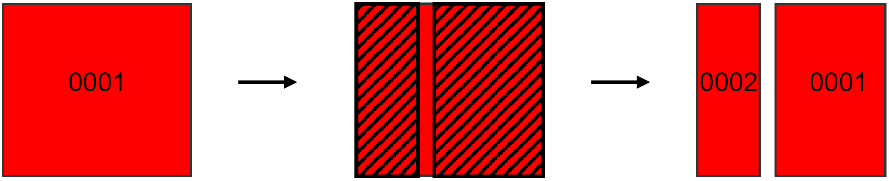

| identificatie | objectBeginTijd | versieBeginTijd |
|:---|:---|:---|
| 0001 | 01-01-2005 | 01-01-2005 |
| _0002_ | _01-01-2006_ | _01-01-2006_ |
| _0001_ | _01-01-2005_ | _01-01-2006_ |

_Figuur B1.8: Toepassing van de splitsregel. De cursieve tekst geeft de nieuwe attribuutwaarden t.o.v. de oorspronkelijke situatie._

Na het toepassen van de overlapregel op beide 'nieuwe' geo-objecten blijken ze beide de identificatie 0001 te mogen krijgen. Dit mag niet en de splitsregel wordt toegepast.

De oppervlakte van het kleine nieuwe geo-object in figuur B1.8 is minder dan 50% van de oppervlakte van het oorspronkelijke geo-object. Het neemt de identificatie niet over en krijgt een nieuwe identificatie met een nieuwe objectBeginTijd en tijdstipRegistratie. De oppervlakte van het grote nieuwe geo-object is meer dan 50% van de oppervlakte van het oorspronkelijke geo-object en neemt de identificatie 0001 wel over, uiteraard met een nieuwe tijdstipRegistratie.

Soms kunnen, na toepassing van deze regel, toch meerdere geo-objecten de identificatie van het oorspronkelijke geo-object overnemen. In dit geval neemt geen enkel geo-object de identificatie over, maar krijgen ze allemaal een nieuwe identificatie met een nieuwe objectBeginTijd en een zelfde tijdstipRegistratie (zie figuur B1.9).

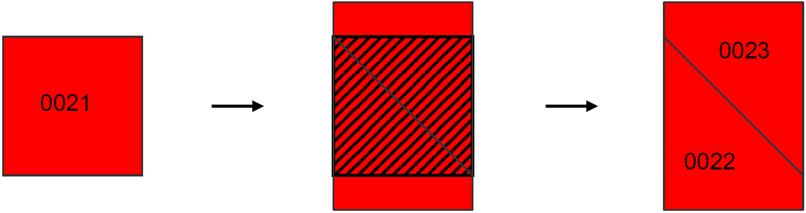

| identificatie | objectBeginTijd | versieBeginTijd |
|:---|:---|:---|
| 0021 | 01-01-2005 | 01-01-2005 |
| _0022_ | _01-01-2006_ | _01-01-2006_ |
| _0023_ | _01-01-2006_ | _01-01-2006_ |

_Figuur B1.9: Voorbeeld waarbij overlapregel en splitsregels nog geen uitsluitsel geven. De cursieve tekst geeft de nieuwe attribuutwaarden t.o.v. de oorspronkelijke situatie._

Na het toepassen van de overlapregel in figuur B1.9 kunnen beide geo-objecten de identificatiecode 0021 overnemen. Dit is nog steeds het geval na het toepassen van de splitsregel, dus krijgen beide nieuwe geo-objecten een nieuwe identificatie (0022 en 0023).

### Wijziging van coördinaten van de aanvullende geometrie

Indien de enige wijziging van een geo-object een wijziging van de coördinaten van de aanvullende geometrie is, dan komt er een nieuwe versie van het geo-object waarbij deze een zelfde tijdstipRegistratie krijgt. Indien er ook andere wijzigingen plaatsvinden, dan wordt de aanvullende geometrie, en de eventuele veranderingen daarvan, buiten beschouwing gelaten.

## Schema

In onderstaand schema wordt aangegeven wat er in welke situatie gebeurt. Dit is afhankelijk van:

- de objectklasse;
- de verandering (van attribuutwaarde, coördinaten of geometrietype).

| Objectklasse | Verandering van attribuutwaarde | Verandering van coördinaten | Verandering van geometrietype |
|:---|:---|:---|:---|
| Wegdeel | 1 | 3 | 3 | |
| Spoorbaandeel | 1 | 3 | 3 |
| Waterdeel | 1 | 3 | 3 |
| Gebouw | 1 | 3 | 3 |
| Terrein | 1 | 3 | n.v.t. |
| Inrichtingselement | 2 | 3 | 3 |
| Reliëf | 2 | 3 | 4 |
| Hoogte | 2 | 3 | 4 |
| Registratief gebied | 2 | 3 | n.v.t |
| Geografisch gebied | 2 | 3 | 1 |
| Plaats | 2 | 3 | 3 |
| Functioneel gebied | 2 | 3 | 1 |
| Plantopografie | 2 | 3 | 4 |

_Tabel B1.2: Schema gebeurtenis mutatieprotocol._

Verklaring van de nummers:

1\. Het geo-object krijgt een nieuwe tijdstipRegistratie.

2\. Het geo-object krijgt een nieuwe identificatie met een nieuwe objectBeginTijd en een zelfde tijdstipRegistratie als de waarde van het attribuut 'type inrichtingselement', 'type reliëf', 'type hoogte', 'type registratief gebied', 'type geografisch gebied', type gebied', 'type functioneel gebied' gebied' of 'type object' verandert. Het oorspronkelijke geo-object krijgt een objectEindTijd en versieEindTijd.

Indien de waarde van een ander attribuut verandert, dan krijgt het geo-object krijgt een nieuwe tijdstipRegistratie.

3\. Als er alleen coördinaten van _**aanvullende**_ geometrie (b.v. hartlijn) veranderen, dan krijgt het geo-object een nieuwe tijdstipRegistratie.

In alle andere gevallen wordt de overlapregel toegepast. Als een geo-object meerdere identificaties krijgt toegewezen, dan wordt de **samenvoeg**regel gebruikt. Indien na behandeling van alle geo-objecten blijkt dat een identificatie aan meerdere geo-objecten is toegekend, dan wordt de **splits**regel toegepast.

Puntvormige en lijnvormige geo-objecten worden van een buffer van drie meter voorzien om de overlapregel, de splitsregel en de samenvoegregel toe te kunnen passen. Dan wordt de oppervlakte van het geo-object met buffer gebruikt.

Als een nieuw geo-object geen identificatie kan overnemen, dan krijgt het een nieuwe identificatie met een objectBeginTijd en een zelfde tijdstipRegistratie.

4\. Als het geometrietype verandert, dan verandert vaak ook de waarde van het attribuut 'type inrichtingselement', 'type reliëf', 'type hoogte' of 'type object'. Dit heeft al een nieuwe identificatie tot gevolg, dus deze wijziging kan verder buiten beschouwing worden gelaten.
